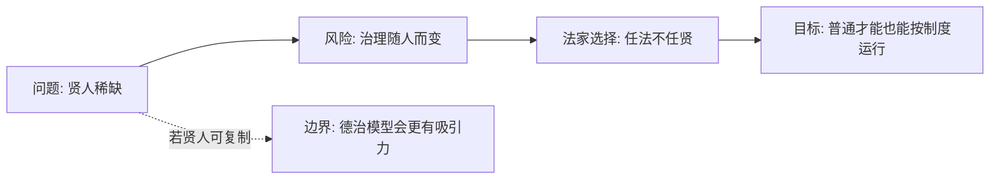

## 法家思维筑基课: 公理二: 贤人稀缺且不可稳定复制

### 作者
digoal

### 日期
2026-05-18

### 标签
法家 , 贤人稀缺 , 任法不任贤 , 制度复制 , 德治边界 , 治理稳定性 , 慎到 , 韩非 , 组织能力 , 人才依赖

----

## 背景

> 面向对象: 高中生到大学低年级读者  
> 核心问题: 法家为什么不愿意把政治希望寄托在圣君贤臣上？  
> 先说结论: 法家认为贤人当然好，但稀缺、难识别、难传承；稳定国家不能靠“刚好遇到好人”，而要靠普通人也能执行的制度。

## 一张图先看懂



## 求真讲法

### 它到底说了什么

这个公理不是说贤人没有价值，而是说国家不能把生死存亡押在贤人稳定出现上。因为贤人有三个难题:

1. 少: 每一代不一定都有。
2. 难辨: 会说漂亮话的人不一定能治理。
3. 难复制: 好君主、好臣子不能像标准零件一样批量生产。

所以法家更信制度，而不是只信品德。

### 它是怎么来的

战国竞争要求持续动员。一个国家不能只在遇到贤君时强大、遇到昏君时崩坏。法家因此追问: 有没有一种安排，使中等才能的人也不至于把系统搞垮？

```text
依赖贤人: 好人出现 -> 治理好；好人消失 -> 治理坏
依赖制度: 职责清楚 -> 规则稳定 -> 普通人也能按流程做事
```

### 它依赖哪些假设

| 假设 | 含义 | 若不成立会怎样 |
|---|---|---|
| 贤人少 | 不能作为常规资源 | 德治成本很高 |
| 贤人难识别 | 名声不等于能力 | 容易被伪君子骗 |
| 制度可复制 | 规则能跨人延续 | 才能替代个人魅力 |
| 职位可约束行为 | 人进入角色后受规则限制 | 组织不完全看个人 |

这是法家选择制度优先的前提，不是对所有时代、所有组织的绝对判断。

### 常见误解

**误解一: 法家不要人才。**  
不对。法家需要能执行法令、完成事务的人才，只是不把秩序建立在个人道德光环上。

**误解二: 制度可以完全替代人。**  
也不对。制度需要人执行、解释、纠错。法家的问题是过分相信自上而下的控制能解决人的问题。

**误解三: 贤人稀缺说明道德教育没用。**  
道德教育有用，但法家认为它不足以支撑大规模国家治理。

## 求存讲法

### 它有什么用

它把政治从“等待明君贤臣”推向“建设可复制流程”。对国家、公司、学校团队都很重要: 好系统不能只靠一个英雄维持。

### 它怎么迁移到熟悉领域

班级活动不能只靠某个特别负责的同学。更好的办法是写清分工、时间点、交付物和检查方式。这样即使换人，活动也能继续。

### 它的适用范围和边界

适用: 重复性强、目标清楚、人员流动较大的组织。  
边界: 创业早期、研究突破、艺术创作等场景仍高度依赖关键人才的判断。

### 正例: 怎么用它提升能力

小组做研究报告时，不说“组长负责到底”，而是建立共享文档、任务表、交稿时间和互评标准。这样组长请假也不会让项目停摆。

### 反例: 前提不成立会怎样

一个乐队把所有演出效果都标准化，要求主唱、吉他手完全按流程表演，结果失去感染力。失败原因是“制度可复制”这个前提在艺术表达上不完全成立。

## 思考

一个组织最危险的时刻，往往是它把“某个人很强”误认为“系统很强”。  
但另一个危险是: 把制度写得很细，却没有人敢判断新情况。

## 最后记住

1. 法家不是否认贤人，而是不把贤人当作稳定资源。
2. “任法不任贤”的目标是降低对个人品德和天才的依赖。
3. 制度能提高可复制性，但不能替代所有判断。
4. 判断制度好坏，要看换人后还能不能稳定运行。

## 参考资料

1. 《韩非子·有度》《韩非子·定法》。
2. 《慎子》佚文中关于“势”的思想材料。
3. 冯友兰《中国哲学史》相关章节。
4. 本文基于通行先秦思想史整理，重点解释理论模型。

  
#### [PostgreSQL 解决方案集合](../201706/20170601_02.md "40cff096e9ed7122c512b35d8561d9c8")
  
  
#### [德哥 / digoal's Github - 公益是一辈子的事.](https://github.com/digoal/blog/blob/master/README.md "22709685feb7cab07d30f30387f0a9ae")
  
  
#### [About 德哥](https://github.com/digoal/blog/blob/master/me/readme.md "a37735981e7704886ffd590565582dd0")
  
  

  
