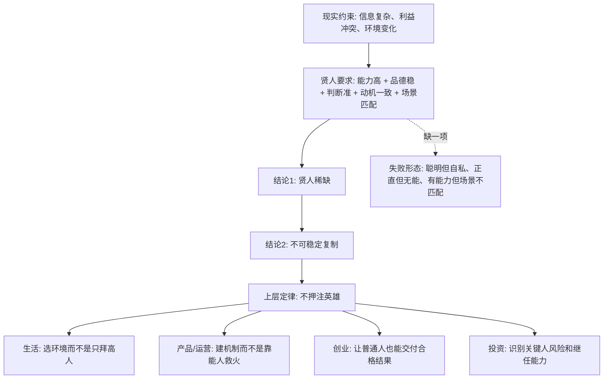

## 法家思维筑基课: 贤人稀缺且不可稳定复制

### 作者
digoal

### 日期
2026-05-18

### 标签
法家思想 , 任法不任贤 , 关键人风险 , 组织能力 , 制度设计 , 创业管理 , 产品管理 , 运营管理 , 投资判断 , 继任机制

----

## 背景

> 面向对象: 大学生、产品经理、运营经理、有投资需求的人  
> 核心问题: 为什么生活、创业、管理和投资中，不能把成败押在“遇到一个高人、老板、贵人、明星经理、天才创始人”上？  
> 先说结论: “贤人稀缺且不可稳定复制”不是说世界没有优秀的人，而是说真正同时具备能力、品德、判断力、资源位置和长期动机一致的人很少；即使出现，也很难批量制造、长期留住、跨场景复用。所以成熟系统必须把关键能力沉淀为制度、流程、文化、激励和可验证的反馈，而不是依赖某个英雄长期在线。

本文把“贤人”定义为一种复合型稀缺资源: **能做正确判断、愿意承担责任、不会为私利破坏系统、还能在关键时刻稳定交付的人**。这不是道德评判，而是一个用于生活选择、组织设计、创业和投资判断的底层公理。

## 一张图先看懂



## 求真讲法

### 它到底说了什么

“贤人稀缺且不可稳定复制”可以拆成两句话:

1. **贤人稀缺:** 真正可靠的人，不只是聪明，还要正直、稳定、能判断复杂局面、能抗诱惑、能把长期利益放在短期诱惑之前。
2. **不可稳定复制:** 即使你今天遇到了一个贤人，也不能保证明天还能遇到；即使一个岗位上有贤人，也不能保证换人后能力延续；即使一个团队今天靠某个强人跑通，也不能说明系统本身已经成熟。

用更直白的话说:

```text
遇到好人，是运气。
留住好人，是能力。
复制好人，是极难的组织能力。
不依赖好人也能运转，才是系统能力。
```

这条规律不是叫人不相信别人，而是提醒我们: **信任一个人之前，要先看这个系统是否能约束坏行为、放大好行为、纠正错误行为。**

### 它是怎么来的

这条规律来自几个长期稳定的人类处境。

**第一，人的能力分布不均匀。**

在任何领域，真正能持续做出高质量判断的人都很少。大学里会有少数特别会学习的人，公司里会有少数特别会拆问题的人，市场里会有少数特别能识别价值的人。大多数人的能力集中在中间区域。

**第二，能力和品德不是同一个东西。**

一个人可以很聪明，但不诚实；可以很勤奋，但判断力差；可以很善良，但不适合复杂决策；可以短期可靠，但在利益压力下变形。

**第三，优秀表现高度依赖场景。**

一个人在 A 公司表现很好，换到 B 公司可能失效；一个人在增长期很强，到了收缩期可能不会做取舍；一个创始人在 0 到 1 很强，到了 1 到 100 可能不适合管理大组织。

**第四，许多关键能力是隐性知识。**

隐性知识是很难写进说明书的能力，比如判断人的微妙信号、识别市场拐点、知道什么时候该停止投入、知道一个产品指标背后是否有欺骗性。它靠长期经验形成，很难通过培训快速复制。

**第五，动机会随位置变化。**

一个人没掌权时可能很清醒，掌权后可能被利益、声望、团队惯性和外部期待改变。投资里常说的管理层诚信、资本配置能力、股东导向，本质上都在问: 这个人掌握资源以后，是否还会替所有者长期负责？

### 它依赖哪些假设

把它写成一个简化模型:

```text
贤人 = 能力 × 品德 × 判断力 × 动机一致 × 场景匹配 × 时间稳定
```

这里用乘法，是为了表达一个残酷事实: 只要某一项接近 0，整体可靠性就会大幅下降。

| 条件 | 如果成立 | 如果不成立 |
|---|---|---|
| 能力足够 | 能解决真实问题 | 好心办坏事 |
| 品德可靠 | 不用系统性防他作恶 | 聪明人变成高风险源 |
| 判断力强 | 能处理不确定性 | 只会在标准题里优秀 |
| 动机一致 | 个人收益和系统长期收益同向 | 越有能力，越可能套利系统 |
| 场景匹配 | 经验能迁移 | 过去成功变成未来包袱 |
| 时间稳定 | 可以长期托付 | 短期可靠，长期失控 |

这个公理依赖的假设是:

1. 世界复杂到无法靠单个大脑长期正确判断一切。
2. 人会受利益、情绪、地位和环境影响。
3. 组织和市场需要可复制能力，而不是一次性运气。
4. 外部表象容易伪装，真实能力必须通过长期结果和逆境行为验证。

### 常见误解

**误解一: 这是不是说不要重视人才？**

不是。恰恰相反，因为贤人稀缺，所以更要识别、珍惜和激励优秀人才。区别在于: 不能把系统设计成“没有这个人就崩”。

**误解二: 有制度就不需要贤人？**

也不对。制度能降低对贤人的依赖，但制度本身也需要人设计、维护和纠偏。成熟做法不是“人治或制度二选一”，而是让好制度吸引好人、约束坏人、帮助普通人。

**误解三: 强人领导一定不好？**

不一定。创业早期、危机时刻、战略转向期，强人判断可能非常重要。但如果组织长期只能靠强人拍板、救火、背锅，说明组织能力没有沉淀下来。

**误解四: 投资只看创始人就够了？**

不够。优秀创始人很重要，但投资还要看商业模式、护城河、现金流、资本配置、治理结构和继任机制。一个公司如果所有价值都绑在一个人身上，估值就应该打折，因为关键人风险很高。

## 求存讲法

### 它有什么用

这条规律可以帮你在四类场景里少犯大错。

**生活中:** 不把人生希望压在“遇到贵人”上，而是选择能让普通人持续进步的环境。

**产品中:** 不靠某个天才产品经理的灵感，而是建立用户研究、需求验证、指标复盘、灰度实验和失败复盘机制。

**运营中:** 不靠某个超级运营天天救火，而是把活动 SOP、数据看板、素材库、复盘模板、异常预警做成可继承资产。

**投资中:** 不只问“老板厉不厉害”，还要问“这家公司离开老板还能不能正常赚钱，文化和资本配置能不能延续”。

### 它推出的上层定律

| 上层定律 | 一句话解释 | 适用场景 |
|---|---|---|
| 制度替代英雄定律 | 能用机制解决的，不要长期依赖个人自觉 | 管理、创业、运营 |
| 关键人风险定律 | 如果一个人离开就崩盘，系统价值要打折 | 投资、创业 |
| 流程封装经验定律 | 高手的经验要沉淀成清单、模板、训练和反馈 | 产品、运营、学习 |
| 授权配校验定律 | 授权不是放任，必须有目标、边界和复盘 | 团队管理 |
| 逆境验人定律 | 顺境看能力，逆境看品德和真实动机 | 投资、合作、择业 |
| 继任能力定律 | 好组织不仅有强人，还能培养下一批合格负责人 | 公司治理 |
| 指标防作弊定律 | 奖惩越强，越要防止人为了指标扭曲目标 | 运营、绩效、投资 |

### 它怎么迁移到熟悉领域

#### 1. 大学生: 别只找“名师”，要找能训练你的系统

一个老师很厉害，不代表你一定会变强。你要看:

1. 有没有清晰作业和反馈。
2. 有没有可重复练习的方法。
3. 有没有同伴环境和压力。
4. 有没有把能力拆成可训练动作。

一个普通老师加上好训练系统，常常比一个难以接近的名师更能改变你。

#### 2. 产品经理: 别崇拜“神级判断”，要建立验证闭环

产品经理容易迷信“我懂用户”。但用户需求经常被误读，表面数据也可能骗人。更稳的做法是:

```text
用户访谈 → 问题定义 → 原型验证 → 小流量实验 → 数据复盘 → 迭代或停止
```

这条链路的价值在于: 它把个人直觉变成可被团队讨论、验证和纠正的过程。

#### 3. 运营经理: 别把增长押在某个操盘手

很多活动爆了以后，团队会以为“我们掌握了增长方法”。其实可能只是某个运营对时机、内容、渠道和用户情绪判断得准。要防止经验消失，必须沉淀:

1. 活动前的目标假设。
2. 渠道和人群选择逻辑。
3. 素材测试结果。
4. 转化漏斗数据。
5. 失败样本库。

否则下一次换人，就只能重新碰运气。

#### 4. 投资者: 别只买“英雄故事”

投资中，“贤人稀缺”意味着管理层很重要；“不可稳定复制”意味着不能只看管理层光环。

一个更稳的检查表是:

| 投资问题 | 观察重点 |
|---|---|
| 我是否懂这个生意？ | 是否在能力圈内，能否解释赚钱逻辑 |
| 管理层是否诚实？ | 是否主动披露坏消息，是否承认错误 |
| 公司是否依赖单一关键人？ | 创始人离开后，客户、渠道、文化、资本配置是否延续 |
| 护城河是否独立于个人？ | 品牌、网络效应、成本优势、转换成本是否存在 |
| 激励是否一致？ | 管理层是否像所有者一样配置资本 |
| 价格是否留出安全边际？ | 即使判断有误，是否还有缓冲 |

这不是具体投资建议，而是一种防止被表面故事带走的判断框架。

### 它的适用范围和边界

这条规律特别适用于:

1. 长周期决策: 择业、创业、投资、婚姻合作、长期合伙。
2. 复杂系统: 公司、平台、组织、资本市场、教育训练。
3. 高不确定性场景: 新产品、新市场、转型、融资、并购。
4. 信息不对称场景: 你很难直接看清对方真实能力和动机。

但它也有边界:

1. **早期突破仍然需要少数强人。** 0 到 1 的创新常常来自非平均水平的人。
2. **过度制度化会杀死创造力。** 如果流程太重，高手会被束缚，普通人也会只按流程免责。
3. **不是所有能力都能流程化。** 战略判断、审美、关键谈判、人性洞察很难完全写成 SOP。
4. **不能用“贤人稀缺”当作不信任所有人的借口。** 低信任会让组织成本暴涨，最后好人也会离开。

更准确的边界是:

```text
关键判断需要高手，
重复交付需要系统，
长期稳定需要文化，
重大风险需要制衡。
```

### 正例: 怎么用它提升能力

假设你是一个产品经理，团队过去依赖一位很强的负责人做需求判断。现在你想降低对他的依赖。

可操作做法:

1. 把每次需求决策写成“问题、用户、证据、假设、反证、指标”六栏。
2. 每个版本上线前，明确“什么数据出现，说明我们错了”。
3. 让新人先复盘历史需求，而不是直接听结论。
4. 把成功需求和失败需求都放入案例库。
5. 每月做一次“判断错误复盘”，重点看当初哪个假设错了。

这样做的意义不是消灭高手，而是把高手的隐性判断变成团队可学习的资产。

### 反例: 前提不成立会怎样

一家创业公司增长很快，投资人认为创始人极强，于是给了很高估值。但尽调时忽略了几个问题:

1. 大客户都由创始人个人关系带来。
2. 产品路线只有创始人能讲清楚。
3. 财务负责人频繁更换。
4. 二号位没有独立决策经验。
5. 公司没有稳定的销售流程和客户成功体系。

后来创始人精力转向融资和外部活动，内部交付质量下降，客户续费变差，增长迅速放缓。

这个失败不是因为“创始人不优秀”，而是因为一个前提不成立: **公司价值并没有从个人能力沉淀为组织能力**。当贤人不可复制时，估值却按“可复制增长”来给，风险就被低估了。

## 思考

### 为什么表面变化越快，底层规律越重要

技术、平台、渠道、流量入口会快速变化。今天是短视频，明天是 AI agent，后天可能是新的交互界面。但有些底层约束很稳定:

1. 人的注意力有限。
2. 人会受激励影响。
3. 信息永远不完全。
4. 组织会出现代理问题。
5. 能长期正确判断的人稀缺。
6. 没有反馈的系统会自我欺骗。

如果你只看表面现象，就会不断追热点。如果你看底层规律，就会问:

```text
这个变化解决了什么真实约束？
它依赖哪个稀缺资源？
它能否被复制？
它离开关键人还能否运转？
它的激励会不会把系统带偏？
```

这些问题比“现在什么火”更接近未来。

### 一个反事实问题

假设贤人很多，而且可以稳定复制，那么世界会完全不同:

1. 公司只要招聘就能解决管理问题。
2. 投资只要找到一个好 CEO 就够了。
3. 教育只要找到名师就能批量培养高手。
4. 创业只要复制成功创始人的方法就能成功。
5. 政府只要任用贤官就能长期稳定。

但现实不是这样。现实中，招聘会失败，培训会失真，继任会断层，激励会扭曲，成功经验会过期。所以真正成熟的系统，一定会追求“少数贤人定方向，多数普通人按系统交付，制度及时发现错误”。

### 对投资的特别提醒

从长期投资角度看，最值得警惕的不是“公司没有明星人物”，而是“公司只有明星人物”。

好的管理层当然重要，但更好的信号是:

1. 管理层诚实面对坏消息。
2. 公司文化能让坏消息向上传递。
3. 资本配置有长期纪律。
4. 继任安排清楚。
5. 业务护城河不完全依赖个人魅力。
6. 即使创始人退场，公司仍能保持客户价值、现金流和组织习惯。

这就是把“贤人稀缺”转化为投资判断的方式: **既重视人，又不迷信人。**

## 最后记住

1. 贤人不是单一能力，而是能力、品德、判断力、动机一致、场景匹配和时间稳定的组合。
2. 真正成熟的生活策略、组织策略和投资策略，都不能把成败押在少数英雄长期正确上。
3. 高手的价值不仅是亲自做成事，更是把方法、标准和判断沉淀为别人能继承的系统。
4. 投资中要特别警惕关键人风险: 如果一个人离开，公司价值就大幅下降，估值必须保守。
5. 底层规律的意义，是帮你穿透热点和故事，看见可复制性、激励结构、反馈机制和长期风险。

## 参考资料

1. 《韩非子》相关篇章: 法、术、势思想强调不能把治理押在个别贤能上，而要依赖可执行的规则、位置权威和官僚考核。
2. 《商君书》相关篇章: 变法、赏罚、农战等内容体现“制度化动员”优先于贵族身份和个人德望。
3. Max Weber, *Economy and Society*: 官僚制理论说明现代组织如何通过职位、规则、文书和层级来降低对个人魅力的依赖。
4. Herbert A. Simon, *Administrative Behavior*: 有限理性理论说明个人决策能力受信息、注意力和认知边界限制。
5. James G. March 与 Richard M. Cyert 的组织行为研究: 组织决策常受惯例、目标冲突和有限搜索影响，不等同于单个理性人的最优选择。
6. Warren Buffett 历年股东信与 Berkshire Hathaway 管理思想: 管理层诚信、所有者心态、能力圈、关键人和企业文化延续，是长期投资判断中的核心变量。
  
#### [PostgreSQL 解决方案集合](../201706/20170601_02.md "40cff096e9ed7122c512b35d8561d9c8")
  
  
#### [德哥 / digoal's Github - 公益是一辈子的事.](https://github.com/digoal/blog/blob/master/README.md "22709685feb7cab07d30f30387f0a9ae")
  
  
#### [About 德哥](https://github.com/digoal/blog/blob/master/me/readme.md "a37735981e7704886ffd590565582dd0")
  
  

  
