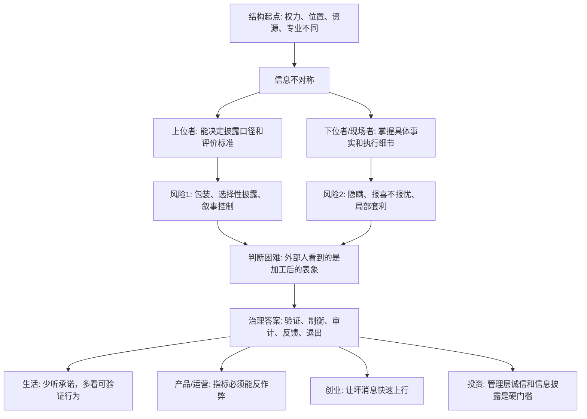

## 法家思维筑基课: 权力与信息天然不对称

### 作者
digoal

### 日期
2026-05-18

### 标签
信息不对称 , 权力结构 , 代理问题 , 公司治理 , 产品指标 , 运营复盘 , 创业管理 , 投资尽调 , 风险控制 , 真实反馈

----

## 背景

> 面向对象: 大学生、产品经理、运营经理、有投资需求的人  
> 核心问题: 为什么表面故事常常很漂亮，但真实情况总是滞后暴露？为什么生活、创业、管理和投资里，谁掌握信息差，谁就更容易掌握主动权？  
> 先说结论: 权力与信息天然不对称，意思是只要人与人之间存在职位、资源、专业、现场距离和责任差异，信息就不会自动平等流动。权力越大的人越能决定别人看见什么，离现场越近的人越掌握真实细节；成熟系统不是幻想完全透明，而是建立验证、制衡、复盘、披露和退出机制。

本文把“权力”定义为: **分配资源、制定规则、评价别人、给予奖惩、决定信息能否公开的能力**。把“信息”定义为: **事实、数据、上下文、解释权、风险和未被说出的坏消息**。

## 一张图先看懂



## 求真讲法

### 它到底说了什么

“权力与信息天然不对称”不是说所有掌权者都会骗人，也不是说所有掌握现场信息的人都会隐瞒。它说的是一个更底层的事实:

1. **权力者有选择信息的能力。** 老板可以决定会议上讨论什么，平台可以决定推荐什么，公司管理层可以决定财报怎样表述。
2. **现场者有接近事实的优势。** 一线销售更知道客户为什么不买，客服更知道用户真正抱怨什么，工厂员工更知道流程哪里会出错。
3. **外部人看到的通常不是原始事实，而是被筛选、包装、延迟或解释过的信息。**
4. **信息差会转化为议价权、控制权和风险转嫁能力。**

用一句更实用的话说:

```text
你以为你在判断事实，
其实你常常是在判断别人愿意让你看见的事实。
```

所以成熟判断的第一步，不是问“他说得有没有道理”，而是问:

```text
他掌握什么信息？
他隐瞒什么信息会获利？
我能不能独立验证？
如果他说错或说假，谁承担代价？
```

### 它是怎么来的

这条公理来自几个长期稳定的结构原因。

**第一，知识天然分散。**

没有一个人能看到全部事实。一个产品经理看到数据面板，但不一定知道用户真实情绪；一个投资人看到财报，但不一定知道客户流失的早期信号；一个老板看到汇报，但不一定知道团队实际执行成本。

**第二，位置决定视角。**

同一件事，管理层看到的是战略和资源，执行者看到的是流程和细节，客户看到的是体验和价格，投资者看到的是回报和风险。视角不同，信息自然不同。

**第三，权力会影响信息流动。**

如果说坏消息会被惩罚，那么坏消息就会变少，不是因为问题消失，而是因为信息不上行。很多组织不是没有问题，而是问题在到达决策层之前被过滤了。

**第四，利益会改变披露动机。**

融资方希望讲增长故事，卖方希望强调优点，求职者希望展示能力，管理层希望维持信心，平台希望提升转化。只要披露者从你的相信中获益，信息就需要被验证。

**第五，专业门槛会制造理解差。**

医生、律师、基金经理、技术专家、平台算法团队都拥有普通人难以快速验证的专业信息。专业分工提高效率，也制造了外行被误导的空间。

### 它依赖哪些假设

这条公理不是从某个学科内部“证明”出来的绝对真理，而是多个领域反复采用的现实假设。它依赖以下前提:

1. 人的注意力有限，无法直接观察所有事实。
2. 组织分工会让不同角色掌握不同信息。
3. 人会受激励影响，披露信息时会考虑自身利益。
4. 权力越集中，越容易决定信息如何被记录、解释和传播。
5. 外部人通常只能看到结果，难以直接看到过程和真实动机。

可以用一个简化公式理解:

```text
真实风险 = 信息差 × 权力差 × 激励错位 × 验证困难
```

如果信息差很大、权力差很大、激励又不一致，同时你还无法验证，那么风险会急剧上升。

| 要素 | 信息对称时 | 信息不对称时 |
|---|---|---|
| 承诺 | 可被及时验证 | 容易变成话术 |
| 指标 | 反映真实进展 | 可能被刷量或美化 |
| 授权 | 有边界、有复盘 | 变成黑箱 |
| 合作 | 双方能校准预期 | 一方转嫁风险 |
| 投资 | 价格接近真实价值 | 容易买到包装后的故事 |
| 管理 | 坏消息能上行 | 报喜不报忧 |

### 常见误解

**误解一: 信息不对称就是有人作恶。**

不一定。很多不对称来自职位、专业和现场距离，不是道德问题。一个 CEO 不知道某个客户为什么流失，并不等于他坏；一个医生比患者懂病情，也不等于他要欺骗患者。问题在于: 结构上存在误导、滞后和滥用空间。

**误解二: 完全透明就能解决问题。**

不现实。信息太多会造成噪音，商业机密和个人隐私也不能全部公开。真正有效的不是“所有信息都公开”，而是“关键信息可验证，关键权力受制衡，关键风险有披露责任”。

**误解三: 数据越多，信息越对称。**

不一定。数据可能被选择、口径可能被改变、指标可能被刷。没有上下文的数据，只是更精致的表象。

**误解四: 权力越高的人信息越全。**

也不一定。权力越高，能调动的信息越多，但离现场也越远。如果组织文化惩罚坏消息，上层看到的可能是加工后的乐观版本。

## 求存讲法

### 它有什么用

这条规律能帮你少被表面现象欺骗。

**生活中:** 不只听承诺，要看对方在利益冲突时怎么行动。

**求职中:** 不只看公司宣传，要问离职率、直属上级、业务现金流、岗位真实权责。

**产品中:** 不只看大盘数据，要看用户原声、分群留存、异常样本和反证。

**运营中:** 不只看活动 GMV、注册量、曝光量，要看真实复购、获客成本、退款率和用户质量。

**创业中:** 不只听团队汇报，要建立坏消息上行机制、数据口径和责任闭环。

**投资中:** 不只看故事和增长曲线，要看现金流、管理层诚信、会计口径、关联交易、负债和资本配置。

### 它推出的上层定律

| 上层定律 | 一句话解释 | 适用场景 |
|---|---|---|
| 信息优势转化为权力定律 | 谁更接近真实信息，谁就更能影响判断和分配 | 商业谈判、投资、管理 |
| 权力遮蔽坏消息定律 | 惩罚坏消息的系统，最后会看不见坏消息 | 创业、组织管理 |
| 授权必配审计定律 | 只授权不校验，会把信任变成黑箱 | 管理、财务、运营 |
| 激励决定披露定律 | 人会优先披露对自己有利的信息 | 投融资、销售、汇报 |
| 口径即权力定律 | 谁定义指标，谁就影响结论 | 产品、运营、绩效 |
| 反证优先定律 | 越想相信一个故事，越要主动找反证 | 投资、创业、择业 |
| 退出权制衡定律 | 不能验证又不能退出，就是高风险关系 | 合作、合同、平台生态 |

### 它怎么迁移到熟悉领域

#### 1. 大学生: 判断机会时，不要只听宣传

一个培训项目、实习机会、创业比赛或导师项目，都会展示最好的一面。你要补齐看不见的信息:

1. 过去参与者真实去向。
2. 失败者的比例和原因。
3. 承诺的资源是否写进规则。
4. 谁负责兑现，无法兑现有什么补偿。
5. 有没有能私下询问的前参与者。

你不是不信任别人，而是在补齐结构性信息差。

#### 2. 产品经理: 指标背后必须有反作弊设计

产品经理看到“日活增长 30%”时，不能立刻判断产品变好了。还要问:

```text
增长来自新用户还是老用户？
用户停留时长是否正常？
是否来自补贴、羊毛党或渠道异常？
核心功能使用率有没有提升？
次日、7 日、30 日留存有没有同步改善？
```

指标是信息，但指标口径也是权力。只看单一指标，就容易被表面增长欺骗。

#### 3. 运营经理: 活动复盘要防止报喜不报忧

运营活动最容易出现信息不对称。执行团队可能强调曝光和 GMV，却弱化成本、退款、投诉、低质量用户和后续留存。

更稳的复盘模板应该同时包含:

1. 目标假设: 活动原本要验证什么。
2. 正向结果: 哪些指标确实改善。
3. 负向结果: 哪些指标恶化。
4. 异常样本: 哪些用户行为不符合预期。
5. 机会成本: 如果不做这次活动，资源还能投向哪里。
6. 下一步停止条件: 什么情况说明不该继续。

这样做的目的，是让坏消息有合法位置。

#### 4. 创业者: 不要让公司只向上汇报好消息

创业公司常见死法，不是创始人不知道要增长，而是坏消息太晚到达创始人。

早期公司应该建立三条信息通道:

```text
客户原声通道: 创始人定期听真实客户反馈
财务现金通道: 每周看现金流、回款、应收和 burn rate
一线异常通道: 销售、客服、交付能直接上报重大异常
```

如果所有信息都经过层层包装，创始人看到的就是“组织希望他看到的公司”，而不是“真实的公司”。

#### 5. 投资者: 管理层披露质量是投资门槛

投资里，信息不对称特别强。管理层比外部投资者更知道真实订单、客户质量、成本压力、库存风险、会计估计和内部文化。

所以投资者要重点观察:

| 检查问题 | 好信号 | 危险信号 |
|---|---|---|
| 是否主动披露坏消息 | 解释问题、承认误判、给出改进路径 | 永远乐观，坏消息藏在脚注 |
| 指标是否稳定可比 | 口径清楚，长期一致 | 频繁更换指标，偏爱 adjusted 口径 |
| 现金流是否支持利润 | 利润能转化为现金 | 利润增长但应收、存货、资本化异常 |
| 管理层是否利益一致 | 长期持股，重视每股内在价值 | 只追求规模、股价和短期奖金 |
| 是否有复杂关联交易 | 交易简单透明 | 关联方多，价格和必要性不清楚 |
| 是否在能力圈内 | 你能解释赚钱逻辑和关键变量 | 只能复述别人的乐观故事 |

这不是具体买卖建议，而是一个底层过滤器: **看不懂、验证不了、披露不诚实，就不该用真金白银下注。**

### 它的适用范围和边界

这条规律特别适用于:

1. 一方掌握资源，另一方依赖资源。
2. 一方掌握专业，另一方难以验证。
3. 一方离现场更近，另一方只能看汇报。
4. 一方披露信息会影响价格、评价、奖金或融资。
5. 决策后果长期才显现，短期难以验证。

但它也有边界:

1. 不是所有信息差都能消除。复杂社会必须依赖专业分工。
2. 过度监督会降低效率，甚至让优秀的人离开。
3. 有些信息暂时不能公开，比如隐私、商业机密、未完成谈判。
4. 怀疑不能代替判断。真正成熟的做法是验证关键事实，而不是怀疑一切。

更稳的原则是:

```text
小事靠信任，
大事靠验证，
长期关系靠机制，
高风险决策靠退出权。
```

### 正例: 怎么用它提升能力

假设你是一个运营经理，负责判断一场拉新活动是否值得继续投钱。活动团队汇报说: “本周新增用户翻倍，GMV 增长 60%。”

你可以这样处理信息不对称:

1. 要求拆分渠道，看增长是否集中在某个异常渠道。
2. 对比新用户 7 日留存和老用户复购，不只看注册量。
3. 检查退款率、投诉率、优惠券套利比例。
4. 抽样看 20 个真实用户路径，而不是只看汇总图表。
5. 计算扣除补贴、渠道费、履约成本后的真实毛利。
6. 设定继续投放条件: 留存、复购、毛利至少满足三条底线。

这套动作的价值，是把“别人给你的信息”变成“你能验证的信息”。

### 反例: 前提不成立会怎样

一家创业公司融资时展示了漂亮数据:

1. 用户数连续增长。
2. GMV 快速上升。
3. 媒体报道很多。
4. 创始人表达能力很强。

投资人只看表面增长，没有继续追问:

1. GMV 有多少来自补贴刷单。
2. 用户留存是否真实。
3. 客户投诉和退款是否上升。
4. 供应商账期是否掩盖现金流压力。
5. 财务数据是否经过独立审计。

后来补贴停止，用户迅速流失，账期压力爆发，公司估值大幅缩水。

这个失败不是因为“增长数据一定没用”，而是因为一个关键前提不成立: **数据没有经过独立验证，披露方又有强烈动机把故事讲得更好。** 在信息不对称下，未经验证的增长更像营销材料，不等于真实价值。

## 思考

### 为什么它能帮助判断真伪

表面世界变化很快: 新平台、新概念、新融资故事、新增长玩法、新管理工具不断出现。但只要存在权力和信息不对称，你就能用同一组问题穿透表象:

```text
谁掌握原始信息？
谁定义指标口径？
谁从这个说法中获益？
谁承担判断错误的代价？
有没有独立验证来源？
坏消息能不能被看见？
我有没有退出权？
```

这些问题不会告诉你所有答案，但能大幅降低被故事牵着走的概率。

### 为什么它能帮助预言未来

很多未来不是凭空预测，而是从结构推出来的。

如果一个公司:

1. 权力高度集中。
2. 坏消息没有上行通道。
3. 指标只奖励增长，不惩罚质量。
4. 财务口径越来越复杂。
5. 外部投资者无法独立验证关键数据。

那么你不需要知道下一条新闻是什么，也能预判一个方向: **真实问题会被延迟暴露，直到某个现金流、监管、客户流失或信任危机把它一次性揭开。**

反过来，如果一个组织:

1. 坏消息能快速上行。
2. 指标口径长期稳定。
3. 权力有边界。
4. 一线信息能进入决策。
5. 管理层愿意承认错误。

它未必每次都成功，但更可能持续纠错。

### 一个反事实问题

假设权力与信息完全对称，世界会很简单:

1. 求职者能立刻知道公司真实文化。
2. 投资者能完全知道企业真实经营。
3. 用户能看清平台算法如何影响自己。
4. 老板能知道一线真实问题。
5. 合作方不能包装、隐瞒或转嫁风险。

但现实不是这样。现实中，人们通常在不完整信息下做决定。因此，真正重要的能力不是“永远知道真相”，而是:

```text
知道自己不知道什么，
知道谁可能知道，
知道谁有动机隐瞒，
知道怎样用低成本验证关键事实。
```

## 最后记住

1. 权力与信息不对称是结构事实，不一定来自恶意，但一定会制造风险。
2. 谁定义指标、控制披露、接近现场，谁就拥有更强的话语权和议价权。
3. 生活、创业、运营和投资中，承诺不等于事实，数据不等于真相，故事不等于价值。
4. 对抗信息不对称的核心方法是: 独立验证、稳定口径、坏消息上行、权力制衡、保留退出权。
5. 预测未来不靠追热点，而靠识别结构: 激励是否扭曲，坏消息是否可见，风险是否被转嫁。

## 参考资料

1. George A. Akerlof, “The Market for Lemons”, 1970: 经典信息不对称模型，说明质量信息不对称会破坏市场交易。
2. Michael C. Jensen 与 William H. Meckling, “Theory of the Firm”, 1976: 代理问题理论，解释所有者和管理者之间的激励错位与监督成本。
3. Friedrich A. Hayek, “The Use of Knowledge in Society”, 1945: 说明知识分散在社会各处，中心无法天然掌握全部现场信息。
4. Max Weber, *Economy and Society*: 官僚制理论帮助理解职位、规则、层级和信息流动之间的关系。
5. 《韩非子》相关篇章: “术”和“循名责实”等思想体现了对君臣之间信息不对称、官僚欺上瞒下问题的早期观察。
6. Warren Buffett 历年股东信与 Berkshire Hathaway 管理思想: 能力圈、管理层诚信、坏消息披露、股东导向和资本配置纪律，是投资中处理信息不对称的重要框架。
  
#### [PostgreSQL 解决方案集合](../201706/20170601_02.md "40cff096e9ed7122c512b35d8561d9c8")
  
  
#### [德哥 / digoal's Github - 公益是一辈子的事.](https://github.com/digoal/blog/blob/master/README.md "22709685feb7cab07d30f30387f0a9ae")
  
  
#### [About 德哥](https://github.com/digoal/blog/blob/master/me/readme.md "a37735981e7704886ffd590565582dd0")
  
  

  
