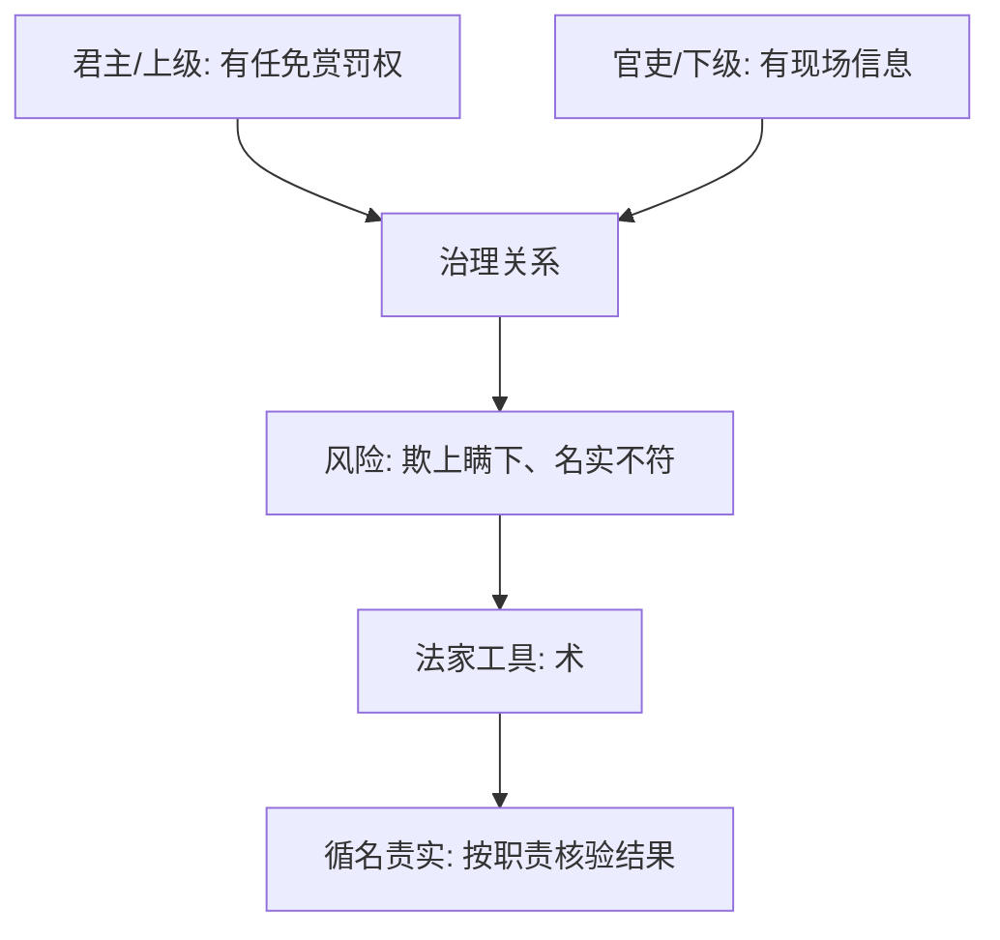

## 法家思维筑基课: 公理三: 权力与信息天然不对称

### 作者
digoal

### 日期
2026-05-18

### 标签
法家 , 信息不对称 , 术 , 循名责实 , 官僚控制 , 申不害 , 韩非 , 委托代理 , 考核核验 , 治理技术

----

## 背景

> 面向对象: 高中生到大学低年级读者  
> 核心问题: 法家为什么特别重视“术”和“循名责实”？  
> 先说结论: 法家认为上级掌握权力，但下级掌握具体信息；如果没有考核和核验技术，官员就可能利用信息差欺骗君主、逃避责任、谋取私利。

## 一张图先看懂



## 求真讲法

### 它到底说了什么

“信息不对称”是现代词，但能帮助理解法家的“术”。上级不可能亲自看到所有田亩、仓库、案件、军功和民情。具体情况往往掌握在官员手里。

于是出现风险: 官员说自己完成了，实际上没有；说困难是客观原因，实际上是偷懒；说别人有罪，实际上是排挤对手。

法家要用“术”来解决这个问题。

### 它是怎么来的

国家变大以后，君主必须通过官僚系统治理。官僚系统越复杂，越会出现委托代理问题:

```text
君主想要: 国家目标
官员可能想要: 自身利益
百姓实际情况: 上级难以直接看见
结果: 必须建立核验、记录、复查、赏罚机制
```

申不害重“术”，韩非把术纳入法、术、势的综合结构，就是为了解决官僚控制问题。

### 它依赖哪些假设

| 假设 | 含义 | 若不成立会怎样 |
|---|---|---|
| 上级看不全事实 | 现场信息分散 | 必须依赖汇报 |
| 下级有自利动机 | 可能包装信息 | 需要核验 |
| 职责可以命名 | 能说清“该做什么” | 才能循名责实 |
| 结果可被复查 | 有证据判断真假 | 术才有效 |

这个公理不是说所有官员都坏，而是说制度不能假设官员永远诚实。

### 常见误解

**误解一: 术就是阴谋。**  
不完全。术包含考核、核验、职责匹配等治理技术，也可能包含隐秘控制。它既有管理理性，也有专制风险。

**误解二: 有监督就没有信息差。**  
监督本身也需要信息。监督者也可能被欺骗或被收买。

**误解三: 下级掌握信息就是坏事。**  
不是。专业知识和现场经验本来就在下级手里，问题是如何让信息真实流动。

## 求存讲法

### 它有什么用

它提醒我们: 管理不能只听汇报，要看证据、结果和可复查记录。否则汇报能力可能替代真实能力。

### 它怎么迁移到熟悉领域

小组合作中，成员说“我快做完了”不等于真的完成。更好的办法是看草稿、代码、数据、演示和提交记录。

### 它的适用范围和边界

适用: 层级组织、项目管理、财务、质量检查、公共治理。  
边界: 过度监控会降低信任，让人只做可检查的事，不做真正有价值但难量化的事。

### 正例: 怎么用它提升能力

写论文时，不用“我读了很多资料”作为进度，而用“完成 20 条文献卡片、每条有观点和出处”作为进度。这样名实更容易核验。

### 反例: 前提不成立会怎样

老师用摄像头监控学生是否盯着屏幕，以判断学习认真。失败原因是“结果可被复查”前提错位: 盯屏幕只是表面行为，不能代表理解。

## 思考

信息差无法消失，只能被制度处理。问题是: 制度要把真实信息引出来，还是把坏消息压下去？  
如果所有人都害怕报告失败，最高层得到的可能只剩好消息。

## 最后记住

1. 法家的“术”针对的是权力和信息分离的问题。
2. 循名责实要求职责、承诺和结果相互对应。
3. 核验能减少欺骗，但过度监控会伤害信任。
4. 好制度不只是抓错，还要鼓励真实信息向上流动。

## 参考资料

1. 《韩非子·定法》《韩非子·二柄》《韩非子·主道》。
2. 《申子》相关思想材料。
3. 《史记·老子韩非列传》。
4. 本文基于通行先秦思想史整理，借用现代“信息不对称”概念作解释。

  
#### [PostgreSQL 解决方案集合](../201706/20170601_02.md "40cff096e9ed7122c512b35d8561d9c8")
  
  
#### [德哥 / digoal's Github - 公益是一辈子的事.](https://github.com/digoal/blog/blob/master/README.md "22709685feb7cab07d30f30387f0a9ae")
  
  
#### [About 德哥](https://github.com/digoal/blog/blob/master/me/readme.md "a37735981e7704886ffd590565582dd0")
  
  

  
