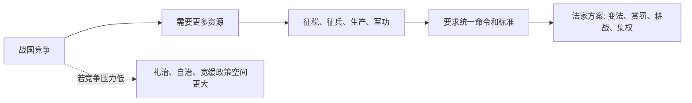

## 法家思维筑基课: 公理四: 国家竞争要求组织动员

### 作者
digoal

### 日期
2026-05-18

### 标签
法家 , 国家竞争 , 组织动员 , 战国变法 , 耕战 , 国家能力 , 商鞅 , 集权 , 资源组织 , 危机治理

----

## 背景

> 面向对象: 高中生到大学低年级读者  
> 核心问题: 为什么法家思想在战国时代特别有力量？  
> 先说结论: 法家的很多主张来自一个高压背景: 国家之间竞争激烈，谁能更有效地组织人口、土地、粮食、军队和官僚，谁就更可能生存。

## 一张图先看懂



## 求真讲法

### 它到底说了什么

法家把国家看成竞争环境中的行动单位。一个国家如果不能征收资源、组织军队、统一命令、奖励军功，就可能被别国吞并。

所以法家重视的不是个人修养优先，而是国家能力优先。

### 它是怎么来的

春秋到战国，战争规模扩大，贵族车战逐渐让位于更大规模的步兵、骑兵和后勤体系。国家需要直接面对基层人口，而不能只依赖贵族封建网络。

```text
战争扩大
  ↓
资源需求上升
  ↓
旧贵族结构不够用
  ↓
必须变法、编户、征税、征兵、奖励军功
  ↓
法家思想获得现实吸引力
```

### 它依赖哪些假设

| 假设 | 含义 | 若不成立会怎样 |
|---|---|---|
| 外部竞争强 | 生存压力高 | 强动员更有吸引力 |
| 国家目标可集中 | 耕战等目标优先 | 多元目标被压低 |
| 资源可被国家组织 | 人口土地能进入制度 | 集权才有效 |
| 动员收益大于成本 | 强控制带来优势 | 否则会伤害社会活力 |

这个公理解释的是战国法家兴起的背景，不等于所有时代都必须高压动员。

### 常见误解

**误解一: 法家强是因为它更“正确”。**  
更准确地说，它适配了战国竞争环境。适配不等于在所有时代都最好。

**误解二: 国家越能动员越好。**  
动员有成本。过度动员会耗尽民力，压缩生活和创造空间。

**误解三: 竞争可以解释一切。**  
竞争解释了法家为何有吸引力，但不能自动证明每项法家政策都正当。

## 求存讲法

### 它有什么用

它让我们理解: 思想不是凭空出现的。治理理论常常回应具体压力。法家的制度工程感，来自战国国家竞争的现实需求。

### 它怎么迁移到熟悉领域

一个球队在联赛中竞争激烈，就会更重视训练纪律、战术执行、体能管理和数据分析。压力越大，组织化程度通常越高。

### 它的适用范围和边界

适用: 战争、灾害、危机管理、强竞争行业。  
边界: 长期和平和创新环境不能永远按危机模式运转，否则人会疲惫，组织会僵化。

### 正例: 怎么用它提升能力

考试前两周进入冲刺期，可以临时提高计划强度: 每天固定复习科目、错题清零、减少娱乐。因为短期竞争压力明确，集中动员有效。

### 反例: 前提不成立会怎样

一个家庭长期按“高考冲刺”模式安排孩子生活，连假期也不允许休息。失败原因是“外部竞争强且短期明确”的前提不成立，长期高压会损害兴趣和健康。

## 思考

危机能让组织变强，也能让组织习惯于压制差异。  
真正困难的问题是: 什么时候需要战时动员，什么时候必须退出战时动员？

## 最后记住

1. 法家思想与战国高压竞争环境密切相关。
2. 组织动员能提高国家能力，但不是无成本工具。
3. 法家强在明确目标下的资源集中。
4. 当环境不再是生存竞争，法家模型必须被重新限制和修正。

## 参考资料

1. 《商君书·更法》《商君书·农战》。
2. 《史记·商君列传》。
3. 侯外庐等《中国思想通史》相关章节。
4. 本文基于通行先秦思想史整理，重点解释法家兴起的历史动因。

  
#### [PostgreSQL 解决方案集合](../201706/20170601_02.md "40cff096e9ed7122c512b35d8561d9c8")
  
  
#### [德哥 / digoal's Github - 公益是一辈子的事.](https://github.com/digoal/blog/blob/master/README.md "22709685feb7cab07d30f30387f0a9ae")
  
  
#### [About 德哥](https://github.com/digoal/blog/blob/master/me/readme.md "a37735981e7704886ffd590565582dd0")
  
  

  
