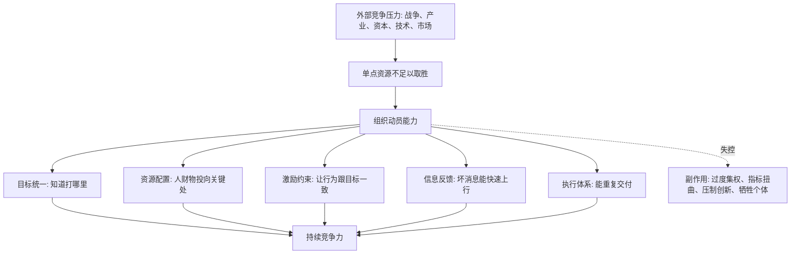

## 法家思维筑基课: 国家竞争要求组织动员

### 作者
digoal

### 日期
2026-05-18

### 标签
组织动员 , 国家竞争 , 资源配置 , 战略执行 , 创业扩张 , 产品闭环 , 运营增长 , 投资分析 , 现金流 , 组织能力

----

## 背景

> 面向对象: 大学生、产品经理、运营经理、有投资需求的人  
> 核心问题: 为什么有资源、有技术、有聪明人还不一定赢？为什么国家、公司、平台、创业团队的长期竞争，最后常常变成组织能力的竞争？  
> 先说结论: “国家竞争要求组织动员”不是鼓吹战争或盲目服从，而是说在高强度竞争中，单点资源只有被组织起来，才能变成持续行动能力。人口、资金、技术、信息、生产、物流、人才、激励和规则如果不能协同，就只是散落的优势；能把它们动员成可执行系统的一方，才更可能穿越周期。

本文把“组织动员”定义为: **把分散的人、钱、物、信息、技术和意愿，转化为一致目标、稳定流程、可追踪责任、快速反馈和持续执行的能力**。它最早可以从国家竞争中看清，但同样适用于创业、产品、运营、投资和个人成长。

## 一张图先看懂



## 求真讲法

### 它到底说了什么

“国家竞争要求组织动员”可以拆成三层意思。

第一，竞争不是单个英雄之间的比赛，而是系统之间的比赛。一个国家有聪明人、有资源、有土地，不等于它能把这些优势变成财政、军队、产业、教育、基础设施和技术能力。

第二，资源只有进入组织结构，才会产生持续力量。粮食要变成后勤，人口要变成训练过的劳动力和士兵，技术要变成产业链，知识要变成教育系统，资金要变成长期资本配置。

第三，动员能力既能创造优势，也可能制造危险。组织动员能提高执行力，但如果没有反馈、边界和纠错，它也会把错误目标放大成系统性伤害。

用一句更直白的话说:

```text
资源本身不是实力，
能被组织、调度、执行、反馈和纠错的资源，
才是实力。
```

### 它是怎么来的

这条规律在战国时代特别明显。诸侯竞争从贵族小规模作战，转向大规模人口、土地、粮食、税收、军功和官僚体系的竞争。旧式贵族身份和熟人政治，很难支撑这种规模的竞争。

所以法家特别强调法令统一、赏罚分明、耕战动员、官僚考核和中央集权。它背后的现实问题是:

```text
人口很多，但不能征发 = 不是动员能力
土地很大，但不能征税 = 不是财政能力
士兵很多，但不能训练补给 = 不是军事实力
人才很多，但不能任用考核 = 不是治理能力
技术先进，但不能产业化 = 不是国家竞争力
```

在现代，这条规律从军事竞争扩展到产业竞争、科技竞争、金融竞争、供应链竞争和平台竞争。国家、公司、大学、平台、创业团队都面临同一个问题: **怎样把分散资源变成持续产出？**

### 它依赖哪些假设

这条公理依赖几个长期稳定的假设。

1. **竞争存在，而且会奖励有效组织。** 如果没有外部竞争，低效率系统也可能长期存在；竞争越强，组织能力越重要。
2. **资源是分散的。** 人才、资金、信息、技术、需求、供应链分布在不同地方，需要协调。
3. **个人能力有上限。** 单个强人无法长期处理所有信息、决策和执行。
4. **协作有成本。** 人多不会自动变强，沟通、激励、责任和信息误差都会消耗组织能量。
5. **目标需要被翻译成动作。** “变强”“增长”“创新”“安全”都不是动作，必须拆成任务、资源、指标和反馈。

可以用一个简化公式理解:

```text
竞争力 = 资源规模 × 组织效率 × 激励一致 × 反馈速度 × 纠错能力
```

如果资源很大但组织效率低，竞争力会打折；如果执行很强但纠错很差，短期很猛，长期可能出大错。

| 要素 | 动员成功时 | 动员失败时 |
|---|---|---|
| 目标 | 清楚、可拆解、能排序 | 口号很大，动作很乱 |
| 资源 | 投向关键瓶颈 | 平均撒钱或被部门瓜分 |
| 人才 | 放在合适位置 | 被层级、关系或惯性浪费 |
| 激励 | 行为与目标一致 | 指标好看但真实目标变坏 |
| 信息 | 现场反馈能上行 | 报喜不报忧，问题延迟暴露 |
| 执行 | 可重复、可交付 | 靠少数人救火 |
| 纠错 | 能承认错误并调整 | 错误目标被持续放大 |

### 常见误解

**误解一: 组织动员就是集权。**

不对。集权是一种可能形式，但不是组织动员的全部。好的动员可以是集中目标、分布式执行、透明反馈、边界授权。创业公司、开源社区、市场网络也可以形成强动员能力。

**误解二: 动员能力越强越好。**

不一定。动员能力放大目标。如果目标正确，它能提高效率；如果目标错误，它会更快制造灾难。所以动员能力必须配套纠错机制。

**误解三: 有钱就能动员。**

钱只是资源，不是组织能力。很多公司融资后失败，不是钱不够，而是组织承接不了: 招人失控、产品失焦、运营指标变形、管理层信息滞后。

**误解四: 小团队不需要组织动员。**

小团队也需要，只是形式更轻。哪怕三个人创业，也要知道谁负责用户、谁负责产品、谁负责交付、怎样复盘、什么指标说明方向错了。

## 求存讲法

### 它有什么用

这条规律可以帮你判断很多表面现象背后的真实强弱。

**看国家:** 不只看 GDP、人口、论文、资源储量，还要看教育、财政、产业链、基础设施、治理反馈和危机响应能力。

**看公司:** 不只看创始人和融资额，还要看组织是否能稳定招聘、训练、协作、交付、复盘和迭代。

**看产品:** 不只看一个爆款功能，还要看需求发现、研发交付、数据分析、用户反馈、商业化是否形成闭环。

**看运营:** 不只看一次活动爆发，还要看用户获取、转化、留存、复购、内容生产、渠道管理是否能重复。

**看投资:** 不只看赛道和故事，还要看企业能否把资源转化为现金流、护城河和长期资本配置能力。

### 它推出的上层定律

| 上层定律 | 一句话解释 | 适用场景 |
|---|---|---|
| 资源不等于能力定律 | 资源只有被组织起来，才会变成竞争力 | 国家、公司、个人 |
| 协同成本吞噬规模定律 | 规模越大，组织不好，内耗越大 | 创业、管理、投资 |
| 目标翻译定律 | 大战略必须翻译成任务、指标、责任和节奏 | 产品、运营、公司战略 |
| 动员放大目标定律 | 动员能力会放大正确目标，也会放大错误目标 | 国家治理、企业管理 |
| 反馈速度决定纠错定律 | 坏消息越早上行，系统越能活下来 | 创业、投资、运营 |
| 组织承接资本定律 | 融资不是胜利，组织能否消化资本才是关键 | 创业、投融资 |
| 供应链即动员定律 | 现代竞争常常比的是跨组织协同能力 | 制造、平台、科技 |

### 它怎么迁移到熟悉领域

#### 1. 大学生: 个人竞争力也需要组织动员

很多人把个人成长理解成“我要努力”。但努力如果不能被组织起来，就会变成情绪消耗。

个人版组织动员是:

```text
目标: 我要进入数据分析岗位
资源: 时间、课程、项目、同伴、导师、简历渠道
动作: 每周完成一个数据项目
反馈: 找从业者评审作品
纠错: 如果投递无回应，调整作品和岗位定位
```

这比“我最近很焦虑，所以要更努力”更接近真实竞争力。

#### 2. 产品经理: 产品竞争不是灵感竞争，而是闭环竞争

一个好想法只是起点。产品团队真正的组织动员能力体现在:

1. 能不能找到真实高频痛点。
2. 能不能把痛点翻译成产品方案。
3. 能不能快速上线最小可行版本。
4. 能不能通过数据和用户反馈判断方向。
5. 能不能在资源有限时做取舍。

很多产品失败，不是因为没有创意，而是因为创意没有被组织成验证闭环。

#### 3. 运营经理: 活动爆发不等于运营能力

一次活动爆了，可能是时机好、渠道红利、补贴强、达人偶然带动。运营能力要看是否可重复:

| 运营环节 | 表面现象 | 组织动员视角 |
|---|---|---|
| 拉新 | 注册量上涨 | 渠道质量、获客成本、用户匹配度 |
| 转化 | GMV 上升 | 毛利、退款、优惠依赖、复购 |
| 内容 | 爆文出现 | 选题机制、素材库、分发节奏 |
| 社群 | 群很活跃 | 留存、转介绍、真实信任 |
| 复盘 | PPT 很漂亮 | 是否沉淀 SOP 和失败样本 |

运营的核心不是“搞一次热闹”，而是把需求、内容、渠道、用户和数据组织成持续增长系统。

#### 4. 创业者: 融资后最怕组织承接不了资本

创业公司拿到钱后，常见错误是立刻扩大团队、增加项目、铺渠道、做品牌。但如果组织动员能力不足，资本会放大混乱。

融资后应该优先问:

1. 公司最关键的瓶颈是什么？
2. 新钱投进去，能不能提高瓶颈产出？
3. 谁负责结果，多久验证一次？
4. 招来的人能不能被训练和管理？
5. 哪些项目必须停止，避免资源分散？
6. 如果增长不达预期，现金能撑多久？

钱不是答案，钱只是让组织能力更快暴露。

#### 5. 投资者: 看企业是否能把资源变成长期现金流

投资中，组织动员能力可以转化成几个观察问题:

| 投资问题 | 观察重点 |
|---|---|
| 业务是否在能力圈内 | 能否解释它怎样赚钱、关键变量是什么 |
| 资源是否变成现金流 | 收入增长是否带来真实自由现金流 |
| 管理层是否会配置资本 | 钱投向高回报项目，还是追求规模和故事 |
| 组织是否能复制成功 | 新区域、新产品、新渠道是否能稳定复制 |
| 护城河是否来自组织能力 | 成本、品牌、网络、供应链、文化是否难复制 |
| 坏消息是否能披露 | 管理层是否诚实面对失败和周期 |
| 估值是否给安全边际 | 即使组织动员不如预期，是否还有缓冲 |

这不是具体买卖建议，而是提醒: **企业价值不是资源清单，而是资源被组织后产生的长期现金流。**

### 它的适用范围和边界

这条规律特别适用于:

1. 外部竞争强的环境: 战争、产业升级、平台竞争、创业融资。
2. 资源分散的场景: 跨部门、跨地区、跨供应链、跨团队协作。
3. 目标复杂的系统: 产品增长、组织转型、国家治理、长期投资。
4. 需要长期执行的任务: 教育、研发、基础设施、品牌、渠道建设。

但它也有边界:

1. **过度动员会损害个体和创新。** 如果一切都服务于统一目标，探索、异议和生活空间会被压缩。
2. **动员不等于正确。** 没有纠错机制的高执行力，可能只是更快地走向错误。
3. **有些领域需要松散探索。** 基础科学、艺术创新、早期产品探索，不适合过早用单一指标强动员。
4. **竞争不是唯一价值。** 社会和人生还包括自由、尊严、信任、幸福和多样性。

更稳的边界是:

```text
竞争强时，要组织动员；
目标不明时，要先探索验证；
执行变强时，要同步加强反馈；
权力集中时，要保留纠错和退出。
```

### 正例: 怎么用它提升能力

假设你是一个运营经理，要把一个新产品从 1 万用户做到 10 万用户。不要只喊“加大投放”，可以按组织动员来拆:

1. **目标:** 10 万用户不是总目标，要拆成新增、激活、留存、转化、复购。
2. **资源:** 明确预算、渠道、人力、内容、产品支持、数据支持。
3. **责任:** 每个指标有负责人，不让“增长”变成大家共同负责但没人负责。
4. **节奏:** 每周复盘渠道质量和用户行为，不等月底才发现钱花错。
5. **反馈:** 保留失败渠道样本，记录为什么无效。
6. **纠错:** 如果 7 日留存低于底线，就先优化产品和人群，不继续盲目买量。

这就是把“增长愿望”动员成“增长系统”。

### 反例: 前提不成立会怎样

一家创业公司看到竞争对手扩张很快，于是也迅速融资、招人、开城市、做广告。表面上声势很大，但内部有几个问题:

1. 产品交付还不稳定。
2. 新员工没有训练体系。
3. 各城市数据口径不一致。
4. 客户投诉没有快速上行。
5. 创始团队不愿关闭低效项目。
6. 现金流只靠下一轮融资维持。

最后公司规模变大，但亏损更快、质量下降、团队内耗、融资环境一变就被迫收缩。

这个失败不是因为“扩张一定错”，而是因为一个关键前提不成立: **组织动员能力不足以承接扩张目标**。当资源、人才、流程、反馈和现金流没有形成闭环时，动员会变成失控。

## 思考

### 为什么它能帮助判断真伪

很多表面故事都在强调“我们有资源”:

```text
我们有大市场。
我们有强技术。
我们有明星团队。
我们融到了很多钱。
我们拿到了重要合作。
我们用户增长很快。
```

但底层问题应该是:

```text
这些资源能被组织起来吗？
组织起来以后能持续交付吗？
交付以后能变成现金流或真实价值吗？
出错时能不能快速纠正？
离开少数关键人后还能不能运行？
```

如果答案是否定的，表面优势很可能只是故事素材。

### 为什么它能帮助预言未来

未来不是只靠猜热点。很多未来可以从组织动员能力推出来。

如果一个企业:

1. 目标频繁变化。
2. 指标互相冲突。
3. 部门之间互相消耗。
4. 坏消息不能上行。
5. 扩张依赖融资续命。
6. 成功无法跨区域、跨产品复制。

那么即使短期增长很快，也可以预判: 它的增长质量脆弱，外部环境一收紧，问题会集中暴露。

反过来，如果一个组织:

1. 战略清楚但允许局部试错。
2. 资源集中在关键瓶颈。
3. 一线信息能进入决策。
4. 激励和长期目标一致。
5. 成功经验能沉淀成流程和文化。
6. 管理层愿意承认错误并调整资本配置。

它未必每年都高增长，但更可能长期复利。

### 一个反事实问题

假设国家竞争不要求组织动员，那么世界会很简单:

1. 有资源的国家自然强大。
2. 有技术的公司自然成功。
3. 有钱的创业团队自然赢。
4. 有聪明人的组织自然高效。
5. 有好战略就自然能执行。

但现实不是这样。现实中，资源会被浪费，技术会卡在实验室，融资会放大混乱，聪明人会互相内耗，好战略会死在执行链条里。

所以真正重要的能力，是把资源从“存在”变成“可调度”，从“可调度”变成“可执行”，从“可执行”变成“可反馈”，从“可反馈”变成“可纠错”。

## 最后记住

1. 国家竞争、企业竞争和个人竞争，底层都不是资源清单比赛，而是组织动员能力比赛。
2. 资源只有被目标、流程、激励、责任、反馈和纠错组织起来，才会变成真实竞争力。
3. 动员能力会放大目标: 目标正确时提高效率，目标错误时放大灾难。
4. 创业和投资中，融资、流量、技术、团队都不是终局，关键要看能否转化为可持续现金流和组织能力。
5. 判断未来，不只看谁声势大，而要看谁能持续协调资源、吸收坏消息、修正错误并重复交付。

## 参考资料

1. 《商君书》相关篇章: 变法、农战、赏罚等内容体现战国国家通过制度进行资源和人口动员的逻辑。
2. 《韩非子》相关篇章: 法、术、势与循名责实思想，体现对官僚组织、权力执行和信息考核的系统思考。
3. Max Weber, *Economy and Society*: 官僚制理论解释现代组织如何通过职位、规则、文书和层级实现稳定执行。
4. Charles Tilly, *Coercion, Capital, and European States*: 从国家形成角度讨论战争、资本、组织能力与国家建设之间的关系。
5. Alfred D. Chandler Jr., *The Visible Hand*: 说明现代企业如何通过管理层级和组织协调替代松散市场交易，形成规模化经营能力。
6. Douglass C. North, John J. Wallis, Barry R. Weingast, *Violence and Social Orders*: 从制度与组织角度理解社会秩序、暴力控制和经济发展。
7. Warren Buffett 历年股东信与 Berkshire Hathaway 管理思想: 能力圈、管理层诚信、资本配置、企业文化和长期现金流，是投资中判断组织动员能力的重要框架。
  
#### [PostgreSQL 解决方案集合](../201706/20170601_02.md "40cff096e9ed7122c512b35d8561d9c8")
  
  
#### [德哥 / digoal's Github - 公益是一辈子的事.](https://github.com/digoal/blog/blob/master/README.md "22709685feb7cab07d30f30387f0a9ae")
  
  
#### [About 德哥](https://github.com/digoal/blog/blob/master/me/readme.md "a37735981e7704886ffd590565582dd0")
  
  

  
