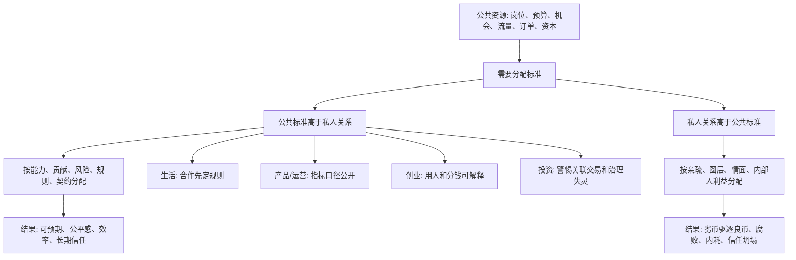

## 法家思维筑基课: 公共标准必须高于私人关系

### 作者
digoal

### 日期
2026-05-18

### 标签
公共标准 , 私人关系 , 法不阿贵 , 公司治理 , 关联交易 , 创业合伙 , 运营资源 , 产品优先级 , 投资风险 , 长期信任

----

## 背景

> 面向对象: 大学生、产品经理、运营经理、有投资需求的人  
> 核心问题: 为什么一个组织只要长期“看关系、讲人情、给熟人开口子”，最后一定会变得低效、不公平、难以预测？为什么投资时要特别警惕关联交易、任人唯亲和内部人利益输送？  
> 先说结论: “公共标准必须高于私人关系”不是反对亲情、友情和信任，而是说只要进入公共资源、组织决策、商业合作和投资分配领域，规则、证据、职责、绩效和契约必须高于亲疏远近。私人关系一旦压过公共标准，系统就会从“按贡献分配”滑向“按关系分配”，最终伤害效率、信任和长期价值。

本文把“公共标准”定义为: **可公开说明、可被多人复核、对相同情况一致适用、服务于共同目标的规则和判断尺度**。把“私人关系”定义为: **亲属、朋友、同学、同乡、熟人、圈层、上下级私交和利益小团体**。

## 一张图先看懂



## 求真讲法

### 它到底说了什么

“公共标准必须高于私人关系”可以拆成三句话。

第一，私人关系可以存在，但不能改写公共规则。你可以喜欢一个同学、信任一个老同事、尊重一个亲戚，但当涉及岗位录用、奖金分配、供应商选择、投资决策、用户权益时，必须回到公开标准。

第二，公共标准的价值不是冷酷，而是降低不确定性。大家知道什么行为会被奖励、什么行为会被惩罚、什么成果会被承认，才愿意长期投入。

第三，私人关系一旦高于公共标准，系统会形成逆向激励: 人们不再努力提高能力，而是努力接近权力、经营圈子、讨好关键人。

用一句更直白的话说:

```text
讲规则的地方讲人情，
最后会让真正做事的人失去信心；
讲人情的地方讲规则，
反而能让关系更长久。
```

这里的关键不是“无情”，而是分清场景: 私人生活可以讲情分，公共分配必须讲标准。

### 它是怎么来的

这条规律可以从古代治理、现代组织和资本市场中反复看到。

在先秦法家那里，“法不阿贵”就是类似思想: 法令标准不能因为贵族、大臣、亲近者而弯曲。它关心的是国家治理问题: 如果身份和亲疏可以凌驾规则，奖惩就不可信，国家就无法有效动员。

在现代组织里，这条规律表现为制度化管理: 招聘要有岗位要求，晋升要看职责和贡献，采购要有比价和审计，财务要有授权边界，绩效要能复核。

在资本市场里，它表现为公司治理: 管理层不能把上市公司当成私人钱包，控股股东不能通过关联交易转移利益，董事会不能只做 CEO 的熟人俱乐部，信息披露不能只保护内部人。

所以这条规律不是道德口号，而是一个系统稳定条件: **公共标准越能压住私人关系，陌生人之间越能合作，长期资本越敢进入，组织越能吸引真正有能力的人。**

### 它依赖哪些假设

这条公理依赖几个现实假设:

1. 公共资源通常是稀缺的。岗位、预算、流量、订单、资本和机会不可能无限供应。
2. 人天然会照顾亲近者。亲属、朋友、圈层和熟人会影响判断。
3. 外部人无法直接看见分配过程。标准不公开，就容易被怀疑为暗箱操作。
4. 组织长期依赖陌生人协作。越是大组织，越不能只靠熟人网络运行。
5. 激励会塑造行为。按关系分配，就会鼓励经营关系；按贡献分配，才会鼓励创造价值。

可以用一个简化公式理解:

```text
系统信任 = 标准清晰 × 执行一致 × 过程可查 × 例外受限
```

只要“例外”越来越多，大家就会意识到: 真正起作用的不是规则，而是关系。

| 维度 | 公共标准优先 | 私人关系优先 |
|---|---|---|
| 招聘 | 岗位匹配、能力验证 | 熟人推荐直接录用 |
| 晋升 | 贡献、责任、长期表现 | 亲近领导、圈层站队 |
| 采购 | 比价、质量、审计 | 关系供应商优先 |
| 产品 | 用户价值和数据证据 | 老板朋友一句话插队 |
| 运营 | 指标口径公开一致 | 给关系渠道特殊口径 |
| 投资 | 现金流、治理、估值 | 听熟人内幕和饭局故事 |
| 公司治理 | 股东利益和透明披露 | 内部人利益输送 |

### 常见误解

**误解一: 公共标准优先就是不讲人情。**

不是。它只是要求在公共分配场景里，私人关系不能破坏共同规则。真正长久的人情，反而需要边界。没有边界的人情，最后会变成债务和绑架。

**误解二: 熟人推荐一定不公平。**

不一定。熟人推荐可以降低信息成本，但必须进入同样的筛选标准。问题不是“谁推荐”，而是“是否绕过标准”。

**误解三: 小团队早期可以全靠关系。**

早期团队确实常由熟人组成，因为信任成本低。但只要开始招聘、融资、分钱、签客户、做供应商，公共标准就必须逐步建立，否则熟人关系会变成未来内耗。

**误解四: 有标准就不会腐败。**

不够。标准必须公开、执行一致、过程可查、例外受限。只写在制度里的标准，如果领导随时可以改，就仍然是私人关系优先。

## 求存讲法

### 它有什么用

这条规律可以帮你判断一个组织、项目、合作关系和投资标的是否值得长期投入。

**生活中:** 合伙、借钱、合作、租房、共同做项目，都要先讲清规则，再讲关系。

**大学里:** 组队项目要明确分工、贡献记录和署名规则，避免最后靠关系分配成绩。

**产品中:** 需求优先级要看用户价值、战略目标、数据证据和成本，而不是谁声音大、谁和老板熟。

**运营中:** 流量、预算、渠道资源要按效果和长期价值分配，不能被关系渠道长期占用。

**创业中:** 招聘、晋升、股权、奖金、采购和报销都要逐步标准化，否则团队会被熟人圈层撕裂。

**投资中:** 要看公司是否保护所有股东，而不是让控股股东、管理层、关联方优先拿走价值。

### 它推出的上层定律

| 上层定律 | 一句话解释 | 适用场景 |
|---|---|---|
| 法不阿贵定律 | 标准不能因为身份高、关系近就弯曲 | 治理、管理 |
| 例外腐蚀规则定律 | 例外越多，规则越像装饰 | 组织制度 |
| 熟人推荐同标定律 | 熟人可以推荐，但必须同标准筛选 | 招聘、合作 |
| 关联交易高风险定律 | 内部人交易天然需要更高透明度 | 投资、公司治理 |
| 贡献分配定律 | 长期合作必须让贡献和回报大体匹配 | 创业、团队 |
| 口径一致定律 | 同一指标对不同人不能有不同算法 | 产品、运营、绩效 |
| 退出权保护定律 | 当标准被关系破坏时，要保留退出机制 | 合伙、投资、择业 |

### 它怎么迁移到熟悉领域

#### 1. 大学生: 组队前先定规则

大学生做课程项目、竞赛、创业尝试，很容易因为关系好就不谈规则。结果常见问题是: 有人不干活却要署名，有人临时退出，有人把团队成果当个人成果。

更稳的做法是:

```text
任务分工: 谁负责什么
时间节点: 什么时候交付
贡献记录: 每周记录真实投入
署名规则: 按贡献和责任排序
退出规则: 中途退出如何处理成果和权益
```

这不是伤感情。相反，提前把公共标准讲清楚，才是不让关系变坏。

#### 2. 产品经理: 需求优先级不能靠关系插队

产品团队常见问题是“老板朋友提了一个需求”“大客户认识高层”“某部门负责人声音很大”。如果需求排序被关系左右，产品会失焦。

一个更稳的需求评分表:

| 评分维度 | 说明 |
|---|---|
| 用户价值 | 是否解决高频、强痛点 |
| 战略相关 | 是否服务当前核心目标 |
| 影响范围 | 影响多少用户或收入 |
| 验证证据 | 是否有数据、访谈、工单支持 |
| 开发成本 | 需要多少研发、设计、测试资源 |
| 风险 | 是否影响稳定性、合规或体验 |

关系可以提供线索，但不能替代评分。

#### 3. 运营经理: 资源分配必须防止关系渠道占坑

运营资源包括预算、流量位、达人合作、社群入口、内容排期、优惠券和人力。关系渠道常常会用“我们很熟”“以前合作过”“老板认识”来争取资源。

运营经理要做两件事:

1. 所有渠道用同一套指标看: 获客成本、留存、转化、复购、退款、投诉、长期价值。
2. 所有例外都要有期限: 试点可以，但必须有复盘和退出条件。

否则资源会流向最会经营关系的人，而不是最能创造用户价值的人。

#### 4. 创业者: 熟人团队最需要公共标准

很多创业团队由同学、朋友、前同事组成。早期信任高、沟通快，这是优势。但熟人创业最怕三件事:

1. 股权按关系分，不按贡献、风险和长期责任分。
2. 亲近的人犯错不好处理。
3. 后加入的优秀人才感觉天花板被熟人圈层锁死。

创业者要尽早建立:

```text
岗位职责
股权归属和 vesting
薪酬与绩效规则
采购和报销标准
重大决策机制
冲突解决和退出条款
```

公共标准不是大公司病，而是防止熟人团队变成小圈子政治。

#### 5. 投资者: 关联交易和任人唯亲是治理红灯

投资中，“公共标准必须高于私人关系”最直接对应公司治理。你要警惕这些信号:

| 危险信号 | 为什么危险 |
|---|---|
| 关联交易频繁且价格不透明 | 利润可能被转移给内部人 |
| 高管亲属控制供应商或客户 | 真实竞争力和成本可能失真 |
| 董事会缺乏独立性 | 无法有效监督管理层 |
| 坏消息总被淡化 | 管理层可能优先维护形象 |
| 并购对象与管理层关系密切 | 可能是利益输送，不是价值创造 |
| 高管薪酬和长期股东回报脱节 | 管理层拿走收益，股东承担风险 |
| 内部晋升只看圈层 | 组织能力会被关系网络腐蚀 |

从长期投资看，治理不是装饰。一个公司如果不能把全体股东利益置于内部人关系之上，就很难成为可长期持有的好资产。

### 它的适用范围和边界

这条规律特别适用于:

1. 公共资源分配: 岗位、预算、流量、订单、资本。
2. 多人协作: 团队项目、创业合伙、公司管理。
3. 信息不对称: 投资、采购、供应链、外包合作。
4. 长期关系: 合伙、婚姻财务、股权、客户合作。
5. 需要陌生人信任的系统: 平台、市场、公司、社区。

但它也有边界:

1. **私人关系本身不是坏事。** 信任、熟悉和默契可以降低协作成本。
2. **公共标准不能僵化。** 标准应允许合理例外，但例外必须有理由、记录、期限和复核。
3. **不是所有场景都适合完全量化。** 创意、战略、人才潜力需要定性判断，但定性判断也要能解释。
4. **关系可以提供信息，但不能替代证据。** 熟人推荐是一条线索，不是最终结论。

更稳的边界是:

```text
私人场景讲情分，
公共分配讲标准；
熟人可以给入口，
标准必须给出口；
例外可以存在，
但例外必须接受复核。
```

### 正例: 怎么用它提升能力

假设你是一个运营经理，要分配下月 50 万推广预算。三个渠道来申请资源: 老合作方、老板朋友介绍的新渠道、过去数据最好的陌生渠道。

你可以这样做:

1. 先公开预算分配标准: 获客成本、7 日留存、复购率、退款率、用户画像匹配度。
2. 给老板朋友渠道一个小额测试额度，而不是直接大额倾斜。
3. 所有渠道用同一张数据表复盘。
4. 设定退出条件: 如果两周内留存和转化低于底线，停止追加。
5. 把最终分配结果和原因写入复盘文档。

这样既没有拒绝关系线索，也没有让关系凌驾于公共标准之上。

### 反例: 前提不成立会怎样

一家创业公司早期由朋友组成。创始人把采购交给亲戚，把财务交给同学，把核心岗位留给老朋友。起初沟通很顺，但后来出现问题:

1. 亲戚供应商价格高，质量一般。
2. 财务报销不透明，没人敢问。
3. 新招来的专业人才发现晋升无望。
4. 绩效差的老朋友无法被调整。
5. 投资人尽调时发现关联交易和内控混乱。

最后，公司不是败在市场不够大，而是败在公共标准被私人关系吞掉。

这个失败的关键前提是: **当组织开始使用公共资源时，仍然按私人关系分配权力和利益。** 一旦这个前提存在，能力强的人会离开，留下的人会学习经营关系，组织就会逆向淘汰。

## 思考

### 为什么它能帮助判断真伪

表面世界很会讲故事:

```text
我们是兄弟团队。
我们关系很铁。
这个供应商是自己人。
这个人是老板信任的人。
这个项目是高层指定的。
这笔交易有特殊背景。
```

这些话不一定有问题，但你要追问:

```text
是否有公开标准？
是否同标准适用于所有人？
是否有人因关系获得例外？
例外是否有记录、期限和复核？
谁从例外中获益？
谁承担例外的代价？
```

很多真伪不是看口号，而是看标准在利益冲突时是否仍然有效。

### 为什么它能帮助预言未来

如果一个组织:

1. 关键岗位由亲近关系把持。
2. 供应商选择不透明。
3. 指标口径因人而异。
4. 贡献和回报长期不匹配。
5. 坏消息不能触及核心圈层。
6. 外部优秀人才没有公平上升通道。

那么不需要知道下一条新闻，也能预测一个方向: 这个组织会越来越依赖小圈子，真实能力下降，外部信任变弱，最终在竞争或融资收紧时暴露问题。

反过来，如果一个组织:

1. 熟人推荐也要同标准筛选。
2. 关联交易充分披露并接受审计。
3. 晋升和奖励能解释给团队听。
4. 领导亲近的人犯错也能处理。
5. 外部人才进入后能凭贡献上升。

它不一定短期最热闹，但长期更容易吸引能力、资本和信任。

### 一个反事实问题

假设公共标准不需要高于私人关系，那么世界会变得很简单:

1. 招聘只找熟人就够了。
2. 采购只给关系户就够了。
3. 投资只听饭局消息就够了。
4. 团队分钱只看谁跟老板近就够了。
5. 用户权益可以按身份区别对待。

但现实会立刻反噬: 陌生人不敢合作，优秀人才不愿加入，投资者要求更高折价，用户失去信任，组织内部开始把精力花在站队而不是创造价值上。

所以，公共标准不是为了让世界变冷，而是为了让陌生人也敢合作，让优秀者愿意投入，让长期关系不被短期人情消耗。

## 最后记住

1. 私人关系可以提供信任和信息，但不能凌驾于公共资源分配标准之上。
2. 一旦按关系分配，系统就会鼓励经营关系，而不是创造价值。
3. 产品、运营、创业和投资中，最危险的不是有人情，而是人情能绕过指标、契约、审计和责任。
4. 投资时要特别警惕关联交易、任人唯亲、董事会失效和管理层利益高于股东利益。
5. 长期信任来自可公开解释、可持续执行、对亲近者也有效的公共标准。

## 参考资料

1. 《韩非子》相关篇章: “法不阿贵”“刑过不避大臣，赏善不遗匹夫”等思想体现标准高于身份和亲疏的治理逻辑。
2. 《商君书》相关篇章: 通过赏罚和法令统一，削弱贵族身份和私人关系对公共动员的干扰。
3. Max Weber, *Economy and Society*: 官僚制理论强调职位、规则和程序，帮助理解现代组织为何不能只靠私人关系运行。
4. Douglass C. North, *Institutions, Institutional Change and Economic Performance*: 制度降低不确定性，使陌生人合作和长期交易成为可能。
5. Michael C. Jensen 与 William H. Meckling, “Theory of the Firm”, 1976: 代理问题理论解释管理层、股东和内部人之间的利益冲突。
6. Warren Buffett 历年股东信与 Berkshire Hathaway 管理思想: 管理层诚信、所有者心态、透明披露、关联交易警惕和长期股东利益，是投资中判断公司治理质量的重要框架。
  
#### [PostgreSQL 解决方案集合](../201706/20170601_02.md "40cff096e9ed7122c512b35d8561d9c8")
  
  
#### [德哥 / digoal's Github - 公益是一辈子的事.](https://github.com/digoal/blog/blob/master/README.md "22709685feb7cab07d30f30387f0a9ae")
  
  
#### [About 德哥](https://github.com/digoal/blog/blob/master/me/readme.md "a37735981e7704886ffd590565582dd0")
  
  

  
