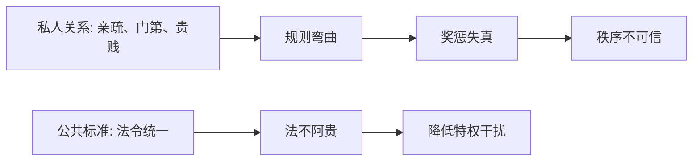

## 法家思维筑基课: 公理五: 公共标准必须高于私人关系

### 作者
digoal

### 日期
2026-05-18

### 标签
法家 , 公共标准 , 私人关系 , 法不阿贵 , 反特权 , 规则统一 , 公平边界 , 商鞅 , 韩非 , 公共治理

----

## 背景

> 面向对象: 高中生到大学低年级读者  
> 核心问题: 法家为什么反复反对贵族特权和人情干预？  
> 先说结论: 法家认为亲疏、贵贱、门第和人情会腐蚀统一规则；如果公共标准不能压过私人关系，国家就会重新落入特权和混乱。

## 一张图先看懂



## 求真讲法

### 它到底说了什么

这个公理说的是: 一个国家如果要统一治理，规则必须高于私人关系。否则有背景的人逃罚，无背景的人受罚，奖惩就会失去公信力。

法家因此主张“法不阿贵”，也就是法令不能偏袒贵人。

### 它是怎么来的

战国变法常常要打破旧贵族特权。旧秩序按血缘、身份、封地和礼制分配权力；新国家要按军功、赋税、职位和法令组织资源。

```text
旧秩序: 身份高 -> 特权多 -> 法令难统一
法家变法: 功过清楚 -> 赏罚统一 -> 国家直接控制
```

### 它依赖哪些假设

| 假设 | 含义 | 若不成立会怎样 |
|---|---|---|
| 私人关系会干扰规则 | 人会偏袒亲近者 | 必须压低人情 |
| 统一标准有治理价值 | 同事同罚更可预期 | 秩序更稳定 |
| 特权会削弱国家能力 | 贵族可能逃避义务 | 改革必须触动利益 |
| 法令能相对公开 | 人们知道标准 | 才能形成信任 |

这是法家反特权的一面，但它并不等于现代权利平等，因为法家主要是为了强化君主治理能力。

### 常见误解

**误解一: 法不阿贵就是现代法律面前人人平等。**  
相似但不相同。现代平等强调权利和程序，法家更强调君主命令对所有臣民有效。

**误解二: 人情一定坏。**  
人情能提供温暖和互助，但当它进入公共裁判和资源分配，就容易变成不公。

**误解三: 只要标准统一就公平。**  
如果标准本身不合理，统一执行也可能统一制造伤害。

## 求存讲法

### 它有什么用

它提醒我们区分私人领域和公共领域。朋友之间可以讲情分，但考试评分、招聘录用、项目评审、司法裁判不能靠关系。

### 它怎么迁移到熟悉领域

班级评奖时，如果老师偏袒熟悉的学生，规则就会失去可信度。公开标准、匿名评分、多人复核，能减少关系干扰。

### 它的适用范围和边界

适用: 公共裁判、资源分配、组织奖惩、招聘考核。  
边界: 家庭照料、朋友互助、心理支持不能完全按冷冰冰的统一标准处理。

### 正例: 怎么用它提升能力

小组互评时，提前写明评分维度: 完成质量、准时程度、协作记录、贡献证据。即使和某个同学关系好，也按证据评分。

### 反例: 前提不成立会怎样

一个班级规定所有迟到都扣同样分数，包括因突发疾病迟到的人。失败原因是“统一标准有治理价值”的前提被机械化了: 公共标准需要规则，也需要合理例外和程序说明。

## 思考

公共标准要压过私人关系，但公共标准本身也要接受质疑。  
如果规则不能偏袒贵人，却可以服务于最高权力，那它仍然不是真正现代意义上的法治。

## 最后记住

1. 法家反对私人关系腐蚀公共标准。
2. “法不阿贵”有反特权意义，但不等同于现代法治。
3. 公共事务需要公开标准和可复核证据。
4. 统一规则还必须配合合理程序和纠错机制。

## 参考资料

1. 《韩非子·有度》。
2. 《商君书·定分》。
3. 《史记·商君列传》。
4. 本文基于通行先秦思想史整理，重点区分法家反特权与现代法治。

  
#### [PostgreSQL 解决方案集合](../201706/20170601_02.md "40cff096e9ed7122c512b35d8561d9c8")
  
  
#### [德哥 / digoal's Github - 公益是一辈子的事.](https://github.com/digoal/blog/blob/master/README.md "22709685feb7cab07d30f30387f0a9ae")
  
  
#### [About 德哥](https://github.com/digoal/blog/blob/master/me/readme.md "a37735981e7704886ffd590565582dd0")
  
  

  
