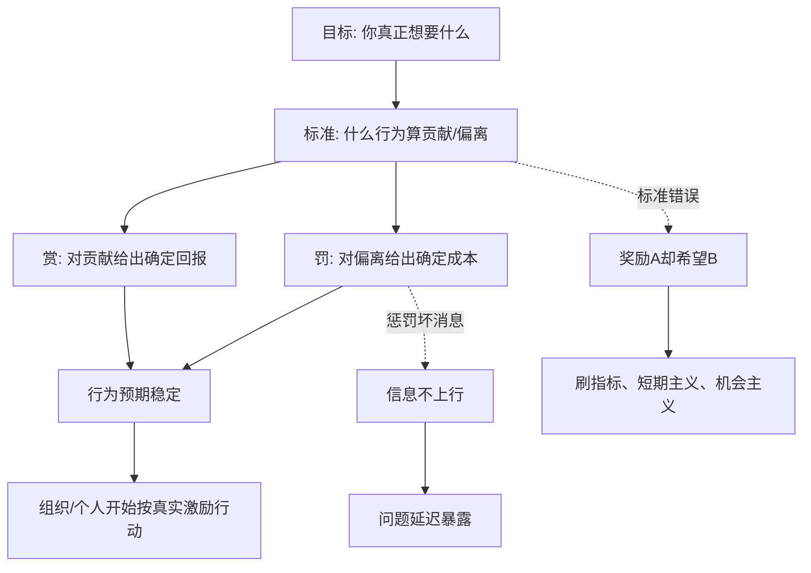

## 法家思维筑基课: 信赏必罚

### 作者
digoal

### 日期
2026-05-18

### 标签
信赏必罚 , 激励机制 , 奖惩系统 , 运营指标 , 产品增长 , 创业文化 , 管理层激励 , 投资判断 , 公司治理 , 长期价值

----

## 背景

> 面向对象: 大学生、产品经理、运营经理、有投资需求的人  
> 核心问题: 为什么很多人和组织不是没有目标，而是目标无法落地？为什么口号、愿景、制度写得很好，却没人真正按它行动？  
> 先说结论: “信赏必罚”不是简单地“多奖励、多惩罚、下重手”，而是说奖惩必须可信、稳定、及时、可预期，并且绑定真实目标。人会根据实际被奖励和实际被惩罚的东西来调整行为；如果你奖励 A 却希望 B，惩罚坏消息却希望真实反馈，系统一定会变形。

本文把“赏”定义为: **资源、机会、金钱、荣誉、信任、晋升、流量、时间和心理反馈**。把“罚”定义为: **成本、限制、责任、损失、退出、降权、复盘和纠偏**。这里的“罚”不等于羞辱和打压，而是让错误行为承担相应后果。

## 一张图先看懂



## 求真讲法

### 它到底说了什么

“信赏必罚”可以拆成四个字:

1. **信:** 奖惩必须可信。说了会奖，就真的奖；说了会罚，就真的罚。不能看心情、看关系、看声音大小。
2. **赏:** 对真正创造价值的行为给回报。回报可以是钱，也可以是机会、信任、资源、成长空间。
3. **必:** 奖惩要有稳定性。不能今天这样、明天那样，不能同样行为对不同人不同处理。
4. **罚:** 对破坏目标、违反规则、转嫁风险的行为给成本。否则坏行为会变成低成本套利。

它最深的意思不是“严”，而是“可预期”。

```text
人不会长期按口号行动，
人会长期按真实激励行动。
```

一个组织口头上说重视长期价值，但奖金只按本月 GMV 发，员工就会追本月 GMV。一个产品口头上说重视用户体验，但团队只奖励日活，大家就会想办法推通知、做签到、加弹窗。一个投资标的口头上说保护股东，但管理层薪酬只看规模，资本就可能被拿去盲目扩张。

### 它是怎么来的

“信赏必罚”是法家治理思想中的经典原则。战国时代国家竞争激烈，国家要把人口、土地、粮食、军功和官僚执行组织起来。仅靠道德号召不够，必须让普通人能清楚知道: 什么行为会被奖，什么行为会被罚。

商鞅、韩非等法家人物都重视赏罚，因为他们关心的问题是: 在大规模陌生人社会里，怎样让行为可预测、命令可执行、功过可分辨？

在现代，它不只属于政治思想，也属于组织管理、行为科学、经济学和投资判断:

```text
法家: 赏罚让国家命令可执行
管理学: 激励让组织目标可落地
经济学: 人会响应激励
产品运营: 机制塑造用户和团队行为
投资: 管理层激励决定资本配置方向
```

所以它是一条跨领域底层规律: **任何系统都会朝着被真实奖励的方向演化，并逃避被真实惩罚的方向。**

### 它依赖哪些假设

这条规律依赖几个现实假设:

1. 人会响应激励。不是所有人都只为利益行动，但长期来看，激励会改变行为分布。
2. 行为有成本。努力、诚实、长期主义、复盘、说坏消息都需要成本；如果没有回报，它们会减少。
3. 坏行为如果没有代价，会被复制。刷量、甩锅、偷懒、虚报、短期套利，只要收益大于成本，就会扩散。
4. 奖惩必须绑定可观察行为。完全无法观察的东西，很难稳定奖惩。
5. 奖惩标准会反过来塑造系统。指标一旦变成奖惩依据，人们就会围绕指标优化，甚至扭曲指标。

可以用一个简化公式理解:

```text
行为倾向 = 预期收益 - 预期成本 + 被发现概率 × 后果强度
```

如果做好事没有收益，做坏事没有成本，系统就会惩罚好人、奖励坏人。

| 要素 | 设计正确时 | 设计错误时 |
|---|---|---|
| 目标 | 奖惩服务真实目标 | 奖惩服务表面指标 |
| 标准 | 清楚、稳定、可复核 | 模糊、随意、看关系 |
| 奖励 | 奖给贡献和长期价值 | 奖给会表演的人 |
| 惩罚 | 惩罚破坏规则和转嫁风险 | 惩罚说真话和报坏消息 |
| 时间 | 反馈及时 | 反馈滞后，行为和结果断开 |
| 比例 | 奖惩与影响匹配 | 小错重罚，大错无事 |
| 一致性 | 对亲近者也适用 | 熟人例外，规则失效 |

### 常见误解

**误解一: 信赏必罚就是严刑峻法。**

不是。严厉不是关键，可信才是关键。过度惩罚会制造恐惧，导致隐瞒、甩锅和保守。真正有效的罚，是让错误行为承担合理后果，而不是让人害怕承担责任。

**误解二: 奖励越大越好。**

不一定。奖励过大可能诱导造假、短期主义和风险转嫁。比如只按销售额发奖金，销售可能承诺无法交付的条件，最后损害客户和品牌。

**误解三: 惩罚越重越能减少错误。**

不一定。如果错误来自探索、创新和复杂环境，重罚会让人不敢试错。该罚的是隐瞒、欺骗、重复犯错和违反底线，不是所有失败。

**误解四: 只要有 KPI 就算信赏必罚。**

不对。KPI 只是指标，不是目标本身。如果 KPI 设计错了，执行越严格，系统越扭曲。

## 求存讲法

### 它有什么用

这条规律能帮你判断一个人、团队、产品、公司和投资标的的真实运行方向。

**生活中:** 你想养成习惯，就不能只靠意志，要设计即时反馈和真实成本。

**大学里:** 团队项目不能只喊“大家积极点”，要记录贡献，按贡献分工、署名和评分。

**产品中:** 用户激励会塑造用户行为。补贴、积分、等级、推荐、限免、封禁都会改变用户动作。

**运营中:** 活动指标奖什么，团队就会优化什么；只奖拉新，就可能牺牲留存和质量。

**创业中:** 公司文化不是墙上的价值观，而是实际奖谁、罚谁、提拔谁、容忍谁。

**投资中:** 管理层薪酬、股权、回购、并购、资本开支和信息披露，会告诉你这家公司真正奖励什么。

### 它推出的上层定律

| 上层定律 | 一句话解释 | 适用场景 |
|---|---|---|
| 真实激励胜过口号定律 | 人会按实际奖惩行动，而不是按标语行动 | 管理、创业 |
| 奖励 A 得到 A 定律 | 奖什么，就会得到什么，哪怕你嘴上想要 B | 产品、运营 |
| 惩罚坏消息定律 | 惩罚坏消息，会让坏消息消失在汇报里 | 组织管理 |
| 低成本作恶扩散定律 | 违规没有成本，违规者会越来越多 | 平台、团队 |
| 及时反馈定律 | 奖惩越及时，行为越容易被塑造 | 学习、运营 |
| 比例匹配定律 | 奖罚要和影响大小匹配，否则会失真 | 管理、法治 |
| 激励一致定律 | 管理层收益必须和长期所有者收益一致 | 投资、公司治理 |

### 它怎么迁移到熟悉领域

#### 1. 大学生: 自律不是靠狠话，而是靠反馈系统

很多人说“我要努力学习”，但没有赏罚系统。结果今天学不学都差不多，短期娱乐立刻有奖励，长期学习回报太远。

可以这样设计:

```text
目标: 30 天完成一门课程
赏: 每完成 3 天学习，允许一次高质量娱乐
罚: 当天未完成，不刷短视频，不熬夜补偿
反馈: 每晚记录学习时长、输出笔记、错题数量
复盘: 每 7 天看一次真正掌握了什么
```

这不是把自己当机器，而是承认人会被即时反馈影响。

#### 2. 产品经理: 用户激励要防止薅羊毛

产品做增长时常用补贴、积分、签到、任务奖励。问题是: 用户会优化你给的奖励，而不一定产生你想要的价值。

| 你奖励什么 | 用户可能做什么 | 更稳的设计 |
|---|---|---|
| 注册 | 批量小号 | 奖励有效激活 |
| 邀请人数 | 拉低质量用户 | 奖励被邀请者留存 |
| 发帖数量 | 灌水 | 奖励有效互动和内容质量 |
| 下单金额 | 凑单后退款 | 看净收入和退款率 |
| 日活 | 机械签到 | 看核心功能使用和留存 |

产品激励的本质不是让数字变好看，而是让用户行为更接近真实价值。

#### 3. 运营经理: 不能奖励短期 GMV 却希望长期复购

运营团队如果只按本月 GMV 发奖金，最容易出现:

1. 大量补贴拉高成交。
2. 低质量渠道冲量。
3. 售后和退款被延后暴露。
4. 用户被过度打扰。
5. 下月复购下降。

更合理的运营激励要同时看:

```text
新增用户质量
首单转化
7日/30日留存
复购率
退款率
毛利
用户投诉
长期 LTV
```

这不是让指标复杂化，而是防止单一指标绑架真实目标。

#### 4. 创业者: 公司文化就是实际奖惩史

创业公司常说“我们重视用户、长期主义、开放沟通”。但员工真正看的不是口号，而是:

1. 谁被提拔。
2. 谁拿奖金。
3. 谁犯错后被保护。
4. 谁说真话后被打压。
5. 谁短期冲数后得到表扬。
6. 谁长期解决难题却被忽视。

如果公司奖励会包装的人，惩罚说坏消息的人，那么文化就会变成表演文化。创始人越忙，越要警惕真实奖惩和口头价值观分裂。

#### 5. 投资者: 看管理层实际被什么奖励

投资中，信赏必罚对应公司治理和资本配置。投资者要问:

| 检查问题 | 好信号 | 危险信号 |
|---|---|---|
| 管理层薪酬绑定什么 | 每股内在价值、自由现金流、ROIC | 收入规模、短期 EPS、股价短期波动 |
| 并购失败有没有代价 | 承认错误、减值、调整策略 | 继续讲协同故事，责任消失 |
| 资本开支是否有纪律 | 投向高回报项目 | 为了规模和排名扩张 |
| 回购是否理性 | 低于内在价值时回购 | 高估时回购只为托 EPS |
| 坏消息是否披露 | 主动解释困难 | 只讲亮点，坏消息藏在脚注 |
| 管理层是否像所有者 | 长期持股，重视股东回报 | 高薪低持股，风险由股东承担 |

这不是具体投资建议，而是一个底层过滤器: **如果管理层被奖励的是规模、短期股价和个人收入，你就不能期待它自然追求长期股东价值。**

### 它的适用范围和边界

这条规律特别适用于:

1. 需要重复行为的场景: 学习、健身、销售、内容生产、运营活动。
2. 需要多人协作的场景: 团队项目、创业公司、平台治理。
3. 信息不对称的场景: 管理层和股东、老板和员工、平台和用户。
4. 容易刷指标的场景: 流量、GMV、注册、发帖、绩效考核。
5. 长周期决策: 投资、人才培养、品牌建设、技术研发。

但它也有边界:

1. **不是所有价值都能立刻奖惩。** 创新、信任、品牌、研究、长期能力建设需要耐心。
2. **过度奖惩会挤出内在动机。** 如果所有事都只用钱和罚来驱动，人会失去责任感和创造力。
3. **探索性失败不能简单惩罚。** 该惩罚的是不复盘、隐瞒、重复犯错、突破底线。
4. **指标不等于目标。** 一旦指标被用于奖惩，就必须防作弊、防短期主义。
5. **奖惩必须受公共标准约束。** 如果熟人例外、亲近者免罚，信赏必罚会立刻失效。

更稳的边界是:

```text
明确目标，
谨慎选指标，
奖励真实贡献，
惩罚底线破坏，
允许诚实试错，
持续修正激励。
```

### 正例: 怎么用它提升能力

假设你是一个运营经理，要提升社群的真实转化，而不是只让群里看起来热闹。

可以这样设计奖惩:

1. **目标:** 提升有效咨询、付费转化和 30 日留存。
2. **奖励:** 奖励带来高质量咨询、真实成交、低退款用户的运营动作。
3. **不奖励:** 不单独奖励发言条数、表情包数量、无效拉群人数。
4. **惩罚:** 对虚假承诺、诱导下单、刷活跃、隐瞒退款的行为扣减绩效。
5. **反馈:** 每周复盘成交来源、投诉原因、用户留存和内容质量。
6. **纠偏:** 如果活跃上升但退款上升，就停止当前话术和激励。

这样做的关键，是把奖惩对准真实目标，而不是对准好看的表面数字。

### 反例: 前提不成立会怎样

一家创业公司为了快速融资，把销售团队奖金和“签约金额”强绑定，却没有把回款、交付成本、退款和客户满意度纳入考核。

结果出现:

1. 销售承诺过度定制。
2. 客户签约后交付团队无法完成。
3. 回款周期拉长。
4. 退款和投诉增加。
5. 销售短期拿奖金，交付和公司承担长期成本。

这个失败不是因为“奖励销售”错了，而是因为一个关键前提不成立: **被奖励的指标不代表真实价值。** 公司奖励了签约金额，却希望得到健康收入；奖励了短期冲刺，却希望长期口碑。系统当然会朝被奖励的方向走。

## 思考

### 为什么它能帮助判断真伪

表面世界很会讲价值观:

```text
我们重视用户。
我们长期主义。
我们鼓励创新。
我们尊重人才。
我们追求高质量增长。
我们保护股东利益。
```

但真正的问题是:

```text
谁实际拿到了奖励？
谁实际承担了后果？
奖励是否绑定真实目标？
惩罚是否只落在弱势者身上？
坏消息会不会被惩罚？
亲近者是否可以例外？
```

一个组织真实相信什么，不看它说什么，看它奖什么、罚什么、容忍什么。

### 为什么它能帮助预言未来

如果一个公司:

1. 奖励短期收入，不看现金流。
2. 奖励扩张速度，不看资本回报。
3. 奖励汇报漂亮，不看真实问题。
4. 惩罚坏消息，不惩罚隐瞒。
5. 亲近者犯错没有代价。
6. 管理层收益和股东长期收益不一致。

那么不用知道下一份财报细节，也能推断方向: 短期数字可能好看，但风险会被延迟、转移和累积，直到某个节点集中暴露。

反过来，如果一个组织:

1. 奖励真实贡献。
2. 惩罚越界行为。
3. 允许诚实失败。
4. 坏消息能上行。
5. 管理层和长期所有者利益一致。
6. 指标定期根据真实目标修正。

它未必每次都冲得最快，但更可能长期复利。

### 一个反事实问题

假设人完全不受奖惩影响，那么世界会很简单:

1. 公司只要喊口号，员工就会行动。
2. 产品只要告诉用户“请高质量使用”，用户就不会薅羊毛。
3. 投资者只要相信管理层说长期主义，就不用看薪酬和资本配置。
4. 学生只要立志学习，就不会被短期娱乐吸引。
5. 组织只要写价值观，就自然形成文化。

但现实不是这样。现实中，人会被即时反馈、利益、成本、声誉、机会和风险影响。因此，真正成熟的人和组织，不是回避奖惩，而是设计更接近真实目标的奖惩。

## 最后记住

1. 信赏必罚的核心不是严厉，而是奖惩可信、稳定、及时、可预期。
2. 人和组织会朝真实被奖励的方向行动，而不是朝口头宣称的方向行动。
3. 奖励错误指标，会得到错误行为；惩罚坏消息，会得到沉默和伪装。
4. 产品、运营、创业和投资中，最重要的问题之一是: 激励是否和真实目标一致？
5. 好的奖惩系统奖励真实贡献、惩罚底线破坏、允许诚实试错，并持续修正指标。

## 参考资料

1. 《商君书》相关篇章: 赏罚、农战、定分等内容体现以确定奖惩塑造行为和国家动员的思想。
2. 《韩非子》相关篇章: 《二柄》《有度》《定法》等篇集中讨论赏罚权、法令可信和官僚控制。
3. B. F. Skinner, *Science and Human Behavior*: 行为主义关于强化、反馈和行为塑造的经典研究。
4. Steven Kerr, “On the Folly of Rewarding A, While Hoping for B”, 1975: 经典说明组织常常奖励了错误行为，却期待相反结果。
5. Michael C. Jensen 与 William H. Meckling, “Theory of the Firm”, 1976: 代理理论解释激励错位如何导致管理者和所有者目标不一致。
6. Bengt Holmstrom 与 Paul Milgrom 关于多任务委托代理的研究: 说明绩效指标不完整时，强激励可能让人忽视未被衡量的重要任务。
7. Warren Buffett 历年股东信与 Berkshire Hathaway 管理思想: 管理层诚信、所有者心态、资本配置纪律和长期股东利益，是投资中判断激励一致性的核心框架。
  
#### [PostgreSQL 解决方案集合](../201706/20170601_02.md "40cff096e9ed7122c512b35d8561d9c8")
  
  
#### [德哥 / digoal's Github - 公益是一辈子的事.](https://github.com/digoal/blog/blob/master/README.md "22709685feb7cab07d30f30387f0a9ae")
  
  
#### [About 德哥](https://github.com/digoal/blog/blob/master/me/readme.md "a37735981e7704886ffd590565582dd0")
  
  

  
