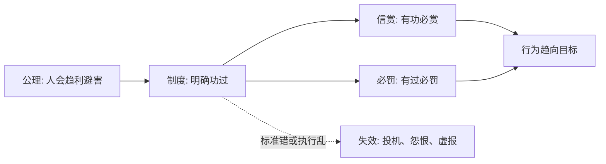

## 法家思维筑基课: 上层定律一: 信赏必罚

### 作者
digoal

### 日期
2026-05-18

### 标签
法家 , 信赏必罚 , 赏罚信用 , 行为激励 , 功过绑定 , 制度执行 , 商鞅 , 韩非 , 组织管理 , 指标校验

----

## 背景

> 面向对象: 高中生到大学低年级读者  
> 核心问题: 为什么法家说赏罚必须可信、必定、可预期？  
> 先说结论: 如果人会趋利避害，那么治理者就必须让功劳和奖励、过错和惩罚稳定对应；赏罚一旦不可信，制度就会变成猜人情、赌运气。

## 一张图先看懂

## 求真讲法

### 它到底说了什么

“信赏必罚”的重点不是严厉，而是确定。人们要相信: 做出制度要求的贡献，真的会得到奖励；违反明确规则，真的会承担后果。

在法家看来，赏罚不确定比赏罚轻更危险。因为不确定会让人转向猜测领导喜怒、寻找关系、包装表面功劳。

### 它是怎么来的

它主要从两个底层公理推出:

| 来源公理 | 推导 |
|---|---|
| 人会趋利避害 | 奖惩能引导行为 |
| 国家竞争要求组织动员 | 必须把个人行为导向国家目标 |

所以商鞅、韩非都强调赏罚要和功过绑定，而不是和出身、口才、亲疏绑定。

### 它依赖哪些假设

| 假设 | 含义 | 若不成立会怎样 |
|---|---|---|
| 功过可识别 | 能判断谁贡献、谁违规 | 奖惩会错配 |
| 规则可预期 | 人知道怎样做 | 行为无法稳定 |
| 执行有信用 | 说到做到 | 制度才有威慑 |
| 指标代表目标 | 奖励的事真有价值 | 否则鼓励作假 |

### 常见误解

**误解一: 必罚就是越重越好。**  
不是。法家重视确定性，但现代迁移时还要考虑比例原则和程序正义。

**误解二: 有奖有罚就公平。**  
如果记录不准、目标错误，奖惩越明确越会制造错误激励。

**误解三: 信赏必罚只适合国家。**  
它也能解释学校、公司、家庭中的规则可信问题。

## 求存讲法

### 它有什么用

它让组织成员不用猜人情，而是看规则。对军功、项目、考试、生产、纪律都很有用。

### 它怎么迁移到熟悉领域

老师如果说“按时提交加分”，就必须真的加；如果有学生迟交却因为关系好不扣分，规则信用会立刻下降。

### 它的适用范围和边界

适用: 目标明确、记录清楚、规则可公开的场景。  
边界: 情绪支持、创意探索、复杂研究不能简单用强奖惩驱动。

### 正例: 怎么用它提升能力

给自己设定背单词规则: 每天完成 50 个复习词并通过自测，才能刷短视频。完成就兑现奖励，没完成就推迟娱乐。这样规则有信用。

### 反例: 前提不成立会怎样

公司按“代码提交行数”发奖金，结果员工写大量冗余代码。失败原因是“指标代表目标”不成立，行数不等于价值。

## 思考

信赏必罚的问题不只是“奖罚有没有执行”，更是“奖罚到底在奖励什么人、惩罚什么行为”。  
错误指标上的坚定执行，比没有执行更危险。

## 最后记住

1. 信赏必罚的核心是确定性和信用。
2. 它从趋利避害和组织动员两个公理推出。
3. 奖惩必须绑定真实功过，而不是关系和表演。
4. 现代使用时必须补上程序、公平和指标校验。

## 参考资料

1. 《韩非子·二柄》《韩非子·有度》。
2. 《商君书·赏刑》。
3. 《史记·商君列传》。
4. 本文基于通行先秦思想史整理。

  
#### [PostgreSQL 解决方案集合](../201706/20170601_02.md "40cff096e9ed7122c512b35d8561d9c8")
  
  
#### [德哥 / digoal's Github - 公益是一辈子的事.](https://github.com/digoal/blog/blob/master/README.md "22709685feb7cab07d30f30387f0a9ae")
  
  
#### [About 德哥](https://github.com/digoal/blog/blob/master/me/readme.md "a37735981e7704886ffd590565582dd0")
  
  

  
