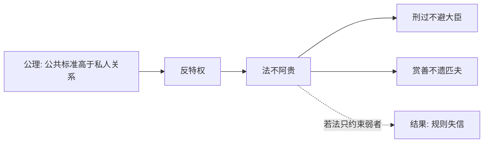

## 法家思维筑基课: 上层定律二: 法不阿贵

### 作者
digoal

### 日期
2026-05-18

### 标签
法家 , 法不阿贵 , 反特权 , 公共标准 , 规则信用 , 贵族政治 , 现代法治边界 , 韩非 , 商鞅 , 公平治理

----

## 背景

> 面向对象: 高中生到大学低年级读者  
> 核心问题: 为什么法家要让贵族和权臣也受法令约束？  
> 先说结论: 如果私人关系和身份特权会破坏公共标准，那么法令就不能因为一个人高贵、有权、亲近君主而弯曲。

## 一张图先看懂

## 求真讲法

### 它到底说了什么

“法不阿贵”的意思是，法令标准不能迎合贵人。高官、有爵位、和君主亲近，都不应该成为逃避责任的理由。

这条定律有很强的反特权意义。它要打破旧贵族凭身份享受特殊待遇的结构。

### 它是怎么来的

它主要从两个公理推出:

| 来源公理 | 推导 |
|---|---|
| 公共标准必须高于私人关系 | 规则不能被亲疏贵贱扭曲 |
| 国家竞争要求组织动员 | 特权会削弱统一动员 |

如果贵族可以不服役、不纳责、不受罚，国家就很难直接组织资源。

### 它依赖哪些假设

| 假设 | 含义 | 若不成立会怎样 |
|---|---|---|
| 法令相对公开 | 人们知道标准 | 才能判断是否偏袒 |
| 特权会腐蚀执行 | 权贵逃责会破坏信用 | 必须反特权 |
| 国家有能力执法 | 能处理高位者 | 否则只是口号 |
| 法本身服务公共秩序 | 不是私人报复工具 | 否则统一执行也不正义 |

### 常见误解

**误解一: 法不阿贵就是现代平等法治。**  
不完全。它接近“反特权”，但先秦法家的法仍主要服务君主治理，不是以个人权利为中心。

**误解二: 对权贵严厉就一定公平。**  
还要看程序是否正当、事实是否清楚、法律本身是否合理。

**误解三: 人情在任何地方都不该存在。**  
私人关系在生活中有价值，但不能进入公共裁判。

## 求存讲法

### 它有什么用

它维护规则信用。一个规则如果只约束普通人、不约束有关系的人，就会很快变成空话。

### 它怎么迁移到熟悉领域

班干部迟到也要按班规处理，不能因为“他平时贡献大”就完全免除。可以表扬贡献，但不能让贡献取消基本规则。

### 它的适用范围和边界

适用: 评分、招聘、处罚、公共资源分配、组织纪律。  
边界: 规则必须有合理例外，比如疾病、灾害、不可抗力，但例外要公开说明。

### 正例: 怎么用它提升能力

团队规定所有人提交材料都要经过查重和引用检查，包括组长。这样组长不能只监督别人，也要受同一标准约束。

### 反例: 前提不成立会怎样

学校规定“任何考试缺席都记零分”，连因急病住院的学生也不允许补考。失败原因是“法本身服务公共秩序”不成立，机械统一损害了正当性。

## 思考

反特权只是公平的起点。真正困难的是: 谁来制定标准？谁来监督执行标准的人？  
如果最高权力不受法限制，“法不阿贵”仍可能停在半路。

## 最后记住

1. 法不阿贵反对身份和关系压倒公共标准。
2. 它有反特权意义，但不等于现代权利法治。
3. 同一规则要约束高位者，规则才有信用。
4. 现代迁移时必须加入程序正义和合理例外。

## 参考资料

1. 《韩非子·有度》。
2. 《商君书·定分》。
3. 《史记·商君列传》。
4. 本文基于通行先秦思想史整理。

  
#### [PostgreSQL 解决方案集合](../201706/20170601_02.md "40cff096e9ed7122c512b35d8561d9c8")
  
  
#### [德哥 / digoal's Github - 公益是一辈子的事.](https://github.com/digoal/blog/blob/master/README.md "22709685feb7cab07d30f30387f0a9ae")
  
  
#### [About 德哥](https://github.com/digoal/blog/blob/master/me/readme.md "a37735981e7704886ffd590565582dd0")
  
  

  
