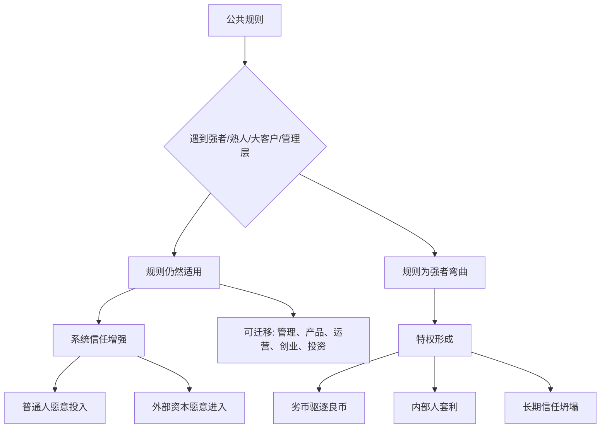

## 法家思维筑基课: 法不阿贵

### 作者
digoal

### 日期
2026-05-18

### 标签
法不阿贵 , 公共规则 , 强者约束 , 特权风险 , 产品治理 , 运营复盘 , 创业管理 , 公司治理 , 关联交易 , 投资风险

----

## 背景

> 面向对象: 大学生、产品经理、运营经理、有投资需求的人  
> 核心问题: 为什么一个系统最危险的不是普通人违规，而是强者、熟人、核心客户、管理层和内部人可以绕过规则？  
> 先说结论: “法不阿贵”不是简单说“人人都一样处理”，而是说公共规则不能因为身份高、资源多、关系近、贡献大、话语权强就弯曲。真正检验一个系统是否可信，不看它怎样约束弱者，而看它能否约束强者。

本文把“贵”扩展理解为: **拥有更高身份、资源、关系、流量、客户价值、管理权、资本权或话语权的人**。把“法”扩展理解为: **公开规则、契约、流程、指标、合规底线、财务纪律和组织共同标准**。

## 一张图先看懂



## 求真讲法

### 它到底说了什么

“法不阿贵”出自法家治理思想，常和“刑过不避大臣，赏善不遗匹夫”一起理解。它的核心不是仇视高位者，而是反对规则因为高位者而变形。

可以拆成三层意思:

1. **规则要能约束强者。** 如果规则只约束普通人，不约束掌权者、核心关系户和内部人，它就不是公共规则，而是管理弱者的工具。
2. **奖惩要看行为和结果，不看身份亲疏。** 有功者虽低也应得赏，有过者虽贵也应承担后果。
3. **系统可信度来自关键例外。** 平时说规则很容易，真正困难的是当违规者很有资源、很有关系、很重要时，规则是否仍然有效。

一句话:

```text
规则是否真实，
不看它怎样对待普通人，
要看它怎样对待强者和自己人。
```

### 它是怎么来的

在战国时代，旧贵族、宗族、亲疏关系会影响国家资源分配和奖惩。如果贵族犯错可以免罚，平民立功却得不到回报，国家就很难形成稳定动员能力。

法家要解决的问题是: 怎样让国家不再被身份、血缘和私人关系绑架？答案之一就是“法不阿贵”: 法令标准必须压过身份特权。

迁移到现代，它对应的是:

```text
公司治理: 控股股东不能掏空公司
团队管理: 老员工和亲信不能免于绩效规则
产品治理: 大客户不能无限破坏产品边界
平台治理: 头部账号不能免于社区规则
投资判断: 管理层不能把股东资本当成私人资源
```

所以，“法不阿贵”的现代价值，不在于复古，而在于提醒我们: **任何系统只要允许强者免于规则，就会逐步变成特权系统。**

### 它依赖哪些假设

这条规律依赖几个现实假设:

1. 强者拥有更高议价权，更容易要求例外。
2. 执行规则的人会受到压力、关系、利益和恐惧影响。
3. 普通人会观察规则是否真正适用于强者。
4. 例外一旦被看见，就会改变所有人的预期。
5. 长期协作需要稳定预期，而稳定预期需要规则压过身份。

可以用一个简化公式理解:

```text
规则可信度 = 对普通人的执行一致性 × 对强者的执行一致性
```

如果对强者的执行接近 0，那么整体可信度也会接近 0。因为大家会知道: 规则只是给没有特权的人准备的。

| 场景 | 法不阿贵成立 | 法阿贵时 |
|---|---|---|
| 招聘 | 关系候选人也要同标准面试 | 熟人跳过筛选 |
| 晋升 | 高贡献、可复核、能解释 | 亲信优先 |
| 产品 | 大客户需求也进优先级评估 | 大客户一句话打乱路线图 |
| 运营 | 头部渠道也按真实 ROI 复盘 | 关系渠道长期占预算 |
| 平台 | 大账号违规也处理 | 头部账号享有隐性豁免 |
| 创业 | 联创、亲友也受财务和绩效约束 | 核心圈层免审计 |
| 投资 | 管理层、控股股东受治理约束 | 内部人优先拿走价值 |

### 常见误解

**误解一: 法不阿贵就是绝对一刀切。**

不是。同样规则不等于同样处理所有细节。不同岗位、不同责任、不同风险可以有不同标准，但标准必须事先可解释，不能事后因为身份而改变。

**误解二: 对重要客户和核心人才不能特殊照顾。**

可以有差异化服务和差异化激励，但不能突破底线。比如大客户可以有专属支持，但不能让产品长期为单一客户私有化；核心人才可以有更高薪酬，但不能免于诚信和绩效底线。

**误解三: 强者犯错严惩就一定好。**

也不对。关键不是报复强者，而是让后果和行为匹配。规则要稳定、比例合理、过程可查，避免变成情绪化清算。

**误解四: 法不阿贵等于现代法治。**

不完全等同。先秦法家的“法”主要是治理工具，现代法治还包括限制公权力、保护权利、正当程序和司法独立。本文借用的是“公共标准不能向特权弯曲”这一底层洞察。

## 求存讲法

### 它有什么用

这条规律能帮你判断一个组织、产品、合作关系和投资标的是否值得长期信任。

**生活中:** 看一个人是否只对弱者讲规则、对强者讲人情。

**大学里:** 看团队是否允许“关系好的人少干活也署名靠前”。

**产品中:** 看需求优先级是否被老板朋友、大客户、内部高层随意插队。

**运营中:** 看预算和流量是否被关系渠道、头部合作方长期占用而不复盘。

**创业中:** 看亲友、联创、老员工、核心销售是否也受财务、绩效和合规约束。

**投资中:** 看控股股东、管理层、关联方是否能绕过普通股东利益拿走公司价值。

### 它推出的上层定律

| 上层定律 | 一句话解释 | 适用场景 |
|---|---|---|
| 强者约束定律 | 规则最重要的对象，是最有能力绕过规则的人 | 管理、治理 |
| 例外透明定律 | 强者例外必须有理由、期限、记录和复核 | 产品、运营 |
| 自己人测试定律 | 看系统可信度，要看它如何处理自己人违规 | 创业、团队 |
| 大客户边界定律 | 大客户可以重要，但不能无限改写产品原则 | 产品、B2B |
| 头部账号同规定律 | 平台头部贡献者也不能破坏公共规则 | 社区、平台 |
| 控股股东约束定律 | 投资要看大股东是否尊重小股东利益 | 投资、公司治理 |
| 规则信号定律 | 强者被规则约束，会向系统释放高信任信号 | 组织文化 |

### 它怎么迁移到熟悉领域

#### 1. 大学生: 组队时最该约束的是“关系好的人”

课程项目里，陌生人不干活通常容易处理；最难处理的是朋友、室友、熟人不干活。因为你不好意思说，关系压力会压过贡献标准。

更稳的做法是:

```text
事前: 写清分工、交付和署名标准
事中: 每周记录实际贡献
事后: 按贡献决定展示和署名
例外: 临时困难可以调整任务，但要公开说明
```

真正成熟的关系，不是互相纵容，而是能承受规则。

#### 2. 产品经理: 大客户不能无限改写产品路线

B2B 产品常遇到大客户提出定制需求。大客户很重要，但如果每个大客户都能绕过产品标准，产品会变成项目外包集合。

产品经理要问:

1. 这个需求是否代表一类客户，还是只代表单一客户？
2. 是否能抽象成通用能力？
3. 是否会增加长期维护成本？
4. 是否会破坏现有用户体验？
5. 是否有明确收入覆盖定制成本？
6. 是否有退出或收敛机制？

大客户可以获得优先响应，但不能让产品战略失去公共标准。

#### 3. 运营经理: 头部渠道也要复盘

运营里常有“这个渠道老板认识”“这个达人关系很好”“这个社区是核心资源”。关系和历史贡献可以成为合作理由，但不能成为免检理由。

运营经理要坚持:

| 检查项 | 为什么重要 |
|---|---|
| 获客成本 | 防止关系渠道高成本占坑 |
| 留存质量 | 防止短期冲量 |
| 退款投诉 | 防止把成本转嫁给后端 |
| 复购和 LTV | 看长期价值 |
| 预算占比 | 防止单一关系渠道绑架增长 |
| 退出条件 | 防止“因为熟”而永远续费 |

如果头部渠道不能接受复盘，它就不是资产，而是组织风险。

#### 4. 创业者: 联创和亲友必须更透明

创业早期常靠熟人和亲友启动，这是正常的。但越是熟人，越要把规则讲清楚。

重点包括:

1. 股权 vesting 和退出条款。
2. 报销、采购和用章权限。
3. 亲属供应商的比价和审批。
4. 联创绩效和职责边界。
5. 核心销售的客户承诺边界。
6. 重大决策的记录和复盘。

原因很简单: 外部员工、客户和投资人都会观察，核心圈层是否也受规则约束。

#### 5. 投资者: 最大风险往往来自“贵者可免”

投资中，“贵”通常表现为控股股东、实际控制人、管理层、核心客户、关联方和地方资源。它们既可能是优势，也可能是风险源。

投资者要特别检查:

| 检查问题 | 好信号 | 危险信号 |
|---|---|---|
| 控股股东是否尊重上市公司边界 | 交易透明，资产独立 | 资金占用、担保、利益输送 |
| 关联交易是否公允 | 披露充分，有独立审议 | 价格不清，必要性不明 |
| 管理层犯错是否有后果 | 承认错误，调整资本配置 | 失败并购无人负责 |
| 薪酬是否匹配长期价值 | 和 ROIC、现金流、长期回报相关 | 高薪、低持股、短期指标 |
| 大客户是否绑架公司 | 客户集中但合同清晰 | 议价权过强，利润被压缩 |
| 坏消息是否能触达董事会 | 披露直接，治理有效 | 董事会像熟人俱乐部 |

这不是具体投资建议，而是底层治理过滤器: **如果强者可以免于规则，少数股东的安全边际就必须大幅提高，甚至直接放弃。**

### 它的适用范围和边界

这条规律特别适用于:

1. 资源分配场景: 岗位、预算、流量、订单、资本。
2. 强弱关系明显的场景: 老板和员工、平台和商家、大客户和供应商。
3. 信息不对称场景: 投资、采购、外包、公司治理。
4. 长期协作场景: 创业合伙、产品路线、运营渠道、股东关系。

但它也有边界:

1. **差异化不是特权。** 贡献更大、责任更重、风险更高的人，可以有不同回报。
2. **合理例外不是腐败。** 危机、创新试点、战略客户可以有例外，但必须有记录、期限、复核和退出条件。
3. **程序正义不能被情绪替代。** 不能因为对方是强者就预设有罪，仍然要看证据、比例和程序。
4. **规则不能僵化到阻止创新。** 早期探索需要弹性，但弹性不能变成少数人的永久豁免权。

更稳的边界是:

```text
不同贡献可以不同回报，
不同责任可以不同权限，
但任何身份都不能免于底线；
任何例外都必须能被解释和复核。
```

### 正例: 怎么用它提升能力

假设你是一个产品经理，大客户要求插队开发一个高度定制功能，销售团队也施压，因为这个客户年度合同很大。

你可以这样处理:

1. 把需求放入统一评分表，而不是口头拍板。
2. 评估它是否能抽象成通用能力。
3. 计算开发、测试、维护和机会成本。
4. 要求销售明确收入、交付边界和客户承诺。
5. 如果确实要做，设置版本边界和维护期限。
6. 向团队说明为什么例外，以及何时复盘。

这样既尊重大客户价值，也不让大客户凌驾于产品公共标准之上。

### 反例: 前提不成立会怎样

一家创业公司有一位明星销售，业绩长期第一。因为他能带来大客户，管理层对他特殊照顾:

1. 他可以绕过 CRM 录入。
2. 他可以给客户承诺研发还没确认的功能。
3. 他的报销不严格审核。
4. 他和交付团队冲突时，公司总是偏向他。
5. 其他销售必须遵守流程，但他不用。

短期看，公司收入增长很快；长期看，交付团队疲惫、客户预期失控、财务风险增加，其他销售也开始模仿或离开。

这个失败不是因为明星销售有错，而是因为一个关键前提不成立: **规则没有约束最有能力破坏规则的人。** 当强者可以免于规则，规则就会失去信号作用，组织会被特权重新塑形。

## 思考

### 为什么它能帮助判断真伪

表面上，很多组织都说自己重视公平、长期主义、用户价值、股东利益。但你要看关键测试:

```text
核心客户不合理要求，会不会被拒绝？
老板亲近的人犯错，会不会承担后果？
头部账号违规，会不会被处理？
控股股东关联交易，会不会透明披露？
明星员工破坏流程，会不会被约束？
管理层并购失败，会不会承认错误？
```

这些时刻比口号更真实。因为规则只有在对强者有效时，才是真的规则。

### 为什么它能帮助预言未来

如果一个组织:

1. 强者可以绕过流程。
2. 亲近者可以免于绩效。
3. 大客户可以无限插队。
4. 头部渠道不用复盘。
5. 控股股东可以占用公司利益。
6. 管理层失败没有后果。

那么可以预判: 这个组织会越来越难吸引真正有能力的人，越来越依赖特权关系，最终在复杂竞争或外部压力下暴露内耗。

反过来，如果一个组织:

1. 亲近者也受规则约束。
2. 强贡献者有高回报但无底线豁免。
3. 大客户例外有记录和复盘。
4. 管理层错误有公开解释和纠偏。
5. 控股股东尊重公司和小股东边界。

它不一定短期最灵活，但长期更可信。

### 一个反事实问题

假设“法可以阿贵”，也就是规则可以对强者弯曲，那么世界会发生什么？

1. 普通人会发现努力不如靠近权力。
2. 员工会发现守规则不如成为特权者。
3. 用户会发现平台规则只保护头部账号。
4. 投资者会发现利润可能被内部人转走。
5. 客户会发现合同不如关系管用。

这时，系统表面还在运行，但底层信任已经被抽空。真正的竞争力不是靠特权维持，而是靠强者也愿意接受共同规则。

## 最后记住

1. 法不阿贵的核心是: 规则必须能约束强者、熟人、核心客户、管理层和内部人。
2. 差异化回报可以存在，但身份不能带来底线豁免。
3. 产品、运营、创业和投资中，最该警惕的是“重要人物可以绕过公共标准”。
4. 投资时要特别看控股股东、管理层、关联交易、董事会和大客户是否凌驾规则。
5. 判断一个系统是否可信，不看它如何管理弱者，而看它如何约束强者和自己人。

## 参考资料

1. 《韩非子》相关篇章: “法不阿贵”“刑过不避大臣，赏善不遗匹夫”等思想体现规则不向身份特权弯曲的治理逻辑。
2. 《商君书》相关篇章: 通过法令和赏罚削弱贵族身份、亲疏关系对国家动员和奖惩的干扰。
3. Max Weber, *Economy and Society*: 官僚制理论强调职位、规则、程序和非人格化治理，帮助理解现代组织为何不能只靠私人关系运行。
4. Douglass C. North, *Institutions, Institutional Change and Economic Performance*: 制度降低不确定性，使陌生人合作和长期交易成为可能。
5. Michael C. Jensen 与 William H. Meckling, “Theory of the Firm”, 1976: 代理问题理论解释管理层、股东和内部人之间的利益冲突。
6. Warren Buffett 历年股东信与 Berkshire Hathaway 管理思想: 管理层诚信、所有者心态、透明披露、关联交易警惕和长期股东利益，是投资中判断公司治理质量的重要框架。
  
#### [PostgreSQL 解决方案集合](../201706/20170601_02.md "40cff096e9ed7122c512b35d8561d9c8")
  
  
#### [德哥 / digoal's Github - 公益是一辈子的事.](https://github.com/digoal/blog/blob/master/README.md "22709685feb7cab07d30f30387f0a9ae")
  
  
#### [About 德哥](https://github.com/digoal/blog/blob/master/me/readme.md "a37735981e7704886ffd590565582dd0")
  
  

  
