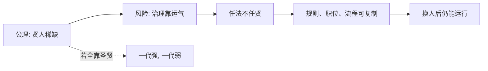

## 法家思维筑基课: 上层定律三: 任法不任贤

### 作者
digoal

### 日期
2026-05-18

### 标签
法家 , 任法不任贤 , 贤人稀缺 , 制度治理 , 可复制性 , 德治边界 , 韩非 , 慎到 , 组织流程 , 稳定治理

----

## 背景

> 面向对象: 高中生到大学低年级读者  
> 核心问题: 为什么法家说治理要依赖法，而不是依赖贤人？  
> 先说结论: 贤人可贵但稀缺，制度普通但可复制；法家希望国家不要随着个人贤愚大起大落，所以主张任法不任贤。

## 一张图先看懂

## 求真讲法

### 它到底说了什么

“任法不任贤”不是说不要贤人，而是说不能把治理基础放在贤人的个人德性上。贤人出现当然好，但制度要能在普通人手里运行。

它关注的是稳定性: 好制度应该降低对天才和道德英雄的依赖。

### 它是怎么来的

它主要从两个公理推出:

| 来源公理 | 推导 |
|---|---|
| 贤人稀缺且不可稳定复制 | 不能靠贤人作为常规资源 |
| 权力与信息天然不对称 | 即使贤人也需要制度核验 |

国家越大，越不能靠少数人的人格魅力覆盖所有角落。

### 它依赖哪些假设

| 假设 | 含义 | 若不成立会怎样 |
|---|---|---|
| 制度能约束普通人 | 规则有实际力量 | 任法才有意义 |
| 职责可被定义 | 工作能拆成角色 | 才能不依赖个人 |
| 法令比个人稳定 | 不因情绪和亲疏改变 | 可预期性提高 |
| 人才评价困难 | 贤名可能造假 | 需要客观标准 |

### 常见误解

**误解一: 任法不任贤就是反智、反人才。**  
不是。它反对的是把国家押在少数贤人身上，不是否认能力。

**误解二: 有制度就不需要好人。**  
制度也需要有能力、有责任的人维护。坏人掌握制度，也会滥用制度。

**误解三: 法比人一定可靠。**  
如果法本身错误，稳定执行反而会稳定制造问题。

## 求存讲法

### 它有什么用

它促使组织建设流程、标准和交接机制，而不是永远依赖某个能人救火。

### 它怎么迁移到熟悉领域

社团不能只靠一个会长。活动流程、联系人、预算表、复盘记录都要留下来，让下一届能接上。

### 它的适用范围和边界

适用: 行政、运营、财务、生产、教学流程。  
边界: 战略判断、科学发现、艺术创造仍然高度依赖优秀个体。

### 正例: 怎么用它提升能力

你整理一套写作文流程: 审题、列提纲、素材选择、段落检查、错字复核。这样即使当天状态一般，也能写出稳定水平。

### 反例: 前提不成立会怎样

研究团队把论文创新也流程化到每一步，要求所有人按模板提出“突破性观点”。失败原因是“职责可被定义”不充分，真正创新无法完全流程化。

## 思考

制度能降低对贤人的依赖，但不能创造判断力本身。  
最好的组织也许不是“不要贤人”，而是“贤人设计制度，制度保护普通人不至于失控”。

## 最后记住

1. 任法不任贤强调治理的可复制性。
2. 它从贤人稀缺和信息不对称中推出。
3. 制度能降低个人波动，但不能替代全部判断。
4. 现代迁移时，要同时重视制度建设和人才培养。

## 参考资料

1. 《韩非子·有度》《韩非子·定法》。
2. 《慎子》相关思想材料。
3. 冯友兰《中国哲学史》相关章节。
4. 本文基于通行先秦思想史整理。

  
#### [PostgreSQL 解决方案集合](../201706/20170601_02.md "40cff096e9ed7122c512b35d8561d9c8")
  
  
#### [德哥 / digoal's Github - 公益是一辈子的事.](https://github.com/digoal/blog/blob/master/README.md "22709685feb7cab07d30f30387f0a9ae")
  
  
#### [About 德哥](https://github.com/digoal/blog/blob/master/me/readme.md "a37735981e7704886ffd590565582dd0")
  
  

  
