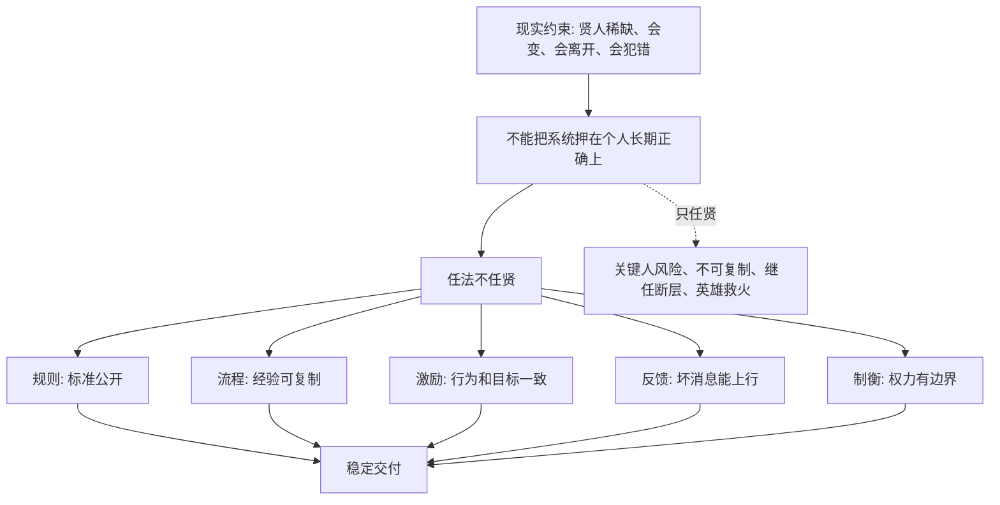

## 法家思维筑基课: 任法不任贤

### 作者
digoal

### 日期
2026-05-18

### 标签
任法不任贤 , 制度设计 , 关键人风险 , 组织复制 , 产品机制 , 运营沉淀 , 创业管理 , 投资分析 , 继任能力 , 公司治理

----

## 背景

> 面向对象: 大学生、产品经理、运营经理、有投资需求的人  
> 核心问题: 为什么不能把生活、创业、管理和投资的成败押在“遇到一个好人、能人、明君、老板、创始人、基金经理”上？  
> 先说结论: “任法不任贤”不是否定人才，而是说系统不能依赖少数贤人长期正确。贤人稀缺、会变、会离开、会判断失误；成熟系统必须把正确行为沉淀为规则、流程、激励、反馈、制衡和文化，让好人更容易做对事，让普通人也能稳定交付，让坏人难以破坏系统。

本文把“法”扩展理解为: **公开规则、职责边界、流程、指标、奖惩、审计、反馈、契约和组织文化**。把“贤”扩展理解为: **能力强、品德好、判断准、愿意负责、能在关键时刻做正确事的人**。

## 一张图先看懂



## 求真讲法

### 它到底说了什么

“任法不任贤”可以拆成三层意思。

第一，贤人当然重要，但不能成为系统唯一支柱。一个好老师、好老板、好创始人、好产品负责人、好基金经理，都可能极大提升结果。但如果没有他系统就崩，说明强的是个人，不是系统。

第二，制度的价值是降低对超常个人的依赖。好的制度不是消灭人的判断，而是把关键判断转化为可复核的标准、可训练的流程、可追踪的责任和可纠错的反馈。

第三，真正成熟的系统，不是“没有贤人也一样优秀”，而是“有贤人时能放大贤人的作用，没有贤人时也不至于崩盘”。

一句话:

```text
贤人能提高上限，
制度决定下限；
长期竞争中，下限失守比上限不高更危险。
```

### 它是怎么来的

在先秦法家语境里，“任法不任贤”针对的是人治不稳定的问题。儒家更强调贤君、贤臣、德治和教化；法家则担心: 如果治理依赖贤人，那么一旦贤人不在，国家就会失序。

法家的问题意识很现实:

```text
圣君不可常得
贤臣不可批量复制
人心会被利益改变
官僚会利用信息差
贵族和亲疏会扭曲规则
```

因此，法家更重视法令、职责、赏罚、名实考核和权力位置。它的核心动机不是讨厌贤人，而是不愿意把国家命运押在“每一代都能遇到贤人”这个不稳定条件上。

迁移到现代:

```text
公司不能只靠创始人拍脑袋
产品不能只靠明星 PM 的灵感
运营不能只靠一个操盘手救火
投资不能只靠 CEO 光环
个人成长不能只靠偶遇名师和贵人
```

### 它依赖哪些假设

这条规律依赖几个现实假设:

1. 贤人稀缺，而且不可稳定复制。
2. 人会受利益、情绪、权力、疲劳和环境影响。
3. 组织需要多人长期协作，不能只靠个人魅力。
4. 信息不对称会让个人判断失真。
5. 系统需要继任、扩张、复制和纠错。

可以用一个简化公式理解:

```text
系统可靠性 = 人才质量 × 制度稳定性 × 反馈速度 × 纠错能力
```

如果制度稳定性接近 0，即使人才质量很高，系统也可能因为换人、扩张、压力或利益冲突而失控。

| 对比维度 | 只任贤 | 任法不任贤 |
|---|---|---|
| 成功来源 | 依赖少数强人 | 依赖人和机制配合 |
| 可复制性 | 很弱，换人就变 | 较强，经验可沉淀 |
| 风险 | 关键人风险高 | 单点风险较低 |
| 管理方式 | 靠信任和个人威望 | 靠职责、流程、反馈 |
| 组织扩张 | 容易失控 | 更容易训练新人 |
| 投资判断 | 迷信创始人故事 | 看治理、文化、现金流和继任 |
| 失败形态 | 英雄离场即崩 | 流程僵化或指标主义 |

### 常见误解

**误解一: 任法不任贤就是不重视人才。**

不是。好制度反而更需要好人才设计、维护和改进。区别在于，成熟系统不会让人才变成不可替代的单点故障。

**误解二: 有流程就能替代判断。**

不对。流程能处理重复问题，不能替代复杂判断。任法不任贤的重点不是消灭判断，而是让判断有证据、有复盘、有边界。

**误解三: 强人领导一定不好。**

不一定。创业早期、危机转型、战略突破时，强人判断很重要。问题是强人不能永远亲自救火，必须把方法沉淀成组织能力。

**误解四: 制度越多越好。**

不对。制度太重会拖慢行动、压制创新、制造形式主义。好的“法”应该服务真实目标，而不是让人围着流程表演。

## 求存讲法

### 它有什么用

这条规律能帮你判断一个人、团队、公司和投资标的的真实稳定性。

**生活中:** 不把成长押在贵人和名师上，而是建立自己的学习系统、反馈系统和选择标准。

**大学里:** 组队项目不能只靠一个大腿同学，要有分工、文档、进度和交接。

**产品中:** 不能只靠一个产品经理的感觉，要建立用户研究、需求评分、实验验证和复盘机制。

**运营中:** 不能只靠一个操盘手的经验，要沉淀活动 SOP、渠道评估、素材库和异常样本。

**创业中:** 不能只靠创始人个人能力，要建立招聘、训练、财务、销售、交付和决策机制。

**投资中:** 不能只买“英雄 CEO 故事”，要看商业模式、治理、文化、资本配置、继任能力和现金流质量。

### 它推出的上层定律

| 上层定律 | 一句话解释 | 适用场景 |
|---|---|---|
| 关键人风险定律 | 离开一个人就崩的系统，价值要打折 | 创业、投资 |
| 经验封装定律 | 高手经验必须沉淀成文档、流程、训练和反馈 | 产品、运营 |
| 制度放大贤人定律 | 好制度不是替代贤人，而是放大贤人 | 管理 |
| 继任能力定律 | 真正成熟的组织能培养下一批负责人 | 公司治理 |
| 授权校验定律 | 授权必须配目标、边界、数据和复盘 | 团队管理 |
| 反英雄叙事定律 | 越动人的个人英雄故事，越要检查系统能力 | 投资、创业 |
| 流程防僵化定律 | 制度必须定期复盘，否则会变成形式主义 | 组织管理 |

### 它怎么迁移到熟悉领域

#### 1. 大学生: 不要把学习押在名师和学霸上

有好老师、好同学当然幸运，但你不能把成长押在外部贤人上。更稳的做法是建立自己的学习机制:

```text
目标: 明确要掌握什么能力
材料: 选择可靠教材和课程
输出: 每周做题、写笔记、做项目
反馈: 找老师、同学或线上社区纠错
复盘: 记录错因和改进动作
迭代: 根据反馈调整学习路径
```

这样，即使没有一直陪伴你的名师，你也能持续进步。

#### 2. 产品经理: 好产品不能只靠天才直觉

明星产品经理可能很强，但产品组织不能只靠他的直觉。因为直觉可能失效，用户可能变化，市场可能转向。

更稳的产品机制包括:

1. 用户问题库。
2. 需求评分表。
3. 原型验证。
4. 小流量实验。
5. 数据看板。
6. 成功和失败案例库。
7. 版本复盘机制。

这样做不是否定产品判断，而是让判断可以被团队学习、挑战和继承。

#### 3. 运营经理: 操盘手经验必须沉淀

很多运营活动成功后，团队只记住“某某很厉害”，却没有记录他为什么判断对。下次换人，成功就无法复制。

运营经验要沉淀成:

| 经验对象 | 应该沉淀什么 |
|---|---|
| 渠道 | 人群质量、成本、转化、留存 |
| 内容 | 选题逻辑、素材来源、标题结构 |
| 活动 | 目标假设、节奏、成本、风险 |
| 用户 | 分群、反馈、投诉、复购行为 |
| 失败 | 哪个假设错了，什么信号被忽略 |
| 复盘 | 下次继续、停止、调整什么 |

高手最重要的贡献，不只是亲自打赢一仗，而是让组织以后少靠他也能打仗。

#### 4. 创业者: 创始人必须把自己从瓶颈中解放出来

创业早期，创始人常常亲自做销售、产品、招聘、融资、交付。早期这是必要的，但长期如果所有决策都卡在创始人身上，公司会无法扩张。

创始人要逐步建立:

```text
销售: 客户分层、话术、CRM、回款标准
产品: 需求评审、路线图、版本复盘
财务: 预算、报销、现金流预警
人才: 招聘标准、试用期评估、晋升机制
交付: SOP、质量检查、客户成功流程
决策: 哪些事授权，哪些事必须上会
```

创始人的目标不是永远做最强的人，而是把强判断变成组织能力。

#### 5. 投资者: 好管理层重要，但不能只买管理层光环

长期投资中，优秀管理层是加分项，但不能替代商业模式和治理结构。投资者要问:

| 检查问题 | 好信号 | 危险信号 |
|---|---|---|
| 公司是否离不开创始人 | 文化、流程、客户关系能延续 | 创始人不在就没人能决策 |
| 管理层是否诚实 | 主动披露坏消息，承认不知道 | 永远乐观，坏消息藏起来 |
| 资本配置是否制度化 | 并购、回购、投资有长期纪律 | 依赖 CEO 兴趣和冲动 |
| 中层是否有能力 | 内部晋升稳定，责任清楚 | 全靠老板直接管 |
| 护城河是否独立于个人 | 品牌、成本、网络、转换成本存在 | 主要靠个人关系拿订单 |
| 继任是否清楚 | 有明确培养和交接机制 | 从不讨论继任 |
| 价格是否留安全边际 | 估值不把完美管理当必然 | 价格已经假设贤人永远正确 |

这不是具体投资建议，而是底层过滤器: **好人很重要，但不能用好人故事替代商业质量、治理质量和安全边际。**

### 它的适用范围和边界

这条规律特别适用于:

1. 长期系统: 公司、团队、产品、投资组合、学习计划。
2. 需要复制的场景: 扩张、培训、新人接手、跨城市经营。
3. 信息不对称场景: 创始人和投资者、老板和员工、产品和用户。
4. 关键人风险高的场景: 单一创始人、明星经理、头部销售、核心技术专家。

但它也有边界:

1. **早期探索需要强人。** 0 到 1 阶段，制度太重反而会拖慢试错。
2. **制度不能替代品德。** 坏人会钻制度漏洞，所以诚信仍然是硬门槛。
3. **制度不能替代战略判断。** 方向错了，流程越强，错得越快。
4. **制度不能僵化。** 过度流程化会让组织只求合规，不求结果。
5. **不是所有知识都能写进 SOP。** 审美、战略、人性判断和复杂谈判仍需要高手。

更稳的边界是:

```text
早期靠贤人突破，
中期靠制度复制，
长期靠文化延续，
关键处靠制衡纠错。
```

### 正例: 怎么用它提升能力

假设你是一个运营经理，团队里有一位活动操盘手很强，每次大促都靠他救火。你想降低关键人风险。

可以这样做:

1. 让他把每次活动拆成目标、用户、渠道、素材、节奏、预算、风险七部分。
2. 建立活动模板和复盘模板。
3. 每次活动安排一名新人做影子负责人。
4. 把失败活动也纳入案例库，不只记录成功。
5. 建立渠道数据表，避免经验只停留在脑子里。
6. 明确哪些决策必须升级，哪些可以授权。

这样做不是削弱高手，而是把高手能力转化为团队能力。

### 反例: 前提不成立会怎样

一家创业公司早期靠创始人极强的销售能力拿下很多客户。投资人也相信“这个创始人很能打”，给了较高估值。但公司内部存在问题:

1. 客户关系都在创始人个人微信里。
2. 销售流程没有 CRM 记录。
3. 产品需求都靠创始人口头转达。
4. 交付团队不知道哪些承诺能做，哪些不能做。
5. 没有二号位能独立谈客户。
6. 财务只看签约额，不看回款和交付成本。

后来创始人转向融资和外部合作，销售转化下降，客户预期失控，回款变慢，组织开始混乱。

这个失败不是因为创始人不贤，而是因为一个关键前提不成立: **个人能力没有沉淀为组织能力。** 当系统只任贤、不任法，贤人越强，组织越可能延迟面对自身脆弱性。

## 思考

### 为什么它能帮助判断真伪

表面故事喜欢讲人:

```text
这个老板很厉害。
这个创始人很有魅力。
这个操盘手很会增长。
这个基金经理过去业绩很好。
这个团队有几个明星成员。
```

这些信息有价值，但不够。你还要问:

```text
他的方法能不能复制？
离开他以后系统会怎样？
有没有流程、文档、数据和复盘？
有没有二号位和继任机制？
坏消息能不能挑战他的判断？
他的激励是否和系统长期利益一致？
```

真正的判断，不是在人和制度之间二选一，而是看人能否建设制度，制度能否延续人的正确行为。

### 为什么它能帮助预言未来

如果一个组织:

1. 所有关键决策都依赖一个人。
2. 成功经验没有沉淀。
3. 数据和客户关系掌握在少数人手里。
4. 新人无法快速训练。
5. 坏消息不能挑战领导判断。
6. 继任问题长期回避。

那么即使短期增长很快，也可以预判: 这个组织存在关键人风险，扩张会放大混乱，换人或环境变化时会暴露脆弱性。

反过来，如果一个组织:

1. 有优秀的人，也有可复制流程。
2. 关键经验能文档化和训练。
3. 授权和复盘并存。
4. 坏消息能挑战权威。
5. 继任机制清楚。
6. 管理层诚实面对自己不知道的事。

它未必最依赖明星叙事，但更可能长期稳定。

### 一个反事实问题

假设贤人很多，而且永远稳定可靠，那么“任法不任贤”就不重要了:

1. 公司只要找好老板就能长期成功。
2. 投资只要找到好 CEO 就够了。
3. 产品只要有天才 PM 就不需要用户验证。
4. 运营只要有强操盘手就不用复盘。
5. 国家只要有明君贤臣就不需要制度。

但现实不是这样。现实中，贤人稀缺，判断会错，利益会变，精力有限，人会离开，环境会变化。所以长期系统必须从“依赖好人”升级到“好人建设制度，制度保护长期目标”。

## 最后记住

1. 任法不任贤不是否定人才，而是不把系统生死押在少数贤人长期正确上。
2. 贤人提高上限，制度守住下限；长期系统最怕下限失守。
3. 产品、运营、创业和投资中，要警惕只靠明星个人、创始人魅力、操盘手经验和 CEO 光环的系统。
4. 好制度能放大好人、训练普通人、约束坏人、暴露错误、降低继任风险。
5. 判断未来，不只看谁现在很强，还要看强能力是否已经沉淀为可复制、可纠错、可继任的系统。

## 参考资料

1. 《韩非子》相关篇章: 法、术、势与循名责实思想体现了不把治理押在个人贤能上的制度化取向。
2. 《商君书》相关篇章: 通过法令、赏罚和耕战制度削弱贵族身份与个人德望对国家动员的影响。
3. Max Weber, *Economy and Society*: 官僚制理论解释现代组织如何通过职位、规则、文书和层级降低对个人魅力的依赖。
4. Herbert A. Simon, *Administrative Behavior*: 有限理性理论说明个人判断受信息、注意力和认知边界限制。
5. James G. March 与 Herbert A. Simon, *Organizations*: 组织行为研究说明组织决策依赖惯例、流程和有限搜索，不等同于单个理性人的判断。
6. Michael C. Jensen 与 William H. Meckling, “Theory of the Firm”, 1976: 代理理论帮助理解为什么只信任管理层个人品质不足以保护所有者利益。
7. Warren Buffett 历年股东信与 Berkshire Hathaway 管理思想: 管理层诚信很重要，但还要看企业文化、资本配置纪律、能力圈、继任和长期股东导向。
  
#### [PostgreSQL 解决方案集合](../201706/20170601_02.md "40cff096e9ed7122c512b35d8561d9c8")
  
  
#### [德哥 / digoal's Github - 公益是一辈子的事.](https://github.com/digoal/blog/blob/master/README.md "22709685feb7cab07d30f30387f0a9ae")
  
  
#### [About 德哥](https://github.com/digoal/blog/blob/master/me/readme.md "a37735981e7704886ffd590565582dd0")
  
  

  
