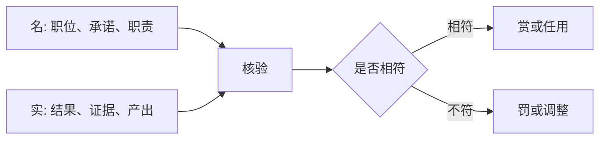

## 法家思维筑基课: 上层定律四: 循名责实

### 作者
digoal

### 日期
2026-05-18

### 标签
法家 , 循名责实 , 名实相符 , 官僚考核 , 责任管理 , 信息不对称 , 申不害 , 韩非 , 项目管理 , 绩效核验

----

## 背景

> 面向对象: 高中生到大学低年级读者  
> 核心问题: 法家为什么要把职位名称、职责承诺和实际结果对起来检查？  
> 先说结论: 因为官员可能利用信息差包装自己，法家要求“名”和“实”相符: 你承担了什么职责，就按实际结果核验什么。

## 一张图先看懂

## 求真讲法

### 它到底说了什么

“循名责实”就是顺着一个人的名分、职责、承诺，去追问实际结果。不是看他说得多漂亮，而是看他是否完成了自己承担的事。

它是法家处理官僚信息不对称的重要方法。

### 它是怎么来的

它主要从这些公理推出:

| 来源公理 | 推导 |
|---|---|
| 权力与信息天然不对称 | 不能只听汇报 |
| 人会趋利避害 | 官员可能包装功劳、逃避责任 |
| 公共标准高于私人关系 | 考核要按职责证据，不按亲疏 |

如果名实不核验，官员就可能用语言替代结果。

### 它依赖哪些假设

| 假设 | 含义 | 若不成立会怎样 |
|---|---|---|
| 名能清楚定义 | 职责可说清 | 否则无法追责 |
| 实能被观察 | 有证据和结果 | 否则只能听故事 |
| 名实之间有关联 | 职责能影响结果 | 否则追责不公平 |
| 核验者相对独立 | 不被关系左右 | 否则名实检查失真 |

### 常见误解

**误解一: 循名责实就是只看结果。**  
不完全。它看的是“职责和结果是否匹配”，不是把所有外部因素都忽略。

**误解二: 承诺越大越好。**  
在这种制度下，乱承诺会增加责任。名要谨慎，实要可证。

**误解三: 所有工作都能简单量化。**  
复杂工作需要多维证据，不能只看单一数字。

## 求存讲法

### 它有什么用

它能减少空话、甩锅和虚报，让组织成员对自己的承诺负责。

### 它怎么迁移到熟悉领域

做小组作业时，不说“我负责资料”，而写清楚“我在周三前提交三篇文献摘要，每篇 300 字并标注出处”。这才方便循名责实。

### 它的适用范围和边界

适用: 项目管理、官僚考核、学习计划、合同履行。  
边界: 如果目标本身探索性强，前期不能把结果承诺写得过死。

### 正例: 怎么用它提升能力

练口语时，把“提升英语”改成“每天录 2 分钟英文复述，每周对比语速、停顿、语法错误”。名具体，实可查。

### 反例: 前提不成立会怎样

老师要求学生承诺“下次一定进步 20 分”，没进步就处罚。失败原因是“名实之间有关联”不充分，分数受难度、基础、状态等多因素影响。

## 思考

循名责实能让承诺变严肃，但也可能让人只承诺容易完成的事。  
好制度要区分“必须完成的职责”和“允许探索的目标”。

## 最后记住

1. 循名责实要求职责、承诺和结果对应。
2. 它针对信息不对称和官僚包装。
3. 名要具体，实要可证，追责要考虑可控因素。
4. 复杂目标不能被单一指标粗暴替代。

## 参考资料

1. 《韩非子·定法》《韩非子·主道》。
2. 《申子》相关思想材料。
3. 《史记·老子韩非列传》。
4. 本文基于通行先秦思想史整理。

  
#### [PostgreSQL 解决方案集合](../201706/20170601_02.md "40cff096e9ed7122c512b35d8561d9c8")
  
  
#### [德哥 / digoal's Github - 公益是一辈子的事.](https://github.com/digoal/blog/blob/master/README.md "22709685feb7cab07d30f30387f0a9ae")
  
  
#### [About 德哥](https://github.com/digoal/blog/blob/master/me/readme.md "a37735981e7704886ffd590565582dd0")
  
  

  
