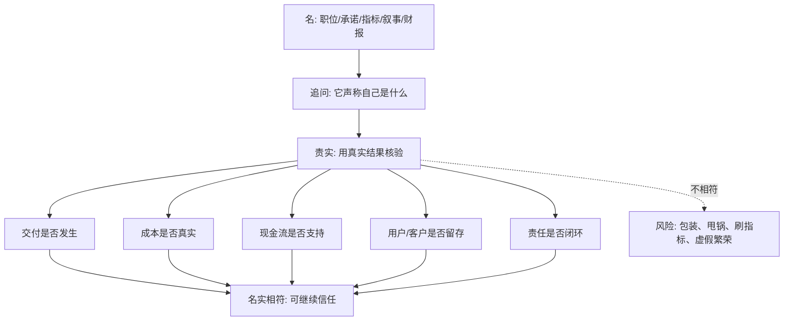

## 法家思维筑基课: 循名责实

### 作者
digoal

### 日期
2026-05-18

### 标签
循名责实 , 名实相符 , 结果核验 , 产品验证 , 运营指标 , 创业融资 , 财报分析 , 现金流 , 投资判断 , 管理层诚信

----

## 背景

> 面向对象: 大学生、产品经理、运营经理、有投资需求的人  
> 核心问题: 为什么很多表面漂亮的职位、战略、指标、融资故事、增长数据和管理承诺，最后会变成空话？怎样判断一个人、产品、团队、公司和投资标的到底靠不靠谱？  
> 先说结论: “循名责实”就是沿着“名”去追问“实”: 你叫什么、承诺什么、负责什么、宣传什么、指标说什么，就必须拿真实结果来核验。名是标签、职位、目标、口号、财报和叙事；实是交付、现金流、留存、复购、责任闭环和长期后果。名实不符，是判断真伪和预言风险的核心信号。

本文把“名”扩展理解为: **岗位名称、职责承诺、战略口号、产品定位、运营指标、财报利润、融资故事、管理层说法、品牌叙事**。把“实”扩展理解为: **真实行为、真实交付、真实成本、真实现金流、真实用户价值、真实责任和长期结果**。

## 一张图先看懂



## 求真讲法

### 它到底说了什么

“循名责实”是法家和名法思想中的重要原则。简单说，就是不能只听一个人、一个岗位、一个组织、一个项目“叫什么、说什么”，而要按它自己声称的责任去检查实际结果。

可以拆成三步:

1. **循名:** 先看它的名称、职责、承诺和目标。比如“产品负责人”“增长项目”“长期主义”“高质量收入”“AI 平台公司”。
2. **责实:** 再看真实结果是否配得上这个名。产品负责人是否解决用户问题？增长项目是否带来留存和利润？长期主义是否体现在资本配置上？
3. **追责:** 如果名实不符，就要追问原因和责任。是环境变化、能力不足、指标错了、故意包装，还是有人把后果转嫁给别人？

一句话:

```text
不要被名称和故事带走，
要让名称和故事接受真实结果的审判。
```

### 它是怎么来的

在古代治理中，君主和上级面临一个难题: 官员会说自己能做什么、负责什么、完成了什么，但上级不能直接看到全部现场。于是必须用“名”和“实”来核验。

“名”是官员的职位、承诺、职责、计划和汇报；“实”是实际完成的结果。循名责实就是: 你说你负责粮草，就看粮草是否到位；你说你能治水，就看洪水是否减轻；你说你完成任务，就看结果是否可验证。

迁移到现代，这个问题更普遍:

```text
岗位有名: 但是否承担职责？
产品有定位: 但用户是否真的使用？
运营有指标: 但是否带来真实增长？
公司有利润: 但是否转化为现金流？
创业有故事: 但是否能交付和回款？
基金有业绩: 但是否可持续、可解释、风险匹配？
```

因此，“循名责实”的底层价值，是把世界从“听叙事”拉回“看证据”。

### 它依赖哪些假设

这条规律依赖几个现实假设:

1. 人会包装自己。职位、口号、故事、数据和品牌都可能被修饰。
2. 信息不对称长期存在。外部人常常先看到“名”，后看到“实”。
3. 真实结果会滞后暴露。短期名实不符可能被遮住，长期会通过现金流、留存、交付和信任显现。
4. 指标会被优化，甚至被扭曲。只要指标影响奖惩，人就会围绕指标行动。
5. 责任如果不闭环，名实不符会反复出现。

可以用一个简化公式理解:

```text
可信度 = 名实匹配度 × 可验证性 × 责任闭环程度
```

如果一个项目名头很大，但无法验证，又没人承担结果，它的可信度就很低。

| “名” | 应该核验的“实” | 常见风险 |
|---|---|---|
| 产品负责人 | 用户问题、需求取舍、版本结果 | 只做功能，不解决问题 |
| 增长运营 | 留存、复购、毛利、用户质量 | 只冲注册和 GMV |
| 长期主义 | 资本配置、研发投入、客户价值 | 口头长期，实际短期 |
| 高质量收入 | 回款、毛利、续费、低退款 | 签约额好看，现金差 |
| AI 公司 | 技术壁垒、客户价值、成本结构 | 只贴概念，不创造价值 |
| 净利润增长 | 经营现金流、应收、存货、资本开支 | 会计利润漂亮，现金不回 |
| 优秀管理层 | 兑现承诺、披露坏消息、资本纪律 | 只讲亮点，不认错误 |

### 常见误解

**误解一: 循名责实就是只看结果。**

不是。它不是粗暴地“成王败寇”。正确做法是看名和实是否匹配，也看过程、约束、外部变化和责任边界。探索性项目可能失败，但要看它是否诚实验证、及时止损、沉淀经验。

**误解二: 名不重要，只看实就行。**

名也重要。名定义了责任边界和承诺范围。没有清楚的名，就无法责实。岗位职责、项目目标、指标口径、财报定义都属于“名”的一部分。

**误解三: 数据就是实。**

不一定。数据可能只是另一个“名”。比如注册量、曝光量、GMV、adjusted profit 都需要继续追问真实用户、真实收入、真实成本和真实现金流。

**误解四: 名实不符一定是欺骗。**

不一定。也可能是环境变化、能力不足、假设错误或指标设计错误。关键是能不能承认不符、解释原因、承担责任并修正。

## 求存讲法

### 它有什么用

这条规律能帮你识别生活、产品、运营、创业和投资中的“表面繁荣”。

**生活中:** 不只听一个人说自己靠谱，要看他是否按承诺交付。

**大学里:** 不只看小组成员说“我会负责”，要明确交付物和截止时间。

**产品中:** 不只看产品定位和功能列表，要看用户是否真的使用、留存、复购、愿意付费。

**运营中:** 不只看曝光、注册、GMV，要看真实用户质量、毛利、退款、投诉和长期价值。

**创业中:** 不只看融资、团队、PR、战略，要看回款、交付、客户成功、组织能力和现金流。

**投资中:** 不只看净利润、故事和管理层表达，要看经营现金流、ROIC、应收存货、资本开支、关联交易和长期兑现记录。

### 它推出的上层定律

| 上层定律 | 一句话解释 | 适用场景 |
|---|---|---|
| 承诺交付定律 | 说了什么，就按什么交付核验 | 合作、管理 |
| 指标穿透定律 | 指标只是入口，要穿透到真实价值 | 产品、运营 |
| 利润现金流定律 | 利润是名，现金流和资本需求是实 | 投资、财报 |
| 岗位职责定律 | 职位越响，越要看责任是否闭环 | 团队管理 |
| 故事兑现定律 | 融资故事必须被客户、收入和现金验证 | 创业 |
| 坏消息验证定律 | 名实不符不可怕，隐瞒不符才危险 | 组织文化 |
| 长期记录定律 | 一次结果可能是运气，长期名实相符才可信 | 投资、择业 |

### 它怎么迁移到熟悉领域

#### 1. 大学生: 小组项目先把“名”写清楚

很多小组项目失败，是因为大家只有模糊承诺:

```text
我负责资料。
我负责 PPT。
我负责讲解。
我到时候看看。
```

这些“名”太虚，无法责实。更好的写法是:

```text
周三 22:00 前，A 提交 5 篇参考资料摘要，每篇 200 字。
周五 18:00 前，B 完成 PPT 第 1-8 页，包含图表和引用。
周六 12:00 前，C 试讲 8 分钟并根据反馈修改。
```

名越清楚，实越容易检验，合作越不容易靠情绪撕扯。

#### 2. 产品经理: 产品定位必须接受用户行为检验

一个产品说自己是“高效协作平台”，这只是名。要看实:

1. 用户是否真的每天协作，而不是只注册。
2. 团队是否愿意把关键流程迁移进来。
3. 留存是否高于替代工具。
4. 用户是否愿意付费。
5. 客户是否因为它减少沟通成本。
6. 新功能是否提升核心任务完成率。

产品经理的任务不是维护定位话术，而是持续让定位接受用户行为检验。

#### 3. 运营经理: GMV 不是实，净价值才接近实

运营活动最容易名实不符。GMV 看起来增长，但可能来自补贴、凑单、刷单、退款延迟和低质量用户。

更稳的复盘表:

| 运营名词 | 继续追问的实 |
|---|---|
| 曝光 | 目标人群是否匹配 |
| 点击 | 是否有真实兴趣 |
| 注册 | 是否完成有效激活 |
| GMV | 扣除补贴、退款、履约成本后的毛利 |
| 新客 | 7 日、30 日留存 |
| 社群活跃 | 有效咨询、转化和复购 |
| 内容爆款 | 是否带来目标用户和长期关注 |

循名责实不是反对指标，而是反对把指标当结果。

#### 4. 创业者: 融资故事必须回到交付和回款

创业公司常有漂亮名词: 大模型、平台化、生态、闭环、增长飞轮、行业第一。它们可以作为战略叙事，但不能替代真实经营。

创业者要定期核验:

```text
客户是否真实付费？
回款是否及时？
交付成本是否可控？
复购是否发生？
销售承诺是否可兑现？
产品是否减少客户真实成本？
团队是否能脱离创始人重复交付？
```

如果这些“实”站不住，叙事越漂亮，风险越大。

#### 5. 投资者: 从会计利润穿透到经济现实

投资中，循名责实尤其重要。财报上的“净利润”是名，真正要追问的是企业的经济现实。

| 财报或叙事的“名” | 投资者要追的“实” |
|---|---|
| 净利润增长 | 经营现金流是否同步增长 |
| 收入高增长 | 应收账款是否异常增加 |
| 库存充足 | 存货是否积压或跌价 |
| adjusted earnings | 调整项是否长期反复出现 |
| 资本开支 | 是维护竞争力，还是低回报扩张 |
| 并购协同 | ROIC 是否改善，商誉是否有减值风险 |
| 管理层长期主义 | 回购、分红、再投资是否有纪律 |
| 护城河 | 毛利率、留存、定价权、现金流是否支持 |

这不是具体投资建议，而是底层过滤器: **看不懂“名”如何变成“实”，就不要下注；看见名实长期不符，就要提高安全边际或离开。**

### 它的适用范围和边界

这条规律特别适用于:

1. 承诺和结果可能分离的场景: 合作、招聘、创业、投资。
2. 指标容易被包装的场景: 流量、GMV、利润、估值、排名。
3. 信息不对称场景: 管理层和股东、老板和员工、平台和用户。
4. 长周期决策: 投资、职业选择、产品战略、组织建设。

但它也有边界:

1. **实会滞后。** 研发、品牌、教育、基础设施的真实结果可能需要较长时间。
2. **不能只看短期实。** 短期现金好看，可能牺牲长期能力；短期亏损，也可能是在建设高质量资产。
3. **名本身需要准确定义。** 目标模糊，责实就会变成事后挑刺。
4. **复杂结果不能只用单一指标衡量。** 用户价值、组织文化、技术能力需要多维证据。
5. **探索性失败要区别对待。** 诚实试错和虚假包装不是一回事。

更稳的边界是:

```text
先定义清楚名，
再选择合适的实，
用多维证据核验，
允许诚实试错，
惩罚长期伪装和责任逃逸。
```

### 正例: 怎么用它提升能力

假设你是一个产品经理，团队计划上线一个“提升用户协作效率”的功能。

可以这样循名责实:

1. **定义名:** 协作效率提升，具体指任务完成时间缩短、沟通轮次减少、多人编辑成功率提高。
2. **确定实:** 选择 3 个真实指标: 任务完成时长、协作文件留存、团队付费转化。
3. **设反证:** 如果功能使用率高但任务完成时间没下降，就不能说效率提升。
4. **小流量验证:** 先对一部分团队开放，收集行为数据和用户访谈。
5. **复盘责任:** 如果结果不达预期，回看是需求假设错、交互成本高，还是用户场景不成立。
6. **决定去留:** 名实相符就扩大投入，不相符就调整或停止。

这样做能防止团队把“上线了一个功能”误认为“解决了一个问题”。

### 反例: 前提不成立会怎样

一家创业公司对外宣传“高质量增长”，融资材料里写着收入快速上升、客户数量增加、市场空间巨大。但实际情况是:

1. 大量收入来自一次性项目，不是可续费产品。
2. 应收账款增长快于收入增长。
3. 销售为了签单承诺大量定制。
4. 交付成本被低估。
5. 客户续费率没有披露。
6. 创始人只强调签约额，不谈回款和毛利。

后来公司现金流紧张，交付压力爆发，客户续费下降，估值被重新定价。

这个失败不是因为增长这个“名”没有价值，而是因为一个关键前提不成立: **增长没有被真实现金流、客户留存和可复制交付证明。** 名很漂亮，但实没有跟上。

## 思考

### 为什么它能帮助判断真伪

表面世界充满“名”:

```text
战略升级
平台生态
高质量增长
长期主义
AI 原生
用户第一
行业领先
利润改善
组织进化
```

这些词不一定是假的，但你要立刻追问:

```text
它具体承诺了什么？
用什么结果核验？
谁负责交付？
什么数据会证明它错了？
成本和代价在哪里？
结果是否能转化为现金、留存、效率或信任？
```

循名责实的价值，是把抽象词汇变成可验证问题。

### 为什么它能帮助预言未来

如果一个组织:

1. 口号越来越大。
2. 指标越来越复杂。
3. 责任越来越模糊。
4. 现金流跟不上利润。
5. 客户续费跟不上签约。
6. 坏消息被包装成阶段性调整。

那么可以预判: 名实不符正在累积，未来大概率会通过现金流压力、客户流失、组织内耗或估值下修暴露。

反过来，如果一个组织:

1. 承诺清楚。
2. 指标稳定。
3. 现金流能支持利润。
4. 管理层主动解释不达预期。
5. 失败项目能及时止损。
6. 长期记录显示说到做到。

它未必短期最会讲故事，但更值得信任。

### 一个反事实问题

假设名和实永远一致，那么世界会很简单:

1. 叫“高质量增长”的公司一定高质量。
2. 叫“产品负责人”的人一定真正负责产品结果。
3. 财报利润一定等于真实赚钱能力。
4. “长期主义”一定意味着长期资本配置纪律。
5. “AI 公司”一定有真实技术壁垒和客户价值。

但现实不是这样。现实中，名经常先于实出现，甚至替代实传播。越是复杂、热门、信息不对称的领域，越需要循名责实。

## 最后记住

1. 循名责实的核心是: 任何职位、承诺、指标、叙事和财报，都必须回到真实结果上核验。
2. 名不清，责实就无从开始；实不明，名就容易变成包装。
3. 产品、运营、创业和投资中，最危险的是把指标、故事和概念误当成真实价值。
4. 投资时要从净利润穿透到现金流、ROIC、资本开支、应收存货、管理层兑现记录和真实护城河。
5. 判断未来，不只看谁会命名和叙事，而看谁能让名与实长期相符。

## 参考资料

1. 《韩非子》相关篇章: “循名责实”“形名参同”等思想体现按职责和承诺核验实际结果的治理逻辑。
2. 《申子》与申不害相关思想: “术”强调君主通过名实核验控制官僚欺上瞒下。
3. 《商君书》相关篇章: 赏罚和职责明确化，体现以实际功效而非空言判断行为的取向。
4. Max Weber, *Economy and Society*: 官僚制理论强调职位、职责、文书和可复核程序，有助于理解现代组织中的名实核验。
5. Herbert A. Simon, *Administrative Behavior*: 有限理性理论说明组织需要通过规则、流程和反馈降低个人判断偏差。
6. Steven Kerr, “On the Folly of Rewarding A, While Hoping for B”, 1975: 说明指标和奖惩若不能对应真实目标，会制造名实不符。
7. Warren Buffett 历年股东信与 Berkshire Hathaway 管理思想: 从会计利润穿透到 owner earnings、现金流、资本配置和管理层诚信，是投资中循名责实的重要实践。
  
#### [PostgreSQL 解决方案集合](../201706/20170601_02.md "40cff096e9ed7122c512b35d8561d9c8")
  
  
#### [德哥 / digoal's Github - 公益是一辈子的事.](https://github.com/digoal/blog/blob/master/README.md "22709685feb7cab07d30f30387f0a9ae")
  
  
#### [About 德哥](https://github.com/digoal/blog/blob/master/me/readme.md "a37735981e7704886ffd590565582dd0")
  
  

  
