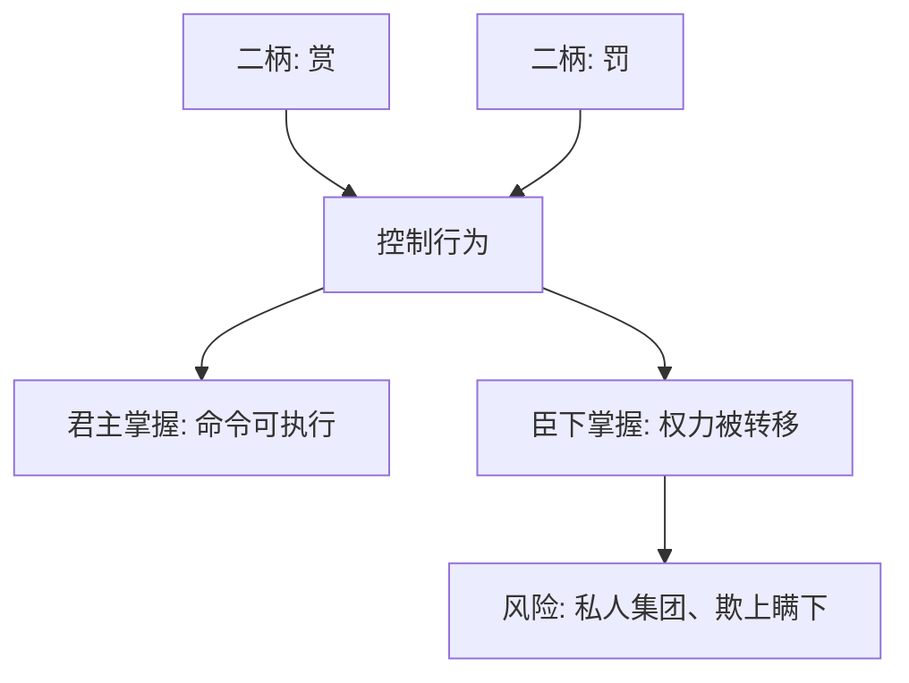

## 法家思维筑基课: 上层定律五: 二柄不可失

### 作者
digoal

### 日期
2026-05-18

### 标签
法家 , 二柄不可失 , 赏罚权 , 权力控制 , 官僚治理 , 韩非 , 责权匹配 , 集权边界 , 激励权 , 组织治理

----

## 背景

> 面向对象: 高中生到大学低年级读者  
> 核心问题: 韩非为什么说君主不能把赏罚大权交给臣下？  
> 先说结论: 在法家看来，赏和罚是控制官僚的两个把手；如果这两个把手落到臣下手中，君主就会被架空，国家命令也会被权臣改写。

## 一张图先看懂

## 求真讲法

### 它到底说了什么

“二柄”指赏与罚两种权柄。韩非认为，君主如果失去赏罚权，就会失去控制臣下的核心工具。

这不是现代分权思想，而是君主集权模型中的控制逻辑。

### 它是怎么来的

它主要从这些公理推出:

| 来源公理 | 推导 |
|---|---|
| 人会趋利避害 | 赏罚能控制行为 |
| 权力与信息天然不对称 | 臣下可能利用权力谋私 |
| 国家竞争要求组织动员 | 核心权柄必须集中以保持命令统一 |

如果臣下能随意赏罚，就会形成私人恩威。人们会效忠掌握赏罚的人，而不是效忠国家命令。

### 它依赖哪些假设

| 假设 | 含义 | 若不成立会怎样 |
|---|---|---|
| 赏罚是关键激励 | 人会响应得失 | 二柄才重要 |
| 臣下可能自利 | 权臣会发展私人势力 | 集中权柄有理由 |
| 君主能正确使用二柄 | 最高权力不犯大错 | 否则集中会放大错误 |
| 国家需要命令统一 | 分散赏罚会冲突 | 集权更有吸引力 |

### 常见误解

**误解一: 二柄不可失适合所有现代组织。**  
不适合照搬。现代组织需要授权、监督、分工和制度化问责。

**误解二: 权力集中就一定高效。**  
短期可能高效，长期可能因为缺少制衡而放大错误。

**误解三: 赏罚权只能在一个人手里。**  
现代制度更强调规则化授权，而不是个人独占。

## 求存讲法

### 它有什么用

它提醒我们: 谁掌握激励，谁就掌握组织方向。名义上的负责人如果没有奖惩和资源配置权，往往只是空头负责人。

### 它怎么迁移到熟悉领域

班级项目中，如果组长负责结果，却没有分工确认、进度提醒、贡献记录的权力，组长很难真正协调团队。

### 它的适用范围和边界

适用: 责任和权力必须匹配的场景。  
边界: 权力不能无监督集中。现代迁移时，应把“二柄”理解为责权匹配，而不是个人专断。

### 正例: 怎么用它提升能力

你负责一个社团活动，就要同时拥有预算查看、任务分配、进度确认、贡献记录的权限。否则出了问题你承担责任，却无法影响过程。

### 反例: 前提不成立会怎样

公司老板把所有奖励和处罚都亲自决定，部门经理没有任何授权，导致小事也要上报，决策变慢。失败原因是“国家需要命令统一”的前提被机械套用到复杂组织，授权不足反而低效。

## 思考

二柄不可失揭示了激励权的重要性，但也暴露出法家的盲点: 如果最高权力误判，谁来纠错？  
现代治理的关键不是让权力无人分享，而是让权力有边界、有程序、有监督。

## 最后记住

1. 二柄指赏与罚，是法家控制行为的核心工具。
2. 它从趋利避害、信息不对称和命令统一中推出。
3. 现代可借鉴的是责权匹配，不是个人专断。
4. 权力集中必须配合监督和纠错，否则会放大错误。

## 参考资料

1. 《韩非子·二柄》。
2. 《韩非子·主道》。
3. 《史记·老子韩非列传》。
4. 本文基于通行先秦思想史整理。

  
#### [PostgreSQL 解决方案集合](../201706/20170601_02.md "40cff096e9ed7122c512b35d8561d9c8")
  
  
#### [德哥 / digoal's Github - 公益是一辈子的事.](https://github.com/digoal/blog/blob/master/README.md "22709685feb7cab07d30f30387f0a9ae")
  
  
#### [About 德哥](https://github.com/digoal/blog/blob/master/me/readme.md "a37735981e7704886ffd590565582dd0")
  
  

  
