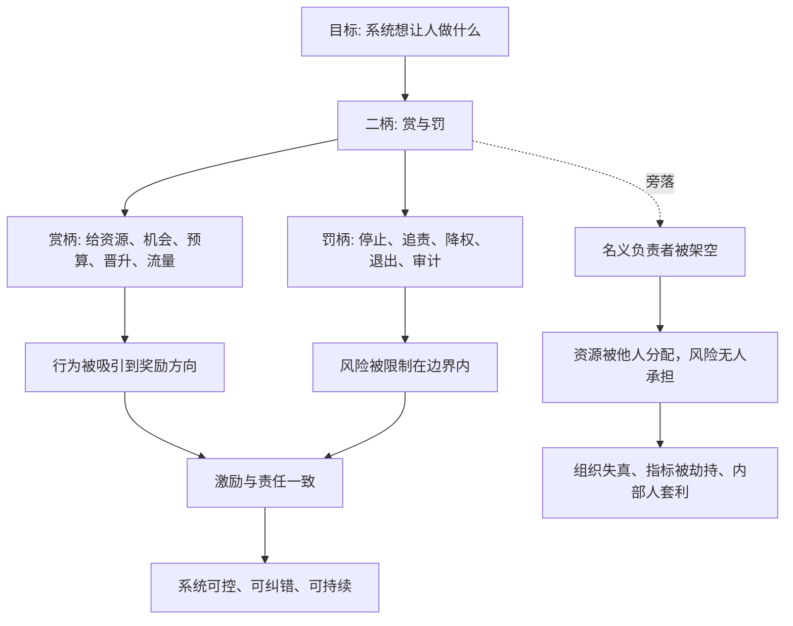

## 法家思维筑基课: 二柄不可失

### 作者
digoal

### 日期
2026-05-18

### 标签
二柄不可失 , 赏罚二柄 , 权责匹配 , 激励机制 , 风险控制 , 产品治理 , 运营预算 , 创业管理 , 资本配置 , 投资风险

----

## 背景

> 面向对象: 大学生、产品经理、运营经理、有投资需求的人  
> 核心问题: 为什么很多人名义上负责，实际上却指挥不动资源、管不住风险、纠正不了错误？为什么创业、产品、运营和投资中，最危险的是“责任在你，奖惩权在别人”？  
> 先说结论: “二柄不可失”原指韩非所说的赏罚二柄。现代化理解是: 一个系统必须清楚掌握奖励和惩罚这两类关键权柄。谁能给资源、机会、预算、流量、晋升，谁就能塑造行为；谁能设置边界、追责、停止、降权、退出，谁就能控制风险。二柄一旦旁落，名义负责人就会被架空，系统会朝真实掌握奖惩的人那里倾斜。

本文把“赏柄”扩展理解为: **给钱、给资源、给机会、给流量、给职位、给信任、给预算、给评价、给继续试错资格**。把“罚柄”扩展理解为: **停止投入、追究责任、降权、撤换、退出、审计、限制权限、纠正错误、让风险承担者付出代价**。

## 一张图先看懂



## 求真讲法

### 它到底说了什么

“二柄不可失”出自《韩非子》一类法家政治思想。原意是君主必须掌握赏与罚两种权柄，否则臣下就会借君主之名控制国家。

换成今天能理解的话:

1. **赏柄决定系统追逐什么。** 谁掌握预算、晋升、流量、奖金、项目机会，谁就能让人朝某个方向努力。
2. **罚柄决定系统停止什么。** 谁能叫停错误项目、撤换不合格负责人、审计异常成本、追究虚假承诺，谁就能让风险不过度扩散。
3. **二柄必须和责任匹配。** 让一个人负责结果，却不给他资源配置权和纠错权，就是让他背锅。
4. **二柄不能被代理人私有化。** 如果销售能承诺产品却不用承担交付后果，财务能报表美化却不用承担现金流责任，平台头部账号能破坏规则却免罚，系统会被真实奖惩权重塑。

一句话:

```text
看一个系统谁真正有权，
不要只看职位，
要看谁能奖励，谁能叫停，谁能让错误付出代价。
```

### 它是怎么来的

法家面对的是一个权力和信息高度不对称的问题: 君主在上，官僚在下。官僚掌握具体执行信息，如果还能掌握赏罚，就会把公共权力变成私人权力。

所以韩非强调“二柄”: 赏与罚是控制臣下行为的两个把手。赏用来吸引行为，罚用来限制行为。两者如果分离或旁落，名义上的最高权力会被实际掌握奖惩的人架空。

迁移到现代组织，问题并没有消失，只是形式变了:

```text
创始人负责战略，但预算被部门惯性锁死
产品负责人负责体验，但销售可以随意承诺定制
运营负责人负责增长质量，但老板只奖励 GMV
HR 负责文化，但晋升由私人关系决定
投资者承担损失，但管理层拿走短期奖金
```

这就是“名义责任”和“真实二柄”分离。

### 它依赖哪些假设

这条规律依赖几个现实假设:

1. 人会响应实际奖惩，而不是只响应口号。
2. 权力常常不等于职位，而等于资源分配权和后果定义权。
3. 代理人可能利用信息差，把公共权柄转为私人收益。
4. 没有叫停权的责任，是虚假责任。
5. 没有追责权的授权，会变成失控。
6. 奖励和惩罚分离，会制造套利空间。

可以用一个简化公式理解:

```text
系统控制力 = 目标清晰度 × 赏柄归属清晰度 × 罚柄归属清晰度 × 责任匹配度
```

如果责任在 A，赏罚权在 B，执行在 C，风险由 D 承担，那么系统会天然混乱。

| 维度 | 二柄清楚时 | 二柄旁落时 |
|---|---|---|
| 资源 | 投向真实目标 | 被关系、惯性、部门利益分走 |
| 激励 | 奖励贡献和长期价值 | 奖励表演、短期数和政治站队 |
| 风险 | 有人能叫停 | 错误项目越滚越大 |
| 责任 | 权责匹配 | 有责无权，或者有权无责 |
| 产品 | 需求有优先级和边界 | 大客户、销售、高层随意插队 |
| 运营 | 投放按质量复盘 | 只奖励 GMV 和声量 |
| 投资 | 管理层资本配置受约束 | 管理层拿奖励，股东承担损失 |

### 常见误解

**误解一: 二柄不可失就是要把权力集中在一个人手里。**

不是。现代组织不能简单照搬君主术。真正可迁移的是“奖惩权必须清楚、权责必须匹配、关键权柄不能被代理人私有化”。它可以通过董事会、预算委员会、审计、绩效机制和流程共同实现，不一定靠某个强人独断。

**误解二: 掌握二柄就是严厉控制。**

不对。二柄的关键是可预期和可纠错，不是粗暴。赏要奖真实贡献，罚要限制真实风险。乱赏乱罚会比没有二柄更糟。

**误解三: 罚柄就是惩罚员工。**

太窄了。罚柄更多时候是叫停错误、收回资源、限制风险、让决策者承担后果。它不是羞辱人，而是防止错误成本被转嫁给系统。

**误解四: 授权就应该放弃二柄。**

不对。授权是把执行权交出去，不是把目标、边界、预算、审计和责任完全放掉。没有校验的授权，会变成黑箱。

## 求存讲法

### 它有什么用

这条规律能帮你判断一个系统到底由谁控制，风险到底由谁承担。

**生活中:** 合作前看谁有决定权、谁出钱、谁验收、谁承担失败后果。

**大学里:** 小组项目不能只让一个人背最终责任，却不给他分工调整权和质量验收权。

**产品中:** 产品负责人如果没有需求优先级权、上线否决权和复盘权，就很难真正负责体验。

**运营中:** 运营负责人如果只负责 GMV，却不能决定预算、渠道、话术和停止条件，就是有责无权。

**创业中:** 创始人必须掌握关键资本配置、核心用人、财务纪律和战略取舍，否则公司会被局部部门利益牵着走。

**投资中:** 投资者要看管理层是否掌握资本配置权，以及这种权力是否受到股东导向、董事会、审计和长期激励约束。

### 它推出的上层定律

| 上层定律 | 一句话解释 | 适用场景 |
|---|---|---|
| 权责匹配定律 | 让谁负责结果，就必须给谁必要的赏罚权 | 管理、协作 |
| 资源即方向定律 | 预算、流量、职位和机会流向哪里，系统就朝哪里走 | 产品、运营 |
| 叫停权定律 | 没有叫停权，就没有真正的风险控制 | 创业、投资 |
| 有权有责定律 | 能决定资源的人，必须承担结果后果 | 公司治理 |
| 代理套利定律 | 代理人掌握赏罚但不承担后果，会倾向于套利系统 | 投融资 |
| 二柄分离风险定律 | 奖励权和惩罚权分离，会让人拿收益、转嫁损失 | 组织管理 |
| 授权校验定律 | 授权必须配边界、数据、审计和退出机制 | 团队、平台 |

### 它怎么迁移到熟悉领域

#### 1. 大学生: 小组项目别让“组长背锅但没权”

很多小组作业里，组长负责最终提交，但没有权力调整分工、催交、删掉低质量内容，也没有办法记录贡献。结果是有责无权。

更稳的机制是:

```text
组长: 负责版本整合和质量验收
成员: 明确交付物和截止时间
赏柄: 贡献记录影响署名和展示机会
罚柄: 逾期或低质量内容可以退回重做
复盘: 最终提交前公开检查每个人贡献
```

这不是让组长控制别人，而是让责任和必要权柄匹配。

#### 2. 产品经理: 没有否决权，就很难负责用户体验

产品经理常被要求“对用户体验负责”，但如果销售、大客户、高层都能绕过产品评审直接插需求，产品负责人就只有背锅权，没有二柄。

产品团队要明确:

1. 谁能把需求放进池子。
2. 谁能决定优先级。
3. 谁能判断需求是否符合产品边界。
4. 谁能叫停破坏体验的上线。
5. 谁对上线后的指标负责。
6. 例外需求如何记录、复盘和退出。

产品的二柄不是权力欲，而是防止产品被局部利益切碎。

#### 3. 运营经理: 预算权和停止权比口号重要

运营负责人如果只被要求“增长”，但预算由老板随意分配，渠道由关系决定，停止条件没人执行，那么他无法真正负责增长质量。

运营二柄可以这样设计:

| 权柄 | 具体含义 |
|---|---|
| 预算分配权 | 按获客成本、留存、毛利、退款率分配预算 |
| 渠道准入权 | 渠道必须通过小额测试再放量 |
| 话术审核权 | 防止虚假承诺和高退款 |
| 停止权 | 指标低于底线时停止投放 |
| 复盘权 | 要求渠道和团队解释结果 |
| 奖惩权 | 奖励真实增长，惩罚刷量和隐瞒 |

没有停止权的增长，常常只是把风险推迟。

#### 4. 创业者: 创始人不能丢掉资本配置二柄

创业公司最容易出现“局部最优绑架整体”:

```text
销售要更多折扣
产品要更多研发
市场要更多预算
技术要更多架构投入
投资人要更快增长
老员工要更多稳定
```

创始人必须掌握关键资本配置二柄:

1. 哪些项目继续投。
2. 哪些项目必须停。
3. 谁拿核心岗位。
4. 谁对结果负责。
5. 现金流底线是多少。
6. 哪些客户承诺不能做。
7. 哪些增长方式会伤害长期价值。

如果创始人只会鼓励，不会取舍和叫停，公司会被所有局部诉求拖向现金流悬崖。

#### 5. 投资者: 看管理层是否滥用资本配置二柄

投资中，管理层天然掌握企业的赏罚二柄: 它决定资本投向哪里、谁被提拔、哪些项目继续、哪些错误被承认、股东的钱如何使用。

投资者要重点检查:

| 检查问题 | 好信号 | 危险信号 |
|---|---|---|
| 资本配置是否有纪律 | 投向高 ROIC 项目 | 为规模和面子扩张 |
| 并购失败是否有后果 | 承认错误、减值、调整 | 继续讲协同故事 |
| 回购是否看价格 | 低于内在价值才回购 | 高估也回购以托 EPS |
| 管理层薪酬绑定什么 | 长期每股价值、现金流 | 收入规模、短期股价 |
| 董事会是否能制衡 | 能审议、追问、否决 | 熟人化、橡皮图章 |
| 坏消息是否上行 | 主动披露问题 | 只讲亮点，风险后置 |
| 少数股东是否被保护 | 关联交易透明 | 内部人优先拿走价值 |

这不是具体投资建议，而是底层治理过滤器: **如果管理层掌握奖赏自己、转嫁损失、继续错误项目的二柄，而股东没有有效制衡，就要大幅提高安全边际，甚至放弃。**

### 它的适用范围和边界

这条规律特别适用于:

1. 权责容易分离的场景: 团队项目、部门管理、创业公司、上市公司。
2. 资源分配场景: 预算、流量、岗位、资本开支、并购、回购。
3. 信息不对称场景: 管理层和股东、老板和员工、平台和用户。
4. 高风险决策: 投融资、扩张、战略转型、重资产投入。

但它也有边界:

1. **二柄不能变成个人专断。** 现代组织需要程序、透明度、制衡和申诉。
2. **二柄不能脱离公共标准。** 奖惩必须基于规则和证据，不能看关系和情绪。
3. **二柄不能只罚不赏。** 只会叫停和追责，会制造保守、隐瞒和不敢创新。
4. **二柄不能只赏不罚。** 只给资源不承担后果，会鼓励冒险和转嫁损失。
5. **探索性失败要区别对待。** 诚实试错不应被简单惩罚，隐瞒、欺骗和重复越界才应承担后果。

更稳的边界是:

```text
赏罚权要清楚，
权责要匹配，
规则要公开，
例外要复核，
授权要校验，
强权要制衡。
```

### 正例: 怎么用它提升能力

假设你是一个运营经理，要负责一场大促活动。过去的问题是: 老板定 GMV，销售定承诺，渠道要预算，客服承担投诉，最后运营背结果。

你可以这样重建二柄:

1. **目标定义:** GMV、毛利、退款率、投诉率、30 日复购同时作为目标。
2. **预算权:** 渠道先小额测试，达标后放量。
3. **话术权:** 所有优惠和交付承诺必须经过运营和交付确认。
4. **停止权:** 如果退款率、投诉率或获客成本超过底线，立即暂停对应渠道。
5. **奖惩权:** 奖励高质量增长，扣减刷量、虚假承诺和隐瞒异常。
6. **复盘权:** 活动后用统一数据复盘，不让局部团队只展示有利指标。

这样做的意义，是让负责增长的人也能控制增长质量和风险边界。

### 反例: 前提不成立会怎样

一家创业公司把销售团队奖金绑定签约额。销售可以给客户承诺定制功能，但产品和交付团队没有否决权。创始人只看每月签约额，财务只在季度末才发现回款很差。

结果:

1. 销售拿到短期奖金。
2. 产品路线被大量定制打乱。
3. 交付成本快速上升。
4. 客户因为承诺无法兑现而投诉。
5. 回款变慢，现金流紧张。
6. 最后公司整体承担损失。

这个失败不是因为销售激励本身错了，而是因为一个关键前提不成立: **赏柄给了销售，罚柄和后果却留给公司其他部门和股东。** 奖励权和风险承担分离，系统必然鼓励短期套利。

## 思考

### 为什么它能帮助判断真伪

表面上，组织图会告诉你谁是负责人。但真正判断权力，要看二柄在哪里:

```text
谁能给预算？
谁能给晋升？
谁能分配流量？
谁能批准例外？
谁能叫停项目？
谁能追究责任？
谁承担失败后果？
```

如果一个人名义上负责，却没有赏罚权，他很可能只是背锅位。如果一个人没有名义责任，却能分配资源、批准例外、免除后果，他才是真正影响系统行为的人。

### 为什么它能帮助预言未来

如果一个公司:

1. 奖励权在销售，交付后果在产品。
2. 预算权在老板偏好，复盘责任在运营。
3. 并购决策在管理层，失败成本在股东。
4. 头部客户能插队，普通用户承担体验下降。
5. 高管薪酬看规模，股东回报看现金流。
6. 错误项目没人能叫停。

那么可以预判: 短期数字可能好看，但风险会被不断转嫁，直到现金流、用户信任、组织士气或估值承受不了。

反过来，如果一个组织:

1. 权责清楚。
2. 资源和目标一致。
3. 奖励和长期价值一致。
4. 错误能被及时叫停。
5. 决策者承担后果。
6. 关键权柄受公共标准和制衡约束。

它未必每次都跑得最快，但更容易穿越周期。

### 一个反事实问题

假设二柄可以随便丢失，系统仍能稳定，那么世界会很简单:

1. 负责人不需要预算权也能负责结果。
2. 产品经理没有否决权也能保证体验。
3. 创始人不掌握资本配置也能控制方向。
4. 投资者不用看管理层激励和董事会制衡。
5. 奖励短期数字也能自然得到长期价值。

但现实不是这样。现实中，行为会朝真实奖惩方向移动。谁掌握二柄，谁就重塑系统。

## 最后记住

1. 二柄不可失的核心是: 奖励权和惩罚权必须清楚，不能和责任长期分离。
2. 谁能给资源、机会、预算、晋升，谁就能塑造行为；谁能叫停、追责、退出，谁就能控制风险。
3. 产品、运营、创业和投资中，最危险的是有权者不担责、担责者无权。
4. 投资时要特别看管理层资本配置权是否受股东导向、董事会、审计和长期激励约束。
5. 好系统不是权力集中到个人，而是赏罚权、责任、公共标准和制衡机制匹配。

## 参考资料

1. 《韩非子》相关篇章: 《二柄》《主道》《有度》等篇集中讨论赏罚权、君臣关系和权力旁落风险。
2. 《商君书》相关篇章: 赏罚和法令统一体现通过确定奖惩塑造行为和组织动员的思想。
3. Max Weber, *Economy and Society*: 官僚制理论帮助理解职位、权责、规则和组织控制之间的关系。
4. Michael C. Jensen 与 William H. Meckling, “Theory of the Firm”, 1976: 代理理论解释为什么有权者和承担后果者分离会制造代理成本。
5. Steven Kerr, “On the Folly of Rewarding A, While Hoping for B”, 1975: 说明奖励权若指向错误指标，系统会得到与目标相反的行为。
6. Bengt Holmstrom 与 Paul Milgrom 的多任务委托代理研究: 说明不完整指标下的强激励会扭曲任务分配和风险承担。
7. Warren Buffett 历年股东信与 Berkshire Hathaway 管理思想: 管理层诚信、资本配置纪律、董事会治理、长期股东导向和安全边际，是投资中判断二柄是否被正确约束的重要实践。
  
#### [PostgreSQL 解决方案集合](../201706/20170601_02.md "40cff096e9ed7122c512b35d8561d9c8")
  
  
#### [德哥 / digoal's Github - 公益是一辈子的事.](https://github.com/digoal/blog/blob/master/README.md "22709685feb7cab07d30f30387f0a9ae")
  
  
#### [About 德哥](https://github.com/digoal/blog/blob/master/me/readme.md "a37735981e7704886ffd590565582dd0")
  
  

  
