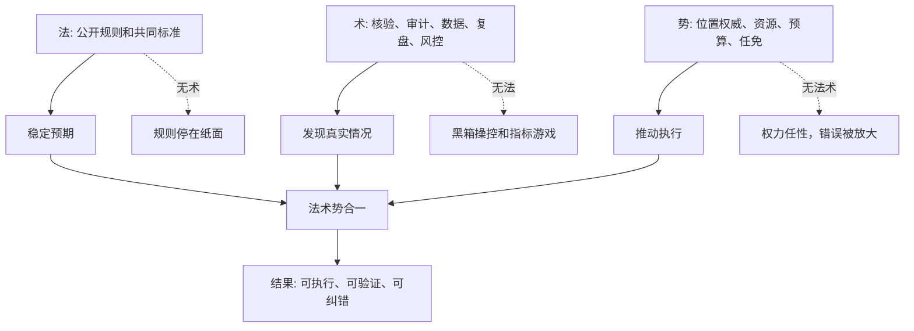

## 法家思维筑基课: 法、术、势合一

### 作者
digoal

### 日期
2026-05-18

### 标签
法术势 , 系统治理 , 规则设计 , 管理技术 , 位置权威 , 产品治理 , 运营增长 , 创业管理 , 投资判断 , 公司治理

----

## 背景

> 面向对象: 大学生、产品经理、运营经理、有投资需求的人  
> 核心问题: 为什么有制度不一定能执行，有工具不一定能治理，有权力不一定能做好事？为什么很多组织不是缺规则，而是规则、方法和权威彼此脱节？  
> 先说结论: “法、术、势合一”是法家思想的系统版: 法是公开规则，术是操作技术，势是位置权威。只有法，没有术，规则会停在纸面；只有术，没有法，管理会变成黑箱操控；只有势，没有法和术，权力会放大任性。成熟系统必须让规则、方法和权威互相校准，才能稳定执行、及时纠错、长期可信。

本文把“法”扩展理解为: **公开规则、制度、标准、契约、指标、流程和底线**。把“术”扩展理解为: **识别、考核、审计、数据分析、复盘、实验、风控和管理技术**。把“势”扩展理解为: **职位权威、资源配置权、预算权、任免权、平台权重、品牌势能和资本配置权**。

## 一张图先看懂



## 求真讲法

### 它到底说了什么

法、术、势本来来自先秦法家不同思想线索，后来常被用来概括韩非的综合。

1. **法:** 让所有人知道规则是什么，什么能做，什么不能做，什么有赏，什么有罚。
2. **术:** 让掌权者能识别真实情况，防止下级欺上瞒下，核验名实是否相符。
3. **势:** 让规则和判断有执行力量。没有位置权威，再好的规则和方法也可能推不动。

合起来看，它不是三套孤立工具，而是一个系统:

```text
法给方向和边界，
术给识别和校验，
势给执行和资源。
```

如果三者断开，就会出现典型失效:

```text
有法无术: 制度写得很好，但没人知道真实执行如何。
有术无法: 数据、审计、算法很多，但没有公开标准，容易黑箱化。
有势无法术: 权力很大，但缺少规则和校验，错误会被快速放大。
```

### 它是怎么来的

战国时代的国家治理面对三个问题。

第一，国家变大以后，不能只靠熟人关系和贵族身份来治理，必须有统一规则。这就是“法”的需求。

第二，官僚掌握现场信息，上级很难直接知道真相，必须有考核、核验、名实对应。这就是“术”的需求。

第三，规则和考核如果没有权威位置支撑，就无法执行。赏罚、任免、资源和命令需要集中在能推动系统的位置上。这就是“势”的需求。

韩非的综合性在于: 他看见单独强调任何一个都不够。

```text
商鞅重法: 解决规则和动员问题
申不害重术: 解决官僚考核和信息问题
慎到重势: 解决位置权威和执行问题
韩非综合: 法、术、势必须互相配合
```

迁移到现代，就是一个组织不能只靠制度、只靠工具、只靠领导权威，而要让三者形成闭环。

### 它依赖哪些假设

这条规律依赖几个现实假设:

1. 人会响应规则和激励，但也会寻找漏洞。
2. 信息天然不对称，真实情况需要核验。
3. 组织协作需要位置权威，否则决策难以落地。
4. 权力会被滥用，所以必须受规则和技术校验。
5. 规则会过时，所以必须通过反馈和复盘不断修正。

可以用一个简化公式理解:

```text
系统治理能力 = 规则清晰度 × 核验能力 × 执行权威 × 纠错机制
```

任何一项接近 0，整体治理能力都会大幅下降。

| 组合状态 | 表面样子 | 真实风险 |
|---|---|---|
| 有法无术 | 制度完整、流程很多 | 不知道真实执行，容易形式主义 |
| 有术无法 | 数据强、工具多、监控密 | 标准不公开，容易操控和恐惧 |
| 有势无法 | 领导强势、执行很快 | 任性决策，组织不可信 |
| 有法无势 | 规则合理但没人听 | 制度空转 |
| 有术无势 | 分析很多但推不动 | 咨询化、报告化 |
| 有势无术 | 权力集中但看不见真相 | 被下级包装信息 |
| 法术势合一 | 标准清楚、核验有效、权责匹配 | 更可能稳定执行和纠错 |

### 常见误解

**误解一: 法术势合一就是权谋术。**

不应这样理解。先秦法家的确有君主术色彩，但现代迁移时，不能把它当成操控他人的技巧。更有价值的理解是: 规则、管理技术和组织权威必须匹配。

**误解二: 有制度就够了。**

不够。制度没有数据、审计、反馈和复盘，就不知道是否执行，也不知道是否有效。

**误解三: 有数据和算法就够了。**

也不够。没有公开标准和责任边界的数据系统，可能变成监控工具、刷指标工具或黑箱权力。

**误解四: 有强领导就够了。**

不够。强领导能提高短期执行力，但如果缺少规则和核验，组织会依赖个人判断，且难以纠错和继任。

## 求存讲法

### 它有什么用

这条规律能帮你判断一个组织、产品、创业公司或投资标的到底有没有“系统能力”。

**生活中:** 个人成长不能只有目标，还要有规则、反馈方法和执行环境。

**大学里:** 小组项目不能只有组长权威，还要有分工规则和进度核验。

**产品中:** 产品团队不能只有路线图，还要有用户验证、数据复盘和决策权。

**运营中:** 运营不能只有活动 SOP，还要有渠道数据、预算权和停止权。

**创业中:** 创始人不能只有愿景，还要有制度、财务纪律、管理技术和资源取舍权。

**投资中:** 企业不能只有好故事，还要看商业规则、治理技术、资本配置权和长期兑现能力是否一致。

### 它推出的上层定律

| 上层定律 | 一句话解释 | 适用场景 |
|---|---|---|
| 三角缺一失效定律 | 法、术、势任何一角缺失，系统都会变形 | 组织管理 |
| 规则落地定律 | 规则必须配核验技术和执行权威 | 产品、运营 |
| 数据受法约束定律 | 数据工具必须服务公开目标和公共标准 | 平台、管理 |
| 权力受术校验定律 | 权威越大，越需要反馈、审计和反证 | 创业、投资 |
| 势能变现金流定律 | 品牌、资源和权位必须转化为真实价值 | 投资 |
| 闭环治理定律 | 目标、规则、执行、反馈、纠错必须闭环 | 团队管理 |
| 反单点崇拜定律 | 不迷信制度、工具或强人中的任何单点 | 创业、投资 |

### 它怎么迁移到熟悉领域

#### 1. 大学生: 学习系统也要有法、术、势

如果你想提升英语或编程能力，不能只说“我要努力”。

```text
法: 每周学习规则，输出要求，错题整理标准
术: 测验、代码评审、错题复盘、反馈表
势: 固定时间、学习社群、公开承诺、考试/项目压力
```

只有法，没有术，你不知道自己是否真会；只有术，没有势，你知道问题但不行动；只有势，没有法，你可能焦虑忙乱。

#### 2. 产品经理: 好产品治理不是只靠需求池

产品团队的法、术、势可以这样对应:

| 维度 | 产品里的含义 |
|---|---|
| 法 | 需求优先级规则、产品原则、体验底线、发布标准 |
| 术 | 用户访谈、A/B 测试、留存分析、漏斗分析、复盘 |
| 势 | 产品负责人决策权、上线否决权、资源协调权 |

如果只有需求评分表，却没有用户验证，就是有法无术。如果数据很多但谁都能绕过产品原则，就是有术无法。如果产品负责人没有否决权，就是有法术无势。

#### 3. 运营经理: 活动增长要有规则、数据和预算权

运营活动常见问题是只看热闹，没有闭环。

```text
法: 渠道准入规则、预算分配标准、停止条件
术: 分渠道 ROI、留存、退款、投诉、LTV 复盘
势: 预算调整权、渠道停止权、话术审核权
```

三者合一时，运营才能从“搞活动”升级为“经营增长系统”。

#### 4. 创业者: 创始人要防止三角断裂

创业公司最容易出现三种断裂:

1. **有势无法:** 创始人很强势，但制度不清，团队只会猜老板。
2. **有法无势:** 制度很多，但核心老员工、亲友、明星销售不受约束。
3. **有术无法:** 数据看板很多，但指标口径随融资故事变化。

更成熟的创业治理是:

```text
法: 股权、财务、招聘、客户承诺、产品边界清楚
术: 现金流预警、客户复盘、销售漏斗、交付质量审计
势: 创始人和管理层有权取舍、叫停、任免和配置资本
```

#### 5. 投资者: 看企业是否把资源、规则和治理变成现金流

投资中，法术势合一可以变成一套检查表:

| 检查问题 | 好信号 | 危险信号 |
|---|---|---|
| 法是否清楚 | 商业模式清晰、治理规则透明 | 业务边界模糊、关联交易复杂 |
| 术是否有效 | 财务披露稳定、审计可靠、管理层能复盘错误 | 只讲亮点，调整口径频繁 |
| 势是否正当 | 管理层有资本配置能力且受董事会约束 | 控股股东或 CEO 权力无制衡 |
| 三者是否一致 | 资源投向高 ROIC 和长期护城河 | 为规模、排名、面子扩张 |
| 结果是否兑现 | 现金流、ROIC、留存、定价权支持故事 | 利润好看但现金差 |
| 继任是否稳定 | 文化和制度能延续 | 依赖个人英雄和关系资源 |

这不是具体投资建议，而是底层过滤器: **一个企业如果只有势能故事，没有规则和核验；或者有规则披露，却无资本配置纪律，就很难成为可长期持有的高质量资产。**

### 它的适用范围和边界

这条规律特别适用于:

1. 复杂组织: 公司、平台、政府、学校、社区。
2. 需要规模化复制的系统: 产品、运营、销售、供应链。
3. 信息不对称场景: 投资、管理、外包、渠道合作。
4. 高权力集中场景: 创始人公司、强 CEO 公司、平台型组织。

但它也有边界:

1. **法不能僵化。** 规则服务目标，不能变成形式主义。
2. **术不能黑箱。** 数据和管理技术必须有公开标准和伦理边界。
3. **势不能任性。** 位置权威必须受规则、反馈和制衡约束。
4. **早期探索不能过度治理。** 0 到 1 阶段需要弹性，但弹性不能变成永久无规则。
5. **不是所有价值都能短期量化。** 品牌、研究、文化和信任需要长期证据。

更稳的边界是:

```text
用法定边界，
用术看真实，
用势推执行，
用反馈纠偏，
用制衡防滥用。
```

### 正例: 怎么用它提升能力

假设你是一个运营经理，要搭建一套渠道增长体系。

可以这样设计法、术、势:

1. **法:** 渠道准入必须通过小额测试；预算按获客成本、留存、毛利、退款率分配；低于底线自动停投。
2. **术:** 每周看分渠道 ROI、用户质量、退款投诉、30 日留存；抽样检查真实用户路径。
3. **势:** 运营负责人拥有预算调整权、渠道暂停权、话术审核权和复盘召集权。
4. **反馈:** 每月复盘渠道分层，淘汰低质量渠道，追加高质量渠道。
5. **制衡:** 财务和客服参与复盘，避免运营只展示增长数据。

这套机制比“多投一点预算试试”更稳，因为它同时解决规则、核验和执行权问题。

### 反例: 前提不成立会怎样

一家创业公司增长很快，创始人很强势，销售团队也很能打。公司表面上有制度和数据看板，但实际情况是:

1. 大客户可以绕过产品规则直接插需求。
2. 销售承诺功能后不用承担交付成本。
3. 数据看板只展示签约额，不展示回款和退款。
4. 财务预警没有权威，没人能叫停高风险项目。
5. 创始人根据融资叙事频繁改变指标口径。

短期看，势很强，术也很多，法似乎也存在；但三者没有合一。规则被大客户和销售绕过，数据服务融资叙事，权威没有被真实反馈约束。

这个失败的关键前提是: **法、术、势彼此脱节。** 当规则不能约束权势，技术不能揭示真实，权势不能承担后果，增长越快，风险越大。

## 思考

### 为什么它能帮助判断真伪

表面世界常常只展示一个角:

```text
制度很多，看起来规范。
数据很多，看起来科学。
领导很强，看起来有执行力。
融资很多，看起来有势能。
品牌很响，看起来有护城河。
```

但你要问三角是否闭合:

```text
规则是否清楚？
规则是否被核验？
核验结果是否能改变资源分配？
掌权者是否受规则约束？
数据是否服务真实目标？
错误是否能被叫停？
```

只看一个角，容易被表面骗；看三角关系，才接近系统真实。

### 为什么它能帮助预言未来

如果一个组织:

1. 规则写得很漂亮，但强者可以例外。
2. 数据看板很多，但只服务汇报。
3. 领导权威很强，但坏消息不能上行。
4. 奖惩很明确，但指标和真实目标错位。
5. 资本配置权很集中，但没有董事会和现金流约束。

那么可以预判: 它短期可能很有执行力，长期会出现信息失真、内部人套利、组织恐惧、现金流压力或信任坍塌。

反过来，如果一个组织:

1. 规则清楚且对强者有效。
2. 数据能揭示真实问题。
3. 权威能推动改变，也接受反馈。
4. 奖惩绑定长期价值。
5. 管理层能承认错误并调整资本配置。

它未必最会讲故事，但更可能长期复利。

### 一个反事实问题

假设法、术、势不需要合一，那么世界会很简单:

1. 有制度就自然执行。
2. 有数据就自然真实。
3. 有强领导就自然正确。
4. 有融资和资源就自然成功。
5. 有治理文件就自然保护股东。

但现实不是这样。制度会空转，数据会被包装，权力会任性，资源会被浪费，治理文件会变成装饰。所以成熟判断必须同时看规则、核验和权威。

## 最后记住

1. 法、术、势合一的核心是: 规则、核验技术和执行权威必须互相配合。
2. 有法无术会形式主义，有术无法会黑箱操控，有势无法术会放大错误。
3. 产品、运营、创业和投资中，要看规则是否清楚、数据是否真实、权力是否能推动也受约束。
4. 投资时要看商业模式、财务披露、审计质量、资本配置权、董事会制衡和现金流兑现是否一致。
5. 判断未来，不只看制度、工具或强人单点，而看三者是否形成可执行、可验证、可纠错的闭环。

## 参考资料

1. 《韩非子》相关篇章: 法、术、势思想在《有度》《二柄》《定法》《主道》《难势》等篇中集中体现。
2. 《商君书》相关篇章: 法令、赏罚和国家动员思想体现“法”的治理功能。
3. 申不害相关思想: “术”强调名实核验、官僚考核和防止欺上瞒下。
4. 慎到相关思想: “势”强调位置权威对治理效果的影响。
5. Max Weber, *Economy and Society*: 官僚制理论帮助理解规则、职位、文书、层级和现代组织执行之间的关系。
6. Michael C. Jensen 与 William H. Meckling, “Theory of the Firm”, 1976: 代理理论说明权力、信息和激励错位会制造治理成本。
7. Warren Buffett 历年股东信与 Berkshire Hathaway 管理思想: 管理层诚信、资本配置纪律、董事会治理、现金流和长期股东导向，是投资中判断“法术势是否合一”的重要实践。
  
#### [PostgreSQL 解决方案集合](../201706/20170601_02.md "40cff096e9ed7122c512b35d8561d9c8")
  
  
#### [德哥 / digoal's Github - 公益是一辈子的事.](https://github.com/digoal/blog/blob/master/README.md "22709685feb7cab07d30f30387f0a9ae")
  
  
#### [About 德哥](https://github.com/digoal/blog/blob/master/me/readme.md "a37735981e7704886ffd590565582dd0")
  
  

  
