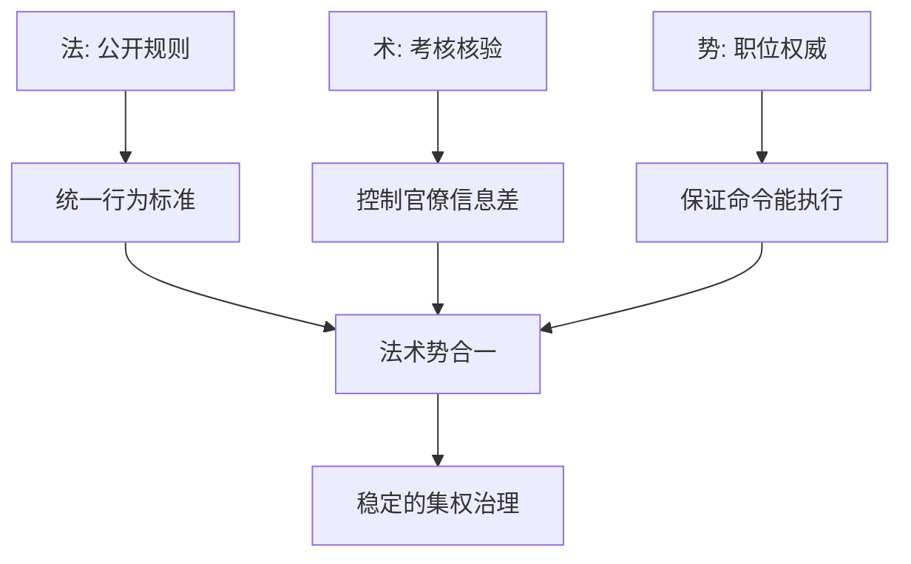

## 法家思维筑基课: 上层定律六: 法、术、势合一

### 作者
digoal

### 日期
2026-05-18

### 标签
法家 , 法术势合一 , 法 , 术 , 势 , 韩非 , 公开规则 , 官僚核验 , 职位权威 , 治理模型

----

## 背景

> 面向对象: 高中生到大学低年级读者  
> 核心问题: 为什么韩非要把法、术、势放在一起，而不是只讲法律或只讲权力？  
> 先说结论: 法是公开标准，术是官僚控制技术，势是职位权威；三者缺一，法家治理机器就容易失灵。

## 一张图先看懂



## 求真讲法

### 它到底说了什么

韩非综合了几条法家传统:

| 概念 | 代表意义 | 解决的问题 |
|---|---|---|
| 法 | 公开法令、标准、赏罚 | 民众和官员按什么行动 |
| 术 | 任免、考核、名实核验 | 怎样防止官员欺骗 |
| 势 | 君主职位的权威 | 为什么命令能被执行 |

只有法，没有术，官员可能钻规则空子。只有术，没有法，治理会变成个人权谋。只有法和术，没有势，命令可能推不动。

### 它是怎么来的

它从多个公理共同推出:

| 来源公理 | 推导 |
|---|---|
| 人会趋利避害 | 需要法令和赏罚 |
| 贤人稀缺 | 需要制度而非个人德性 |
| 权力与信息不对称 | 需要术来核验官僚 |
| 国家竞争要求动员 | 需要势来统一命令 |
| 公共标准高于私人关系 | 需要法压过人情特权 |

### 它依赖哪些假设

| 假设 | 含义 | 若不成立会怎样 |
|---|---|---|
| 法能被公开执行 | 标准可见 | 否则人无法预期 |
| 术能发现偏差 | 考核有效 | 否则官僚架空 |
| 势能支撑执行 | 职位有权威 | 否则命令落空 |
| 三者服务同一目标 | 不互相打架 | 否则制度内耗 |

### 常见误解

**误解一: 法术势合一就是法治。**  
不是。这里的法服务于君主集权，不是现代意义上限制权力的法治。

**误解二: 术越隐秘越高明。**  
过度隐秘会制造恐惧和猜疑，损害真实信息流动。

**误解三: 势就是个人魅力。**  
势更接近职位权威。普通人坐在关键位置，也会获得制度赋予的力量。

## 求存讲法

### 它有什么用

它提供了一个组织分析框架: 规则、检查、权威必须配套。只写制度没人检查，制度会空转；只检查没标准，会变成任意挑错；只有权威没规则，会变成拍脑袋。

### 它怎么迁移到熟悉领域

小组项目中:

```text
法: 任务表和评分标准
术: 每周检查进度和证据
势: 组长或老师有协调和调整权限
```

三者配合，项目更容易完成。

### 它的适用范围和边界

适用: 大型组织、项目治理、行政流程、学校管理。  
边界: 不能把“术”变成不透明监控，也不能把“势”变成不受限制的权力。

### 正例: 怎么用它提升能力

准备竞赛时，制定训练计划是“法”，每周测验和错题分析是“术”，固定教练或队长协调训练节奏是“势”。三者合起来比只喊努力有效。

### 反例: 前提不成立会怎样

团队有严格规则和频繁检查，但负责人没有资源调配权，发现问题也不能调整。失败原因是“势能支撑执行”不成立。

## 思考

法术势合一说明治理不是单靠一张制度表。  
但现代治理还要追问: 法能否限制势？术是否透明可申诉？被治理者是否有权利？

## 最后记住

1. 法是标准，术是核验，势是职位权威。
2. 韩非的贡献在于把三者合成完整治理模型。
3. 现代可借鉴的是规则、检查、授权配套。
4. 不可照搬的是君主工具论和不透明控制。

## 参考资料

1. 《韩非子·定法》《韩非子·主道》《韩非子·二柄》。
2. 《商君书》与《申子》《慎子》相关思想材料。
3. 冯友兰《中国哲学史》相关章节。
4. 本文基于通行先秦思想史整理。

  
#### [PostgreSQL 解决方案集合](../201706/20170601_02.md "40cff096e9ed7122c512b35d8561d9c8")
  
  
#### [德哥 / digoal's Github - 公益是一辈子的事.](https://github.com/digoal/blog/blob/master/README.md "22709685feb7cab07d30f30387f0a9ae")
  
  
#### [About 德哥](https://github.com/digoal/blog/blob/master/me/readme.md "a37735981e7704886ffd590565582dd0")
  
  

  
