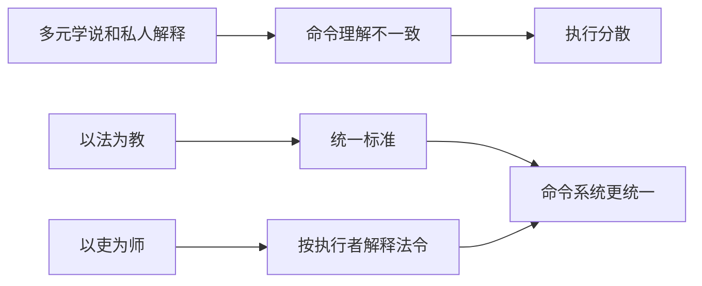

## 法家思维筑基课: 上层定律七: 以法为教，以吏为师

### 作者
digoal

### 日期
2026-05-18

### 标签
法家 , 以法为教 , 以吏为师 , 统一标准 , 国家中心 , 普法边界 , 官吏治理 , 韩非 , 思想统一 , 流程管理

----

## 背景

> 面向对象: 高中生到大学低年级读者  
> 核心问题: 为什么法家希望用法令和官吏来统一社会知识与行为？  
> 先说结论: 在法家眼里，多元解释可能削弱命令统一；所以它倾向用国家法令作为教育内容，用执行法令的官吏作为行为导师。

## 一张图先看懂

## 求真讲法

### 它到底说了什么

“以法为教，以吏为师”强调: 社会成员应该学习国家法令，官吏负责解释和执行这些法令。它的目标是减少不同学说、私人议论和地方习惯对统一命令的干扰。

这条定律体现了法家强烈的国家中心立场。

### 它是怎么来的

它主要从这些公理推出:

| 来源公理 | 推导 |
|---|---|
| 国家竞争要求组织动员 | 命令和行为标准要统一 |
| 公共标准高于私人关系 | 私人解释不能压过国家法令 |
| 贤人稀缺且不可复制 | 不依赖私人师说和个人德化 |

在高压竞争中，法家担心思想多元会削弱国家动员效率。

### 它依赖哪些假设

| 假设 | 含义 | 若不成立会怎样 |
|---|---|---|
| 统一比多元更重要 | 生存压力压过讨论空间 | 才会压低百家争鸣 |
| 法令内容足够正确 | 法可作为教育核心 | 错法会被放大 |
| 官吏能正确解释 | 吏可为师 | 否则变成权力任意解释 |
| 社会目标高度集中 | 不需要复杂多元知识 | 否则会压制创新 |

### 常见误解

**误解一: 以法为教等于普法教育。**  
不完全。现代普法是让公民理解权利义务，法家更偏向让臣民服从国家命令。

**误解二: 统一思想一定提高效率。**  
短期可能提高执行，长期可能降低纠错和创新。

**误解三: 多元讨论只会制造混乱。**  
多元讨论也能发现错误、补充知识、限制权力。

## 求存讲法

### 它有什么用

它能在危机或强执行场景中减少解释混乱。比如消防演练、实验室安全、交通规则，确实需要统一标准。

### 它怎么迁移到熟悉领域

学校实验室不能让每个人按自己的理解处理危险试剂，必须学习统一安全规范，并听从负责老师或管理员安排。

### 它的适用范围和边界

适用: 安全规则、应急管理、基础纪律、流程培训。  
边界: 学术研究、公共讨论、创新设计不能只允许一种解释。

### 正例: 怎么用它提升能力

学习编程时，先遵守项目代码规范和测试流程，遇到争议按维护者文档执行。这样团队协作更稳定。

### 反例: 前提不成立会怎样

课堂讨论文学作品时，老师只允许一种标准答案，不许学生提出不同解释。失败原因是“统一比多元更重要”的前提不成立，文学理解需要多角度解释。

## 思考

统一标准能减少混乱，但也可能消灭发现错误的声音。  
一个成熟社会要区分: 哪些地方必须统一执行，哪些地方必须允许讨论和质疑？

## 最后记住

1. 以法为教、以吏为师体现法家的国家中心立场。
2. 它从组织动员和公共标准优先中推出。
3. 它适合安全和流程场景，不适合压制所有思想多元。
4. 现代普法与法家“以法为教”不能简单等同。

## 参考资料

1. 《韩非子》相关篇章。
2. 《史记·秦始皇本纪》关于秦制思想环境的传统叙述。
3. 侯外庐等《中国思想通史》相关章节。
4. 本文基于通行先秦思想史整理，注意区分理论表达与历史实践。

  
#### [PostgreSQL 解决方案集合](../201706/20170601_02.md "40cff096e9ed7122c512b35d8561d9c8")
  
  
#### [德哥 / digoal's Github - 公益是一辈子的事.](https://github.com/digoal/blog/blob/master/README.md "22709685feb7cab07d30f30387f0a9ae")
  
  
#### [About 德哥](https://github.com/digoal/blog/blob/master/me/readme.md "a37735981e7704886ffd590565582dd0")
  
  

  
