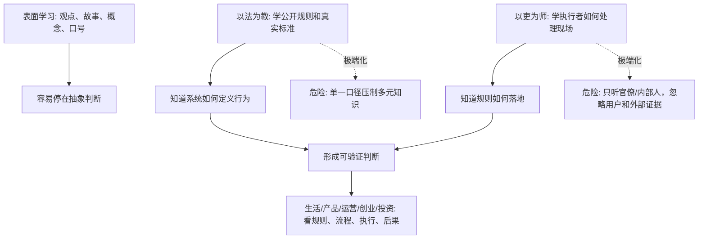

## 法家思维筑基课: 以法为教，以吏为师

### 作者
digoal

### 日期
2026-05-18

### 标签
以法为教 , 以吏为师 , 规则学习 , 现场执行 , 产品实践 , 运营复盘 , 创业尽调 , 投资分析 , 组织学习 , 反证思维

----

## 背景

> 面向对象: 大学生、产品经理、运营经理、有投资需求的人  
> 核心问题: 为什么很多人学了很多理论，到了真实组织、产品、创业和投资现场却不会判断？为什么只听故事、观点和名词，不如看规则如何执行、责任如何落地？  
> 先说结论: “以法为教，以吏为师”在先秦法家语境中，是用国家法令统一教化、用官吏解释执行规则。现代可迁移的部分是: 学习和判断不能只靠空谈，要以公开规则、真实流程、一线执行和责任后果为教材。但它也有危险边界: 如果只允许单一权威解释世界，就会压制多元知识、反证和创新。

本文把“法”扩展理解为: **公开规则、制度、标准、流程、契约、财务纪律、产品原则和合规底线**。把“吏”扩展理解为: **真正执行规则、处理现场、承担结果、知道系统如何运转的一线实践者和管理者**。

## 一张图先看懂



## 求真讲法

### 它到底说了什么

“以法为教，以吏为师”常见于法家思想语境，尤其可以和《韩非子》里反对空谈、强调法令和官吏执行的观点一起理解。

它可以拆成两句话:

1. **以法为教:** 不让人各讲各的古书、私学、道德说辞，而是用统一法令作为行为教材。
2. **以吏为师:** 不让人只听空谈家，而是向掌握法令执行、奖惩流程和具体事务的官吏学习。

在古代语境里，这是一种强国家治理方案: 让知识、行为和服从都围绕国家法令统一起来。

迁移到现代，不能照搬它的思想控制部分，但可以抽取一个重要洞察:

```text
判断一个系统，
不要只听它怎么解释自己，
要看它的规则怎么写，
执行者怎么做，
违规者怎么被处理，
结果怎么被复盘。
```

### 它是怎么来的

战国时代思想竞争激烈，诸子百家各有主张。法家担心多元解释会削弱统一命令，认为国家要在竞争中取胜，就必须让人民和官僚围绕法令、赏罚、耕战和执行标准行动。

所以“以法为教，以吏为师”的动机，是解决三个问题:

1. **解释权分散:** 每个人都引用不同经典和道德标准，命令难以统一。
2. **执行标准不一:** 地方、贵族、官员各行其是，国家难以动员。
3. **空谈脱离实践:** 说理很多，但无法转化为可执行的行为。

它的古代答案是: 用法令统一解释，用官吏作为规则老师。

现代社会不能接受单一权威垄断知识，但仍然能从中学到: **真实能力来自规则理解和现场执行，而不是只会背概念。**

### 它依赖哪些假设

这条规律依赖几个现实假设:

1. 规则会塑造行为。一个系统真正奖励和惩罚什么，比它口头宣传什么更重要。
2. 执行者掌握现场知识。很多关键细节不在宣传材料里，而在真实流程、异常处理和责任边界里。
3. 空谈容易脱离约束。没有规则和后果的观点，很难检验。
4. 大规模协作需要共同标准。没有共同标准，陌生人合作成本会升高。
5. 单一解释权也会带来风险。知识如果只来自权威内部，会压制反证和创新。

可以用一个简化公式理解:

```text
可用知识 = 规则清晰度 × 执行经验 × 反馈真实性 × 外部反证
```

如果只有规则，没有现场经验，会形式化；如果只有执行经验，没有外部反证，会内部化和僵化。

| 学习对象 | 只看表面 | 以法为教、以吏为师的现代化理解 |
|---|---|---|
| 公司 | 看宣传和价值观 | 看制度、财务纪律、晋升和惩罚 |
| 产品 | 看功能和定位 | 看用户流程、数据、客服和退款 |
| 运营 | 看活动海报和 GMV | 看渠道规则、复盘、留存和成本 |
| 创业 | 看融资故事 | 看合同、回款、交付、现金流 |
| 投资 | 看管理层表达 | 看财报口径、治理规则、资本配置 |
| 职业 | 看岗位 title | 看职责、汇报线、资源和评价标准 |

### 常见误解

**误解一: 以法为教就是只学法律条文。**

不是。现代迁移时，“法”可以理解为任何系统的公开规则和真实标准，比如岗位职责、产品原则、财务纪律、投资准则和平台规则。

**误解二: 以吏为师就是盲目听权威。**

不对。可取的是向真实执行者学习现场知识，不是盲从内部口径。执行者也可能维护自身利益，所以还要看外部证据、用户反馈和独立数据。

**误解三: 这条规律反对理论。**

不准确。理论很重要，但理论必须被规则、流程、案例和结果校验。没有实践的理论容易空转；没有理论的实践容易经验主义。

**误解四: 统一标准一定压制创新。**

不一定。底线和流程需要统一，探索和创新需要空间。关键是区分“必须统一的底线”和“允许试错的领域”。

## 求存讲法

### 它有什么用

这条规律能帮你把学习和判断从“听观点”拉回“看系统”。

**生活中:** 判断一个机构、项目、合作对象，不只听介绍，要看合同、流程、退款、投诉和责任边界。

**大学里:** 学一个专业，不只听大课和概念，要看真实案例、作业标准、实验流程和行业实践者。

**产品中:** 不只听产品愿景，要看需求评审规则、上线流程、用户反馈、客服工单和数据复盘。

**运营中:** 不只看活动创意，要看渠道准入、预算分配、话术审核、退款投诉和复盘机制。

**创业中:** 不只看商业计划书，要看合同、回款、交付、客户成功、财务纪律和组织流程。

**投资中:** 不只看路演和管理层故事，要看财报、治理、资本配置、审计、关联交易和长期兑现记录。

### 它推出的上层定律

| 上层定律 | 一句话解释 | 适用场景 |
|---|---|---|
| 规则即教材定律 | 真正规则比宣传材料更能教你系统如何运转 | 择业、投资 |
| 执行者知识定律 | 一线执行者知道很多文件里没有的真实约束 | 产品、运营 |
| 现场校验定律 | 观点必须经过现场流程和结果校验 | 创业、管理 |
| 合同优先定律 | 合作不能只听口头承诺，要看契约和违约后果 | 生活、商业 |
| 用户反馈定律 | 产品真实规则要到用户和客服那里看 | 产品 |
| 财报穿透定律 | 投资要从管理层叙事进入财报和现金流 | 投资 |
| 反单一口径定律 | 规则和执行要看，也要引入外部反证 | 决策、投资 |

### 它怎么迁移到熟悉领域

#### 1. 大学生: 学专业不能只听概念课

一个大学生想学产品、金融、法律、计算机或运营，如果只听概念，会以为自己懂了。但真正的能力来自“规则 + 执行 + 反馈”。

```text
学产品: 看需求文档、PRD、用户访谈、上线复盘
学金融: 看财报、估值模型、现金流、风险案例
学法律: 看条文、判例、合同、争议处理
学计算机: 看代码、测试、部署、事故复盘
学运营: 看活动 SOP、渠道数据、话术和退款投诉
```

概念给地图，规则和执行给地形。

#### 2. 产品经理: 向客服、销售和用户学习真实规则

产品经理如果只看数据看板和老板战略，很容易误判。很多真实知识在客服、销售、实施和用户那里。

应该定期看:

1. 客服工单里的高频问题。
2. 销售丢单原因。
3. 实施团队遇到的交付阻力。
4. 用户真实操作路径。
5. 退款和投诉原因。
6. 需求评审中被拒绝的案例。

这就是现代化的“以吏为师”: 向真正处理现场的人学习，但不盲从他们的局部立场。

#### 3. 运营经理: 活动复盘要看真实执行链

运营活动不是海报、文案和 GMV。真正该学习的是执行链:

| 环节 | 要看的规则和执行 |
|---|---|
| 渠道 | 准入标准、投放成本、用户质量 |
| 话术 | 是否夸大承诺，是否带来投诉 |
| 优惠 | 是否被套利，是否伤害毛利 |
| 社群 | 活跃是否转化为信任和复购 |
| 售后 | 退款、投诉和交付压力 |
| 复盘 | 是否沉淀 SOP 和停止条件 |

运营经理真正的老师，不只是成功案例，也是失败渠道、投诉工单和财务复盘。

#### 4. 创业者: 公司规则就是最真实的企业文化教材

创业公司说自己重视长期主义、客户价值、开放沟通。真正要看:

```text
谁被提拔？
谁拿预算？
谁能影响产品路线？
坏消息如何上报？
客户投诉谁负责？
报销和采购如何审批？
销售承诺如何审核？
现金流预警谁能叫停项目？
```

这些规则和执行方式，才是员工真正学到的企业文化。

#### 5. 投资者: 从路演进入规则、报表和执行者

投资中，“以法为教，以吏为师”可以转成尽调路径:

| 表面材料 | 继续追问的规则和执行 |
|---|---|
| 管理层路演 | 年报、股东信、历史承诺兑现 |
| 增长故事 | 客户留存、回款、毛利和现金流 |
| 公司治理 | 董事会、审计、关联交易、薪酬机制 |
| 护城河叙事 | 定价权、转换成本、网络效应、成本优势 |
| 资本配置 | 并购、回购、分红、再投资纪律 |
| 文化表达 | 坏消息披露、员工流失、内部晋升 |
| 行业前景 | 竞争格局、监管、周期和替代技术 |

这不是具体投资建议，而是底层过滤器: **不要只听会讲故事的人，要读规则、看记录、问执行者、找反证。**

### 它的适用范围和边界

这条规律特别适用于:

1. 信息不对称场景: 投资、求职、创业合作、培训项目。
2. 规则复杂场景: 法律、金融、医疗、平台、公司治理。
3. 执行链很长的场景: 产品、运营、供应链、客户成功。
4. 容易被概念包装的场景: AI、平台、生态、增长飞轮、长期主义。

但它也有边界:

1. **不能把规则当真理。** 规则可能过时、偏见化或被既得利益设计。
2. **不能只听执行者。** 一线执行者掌握现场，但也可能有局部利益和视野限制。
3. **不能压制理论和外部知识。** 创新往往来自跨领域模型和反常识证据。
4. **不能把统一标准变成思想垄断。** 公共规则需要统一，知识探索需要开放。
5. **不能只看内部口径。** 投资和创业都要引入客户、竞争对手、供应商、财务和监管视角。

更稳的边界是:

```text
以规则防空谈，
以现场防幻想，
以数据防自嗨，
以反证防封闭，
以多元知识防僵化。
```

### 正例: 怎么用它提升能力

假设你是一个产品经理，要判断一个“AI 客服助手”是否真的能提升效率。

可以这样做:

1. **以法为教:** 先看客服部门的服务标准、响应时限、质检规则、升级流程。
2. **以吏为师:** 跟 5 位一线客服坐席访谈，看他们每天最难处理什么。
3. **看真实工单:** 抽样分析 100 条投诉、退款和复杂咨询。
4. **设验证指标:** 平均处理时长、一次解决率、客户满意度、人工升级率。
5. **小范围试点:** 不直接全量上线，先在一个业务线验证。
6. **找反证:** 如果处理时长下降但投诉上升，说明效率名义上提升，真实体验可能变差。

这样做比听供应商演示更可靠，因为它从规则、现场和结果三方面核验。

### 反例: 前提不成立会怎样

一家创业公司购买了一套昂贵的增长咨询方案。咨询方讲了很多“增长飞轮”“私域矩阵”“用户生命周期运营”的概念。创始人觉得很先进，于是让团队照着做。

但公司没有先看:

1. 现有用户为什么流失。
2. 客服投诉集中在哪里。
3. 销售承诺是否能交付。
4. 产品复购是否成立。
5. 渠道获客成本是否健康。
6. 退款和毛利是否支持继续投放。

结果团队做了很多活动、社群和内容，但用户质量差、退款上升、交付压力加重。

这个失败不是因为“增长理论一定没用”，而是因为一个关键前提不成立: **没有以真实规则和现场执行为教材，只学习了概念话术。** 没有现场校验的理论，很容易变成组织自嗨。

## 思考

### 为什么它能帮助判断真伪

表面世界会用很多漂亮词:

```text
顶层设计
先进模式
行业最佳实践
AI 赋能
长期主义
用户第一
增长飞轮
精细化运营
```

你要追问:

```text
规则在哪里？
谁执行？
谁承担后果？
现场反馈是什么？
合同和财报怎么写？
客服和一线怎么说？
有没有外部反证？
```

这能把抽象话术拉回可验证的制度、流程和结果。

### 为什么它能帮助预言未来

如果一个组织:

1. 只重视概念包装。
2. 不读真实规则和合同。
3. 不听一线执行者。
4. 不看投诉、退款、现金流和失败样本。
5. 不允许外部反证挑战内部口径。

那么可以预判: 它会在短期制造叙事，长期暴露交付、现金流、用户信任或组织能力问题。

反过来，如果一个组织:

1. 规则清楚。
2. 一线反馈能上行。
3. 执行者经验能沉淀。
4. 外部反证能进入决策。
5. 管理层能把制度、现场和数据统一起来。

它未必最会讲概念，但更可能持续纠错。

### 一个反事实问题

假设只听概念、观点和专家演讲就能理解世界，那么:

1. 学产品不用看用户和工单。
2. 学投资不用看财报和治理。
3. 学运营不用看渠道和退款。
4. 创业不用看合同、回款和交付。
5. 求职不用看岗位规则和真实汇报线。

但现实不是这样。真正决定结果的，往往藏在规则、流程、执行者、异常案例和责任后果里。

## 最后记住

1. 以法为教的现代价值是: 用真实规则、标准、契约和流程抵抗空谈。
2. 以吏为师的现代价值是: 向真正执行规则、处理现场、承担结果的人学习。
3. 产品、运营、创业和投资中，不要只听概念和故事，要看规则、执行、数据、后果和反证。
4. 这条规律的危险边界是单一口径和权威垄断，所以必须引入用户、市场、财务、竞争对手和外部证据。
5. 判断未来，不看谁说得最漂亮，而看谁能把规则、现场经验和真实反馈变成可持续能力。

## 参考资料

1. 《韩非子·五蠹》相关论述: “以法为教”“以吏为师”体现法家用法令和官吏执行统一社会行为的治理取向。
2. 《韩非子》其他相关篇章: 法、术、势、赏罚和名实核验思想共同构成法家制度化治理框架。
3. 《商君书》相关篇章: 法令、赏罚和农战动员体现以制度和执行替代空谈与身份特权。
4. Max Weber, *Economy and Society*: 官僚制理论帮助理解现代组织中规则、职位、文书和执行者知识的作用。
5. Herbert A. Simon, *Administrative Behavior*: 有限理性理论说明组织需要规则、程序和反馈来降低个人判断偏差。
6. Chris Argyris 与 Donald Schön, *Organizational Learning*: 组织学习理论强调从实际行动、反馈和错误中修正组织规则。
7. Warren Buffett 历年股东信与 Berkshire Hathaway 管理思想: 投资判断要从管理层叙事进入年报、财务、治理、资本配置和长期兑现记录。
  
#### [PostgreSQL 解决方案集合](../201706/20170601_02.md "40cff096e9ed7122c512b35d8561d9c8")
  
  
#### [德哥 / digoal's Github - 公益是一辈子的事.](https://github.com/digoal/blog/blob/master/README.md "22709685feb7cab07d30f30387f0a9ae")
  
  
#### [About 德哥](https://github.com/digoal/blog/blob/master/me/readme.md "a37735981e7704886ffd590565582dd0")
  
  

  
