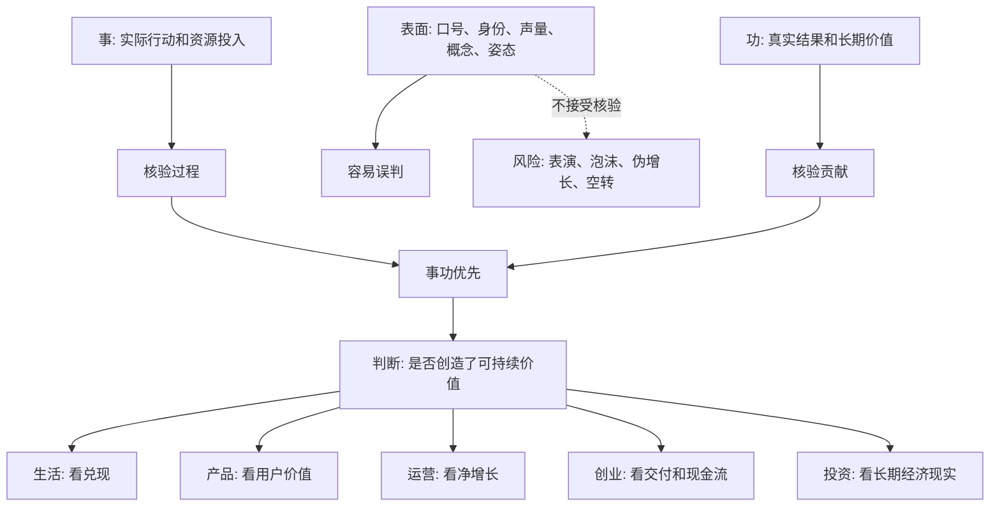

## 法家思维筑基课: 事功优先

### 作者
digoal

### 日期
2026-05-18

### 标签
事功优先 , 结果导向 , 真实贡献 , 产品价值 , 运营增长 , 创业现金流 , 投资判断 , ROIC , 资本配置 , 长期价值

----

## 背景

> 面向对象: 大学生、产品经理、运营经理、有投资需求的人  
> 核心问题: 为什么很多人说得漂亮、姿态正确、概念先进、数据热闹，却没有真正创造价值？怎样判断一个人、团队、产品、公司和投资标的是否真的有效？  
> 先说结论: “事功优先”就是把判断重心从身份、口号、动机、声量、概念和短期表演，转向可验证的真实贡献。事，是实际做了什么；功，是造成了什么结果、承担了什么成本、留下了什么长期价值。它不是反对理想和过程，而是要求理想、过程和叙事最终接受结果检验。

本文把“事”定义为: **真实行动、资源投入、执行过程、责任承担和可观察行为**。把“功”定义为: **真实产出、用户价值、现金流、效率提升、风险降低、能力沉淀和长期后果**。

## 一张图先看懂



## 求真讲法

### 它到底说了什么

“事功优先”可以理解为一种结果导向，但它不是简单粗暴的“只看结果”。更准确地说，它要求我们同时看三件事:

1. **有没有真实行动。** 不是只表态、开会、写计划、发朋友圈，而是是否真正投入资源和承担责任。
2. **有没有真实结果。** 不是只制造声量、数据和故事，而是是否解决问题、创造价值、降低风险。
3. **结果是否值得。** 不是只看短期胜利，还要看成本、后遗症、机会成本和长期复利。

一句话:

```text
不要只问“他说得对不对”，
要问“他做成了什么、代价是什么、能否持续”。
```

这条规律特别适合对抗表面变化。因为新概念会不断出现，但“是否真的创造价值”这个问题不会过时。

### 它是怎么来的

在法家思想中，事功取向和“赏罚”“循名责实”“耕战”“法不阿贵”等原则相连。法家不太相信空谈道德、身份声望和漂亮辞令，更关心国家能否征税、动员、生产、作战、执行命令、维持秩序。

换成现代语言，就是:

```text
不要只看他说什么身份，
看他是否承担职责；
不要只看他说什么理想，
看他是否创造结果；
不要只看他说什么概念，
看它是否改善真实约束。
```

现代商业、产品、运营和投资也一样。一个公司可以讲 AI、生态、平台、长期主义，但最终要回到客户是否付费、现金流是否真实、组织能力是否沉淀、资本配置是否创造价值。

### 它依赖哪些假设

这条规律依赖几个现实假设:

1. 表面叙事容易被包装。身份、概念、声量和指标都可能被修饰。
2. 资源是稀缺的。时间、钱、人力和注意力都需要投向真正有效的地方。
3. 行动和结果之间存在成本。做成一件事不只看产出，还要看代价。
4. 短期结果可能误导。短期冲高可能来自透支、补贴、冒险和转嫁成本。
5. 长期价值需要反复验证。一次成功可能是运气，持续事功才接近能力。

可以用一个简化公式理解:

```text
真实事功 = 可验证结果 - 全部成本 - 风险后遗症 + 能力沉淀
```

如果结果很漂亮，但成本被隐藏、风险被转嫁、能力没有沉淀，那不是真正的事功。

| 表面判断 | 事功优先的追问 |
|---|---|
| 他很努力 | 努力是否转化为有效产出 |
| 产品很酷 | 是否解决高频真实问题 |
| 活动很热闹 | 是否带来高质量留存和复购 |
| 公司增长很快 | 是否有现金流、毛利和客户续费 |
| 团队很豪华 | 是否能稳定交付和协作 |
| 管理层很会讲 | 是否兑现承诺并承认错误 |
| 股票故事很大 | 是否有护城河、ROIC 和安全边际 |

### 常见误解

**误解一: 事功优先就是只看短期结果。**

不是。真正的事功必须包含长期后果。短期 GMV、短期利润、短期排名，如果透支用户、员工、现金流和品牌，不能算高质量事功。

**误解二: 只要结果好，过程就不重要。**

不对。过程决定结果能否复制，也决定成本和风险。靠违规、欺骗、压榨、过度杠杆得到的结果，可能只是把风险延后。

**误解三: 事功优先会压制理想。**

不一定。理想如果不能变成行动和结果，就会停在口号。事功优先要求理想落地，不是取消理想。

**误解四: 所有价值都能立刻量化。**

不对。教育、研发、品牌、文化、基础设施和长期投资，很多价值需要时间显现。事功优先不是要求立刻见效，而是要求有可验证路径和阶段性证据。

## 求存讲法

### 它有什么用

这条规律能帮你识别“看起来很厉害”和“真的有价值”的差别。

**生活中:** 不只看一个人说了什么，要看长期兑现、承担责任和复盘能力。

**大学里:** 不只看小组成员态度积极，要看真实交付物和贡献记录。

**产品中:** 不只看功能数量和发布速度，要看用户任务是否更快、更准、更愿意持续使用。

**运营中:** 不只看曝光、注册、GMV，要看净收入、毛利、退款、留存、复购和用户质量。

**创业中:** 不只看融资、PR、团队背景，要看客户付费、交付能力、回款、现金流和组织复制。

**投资中:** 不只看增长故事和会计利润，要看 owner earnings、自由现金流、ROIC、护城河、资本配置和长期股东回报。

### 它推出的上层定律

| 上层定律 | 一句话解释 | 适用场景 |
|---|---|---|
| 贡献高于姿态定律 | 判断人和团队，要看真实贡献，不看表演姿态 | 学习、管理 |
| 净价值定律 | 产出必须扣除成本、风险和后遗症 | 运营、创业 |
| 长期后果定律 | 短期好看不等于长期有效 | 投资、产品 |
| 结果可复盘定律 | 好结果要能解释和复盘，否则可能只是运气 | 团队、投资 |
| 现金流验真定律 | 商业事功最终要接受现金流和资本回报检验 | 创业、投资 |
| 能力沉淀定律 | 真正的功不仅是一次结果，还要留下可复制能力 | 产品、运营 |
| 反概念崇拜定律 | 越热门的概念，越要回到真实约束和真实价值 | 创业、投资 |

### 它怎么迁移到熟悉领域

#### 1. 大学生: 不要把“忙”误认为“有效”

很多学生每天很忙，听课、收藏资料、参加社群、报训练营，但结果没有提升。

事功优先的学习方式是:

```text
目标: 要掌握什么能力
行动: 每周完成什么可检查任务
结果: 能否独立做题、写代码、做分析、完成作品
成本: 花了多少时间，是否值得
复盘: 错在哪里，下次怎么改
沉淀: 是否形成笔记、模板、作品集或方法
```

“我很努力”是姿态，“我能稳定做出结果”才是事功。

#### 2. 产品经理: 上线功能不是功，解决问题才是功

产品团队常把“上线了多少功能”当成绩。但用户不为功能数量付费，用户为问题被解决付费。

产品经理要追问:

1. 这个功能解决了哪个真实问题？
2. 用户是否主动使用？
3. 核心任务完成率是否提高？
4. 留存或付费是否改善？
5. 是否增加了复杂度和维护成本？
6. 如果下线它，用户是否会明显不满？

真正的产品事功，不是发布，而是用户价值被验证。

#### 3. 运营经理: 热闹不是功，净增长才接近功

运营活动最容易被表面数字误导。一次活动可能曝光很高、GMV 很大、群很活跃，但真实价值很差。

| 表面成绩 | 事功优先的核验 |
|---|---|
| 曝光高 | 是否触达目标用户 |
| 注册多 | 是否完成有效激活 |
| GMV 大 | 扣除补贴、退款、履约成本后是否赚钱 |
| 社群活跃 | 是否形成信任、转化、复购 |
| 内容爆 | 是否带来目标用户和长期关注 |
| 渠道多 | 是否有稳定 ROI 和质量分层 |

运营的功，不是制造热闹，而是把资源转化为可持续用户价值和商业结果。

#### 4. 创业者: 融资不是功，客户和现金流才接近功

创业公司容易把融资、媒体报道、奖项、峰会演讲、团队背景当成事功。它们有用，但不是终局。

更硬的事功是:

```text
客户是否真实付费
产品是否稳定交付
回款是否及时
毛利是否健康
客户是否续费
组织是否能复制交付
现金流是否能穿越周期
```

融资是资源，不是结果。真正的创业事功，是把资源变成客户价值、现金流和组织能力。

#### 5. 投资者: 从故事穿透到长期经济结果

投资中，事功优先就是不被故事、概念和短期股价牵着走。

| 表面故事 | 事功优先的投资追问 |
|---|---|
| 高增长 | 增长是否转化为自由现金流 |
| 高利润 | 经营现金流是否支持净利润 |
| 好赛道 | 公司是否有护城河和定价权 |
| 强管理层 | 是否长期兑现承诺、诚实披露坏消息 |
| 大并购 | ROIC 是否改善，商誉是否有减值风险 |
| 回购 | 是否在低于内在价值时回购 |
| AI/平台/生态 | 是否降低客户成本或创造新增现金流 |
| 低估值 | 是否真有安全边际，而不是价值陷阱 |

这不是具体投资建议，而是底层过滤器: **商业世界最终奖励的不是故事，而是长期可提取现金流和资本配置能力。**

### 它的适用范围和边界

这条规律特别适用于:

1. 表面包装强的领域: 创业、投资、互联网产品、运营增长。
2. 资源稀缺的决策: 时间、预算、人力、资本分配。
3. 信息不对称场景: 求职、合作、融资、投资。
4. 长周期判断: 职业能力、公司质量、产品战略、复利投资。

但它也有边界:

1. **不能只看短期可量化结果。** 有些长期价值需要等待。
2. **不能忽略伦理和底线。** 结果好不代表手段合理。
3. **不能把探索性失败都当无功。** 诚实试错能沉淀知识，也是一种功。
4. **不能用单一指标定义功。** 复杂系统需要多维指标和定性判断。
5. **不能低估叙事的组织作用。** 好叙事能动员资源，但必须接受结果检验。

更稳的边界是:

```text
看结果，但不短视；
看贡献，但扣成本；
看增长，但看质量；
看现金流，也看能力沉淀；
允许试错，但反对伪装。
```

### 正例: 怎么用它提升能力

假设你是一个运营经理，要判断一个内容投放项目是否值得继续。

可以这样做:

1. **定义功:** 不是播放量，而是目标用户线索、有效咨询、成交、复购和内容资产沉淀。
2. **扣成本:** 计算制作成本、投放成本、达人费用、客服承接成本。
3. **看质量:** 区分泛流量和目标用户，追踪 7 日、30 日后续行为。
4. **看复用:** 好内容是否能复剪、沉淀话术、训练销售。
5. **设停止条件:** 如果连续两轮目标线索成本高于上限，就停止同类内容。
6. **复盘假设:** 判断错的是选题、人群、渠道、表达，还是产品本身吸引力。

这就是从“内容很火”转向“内容是否创造净价值”。

### 反例: 前提不成立会怎样

一家创业公司为了融资，集中资源做声量:

1. 高频参加峰会。
2. 发布大量 PR。
3. 做补贴冲 GMV。
4. 包装“平台生态”故事。
5. 用大客户签约额展示增长。

但内部真实情况是:

1. 回款慢。
2. 交付成本高。
3. 客户续费低。
4. 补贴停止后用户流失。
5. 团队没有沉淀可复制销售和交付流程。

融资环境变化后，公司现金流迅速承压。

这个失败不是因为声量和融资没有用，而是因为一个关键前提不成立: **表面声量没有转化为真实事功。** 资源被用来制造看起来像结果的东西，却没有形成客户价值、现金流和组织能力。

## 思考

### 为什么它能帮助判断真伪

表面世界最会制造“像成果的东西”:

```text
排名
奖项
融资
热搜
GMV
下载量
会议数量
战略口号
概念标签
短期股价
```

事功优先会逼你追问:

```text
真实解决了什么问题？
创造了什么净价值？
谁付费，谁复购，谁受益？
成本和风险在哪里？
结果能否持续和复制？
有没有留下能力沉淀？
```

这些问题能把“看起来有效”拆成“真的有效”。

### 为什么它能帮助预言未来

如果一个组织:

1. 只奖励声量和短期指标。
2. 不扣除真实成本。
3. 不追踪长期留存和现金流。
4. 不复盘失败。
5. 不沉淀可复制能力。
6. 把融资、PR、排名当核心成果。

那么可以预判: 它会短期热闹，长期承压。因为资源最终会回到真实价值创造能力上。

反过来，如果一个组织:

1. 定义清楚真实贡献。
2. 敢扣除成本和后遗症。
3. 追踪长期客户价值和现金流。
4. 允许诚实试错。
5. 把成功经验沉淀成能力。
6. 管理层长期兑现承诺。

它未必最会制造声量，但更可能长期复利。

### 一个反事实问题

假设事功不重要，表面就等于真实，那么世界会很简单:

1. 有融资的公司一定成功。
2. 有流量的产品一定有价值。
3. 有口号的组织一定有文化。
4. 有净利润的公司一定有现金。
5. 有高学历和头衔的人一定能交付。

但现实不是这样。现实中，表面可以被制造，事功必须被兑现。越是变化快、概念多、信息不对称强的领域，越要回到事功。

## 最后记住

1. 事功优先不是短期结果主义，而是用真实贡献、全部成本和长期后果检验表面叙事。
2. 产品看用户价值，运营看净增长，创业看客户和现金流，投资看长期经济现实。
3. 热闹、融资、排名、口号、概念和短期指标都只是入口，不是最终功劳。
4. 投资时要重点看现金流、ROIC、护城河、资本配置、管理层兑现记录和安全边际。
5. 判断未来，不看谁最会表演成果，而看谁能持续创造可验证、可复制、可积累的真实价值。

## 参考资料

1. 《韩非子》相关篇章: 法、术、势、赏罚和名实核验思想共同体现以实际功效而非空言身份判断行为的取向。
2. 《商君书》相关篇章: 耕战、赏罚、定分等思想强调以实际产出和国家动员效果作为评价依据。
3. Max Weber, *Economy and Society*: 官僚制理论帮助理解职位职责、规则执行和可复核结果在现代组织中的作用。
4. Peter Drucker, *The Practice of Management*: 管理的核心在于贡献、目标和绩效，而不是活动本身。
5. Steven Kerr, “On the Folly of Rewarding A, While Hoping for B”, 1975: 说明如果奖励表面指标，就会偏离真实目标。
6. Michael C. Jensen 与 William H. Meckling, “Theory of the Firm”, 1976: 代理理论解释为什么管理者可能追求个人收益和表面规模，而非所有者长期价值。
7. Warren Buffett 历年股东信与 Berkshire Hathaway 管理思想: 从故事和会计利润穿透到 owner earnings、现金流、资本配置、护城河和长期股东回报，是投资中“事功优先”的实践。
  
#### [PostgreSQL 解决方案集合](../201706/20170601_02.md "40cff096e9ed7122c512b35d8561d9c8")
  
  
#### [德哥 / digoal's Github - 公益是一辈子的事.](https://github.com/digoal/blog/blob/master/README.md "22709685feb7cab07d30f30387f0a9ae")
  
  
#### [About 德哥](https://github.com/digoal/blog/blob/master/me/readme.md "a37735981e7704886ffd590565582dd0")
  
  

  
