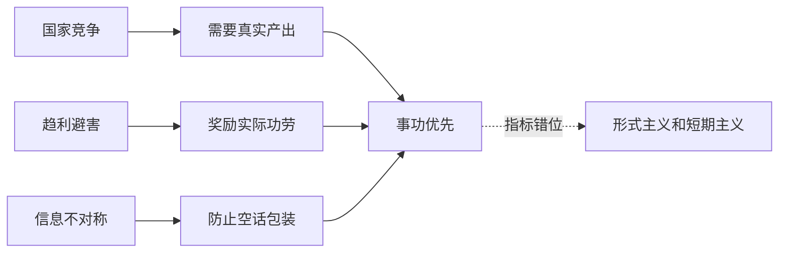

## 法家思维筑基课: 上层定律八: 事功优先

### 作者
digoal

### 日期
2026-05-18

### 标签
法家 , 事功优先 , 结果导向 , 真实功效 , 绩效评价 , 商鞅 , 韩非 , 反空谈 , 指标风险 , 长期价值

----

## 背景

> 面向对象: 高中生到大学低年级读者  
> 核心问题: 为什么法家更看重功劳、产出和效果，而不是出身、辞令和名声？  
> 先说结论: 在法家模型里，国家竞争要求可检验的结果；所以评价人和政策时，应优先看实际功效，而不是身份、口才或道德表演。

## 一张图先看懂

## 求真讲法

### 它到底说了什么

“事功优先”是对法家精神的一种概括: 看一个人，不只看他说什么、出身如何、名声怎样，而看他是否产生了国家需要的实际效果。

在战国语境中，这些效果常常包括耕战、军功、赋税、治安、行政执行。

### 它是怎么来的

它从这些公理推出:

| 来源公理 | 推导 |
|---|---|
| 国家竞争要求组织动员 | 必须奖励真实贡献 |
| 人会趋利避害 | 奖励什么，人就趋向什么 |
| 权力与信息不对称 | 要防止漂亮话替代结果 |
| 公共标准高于私人关系 | 评价要按功过，不按身份 |

事功优先是反贵族、反空谈、重结果的治理原则。

### 它依赖哪些假设

| 假设 | 含义 | 若不成立会怎样 |
|---|---|---|
| 真实功效可判断 | 能知道什么有用 | 否则只剩指标 |
| 短期结果代表长期价值 | 当下功效不伤未来 | 否则会短视 |
| 国家目标本身合理 | 功效服务正当目标 | 否则越有效越危险 |
| 评价标准不被操纵 | 功劳记录可信 | 否则虚功泛滥 |

### 常见误解

**误解一: 事功优先就是只看 KPI。**  
不是。真正的事功是实际价值，不是表面数字。

**误解二: 只要有效就正当。**  
现代视角必须补问: 对谁有效？代价由谁承担？是否侵犯正当权利？

**误解三: 道德和过程都不重要。**  
法家偏重结果，但现代组织不能忽视过程、公平和长期信任。

## 求存讲法

### 它有什么用

它能打破空话、资历和关系，让评价回到实际贡献。对学习、工作、项目复盘很有帮助。

### 它怎么迁移到熟悉领域

评价一次演讲，不只看“准备很辛苦”，还要看听众是否听懂、论证是否清楚、证据是否可靠、问题回答是否到位。

### 它的适用范围和边界

适用: 项目交付、考试训练、工程质量、公共服务效率。  
边界: 教育成长、基础研究、长期品牌、信任建设不能只看短期产出。

### 正例: 怎么用它提升能力

学习写作时，不只统计写了多少字，而看文章是否有清晰观点、证据是否支撑、读者能否复述。把“真实效果”作为改进方向。

### 反例: 前提不成立会怎样

平台只按点击率奖励内容，结果创作者大量标题党。失败原因是“真实功效可判断”和“短期结果代表长期价值”都不成立，点击率不等于内容价值。

## 思考

事功优先能反对空谈，但也可能滑向“只要结果，不问代价”。  
成熟的评价要同时问三件事: 有没有效果？效果是否真实？代价是否正当？

## 最后记住

1. 事功优先强调实际贡献高于身份、辞令和名声。
2. 它从国家竞争、趋利避害、信息不对称中推出。
3. 真正的事功不是表面指标，而是目标相关的真实价值。
4. 现代迁移时必须加入长期性、正当性和权利边界。

## 参考资料

1. 《商君书·农战》《商君书·赏刑》。
2. 《韩非子·有度》《韩非子·二柄》。
3. 《史记·商君列传》。
4. 本文基于通行先秦思想史整理。

  
#### [PostgreSQL 解决方案集合](../201706/20170601_02.md "40cff096e9ed7122c512b35d8561d9c8")
  
  
#### [德哥 / digoal's Github - 公益是一辈子的事.](https://github.com/digoal/blog/blob/master/README.md "22709685feb7cab07d30f30387f0a9ae")
  
  
#### [About 德哥](https://github.com/digoal/blog/blob/master/me/readme.md "a37735981e7704886ffd590565582dd0")
  
  

  
