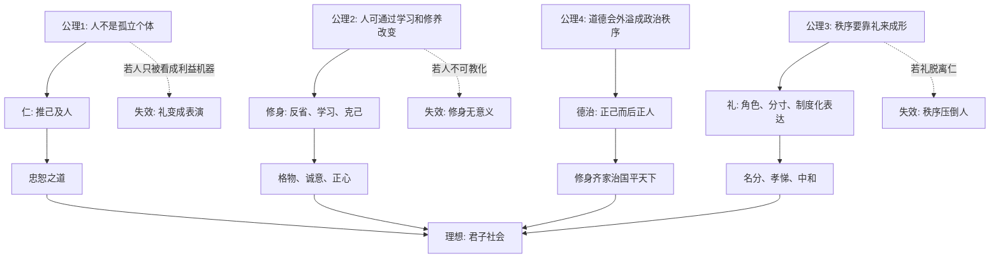
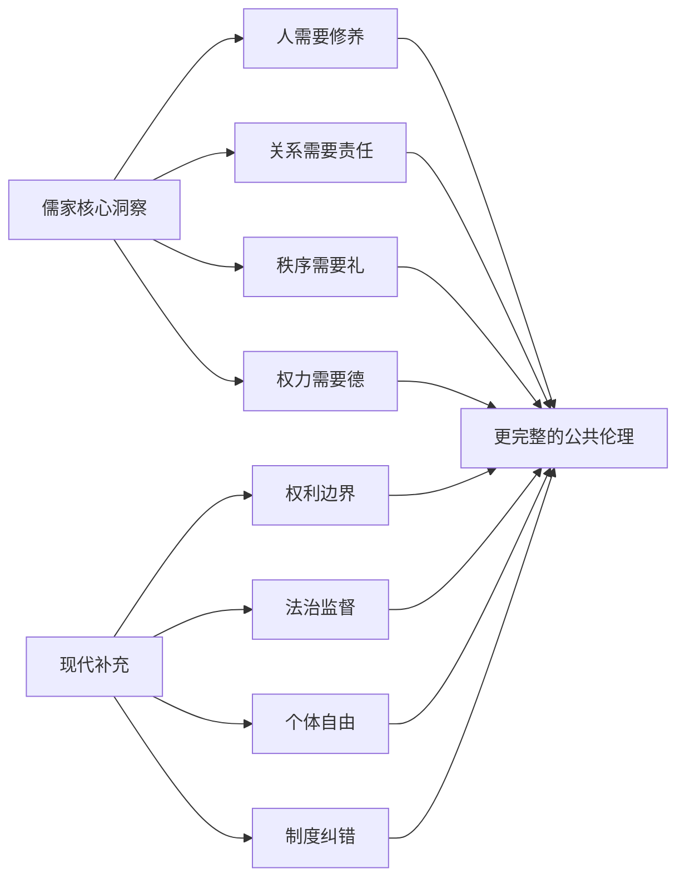

## 儒家思维筑基课: 中国儒家思想的底层公理和经典的上层定律

### 作者
digoal

### 日期
2026-05-18

### 标签
儒家思想 , 底层公理 , 上层定律 , 仁 , 礼 , 修身 , 德治 , 中庸 , 正名 , 传统文化

----

## 背景

> 面向对象: 高中生到大学低年级读者
> 核心问题: 儒家不是一堆背诵语录，它的底层逻辑到底是什么？哪些经典命题是从这些底层假设长出来的？
> 先说结论: 经典儒家把人看成“可被关系塑造、也能主动修养”的伦理存在。它的目标不是先设计一套外在制度机器，而是从个人修身出发，经由家庭、礼乐、政治秩序，把社会变成一个可长期相处、可持续信任的共同体。

## 一张图先看懂



## 求真讲法

### 它到底说了什么

儒家思想可以先压缩成一句话:

> 通过可学习的道德修养，把人的关系、行为和制度调成有仁、有礼、有义、有信的秩序。

这里有几个关键词:

- 仁: 对人有真实的同情、责任和推己及人的能力。
- 礼: 把内心的尊重、分寸和秩序变成可观察的行为规则。
- 义: 面对利益和压力时，知道什么是应该做的。
- 君子: 不是出身高贵的人，而是能约束自己、承担关系责任的人。
- 修身: 不是装样子，而是不断校准欲望、情绪、判断和行动。

### 底层公理

这里的“公理”不是说儒家像几何学一样从几条命题严格演算出一切，而是指: 如果不接受这些基本假设，很多儒家经典命题就不再成立。

| 底层公理 | 通俗说法 | 对应经典线索 | 如果不接受会怎样 |
|---|---|---|---|
| 关系公理 | 人首先活在父子、兄弟、朋友、君臣、夫妇等关系中 | 《论语》重孝悌，《孟子》讲人伦 | 儒家会显得过度重视家庭和角色 |
| 可教化公理 | 人能通过学习、反省、礼乐和榜样被塑造 | “学而时习之”“性相近也，习相远也” | 修身、教育、君子理想失去基础 |
| 仁心公理 | 人有同情他人痛苦的可能性 | 《孟子》“恻隐之心” | 仁政和推己及人难以成立 |
| 礼序公理 | 好的关系需要稳定形式，不能只靠临时善意 | 《礼记》重礼，《论语》讲“克己复礼” | 善意无法沉淀成社会秩序 |
| 德治公理 | 上位者的德性会影响群体风气 | 《论语》“为政以德” | 政治只能剩下刑罚、利益和技术管理 |
| 中和公理 | 好秩序不是极端压制，而是情感、角色、制度的适度平衡 | 《中庸》讲中和 | 儒家容易滑向僵硬等级或无原则和稀泥 |

### 它是怎么来的

儒家的问题意识不是“一个孤立个人如何最大化利益”，而是“许多人长期生活在一起，怎样减少冲突、建立信任、延续文明”。

先秦社会经历礼崩乐坏，旧贵族秩序动摇，战争、兼并和权力竞争变得剧烈。儒家的回应不是先发明一套纯粹技术化的治理系统，而是追问:

- 如果人没有自我约束，制度会不会被人滥用？
- 如果家庭和日常关系都无法形成信任，国家秩序能稳吗？
- 如果只靠刑罚和利益，人会不会只在被监督时守规矩？
- 如果只讲内心善意，没有礼的形式，善意能传给下一代吗？

所以儒家从“修身”出发，并不是只关心个人道德，而是认为社会秩序的最小单元是可被教化的人。

### 经典的上层定律

把底层公理往上推，就能看到一些经典儒家命题的结构。

#### 1. 修身定律: 不能管理自己，就很难正当地影响别人

经典表达: “修身齐家治国平天下”。

逻辑链:

```text
心不正 -> 行为失分寸 -> 家庭关系失信 -> 公共权力被私欲污染
心能正 -> 行为有准绳 -> 近处关系可信 -> 远处治理才有根基
```

这不是说会修身就一定会治国，而是说: 若一个人连最贴近自己的欲望、言行和关系都无法处理好，他拥有更大权力时，风险会被放大。

#### 2. 忠恕定律: 判断行为时，要能把自己放进对方的位置

经典表达: “己所不欲，勿施于人”；“己欲立而立人，己欲达而达人”。

底层依据是关系公理和仁心公理。人不是孤立点，所以判断一件事不能只看“我得到了什么”，还要看“如果位置互换，我是否仍认为这合理”。

#### 3. 礼仁互证定律: 礼没有仁会空，仁没有礼会散

经典表达: “克己复礼为仁”；“人而不仁，如礼何”。

礼让仁有形状: 鞠躬、让座、守约、称谓、祭祀、服丧、会议流程，都是把尊重变成他人能感受到的行为。

仁让礼有灵魂: 如果心里没有尊重，只剩动作正确，礼就会变成表演、权术或压迫。

#### 4. 孝悌扩展定律: 近处关系是远处伦理的训练场

经典表达: “孝弟也者，其为仁之本与”。

儒家把家庭看成伦理能力的初始学校。一个人最早学习责任、感恩、忍让、边界和承诺，通常不是在抽象国家里，而是在亲密关系中。

但这条定律有边界: 孝不是无条件服从。若把孝理解为取消判断、纵容错误，便会违背义和仁。

#### 5. 正名定律: 名称混乱，责任就会混乱

经典表达: “君君，臣臣，父父，子子”；“名不正，则言不顺”。

“正名”不是简单维护等级，而是让角色、责任和行为相匹配。老师不像老师，官员不像官员，父母不像父母，承诺不像承诺，社会就会失去判断标准。

现代说法是: 角色需要有可验证的责任边界。头衔不能只是权力标签，也必须是义务标签。

#### 6. 德风定律: 上层行为会塑造下层风气

经典表达: “君子之德风，小人之德草，草上之风必偃”；“为政以德，譬如北辰”。

儒家认为组织和国家不是只靠制度条文运行，也靠模仿、风气和默认规则运行。上位者怎样使用权力，下面的人会学习。

这不是否定法律，而是提醒: 如果掌权者公开破坏规则，法律会很快失去道德信用。

#### 7. 中庸定律: 高级判断不是折中，而是在具体情境中守住恰当

经典表达: “中也者，天下之大本也；和也者，天下之达道也”。

中庸不是“各打五十大板”，也不是“永远站中间”。它要求人理解情境、角色、后果和原则，在过与不及之间找到合义的行动。

比如诚实是原则，但“把所有真话在任何场合直接砸出去”不一定是义；忍让是美德，但“在原则问题上一直退让”也不是中。

### 它依赖哪些假设

儒家这套系统至少依赖五个前提:

1. 人有可塑性，不是完全被本能、利益或基因决定。
2. 伦理能力能从近处关系扩展到远处关系。
3. 社会秩序需要内在德性和外在制度共同维持。
4. 榜样、礼乐、教育和习惯能长期塑造人。
5. 权力必须接受道德约束，否则会腐化共同体。

这些前提一旦不成立，儒家就会遇到困难。比如，如果一个组织只奖励短期利益，长期羞耻感和责任感反而会被惩罚，那么只讲修身就不够，必须同时修改制度激励。

### 常见误解

| 误解 | 更准确的理解 |
|---|---|
| 儒家就是服从权威 | 经典儒家强调角色责任，君不君、父不父也要被批评 |
| 儒家只讲家庭，不讲公共社会 | 儒家从家庭训练伦理能力，再扩展到政治和天下 |
| 中庸就是没有立场 | 中庸是具体情境中的恰当，不是放弃原则 |
| 礼就是繁文缛节 | 礼的本意是让尊重、边界和秩序可见 |
| 修身就是个人道德洁癖 | 修身是为了让权力、关系和行动不被私欲带偏 |

## 求存讲法

### 它有什么用

儒家思想最核心的用途，是提供一种“低成本信任系统”。

法律和合同很重要，但它们通常处理已经发生或即将发生的冲突。儒家更关心冲突之前的东西: 一个人是否知耻、守信、顾及他人、尊重角色责任、能在无人监督时约束自己。

如果这些能力普遍存在，社会合作成本会下降。反过来，如果人人只在被抓到时才守规矩，再精密的制度也会变得昂贵。

### 它怎么迁移到熟悉领域

在学校里:

- 仁: 不把同学当工具人。
- 礼: 讨论时不打断别人，借东西要归还。
- 义: 分组作业不偷懒、不抢功。
- 信: 答应的事按时完成。
- 中庸: 既不讨好所有人，也不用“我很直”伤人。

在公司里:

- 正名: 岗位、权限、责任要一致。
- 德风: 管理者公开守规则，团队才会相信规则。
- 礼仁互证: 流程要有人味，人情不能破坏原则。
- 修身: 权力越大，越要管理情绪、欲望和偏见。

### 它的适用范围和边界

| 场景 | 儒家方法有效的条件 | 失效风险 |
|---|---|---|
| 家庭 | 亲情中仍承认边界和义 | 孝被扭曲成单向服从 |
| 学校 | 教师以身作则，规则稳定 | 只要求学生服从，不要求师长负责 |
| 公司 | 角色责任清楚，奖惩不反向 | 用“和气”掩盖责任不清 |
| 政治 | 德治与法治配合 | 只讲道德，不设监督 |
| 朋友关系 | 互相尊重，能换位思考 | 以“义气”替代原则 |

儒家最怕两种变形:

1. 只有礼，没有仁: 外表规矩，内里冷酷。
2. 只有德，没有制度: 期待好人掌权，却不给坏人作恶设置限制。

### 正例: 怎么用它提升能力

假设你是一个学生干部，负责组织班级活动。

儒家的做法不是先问“我怎样显得有领导力”，而是按这条链条走:

```text
修身: 我有没有私心，比如只安排朋友露脸？
正名: 我的职责是什么，哪些事必须公开说明？
仁: 任务分配是否考虑同学能力和压力？
礼: 通知、报名、感谢、反馈有没有清楚流程？
义: 如果朋友违反规则，我是否仍能按规则处理？
中庸: 遇到冲突时，能否既守原则又保留沟通空间？
```

如果你这样做，别人不一定都会喜欢你，但会更容易信任你。儒家所谓“德”，不是讨好，而是让别人相信你不会随便滥用位置。

### 反例: 前提不成立会怎样

某家公司天天喊“大家都是一家人”，要求员工加班、忍让、讲奉献，却不明确岗位责任，不支付合理报酬，也不允许员工表达不同意见。

这看起来像儒家，其实破坏了儒家的多个前提:

- 仁不成立: 没有把员工当成需要被体恤的人。
- 礼不成立: 没有清楚的边界和责任。
- 义不成立: 用温情语言包装不公平利益。
- 正名不成立: “家人”这个名掩盖了真实的雇佣关系。

所以这不是儒家修身，而是把儒家词汇当管理工具。前提一坏，上层定律就会变成压迫话术。

## 思考

儒家思想最值得思考的地方，不是它是否能原封不动解决现代问题，而是它提出了一个现代社会仍绕不开的问题:

> 如果制度越来越复杂，但人越来越不愿自我约束，社会真的会更好吗？

现代社会强调权利、自由、契约和法治，这是必要的。但儒家提醒我们: 再好的制度也要由人执行。一个没有羞耻感、责任感和同理心的人，可以把任何制度变成牟利工具。

反过来，儒家也需要接受现代问题的追问:

- 如果长辈、领导、权威本身不仁不义，晚辈和下属是否仍要服从？
- 如果只强调和谐，会不会压制真实冲突？
- 如果只讲修身，会不会忽视制度监督？
- 如果把关系看得太重，会不会损害陌生人的平等权利？

成熟的理解不是“全盘接受”或“全盘否定”，而是看到它的核心洞察和历史局限:



## 最后记住

1. 儒家的底层不是“服从”，而是“人在关系中通过修养形成可信秩序”。
2. 仁是内核，礼是形式；仁没有礼会散，礼没有仁会空。
3. 修身不是私人洁癖，而是防止权力、关系和欲望失控的起点。
4. 正名不是维护头衔，而是让角色、责任和行为相匹配。
5. 儒家有价值，但不能替代现代法治、权利边界和制度监督。

## 参考资料

- 《论语》: 仁、礼、君子、孝悌、忠恕、为政以德等核心命题。
- 《孟子》: 恻隐之心、仁政、义利之辨、人伦扩展等思想。
- 《大学》: 格物、致知、诚意、正心、修身、齐家、治国、平天下的修养链条。
- 《中庸》: 中、和、诚及情境中的恰当原则。
- 《礼记》: 礼乐秩序、角色规范和社会教化思想。
- 本文为教学性重构，基于经典儒家的一般解释框架；不同学派如荀子、宋明理学、现代新儒家会对人性、理气、心性和制度关系作出不同展开。
  
#### [PostgreSQL 解决方案集合](../201706/20170601_02.md "40cff096e9ed7122c512b35d8561d9c8")
  
  
#### [德哥 / digoal's Github - 公益是一辈子的事.](https://github.com/digoal/blog/blob/master/README.md "22709685feb7cab07d30f30387f0a9ae")
  
  
#### [About 德哥](https://github.com/digoal/blog/blob/master/me/readme.md "a37735981e7704886ffd590565582dd0")
  
  

  
