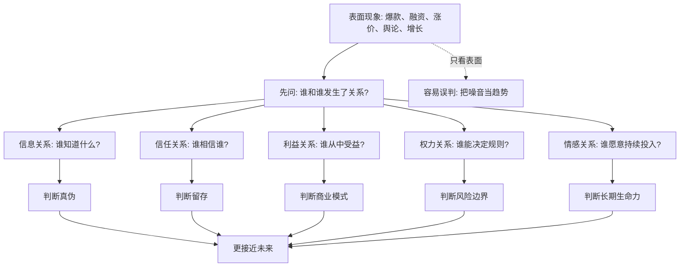
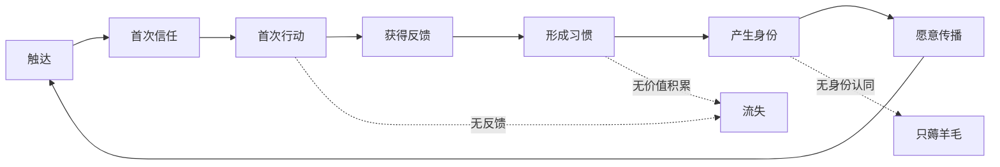

## 儒家思维筑基课: 关系公理: 人不是孤立个体

### 作者
digoal

### 日期
2026-05-18

### 标签
儒家思维 , 关系公理 , 社会网络 , 信任 , 利益关系 , 权力关系 , 产品判断 , 运营增长 , 创业分析 , 投资框架

----

## 背景

> 面向对象: 大学生、产品经理、运营经理、创业者、有投资需求的人
> 核心问题: 世界表面变化太快，为什么只看个人、产品、价格、新闻和数据点，常常判断错真伪，也预言不了未来？
> 先说结论: 人不是孤立个体，而是嵌在家庭、同学、同事、客户、组织、平台、资本、制度和文化关系网中的行动者。很多表面现象会变，但“关系如何连接、信任如何生成、利益如何绑定、信息如何流动、权力如何分配”这些底层结构，往往决定了事情的真实方向。

## 一张图先看懂



## 求真讲法

### 它到底说了什么

“关系公理”可以这样表述:

> 任何人的行为，都不是只由他自己的性格、欲望、能力决定，还由他所在的关系网络决定。

这句话很简单，但它会改变你看世界的方式。

你看到一个人买某个产品，表面是“个人选择”。但背后可能有同学推荐、朋友炫耀、平台算法推送、家庭预算限制、公司报销制度、身份认同、社群压力、售后信任、分期金融、监管政策。

你看到一家公司增长很快，表面是“产品厉害”。但背后可能是渠道关系、供应链关系、资本关系、生态位关系、平台流量关系、组织激励关系、客户迁移成本。

你看到一只股票上涨，表面是“市场看好”。但背后可能是资金结构、叙事传播、产业链位置、政策关系、机构持仓、流动性关系、风险偏好共振。

所以关系公理不是说“个人不重要”，而是说:

```text
个人行为 = 个体特征 x 关系结构 x 情境激励
```

只研究个体特征，等于把大部分因果变量剪掉。

### 它是怎么来的

这个公理来自一个反复出现的经验事实: 人类是社会性动物，几乎所有重要行动都需要他人配合。

一个人要生活，需要家庭、学校、公司、市场、城市、法律、货币、语言、交通、互联网。一个产品要被使用，需要用户相信、朋友传播、渠道触达、支付顺畅、服务兑现。一个企业要变大，需要员工协作、供应商稳定、客户复购、资本支持、监管许可、品牌信用。

从不同学科看，关系都是底层变量:

| 学科或领域 | 关系公理的表达 | 典型问题 |
|---|---|---|
| 社会学 | 个体嵌入社会网络 | 信息、身份、阶层、信任如何流动 |
| 经济学 | 交易依赖制度、契约和交易成本 | 为什么有些交易发生，有些交易失败 |
| 管理学 | 组织靠协作、激励和权责关系运行 | 为什么同一批人换组织后表现不同 |
| 产品 | 用户行为受场景、社交、渠道、习惯影响 | 为什么功能好不等于有人用 |
| 运营 | 增长依赖触点、转化、关系维护和反馈循环 | 为什么一次拉新不等于长期增长 |
| 投资 | 企业价值来自关系网络中的议价权和现金流 | 为什么好故事不等于好生意 |

关系公理不需要在某个系统内部被“证明”才有意义。它更像一个观察世界的起点: 如果我们把人假设为孤立个体，很多现象解释不通；如果把人放回关系网，许多表面混乱的现象会变得可解释。

### 它依赖哪些假设

关系公理依赖几个前提:

1. 人需要资源，而资源通常掌握在关系网络中。
2. 人需要信息，而信息通过关系传播，并且会被关系过滤。
3. 人需要信任，而信任不是一句口号，而是长期互动的结果。
4. 人会受到身份、角色、群体规范和他人期待影响。
5. 大多数重大行动不是一次性选择，而是连续博弈。

这些前提让我们从“点状思维”切换到“网络思维”。

点状思维问:

```text
这个人强不强？
这个产品好不好？
这个公司猛不猛？
这个项目热不热？
```

网络思维问:

```text
他连接了谁？
产品嵌入了哪个使用场景？
公司在产业链里能控制什么？
项目靠什么关系获得持续资源？
热度退去后，谁还离不开它？
```

### 一个更实用的判断模型

看任何人、产品、公司或投资机会，可以先画一张“五关系图”。

```text
              [权力关系]
                  |
[信息关系] -- [核心对象] -- [利益关系]
                  |
              [信任关系]
                  |
              [情感/身份关系]
```

五个问题依次是:

1. 信息关系: 谁先知道，谁后知道，谁能验证？
2. 信任关系: 谁愿意相信，为什么相信，信任能否迁移？
3. 利益关系: 谁付钱，谁受益，谁承担成本？
4. 权力关系: 谁制定规则，谁能改变分配？
5. 情感/身份关系: 谁把它当成“自己人”“自己事”“自己的选择”？

如果一个现象在这五种关系上都站得住，它更可能是真趋势。若只在传播上热，却没有利益绑定、信任沉淀和权力边界，它更可能只是短期噪音。

### 常见误解

| 误解 | 更准确的理解 |
|---|---|
| 关系公理就是“靠关系” | 这里的关系不是走后门，而是信息、信任、利益、权力、情感的结构 |
| 只要产品好，关系自然会来 | 产品好只是条件之一，触达、信任、场景、迁移成本都很关键 |
| 人是理性的，所以关系不重要 | 理性也要依赖信息和激励，而信息和激励都嵌在关系里 |
| 有数据就够了 | 数据记录的是关系发生后的痕迹，不一定解释关系为什么发生 |
| 关系越多越好 | 低质量关系会制造噪音、承诺负担和错误激励 |

## 求存讲法

### 它有什么用

关系公理的最大用途，是帮你从“看现象”升级到“看结构”。

表面现象常常变化:

- 今天流行短视频，明天流行智能体。
- 今天某个品牌火，明天另一个品牌火。
- 今天融资容易，明天现金流为王。
- 今天一个行业被追捧，明天被监管或价格战重估。

但底层问题相对稳定:

- 谁和谁形成了高频关系？
- 谁拥有信任入口？
- 谁控制了交易规则？
- 谁承担了真实成本？
- 谁的关系网络会越来越强，谁的关系网络会越来越脆？

这能帮你做三件事:

1. 判断真伪: 一个故事有没有真实关系支撑。
2. 判断未来: 一个趋势能否从短期传播变成长期结构。
3. 判断风险: 哪条关键关系断裂后，系统会崩。

### 它怎么迁移到生活

在人生选择里，很多人只看“我喜欢什么”“我擅长什么”。这不够。

你还要看:

- 我所在的城市、学校、行业给我什么连接机会？
- 我身边的人会放大我的能力，还是消耗我的注意力？
- 我能否进入一个高信任、高反馈、高标准的关系网络？
- 我现在积累的是可复利的信用，还是一次性的热闹？

一个大学生选择实习，不只要看公司名气，还要看能否接触真实项目、优秀同事、明确反馈和可迁移能力。因为成长不是只发生在个人大脑里，也发生在关系网络提供的问题、标准和机会里。

### 它怎么迁移到产品

产品经理不能只问“功能是否完整”，还要问“关系是否成立”。

| 产品问题 | 关系视角 |
|---|---|
| 用户为什么来？ | 触达关系是否存在 |
| 用户为什么信？ | 品牌、朋友、评价、背书是否可信 |
| 用户为什么留下？ | 产品是否嵌入工作流、生活流或社交关系 |
| 用户为什么付费？ | 付费者、使用者、受益者是否一致 |
| 用户为什么传播？ | 传播是否能提升身份、关系或利益 |

一个协作文档产品，真正的壁垒不只是编辑器功能，而是“同事、文件、权限、评论、历史版本、工作流程”都在里面。关系越多，迁移成本越高，产品越可能从工具变成基础设施。

### 它怎么迁移到运营

运营的本质不是发活动，而是设计关系循环。



如果运营只做补贴，可能得到一次行动；如果运营能让用户获得反馈、关系和身份，才可能得到长期留存。

社区运营尤其如此。一个社区不是人数相加，而是关系密度、信任水平、规则共识和共同记忆的积累。没有这些，十万人群也可能只是十万个沉默账号。

### 它怎么迁移到创业

创业者常犯的错误，是把公司看成“我有一个点子”。关系公理会逼你问更底层的问题:

- 客户关系: 谁痛，谁买单，谁影响决策？
- 渠道关系: 我如何持续触达客户？
- 供应关系: 关键资源是否稳定可得？
- 组织关系: 团队是否能形成互补和信任？
- 资本关系: 资金节奏是否匹配业务周期？
- 制度关系: 政策、监管、平台规则会不会改变生存条件？

一个创业项目能不能活，不只看创始人聪不聪明，而看它能否把这些关系编织成可重复的交易结构。

### 它怎么迁移到投融资

投资里，关系公理能帮你避开“只看故事”和“只看数字”的两个陷阱。

看企业时，问:

| 投资问题 | 关系公理下的追问 |
|---|---|
| 收入为什么增长？ | 是一次性需求，还是客户关系加深 |
| 毛利为什么高？ | 是技术优势，还是产业链议价权 |
| 护城河在哪里？ | 用户、渠道、供应链、数据、生态关系是否难迁移 |
| 风险在哪里？ | 关键客户、关键供应商、关键平台、关键政策是否集中 |
| 估值贵不贵？ | 市场是否把短期关系误判为长期结构 |

一个公司如果增长依赖单一大客户、单一平台流量或单一政策红利，它的表面增速可能很漂亮，但关系结构很脆。相反，一个公司如果能持续提高客户依赖、供应链效率、品牌信任和生态位置，它的短期波动不一定改变长期价值。

这不是具体投资建议，而是一种分析框架: 投资不是预测K线，而是判断关系网络能否持续创造现金流。

### 它的适用范围和边界

| 适用场景 | 为什么适用 | 边界 |
|---|---|---|
| 判断趋势 | 趋势必须进入关系网络才会扩散 | 早期趋势关系尚未稳定，容易误判 |
| 分析产品 | 产品价值来自用户和场景关系 | 单机工具也可能靠极强功能成立 |
| 分析公司 | 企业是客户、员工、供应链、资本的关系系统 | 不能忽视技术、成本、资产和法律约束 |
| 分析投资 | 现金流来自持续交易关系 | 市场价格还受流动性和情绪影响 |
| 分析人生选择 | 机会常来自高质量关系网络 | 关系不能替代个人能力和作品 |

关系公理有一个重要边界: 它不能被理解成“只要认识人就行”。如果没有能力、信用、作品和可交换价值，关系只会变成短期消耗。

更准确地说:

```text
高质量关系 = 可信任的人 x 可交换的价值 x 可持续的互动 x 合理的规则
```

### 正例: 怎么用它提升能力

假设你是一个产品经理，负责做一个面向大学生的AI学习工具。

点状思维会这样做:

```text
做更多功能 -> 买流量 -> 拉新 -> 看注册量
```

关系思维会这样做:

```text
找真实学习场景 -> 识别谁影响购买和使用
-> 建立信任入口 -> 让用户在同学关系中使用
-> 让老师或助教看到效果 -> 形成反馈和复购
```

于是你会发现，真正的产品问题不是“加不加某个按钮”，而是:

- 学生是在考前、作业、论文、求职还是日常预习中使用？
- 他会不会把结果发给同学？
- 老师是否允许？
- 家长或学校是否付费？
- 用户是否愿意把学习记录长期放在这里？
- 使用越久，产品是否越懂他？

当这些关系成立，产品才可能从“工具”变成“学习系统”。

### 反例: 前提不成立会怎样

某创业项目说自己做“高端职场社交平台”，融资材料里有漂亮界面、名人背书和增长曲线。但深入看关系结构:

- 信息关系不成立: 用户不知道平台上谁真的有价值。
- 信任关系不成立: 身份认证弱，交流成本高。
- 利益关系不成立: 高价值用户没有足够理由持续贡献。
- 权力关系不成立: 平台规则无法抑制广告和骚扰。
- 情感/身份关系不成立: 用户不觉得这是“自己的圈子”。

结果早期靠投放和活动拉来很多人，但很快沉默。这里失败不是因为“运营不努力”，而是关系公理的前提没有成立: 没有真实信任、真实利益绑定和真实身份认同，社交产品只剩空壳。

## 思考

关系公理最能帮助我们抵抗三种表面幻觉。

第一种是“数据幻觉”。数据上涨不等于关系变强。比如注册量上涨，可能只是补贴吸引了低质量用户；收入上涨，可能只是提前透支渠道；股价上涨，可能只是流动性和叙事共振。

第二种是“个人英雄幻觉”。一个人厉害，当然重要。但如果他进入错误组织、错误行业、错误激励结构，他的能力会被关系网络抵消。反过来，一个中等能力的人进入高标准、高信任、高反馈的网络，也可能快速成长。

第三种是“孤立产品幻觉”。产品不是功能列表，而是嵌入关系后的行为系统。真正强的产品，往往让用户、数据、内容、工作流、身份、支付和协作关系越来越难分开。

把关系公理用于预测未来，可以问一个更尖锐的问题:

> 如果热度消失、补贴停止、媒体不报道、市场情绪冷却，还有谁因为真实关系离不开它？

如果答案清楚，未来才有根。如果答案含糊，表面再热也要小心。

## 最后记住

1. 人不是孤立个体，行为来自个体特征、关系结构和情境激励的共同作用。
2. 判断真伪，不要只看现象，要看信息、信任、利益、权力、情感关系是否成立。
3. 产品、运营、创业和投资的长期价值，通常来自可持续、可复利、难迁移的关系网络。
4. 关系不是“认识人”，高质量关系必须建立在能力、信用、价值交换和规则之上。
5. 预测未来时，少问“现在热不热”，多问“关键关系会不会越来越强”。

## 参考资料

- Mark Granovetter, “The Strength of Weak Ties”, 1973: 社会网络中弱关系对信息流动和机会扩散的重要性。
- James S. Coleman, “Social Capital in the Creation of Human Capital”, 1988: 社会资本如何影响教育、信任和行动能力。
- Ronald Coase, “The Nature of the Firm”, 1937: 企业为什么存在，与交易成本和组织关系有关。
- Douglass C. North, *Institutions, Institutional Change and Economic Performance*, 1990: 制度如何塑造交易、激励和经济表现。
- Robert Putnam, *Bowling Alone*, 2000: 社会资本、信任和共同体关系对公共生活的影响。
- 《论语》《孟子》《大学》《中庸》: 经典儒家关于人伦、修身、仁义、礼序和共同体秩序的思想资源。
- 本文为跨学科教学性重构，目的是提供生活、产品、运营、创业和投资中的底层分析框架，不构成具体投资建议。
  
#### [PostgreSQL 解决方案集合](../201706/20170601_02.md "40cff096e9ed7122c512b35d8561d9c8")
  
  
#### [德哥 / digoal's Github - 公益是一辈子的事.](https://github.com/digoal/blog/blob/master/README.md "22709685feb7cab07d30f30387f0a9ae")
  
  
#### [About 德哥](https://github.com/digoal/blog/blob/master/me/readme.md "a37735981e7704886ffd590565582dd0")
  
  

  
