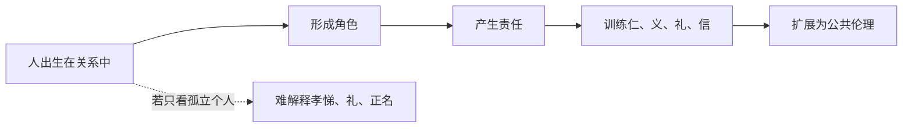

## 儒家思维筑基课: 关系公理: 人不是孤立个体

### 作者
digoal

### 日期
2026-05-18

### 标签
关系公理 , 儒家思想 , 人伦关系 , 孝悌 , 角色责任 , 仁 , 礼 , 正名 , 家庭伦理 , 公共伦理

----

## 背景

> 面向对象: 高中生到大学低年级读者
> 核心问题: 为什么儒家总从父子、兄弟、朋友、君臣这些关系讲起？
> 先说结论: 关系公理认为，人一出生就处在关系网中。人的责任、身份、情感和判断，很多不是抽象地从“我”出发，而是在“我和别人怎样相处”中形成。

## 一张图先看懂

## 求真讲法

### 它到底说了什么

关系公理说: 人不是先作为一个完全独立的点存在，然后才和别人签合同。人最早就是孩子、学生、朋友、邻居、成员。儒家认为，伦理不是凭空出现的，而是在这些关系中被训练出来。

“孝悌也者，其为仁之本与”就是这个思路: 不是说只爱家人就够了，而是说近处关系是学习责任和体恤的第一课堂。

### 它是怎么来的

春秋战国时期旧秩序瓦解，人与人之间的信任变得不稳。儒家要回答的问题是: 如果社会不是由陌生零件组成，而是由父子、师生、朋友、上下级等关系组成，怎样让这些关系不变成互相利用？

于是儒家把伦理起点放在关系里。它不是否认个人，而是认为个人的成熟要在关系中被看见。

### 它依赖哪些假设

| 假设 | 含义 | 不成立时的后果 |
|---|---|---|
| 人有长期关系 | 人不只是一次性交易者 | 孝、信、义会被短期利益冲掉 |
| 关系带来责任 | 身份不是只有权利，也有义务 | “父父、子子”会变成空话 |
| 近处能训练远处 | 家庭和朋友关系能培养公共伦理 | 仁很难从口号落到行动 |
| 关系可被规范 | 礼能让关系有边界 | 亲情、人情可能变成压迫 |

### 常见误解

关系公理不是“血缘至上”。儒家讲亲亲，但也讲义、礼、正名。父母不像父母，君主不像君主，朋友不守信，都不能只靠身份要求别人服从。

它也不是否定陌生人的权利。更准确地说，儒家先从近处训练伦理能力，再尝试向远处扩展。

## 求存讲法

### 它有什么用

关系公理帮助我们理解: 很多冲突不是因为规则太少，而是因为角色责任不清。比如同学合作、家庭沟通、公司协作，都不是单纯“我想怎样”就能解决。

### 它怎么迁移到熟悉领域

班级小组作业中，你不是孤立完成任务的人，而是组员。这个身份意味着你要沟通进度、尊重分工、承担结果。公司里也一样，职位不是头衔，而是一组对他人有影响的责任。

### 它的适用范围和边界

| 场景 | 合理使用 | 失效方式 |
|---|---|---|
| 家庭 | 承认亲情和责任 | 用亲情取消边界 |
| 学校 | 尊师重道也要求教师尽责 | 只要求学生服从 |
| 公司 | 职责与权限匹配 | 用“团队”掩盖剥削 |
| 公共生活 | 从熟人伦理扩展到陌生人伦理 | 只照顾自己圈子 |

### 正例: 怎么用它提升能力

你和同学做项目时，先问三个问题: 我的角色是什么？我的行为会影响谁？别人对我的合理期待是什么？这样做能把“我要表现”变成“我要让关系可信”。

### 反例: 前提不成立会怎样

一个人说“大家都是朋友”，所以借钱不还、迟到不解释、占用别人时间。这里的问题是关系被承认了，责任却被取消了。关系公理失去“责任”这个前提，就会变成人情绑架。

## 思考

现代社会强调个人权利，这是必要的。但如果只讲个人选择，不讲关系责任，人会很难解释为什么要守约、感恩、照顾弱者、尊重共同体。

真正成熟的理解是: 个人有边界，关系有责任。儒家的强项在后者，现代法治要补足前者。

## 最后记住

1. 儒家从关系理解人，不是从孤立个体理解人。
2. 关系不是特权，而是责任结构。
3. 孝悌是伦理训练场，不是无条件服从。
4. 关系若没有边界，会变成人情压迫。

## 参考资料

- 《论语》: “孝弟也者，其为仁之本与”“君君，臣臣，父父，子子”。
- 《孟子》: 人伦、亲亲、仁义相关论述。
- 《礼记》: 礼对角色关系的规范。

  
#### [PostgreSQL 解决方案集合](../201706/20170601_02.md "40cff096e9ed7122c512b35d8561d9c8")
  
  
#### [德哥 / digoal's Github - 公益是一辈子的事.](https://github.com/digoal/blog/blob/master/README.md "22709685feb7cab07d30f30387f0a9ae")
  
  
#### [About 德哥](https://github.com/digoal/blog/blob/master/me/readme.md "a37735981e7704886ffd590565582dd0")
  
  

  
