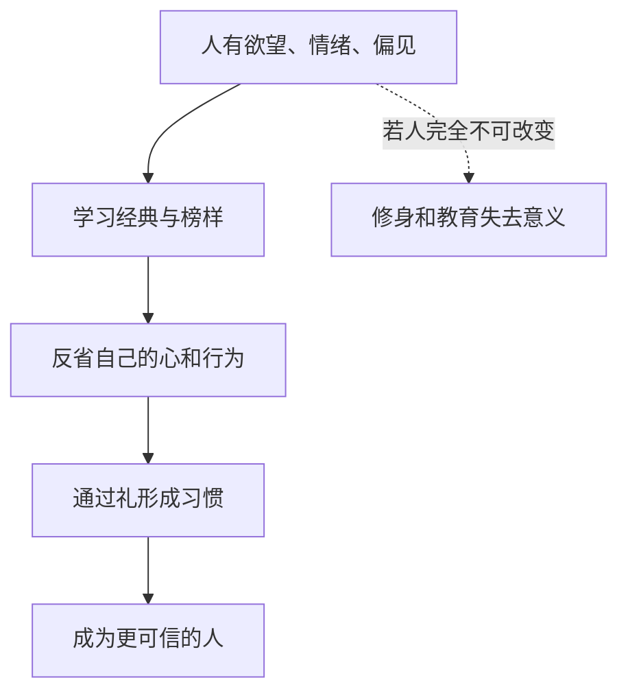

## 儒家思维筑基课: 可教化公理: 人能够通过学习和修养改变

### 作者
digoal

### 日期
2026-05-18

### 标签
可教化公理 , 儒家思想 , 学习 , 修身 , 习惯 , 礼乐教化 , 人性 , 反省 , 教育 , 君子

----

## 背景

> 面向对象: 高中生到大学低年级读者
> 核心问题: 如果人性固定不变，儒家为什么还要反复讲学习、修身和礼乐教化？
> 先说结论: 可教化公理认为，人不是完美的，但也不是不可改变的。学习、反省、习惯、礼乐和榜样可以塑造人的判断与行为。

## 一张图先看懂

## 求真讲法

### 它到底说了什么

可教化公理说: 人会受习惯和环境影响，也能通过学习与修养改造自己。孔子说“学而时习之”，又说“性相近也，习相远也”，重点都在“习”: 反复练习会拉开人的差距。

这里的“教化”不是灌输口号，而是让人形成稳定的判断力和行动习惯。

### 它是怎么来的

儒家面对的是一个失序时代。如果人完全不能改变，只能靠刑罚压住，那教育、礼乐、君子榜样都没意义。儒家选择相信人有可塑性，才会把修身放在核心位置。

孟子强调人有善端，荀子强调人需要礼法化性起伪。两者对人性判断不同，但都承认人需要并且能够被塑造。

### 它依赖哪些假设

| 假设 | 含义 | 不成立时的后果 |
|---|---|---|
| 人会受环境影响 | 风气、榜样、制度会改变人 | 教育效果被低估 |
| 人能反省 | 人能回看自己的欲望和错误 | 修身变成空话 |
| 习惯能稳定行为 | 反复练习能形成品格 | 礼只剩临时表演 |
| 学习需要时间 | 君子不是一夜长成 | 急功近利会破坏教化 |

### 常见误解

可教化不是说“人人都会自动变好”。儒家从不否认欲望、懒惰、私心和环境压力。它说的是: 在合适教育、制度和榜样下，人有变好的可能。

它也不是只靠说教。没有实践、奖惩、礼仪和共同体，口头道德很难稳定。

## 求存讲法

### 它有什么用

这个公理让教育和自我管理有了意义。你今天的脾气、拖延、判断偏差，不一定是永远的命运。它们可以通过环境设计和反复练习被调整。

### 它怎么迁移到熟悉领域

学习数学、写作或编程，本质上也靠“习”。不是听懂一次就会，而是反复做题、写作、调试，把外在规则变成内在能力。

### 它的适用范围和边界

| 条件 | 有效表现 | 边界 |
|---|---|---|
| 有明确榜样 | 知道向什么方向修 | 榜样虚伪会反向伤害 |
| 有反复练习 | 行为逐渐稳定 | 只听道理不会改变 |
| 有反馈 | 能发现偏差 | 没有反馈会自我感动 |
| 有制度支持 | 好习惯不被惩罚 | 坏激励会吞掉修身 |

### 正例: 怎么用它提升能力

如果你容易在讨论中抢话，可以设一个小礼: 每次先复述对方观点，再表达不同意见。这个动作开始是外在规则，久了会改变你的倾听能力。

### 反例: 前提不成立会怎样

一个班级要求学生诚实，却只奖励漂亮结果，不奖励真实过程。学生发现说真话吃亏，作假得利。这里不是学生不可教化，而是环境把坏习惯教化出来了。

## 思考

可教化公理提醒我们: 人既不是天生完美，也不是彻底无救。真正的问题是，我们每天的环境、朋友、制度和练习，正在把自己教化成什么样的人？

## 最后记住

1. 儒家相信人能被学习、反省和习惯塑造。
2. 教化不是说教，而是长期练习和环境塑造。
3. 人性论不同，不等于否定修身。
4. 坏制度也会教化人，只是把人教坏。

## 参考资料

- 《论语》: “学而时习之”“性相近也，习相远也”。
- 《孟子》: 四端说与扩充善端。
- 《荀子》: 化性起伪、礼法教化相关论述。

  
#### [PostgreSQL 解决方案集合](../201706/20170601_02.md "40cff096e9ed7122c512b35d8561d9c8")
  
  
#### [德哥 / digoal's Github - 公益是一辈子的事.](https://github.com/digoal/blog/blob/master/README.md "22709685feb7cab07d30f30387f0a9ae")
  
  
#### [About 德哥](https://github.com/digoal/blog/blob/master/me/readme.md "a37735981e7704886ffd590565582dd0")
  
  

  
