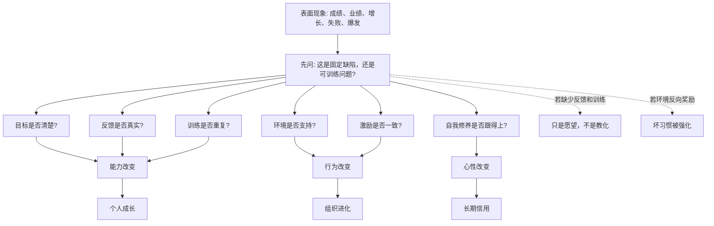
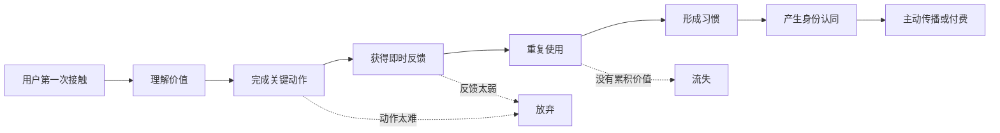

## 儒家思维筑基课: 可教化公理: 人能够通过学习和修养改变

### 作者
digoal

### 日期
2026-05-18

### 标签
儒家思维 , 可教化公理 , 学习能力 , 修养 , 反馈机制 , 刻意练习 , 组织学习 , 产品引导 , 创业成长 , 投资判断

----

## 背景

> 面向对象: 大学生、产品经理、运营经理、创业者、有投资需求的人
> 核心问题: 世界表面变化太快，为什么有些人、组织、产品和公司能不断进化，有些却越努力越僵化？
> 先说结论: 可教化公理说的是: 人并非被天赋、出身、习惯和短期表现彻底锁死。只要有明确目标、有效反馈、可重复训练、合适环境和内在约束，人的能力、判断、行为习惯和价值排序都能发生改变。但它不是“人人无限可塑”，更不是“喊口号就会变好”。

## 一张图先看懂



## 求真讲法

### 它到底说了什么

“可教化公理”可以表述为:

> 人的表现不是固定天命，而是会被学习、训练、反馈、环境、制度和自我修养持续塑造。

这里的“教化”有两层意思:

- 教: 外部输入，包括知识、训练、榜样、制度、反馈、标准。
- 化: 内部改变，包括认知更新、习惯重建、情绪调节、价值排序和行为稳定化。

只“教”没有“化”，知识进了耳朵，没有进入行动。只“化”没有“教”，靠感觉摸索，容易低效和走偏。

所以可教化不是简单相信“努力就会成功”，而是更精确地说:

```text
可持续改变 = 正确目标 x 有效反馈 x 刻意训练 x 环境支持 x 自我约束
```

其中任意一项长期缺失，改变就会很难发生。

### 它是怎么来的

人类之所以能跨代积累文明，是因为人能够学习语言、规则、工具、技术、道德、审美和协作方式。一个婴儿不会写代码、做产品、管理团队、读财报，也不会自然懂得延迟满足和换位思考。这些能力大多来自长期学习和社会训练。

从不同领域看，可教化都是底层前提:

| 领域 | 可教化公理的表达 | 如果不成立会怎样 |
|---|---|---|
| 教育 | 学生能通过学习、练习和反馈提高 | 教育只剩筛选，不再培养 |
| 儒家 | 人能通过学、礼、反省、修身成为君子 | 修身和教化失去意义 |
| 心理学 | 行为和认知会被强化、反馈和环境塑造 | 习惯改变、认知训练都无基础 |
| 管理学 | 员工和组织能力可以被训练、标准化和复盘 | 公司只能赌天才，不能建组织 |
| 产品 | 用户行为可以通过引导、反馈和场景设计形成 | 留存、习惯和转化无法设计 |
| 投资 | 企业管理层和组织能力会影响长期价值 | 只能看资产和行情，无法判断进化能力 |

可教化公理解释了一个重要现象: 初始条件相近的人、团队、公司，几年后差异会非常大。差异不只来自天赋，也来自反馈密度、训练质量、环境标准和自我修正能力。

### 它依赖哪些假设

可教化公理依赖几个前提:

1. 人的大脑和行为模式具有可塑性。
2. 人能从反馈中更新判断，而不是永远重复旧模式。
3. 环境会强化某些行为，也会惩罚某些行为。
4. 训练需要重复、延迟回报和可观察标准。
5. 价值观和自我约束会影响学习能否长期持续。

这些前提让我们区分两种问题。

```text
不可教化判断: 他就是不行，这个组织没救，这个产品没人要。
可教化判断: 哪个变量没有被训练、反馈、激励或环境正确塑造?
```

当然，后一种判断不是盲目乐观。它要求你找出可改变的变量，而不是对一切失败都说“再努力一下”。

### 一个可复用的五问模型

判断一个人、团队、产品或公司是否真的可改变，可以问五个问题:

| 问题 | 看什么 | 反面信号 |
|---|---|---|
| 目标是否清楚 | 知道要改成什么样 | 只有口号，没有标准 |
| 反馈是否真实 | 能看到错误和结果 | 只听好话，数据造假 |
| 训练是否重复 | 有节奏地练关键动作 | 三分钟热度，随机努力 |
| 环境是否支持 | 周围标准、工具、关系能帮助改变 | 环境持续奖励旧行为 |
| 激励是否一致 | 做对事会被奖励，做错事会付成本 | 劣币被奖励，长期主义吃亏 |

这五问能帮你判断一个表面变化到底是真进化，还是短期包装。

### 常见误解

| 误解 | 更准确的理解 |
|---|---|
| 可教化就是人人都一样 | 人有差异，但差异不等于完全不可改变 |
| 只要努力就一定成功 | 努力需要方向、反馈、方法和环境，否则可能强化错误 |
| 培训就是教化 | 培训只是输入，行为和心智改变才是教化 |
| 人会变，所以不用筛选 | 可塑性有边界，关键岗位仍要看基础能力和价值观 |
| 组织文化靠宣讲 | 文化靠制度、奖惩、榜样和重复行为沉淀 |

## 求存讲法

### 它有什么用

可教化公理的最大用途，是让你不要被“当前表现”骗住。

一个人现在成绩差，不等于永远学不会；但如果他拒绝反馈、没有训练、环境混乱，也不能幻想自然变好。

一个产品现在留存差，不等于没有机会；但如果用户没有获得反馈、没有形成习惯、没有清晰价值，也不能靠改颜色和发补贴解决。

一家公司现在增长慢，不等于没价值；但如果组织不能复盘、管理层不承认错误、激励长期扭曲，增长慢可能只是更深问题的表面。

可教化公理让我们从“结果崇拜”转向“进化能力判断”。

### 它怎么迁移到生活

大学生最容易被两个极端误导:

- 我天生不适合，所以不用学。
- 我只要努力，就一定能逆袭。

可教化公理给出的中间答案是:

```text
选择一个清晰能力 -> 找到高质量样本 -> 拆成可练动作
-> 获取真实反馈 -> 重复修正 -> 形成稳定习惯
```

比如学写作，不是每天感动自己地写一千字就够了。你要知道好文章长什么样，拆结构、练标题、练论证、练例子、接受批评、复盘传播效果。这样才是可教化的路径。

### 它怎么迁移到产品

产品经理面对用户时，要记住: 用户不是一开始就懂你的产品，用户行为可以被设计和训练。

| 产品动作 | 教化含义 |
|---|---|
| 新手引导 | 帮用户知道第一步怎么做 |
| 即时反馈 | 让用户知道做对了什么 |
| 默认选项 | 降低正确行为的成本 |
| 模板和案例 | 给用户可模仿的样本 |
| 成长体系 | 让用户看到能力和收益积累 |
| 社群和榜样 | 用他人行为塑造标准 |

但边界也很清楚: 产品不能长期教育一个没有真实需求的人。真正好的产品教化，是把用户已经想完成的事情变得更容易、更清楚、更有反馈，而不是强迫用户接受你的幻想。

### 它怎么迁移到运营

运营不是一次性刺激，而是持续塑造行为。



运营的核心问题不是“今天发什么活动”，而是:

- 用户有没有被带到正确的关键动作？
- 用户完成动作后有没有反馈？
- 用户下一次回来是否更容易？
- 用户长期使用是否有积累？
- 用户是否从“被动参加”变成“主动认同”？

这就是运营中的教化: 把一次行为变成稳定行为，把稳定行为变成身份和关系。

### 它怎么迁移到创业

创业公司最大的挑战之一，是组织能不能学会。

有些团队每次失败都说“市场不好”“用户不懂”“员工不行”。这类团队看似忙，实际上不可教化，因为它拒绝反馈。

真正可教化的创业团队有几个特征:

| 特征 | 表现 |
|---|---|
| 快速试错 | 小步实验，不用大赌证明自己 |
| 诚实复盘 | 能说清楚假设错在哪里 |
| 标准升级 | 今天的方法不会永远神圣 |
| 角色成长 | 人能随着业务变化学习新能力 |
| 激励校准 | 奖励长期有价值的行为 |

创业不是证明创始人永远正确，而是让组织比竞争对手更快接近真实。

### 它怎么迁移到投融资

投资者看公司，不能只看某一年利润，也要看“公司是否可教化”。

这里的可教化不是道德夸奖，而是商业能力:

- 管理层是否承认错误并调整策略？
- 公司是否能从客户反馈中改进产品？
- 组织是否能复制优秀门店、优秀销售、优秀流程？
- 激励制度是否奖励长期价值，而不是短期财务粉饰？
- 资本配置是否从历史经验中变聪明？

一个企业若能持续学习，短期挫折可能是学费。一个企业若不能学习，短期高增长也可能是运气耗尽前的表演。

投资上可以用这张表做初筛:

| 观察点 | 可教化公司 | 不可教化公司 |
|---|---|---|
| 对错误的态度 | 复盘假设，调整动作 | 找借口，换叙事 |
| 对客户的态度 | 用反馈改产品 | 用营销掩盖问题 |
| 对人才的态度 | 培养和授权 | 只消耗，不成长 |
| 对流程的态度 | 沉淀方法，复制成功 | 全靠个人英雄 |
| 对资本的态度 | 纪律性配置 | 追风口、乱扩张 |

这不是具体投资建议，而是提醒: 企业长期价值不仅来自当下资产，也来自组织学习能力。

### 它的适用范围和边界

| 场景 | 可教化公理有效的条件 | 边界 |
|---|---|---|
| 学习 | 有目标、反馈、练习和时间 | 不能无视基础差异和机会成本 |
| 产品 | 用户有真实需求，行为可被引导 | 不能教育用户接受无价值产品 |
| 运营 | 行为能被反馈和激励强化 | 补贴可能训练出错误用户 |
| 管理 | 组织愿意面对真实问题 | 权力结构扭曲会压制学习 |
| 投资 | 公司能把经验转化为流程和资本纪律 | 外部周期、监管和技术替代仍可能压倒努力 |

可教化公理最怕被滥用成“精神鸡汤”。它不承诺人人都能变成任何样子，也不承诺所有问题都能靠学习解决。

更准确的边界是:

```text
可教化 = 在一定时间、资源、基础、环境和激励条件下，某些能力与行为可以被改变
```

### 正例: 怎么用它提升能力

假设你是运营经理，负责提高一款知识产品的复购率。

点状思维会说:

```text
复购低 -> 用户不够努力 -> 多发优惠券
```

可教化思维会这样拆:

```text
复购低 -> 用户没有形成学习行为
-> 检查目标、反馈、训练、环境、激励
```

你可能会发现:

- 目标不清: 用户不知道学完能解决什么问题。
- 反馈太弱: 用户完成课程后没有看到能力变化。
- 训练不足: 只有听课，没有练习和作业。
- 环境缺失: 没有同伴、老师和打卡氛围。
- 激励错位: 用户为了领资料而来，不是为了解决问题。

于是你不只是降价，而是重新设计学习路径: 明确成果、增加练习、建立反馈、设置小组、展示作品。这样复购的基础才是用户真的变强，而不是被促销短期拉动。

### 反例: 前提不成立会怎样

某公司每年都做“领导力培训”，请名师、办大会、发证书。但培训后管理问题没有变化:

- 目标不清: 不知道要改变哪种管理行为。
- 反馈不真: 下属不敢评价上级。
- 训练不重复: 听完课没有场景练习。
- 环境不支持: 公司仍奖励强压和甩锅。
- 激励不一致: 会包装的人升职，会培养团队的人吃亏。

这不是培训预算不够，而是可教化公理的条件不成立。没有真实反馈和激励校准，教育活动只会变成表演。

## 思考

可教化公理会改变你对未来的判断。

如果你相信人完全不可改变，你会过早放弃自己、放弃团队、放弃产品，也会把所有短期结果都当成命运。

如果你相信人无限可改变，你会低估天赋、基础、制度、环境和时间成本，也容易被励志故事骗。

更成熟的判断是:

> 先判断什么可以改变，再判断改变需要什么条件，最后判断成本是否值得。

这对生活、创业和投资都很关键。

选择一个人合作，不只看他现在强不强，还要看他是否能听反馈、能复盘、能调整。

选择一个团队加入，不只看它现在热不热，还要看它是否奖励学习、承认错误、沉淀方法。

选择一个公司投资，不只看它现在赚不赚钱，还要看它是否能把客户反馈、组织经验和资本教训转化成更强的系统。

未来不是奖给“现在最会表演”的人，而是更常奖给“最能持续校准自己”的系统。

## 最后记住

1. 可教化公理不是鸡汤，而是说能力、行为和判断会被目标、反馈、训练、环境和激励塑造。
2. 真正的学习不是听懂，而是行为改变；真正的教化不是输入，而是稳定输出。
3. 产品、运营和管理的核心之一，是设计能让人持续变好的反馈系统。
4. 创业和投资要看组织学习能力: 谁能更快承认错误、修正假设、沉淀方法。
5. 可教化有边界，不能忽视天赋、资源、环境、制度、时间和机会成本。

## 参考资料

- 《论语》: “学而时习之”“性相近也，习相远也”等关于学习、习惯和教化的经典表达。
- 《大学》: 格物、致知、诚意、正心、修身的修养链条。
- 《孟子》: 人性、恻隐之心与道德扩充的思想资源。
- Albert Bandura, *Social Learning Theory*, 1977: 人会通过观察、模仿和反馈学习行为。
- Carol S. Dweck, *Mindset*, 2006: 成长型思维与固定型思维的教育心理学框架。
- Anders Ericsson and Robert Pool, *Peak*, 2016: 刻意练习与专家能力形成。
- Chris Argyris and Donald Schon, *Organizational Learning*, 1978: 组织如何通过反馈和反思学习。
- 本文为跨学科教学性重构，目的是提供生活、产品、运营、创业和投资中的底层分析框架，不构成具体投资建议。
  
#### [PostgreSQL 解决方案集合](../201706/20170601_02.md "40cff096e9ed7122c512b35d8561d9c8")
  
  
#### [德哥 / digoal's Github - 公益是一辈子的事.](https://github.com/digoal/blog/blob/master/README.md "22709685feb7cab07d30f30387f0a9ae")
  
  
#### [About 德哥](https://github.com/digoal/blog/blob/master/me/readme.md "a37735981e7704886ffd590565582dd0")
  
  

  
