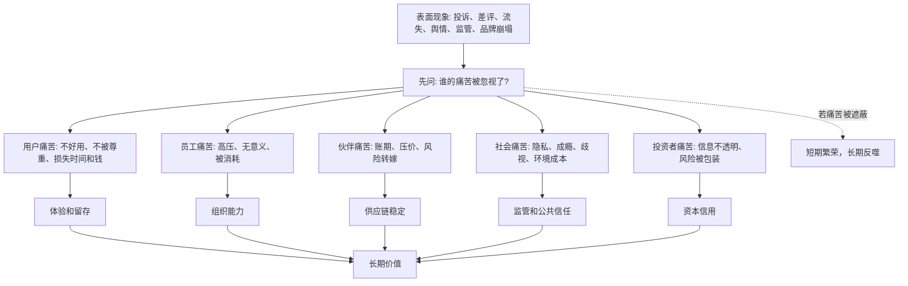
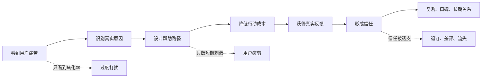

## 儒家思维筑基课: 仁心公理: 人有体会他人痛苦的可能

### 作者
digoal

### 日期
2026-05-18

### 标签
儒家思维 , 仁心公理 , 恻隐之心 , 共情 , 用户痛点 , 信任 , 运营伦理 , 创业价值 , 投资风险 , 长期主义

----

## 背景

> 面向对象: 大学生、产品经理、运营经理、创业者、有投资需求的人
> 核心问题: 表面世界变化很快，为什么有些产品、组织和企业短期很强，却长期失去信任？为什么真正能穿越周期的系统，往往都能认真对待人的痛苦？
> 先说结论: 仁心公理说的是: 人并非只能感知自己的利益，也有体会他人痛苦、理解他人处境、因此调整行动的可能。这个可能性是信任、道德、服务、品牌、组织文化和长期商业价值的底层来源。但它不是“人人天然善良”，而是需要距离被拉近、信息被看见、责任被绑定、制度被设计，才能稳定发挥作用。

## 一张图先看懂



## 求真讲法

### 它到底说了什么

“仁心公理”可以表述为:

> 人具有体会他人痛苦的可能，并可能因此产生克制、帮助、修正和承担责任的行动。

这里的关键词是“可能”，不是“必然”。

人确实会自利，会逃避责任，会在利益面前变得冷漠。但人也会因为看到他人的痛苦而停手、让步、帮助、补偿、改进制度。一个孩子看到别人摔倒会紧张，一个医生看到病人痛苦会调整治疗，一个产品经理看到用户被流程折磨会重做体验，一个创业者看到行业痛点会产生使命感。

所以仁心公理不是天真地说“人都很好”，而是说:

```text
他人痛苦被看见 -> 处境被理解 -> 责任被感知 -> 行动可能改变
```

这个链条一旦成立，人就不只是利益计算器，而有可能成为信任、合作和长期秩序的创造者。

### 它是怎么来的

在儒家传统中，孟子用“恻隐之心”说明人有对他人痛苦产生不忍的可能。这个说法不是严格证明，而是一种人性观察: 当人直接面对无辜者受伤害时，常会出现本能的不忍。

现代社会中，类似思想可以从多个领域看到:

| 领域 | 仁心公理的表达 | 解决的问题 |
|---|---|---|
| 儒家伦理 | 恻隐之心是仁的开端 | 人为什么不只按利益行动 |
| 心理学 | 共情、视角采择、亲社会行为 | 人为什么会帮助陌生人 |
| 产品设计 | 以用户痛点和体验为中心 | 产品为什么不能只堆功能 |
| 管理学 | 关心员工感受和组织公平 | 为什么高压组织会耗尽信任 |
| 创业 | 从真实痛点出发创造价值 | 为什么伪需求难以长期成立 |
| 投资 | 企业对利益相关者的处理影响长期现金流 | 为什么短期利润可能隐藏长期风险 |

这些领域共同说明: 能否看见并处理他人痛苦，会影响一个系统能否长期获得信任。

### 它依赖哪些假设

仁心公理依赖几个前提:

1. 人能感知他人的痛苦信号，比如表情、语言、行为、数据和后果。
2. 人能进行视角转换，不只站在自己位置看问题。
3. 人的行动会受到道德感、羞耻感、责任感和声誉影响。
4. 组织和制度可以放大或压制人的同理心。
5. 长期合作需要信任，而信任依赖对彼此痛苦和成本的尊重。

如果这些前提被破坏，仁心会变弱。比如距离太远、数据太抽象、责任被切割、奖惩只看短期利润，人就很容易看不见他人的痛苦。

### 仁心不是情绪泛滥

仁心不是“谁哭谁有理”，也不是“只要别人痛苦，我就必须无条件满足”。它至少包含三层判断:

```text
感知痛苦: 我看见你正在承受什么
理解处境: 我知道痛苦从哪里来
合义行动: 我判断自己应承担什么、能改变什么、边界在哪里
```

如果只有第一层，容易被情绪勒索和舆论绑架。如果能走到第三层，仁心才会变成稳定的责任能力。

### 一个可复用的四问模型

面对一个产品、政策、组织决策或投资机会，可以问四个问题:

| 问题 | 判断点 | 反面信号 |
|---|---|---|
| 谁在痛苦 | 痛苦是否真实、具体、可观察 | 只讲宏大愿景，不知道谁难受 |
| 痛苦从何而来 | 是效率问题、信任问题、成本问题还是权力问题 | 把症状当原因 |
| 谁有能力改变 | 责任主体是否清楚 | 让最弱的一方承担全部成本 |
| 改变后谁受益 | 价值是否能被公平分配 | 用解决痛苦包装收割 |

这个模型能帮你区分“真正解决问题”和“利用痛苦做营销”。

### 常见误解

| 误解 | 更准确的理解 |
|---|---|
| 仁心就是善良 | 善良是倾向，仁心还要求理解、判断和行动 |
| 有同情心就够了 | 没有能力和制度，同情心很难稳定产生结果 |
| 商业只看利润，不需要仁心 | 长期利润依赖信任，而信任常来自对用户、员工和伙伴痛苦的尊重 |
| 用户痛点就是仁心 | 痛点可能被解决，也可能被操纵和放大 |
| 讲仁心会降低效率 | 忽视痛苦带来的投诉、流失、监管和组织崩溃，往往成本更高 |

## 求存讲法

### 它有什么用

仁心公理的最大用途，是帮你识别长期信任的来源。

世界上很多短期增长都来自刺激、包装、补贴、流量和信息差。但长期留下来的产品、品牌和组织，通常要回答一个更深的问题:

> 它是否真实减少了某些人的痛苦，或者让某些重要成本变得更可承受？

如果一个产品让用户更焦虑、更上瘾、更被剥削，即使短期数据好，也可能在长期遭遇流失、舆情、监管和品牌反噬。

如果一家企业把利润建立在员工耗竭、供应商垫资、用户误导和社会成本外部化之上，它的财务报表可能暂时好看，但底层信任正在流失。

### 它怎么迁移到生活

在人际关系中，仁心公理能帮你从“我有没有道理”升级到“对方正在承受什么”。

比如同学迟交小组作业，你当然可以批评。但更成熟的判断是:

- 他是偷懒，还是遇到真实困难？
- 他的拖延给谁造成了成本？
- 我能否先确认原因，再明确边界？
- 这次合作如何防止下次再发生？

仁心不是取消原则，而是让原则有人的尺度。没有原则的同情会变成纵容；没有仁心的原则会变成冷酷。

### 它怎么迁移到产品

产品经理经常说“用户痛点”，但真正的仁心视角会问得更细:

| 产品层面 | 仁心追问 |
|---|---|
| 入口 | 用户是否一开始就被复杂流程劝退 |
| 使用 | 用户在哪里焦虑、困惑、等待、犯错 |
| 付费 | 用户是否清楚知道自己为什么付费 |
| 失败 | 用户做错时，产品是在帮助修正，还是惩罚羞辱 |
| 退出 | 用户是否能体面取消、迁移数据、停止服务 |

一个真正尊重用户痛苦的产品，不只优化高光时刻，也认真处理失败、取消、投诉、退款、隐私和弱势用户场景。

### 它怎么迁移到运营

运营如果没有仁心，很容易把人当指标，把互动当转化，把信任当资源消耗。



好的运营不是把用户推向你想要的动作，而是帮助用户更顺利地完成他真正想完成的事。转化率可以是结果，但不能成为唯一伦理。

### 它怎么迁移到创业

创业常常从痛点开始，但不是所有“痛点”都值得创业。

仁心公理要求创业者判断:

- 痛苦是否真实: 不是想象出来的伪需求。
- 痛苦是否高频或高强度: 用户是否愿意改变行为。
- 痛苦是否可被产品化解决: 不是纯靠人情和运气。
- 解决痛苦是否有可持续收益: 商业模式不能只靠补贴。
- 解决方案是否制造更大的新痛苦: 比如隐私泄露、成瘾、歧视、过度负债。

创业的长期价值，来自把真实痛苦转化为可持续解决方案，而不是把别人的脆弱变成收割机会。

### 它怎么迁移到投融资

投资者看企业，不能只问“赚不赚钱”，还要问“它的钱从哪里来，代价由谁承担”。

| 投资观察点 | 仁心公理下的追问 |
|---|---|
| 用户增长 | 用户是真的受益，还是被诱导、误导、上瘾 |
| 利润率 | 高利润来自效率，还是来自压榨弱势交易方 |
| 护城河 | 护城河是信任和能力，还是信息不透明和切换困难 |
| 管理层 | 是否尊重客户、员工、供应商和小股东的痛苦 |
| 风险 | 哪些被忽视的痛苦会变成舆情、诉讼、监管或流失 |

许多重大商业风险，在财务报表里出现之前，先以“被忽视的痛苦”出现。用户投诉、员工离职、供应商关系恶化、监管关注、社区反感，都可能是未来现金流受损的前置信号。

这不是具体投资建议，而是一种风险识别框架: 如果一家公司的利润依赖持续制造别人无法承受的痛苦，它的长期价值要打折。

### 它的适用范围和边界

| 场景 | 仁心公理有效的条件 | 边界 |
|---|---|---|
| 生活关系 | 双方能表达痛苦，也尊重边界 | 仁心不能变成无限牺牲 |
| 产品设计 | 用户痛苦真实且可被产品解决 | 不能把所有不满意都当需求 |
| 运营增长 | 帮助用户完成真实目标 | 不能用共情包装操纵 |
| 创业 | 痛点强、解法可持续、商业闭环成立 | 痛苦真实不等于市场足够大 |
| 投资 | 被忽视的痛苦会影响信任、监管和现金流 | 不能只凭道德好感替代财务分析 |

仁心公理最重要的边界是: 感受他人痛苦不等于替他人承担全部后果。

更准确的表达是:

```text
成熟仁心 = 看见痛苦 + 理解原因 + 判断责任 + 设计可持续行动
```

### 正例: 怎么用它提升能力

假设你是一个产品经理，负责一款在线医疗问诊产品。

点状思维会这样看:

```text
提高转化率 -> 增加按钮曝光 -> 缩短问诊路径 -> 多卖服务包
```

仁心思维会先问:

```text
患者真正的痛苦是什么?
焦虑、等待、看不懂报告、担心误诊、怕花冤枉钱、隐私不安全。
```

于是产品设计会发生变化:

- 在入口处说明适合问诊和不适合问诊的情况。
- 用清楚语言解释医生资质、响应时间和费用。
- 对紧急症状给出线下就医提醒。
- 让用户能上传资料并知道医生需要什么信息。
- 保护隐私，减少不必要的信息索取。
- 问诊后提供可理解的总结和下一步建议。

这不只是“善良”，也是商业理性。因为医疗场景的长期价值来自信任，信任来自认真处理患者的痛苦和不确定性。

### 反例: 前提不成立会怎样

某金融产品面向年轻人宣传“提前享受生活”，流程极其顺滑，审批很快，广告充满自由和精致生活。但它刻意弱化真实年化成本、逾期后果和用户收入不稳定的风险。

这里表面上是产品体验好，底层却破坏了仁心公理:

- 没有真实感知用户未来的还款痛苦。
- 没有帮助用户理解风险，只强化即时欲望。
- 把信息不对称包装成便利。
- 把用户脆弱处境变成利润来源。

短期看，转化率可能很高；长期看，逾期、投诉、监管和品牌损害都会累积。前提不成立时，所谓“用户增长”可能只是痛苦转移。

## 思考

仁心公理对现代人的挑战是: 我们比过去更容易看到数据，却更容易看不见人。

在报表里，用户是 DAU、ARPU、留存率；在运营后台里，用户是标签和分层；在投资模型里，用户是收入和利润；在组织管理里，员工是人效和成本。抽象工具提高了效率，也可能把痛苦遮蔽掉。

但被遮蔽的痛苦不会消失，它会换一种形式回来:

- 用户痛苦会变成流失、差评和投诉。
- 员工痛苦会变成低效、离职和组织冷漠。
- 供应商痛苦会变成交付不稳和合作破裂。
- 社会痛苦会变成监管、抵制和公共信任下降。
- 投资者痛苦会变成估值折价和融资困难。

所以判断一个趋势是否真实，不能只看它“增长快不快”，还要看它是否减少了某些真实痛苦，还是把痛苦转嫁给了看不见的人。

一个更适合未来的提问是:

> 如果所有被影响的人都能清楚说话，这个产品、组织或商业模式还能被认为是好的吗？

这个问题很难，但它能穿透很多表面繁荣。

## 最后记住

1. 仁心公理不是说人必然善良，而是说人有体会他人痛苦并调整行动的可能。
2. 痛苦被看见、被理解、被绑定责任，才可能转化为信任和长期价值。
3. 产品、运营、创业和投资都要问: 谁的痛苦被解决了，谁的痛苦被转嫁了。
4. 仁心不是情绪泛滥，成熟仁心包含感知、理解、责任判断和可持续行动。
5. 被忽视的痛苦常常先表现为小信号，后来才变成流失、舆情、监管和估值风险。

## 参考资料

- 《孟子》: “恻隐之心，仁之端也”等关于仁心、同情和道德扩充的经典表达。
- 《论语》: 仁、忠恕、己所不欲勿施于人等关于推己及人的思想资源。
- Martin Hoffman, *Empathy and Moral Development*, 2000: 共情与道德发展关系的心理学研究。
- Daniel Batson, *The Altruism Question*, 1991: 共情与利他行为的理论讨论。
- Paul Bloom, *Against Empathy*, 2016: 对情绪化共情局限的批判，提醒共情需要理性和制度补充。
- Amartya Sen, *The Idea of Justice*, 2009: 从能力、痛苦和公共理性角度理解社会正义。
- 本文为跨学科教学性重构，目的是提供生活、产品、运营、创业和投资中的底层分析框架，不构成具体投资建议。
  
#### [PostgreSQL 解决方案集合](../201706/20170601_02.md "40cff096e9ed7122c512b35d8561d9c8")
  
  
#### [德哥 / digoal's Github - 公益是一辈子的事.](https://github.com/digoal/blog/blob/master/README.md "22709685feb7cab07d30f30387f0a9ae")
  
  
#### [About 德哥](https://github.com/digoal/blog/blob/master/me/readme.md "a37735981e7704886ffd590565582dd0")
  
  

  
