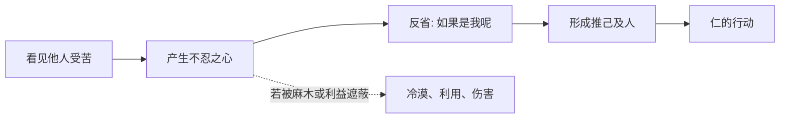

## 儒家思维筑基课: 仁心公理: 人有体会他人痛苦的可能

### 作者
digoal

### 日期
2026-05-18

### 标签
仁心公理 , 儒家思想 , 仁 , 恻隐之心 , 推己及人 , 孟子 , 同理心 , 忠恕 , 道德修养 , 善端

----

## 背景

> 面向对象: 高中生到大学低年级读者
> 核心问题: 儒家为什么相信“仁”不是外面硬塞给人的规矩？
> 先说结论: 仁心公理认为，人心中有同情、怜悯和不忍他人受苦的可能。儒家的修养，就是把这种可能扩充成稳定的行为能力。

## 一张图先看懂

## 求真讲法

### 它到底说了什么

仁心公理说，人有可能从别人的痛苦中感到不忍。孟子用“恻隐之心”说明这种开端: 人看见危险中的孩子，通常会本能地惊惧、怜悯，而不只是计算利益。

这不是说人永远善良，而是说人有善的开端。儒家要做的是把这个开端扩充、训练、稳定下来。

### 它是怎么来的

如果人完全没有同情能力，仁只能靠外在强制。儒家之所以能讲“推己及人”，是因为它假设人能从自己的感受出发，理解他人的处境。

孔子的“己所不欲，勿施于人”和“己欲立而立人，己欲达而达人”，都依赖这种可换位的心。

### 它依赖哪些假设

| 假设 | 含义 | 不成立时的后果 |
|---|---|---|
| 人能感受他人处境 | 不是只感受自己利益 | 忠恕无法成立 |
| 恻隐可被扩充 | 善端能变成品格 | 仁只停留在一时感动 |
| 同情需要判断 | 仁不等于无原则心软 | 善意可能伤害更多人 |
| 仁需要礼承载 | 内心要变成合适行为 | 好心可能没有分寸 |

### 常见误解

仁不是“对所有要求都答应”。仁必须和义、礼一起工作。对不合理要求说不，有时也是仁，因为它保护了边界和更大的公平。

仁也不是情绪泛滥。儒家重视情感，但更重视把情感修成稳定的德行。

## 求存讲法

### 它有什么用

仁心公理让社会不只靠冷冰冰的规则运行。规则能告诉你“最低限度不能伤害人”，仁能提醒你“别人也是有感受和处境的人”。

### 它怎么迁移到熟悉领域

同学考试失利时，仁不是随口说“别难过”，而是理解他真正需要什么: 安静、帮助复盘，或只是有人不嘲笑他。

在技术和产品设计中，仁心可以转化为用户意识: 不把用户当数据点，而是理解他们的困难。

### 它的适用范围和边界

| 场景 | 仁的表现 | 边界 |
|---|---|---|
| 朋友 | 能体谅处境 | 不替对方承担所有责任 |
| 家庭 | 关心而不控制 | 不能用爱取消自由 |
| 管理 | 看到人的压力 | 不能破坏公平规则 |
| 公共生活 | 关心弱者 | 不能只靠情绪判案 |

### 正例: 怎么用它提升能力

当你批评别人时，先问: 我的目的是让对方变好，还是发泄我的不满？如果是前者，你会选择更清楚、更有分寸、更能被接受的表达。

### 反例: 前提不成立会怎样

一个人看到同学被排挤，却说“跟我无关”。如果长期这样训练自己，他的同情能力会变钝。仁心公理不是被反驳了，而是善端没有被扩充，反而被麻木压住了。

## 思考

仁心最难的地方在于扩展: 爱身边人容易，理解陌生人难；理解与自己相似的人容易，理解立场不同的人难。儒家的挑战是把一时不忍变成稳定的公共能力。

## 最后记住

1. 仁心公理说人有同情他人的可能，不是说人天然完美。
2. 恻隐只是开端，扩充之后才成为仁。
3. 仁必须和义、礼配合，不能变成无原则心软。
4. 冷漠也是习惯，会削弱仁心。

## 参考资料

- 《孟子》: “恻隐之心，仁之端也”。
- 《论语》: “己所不欲，勿施于人”“己欲立而立人，己欲达而达人”。
- 《中庸》: 情感与中和相关思想。

  
#### [PostgreSQL 解决方案集合](../201706/20170601_02.md "40cff096e9ed7122c512b35d8561d9c8")
  
  
#### [德哥 / digoal's Github - 公益是一辈子的事.](https://github.com/digoal/blog/blob/master/README.md "22709685feb7cab07d30f30387f0a9ae")
  
  
#### [About 德哥](https://github.com/digoal/blog/blob/master/me/readme.md "a37735981e7704886ffd590565582dd0")
  
  

  
