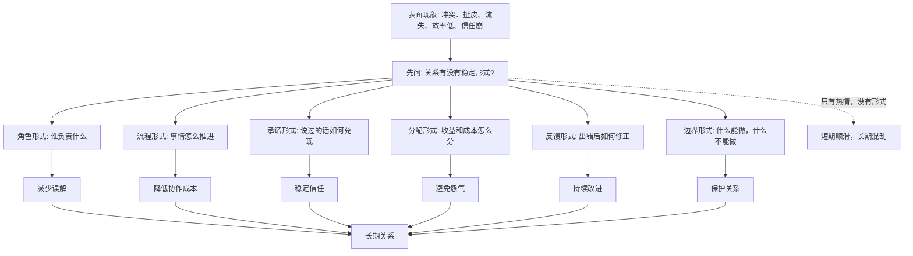
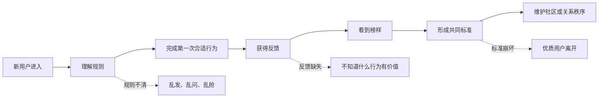

## 儒家思维筑基课: 礼序公理: 好关系需要稳定形式

### 作者
digoal

### 日期
2026-05-18

### 标签
儒家思维 , 礼序公理 , 稳定形式 , 边界 , 流程 , 规则 , 协作秩序 , 产品体验 , 创业治理 , 投资风控

----

## 背景

> 面向对象: 大学生、产品经理、运营经理、创业者、有投资需求的人
> 核心问题: 世界表面变化太快，为什么很多关系一开始靠热情、信任和愿景能运转，后来却因为边界、流程、承诺和分配不清而崩掉？
> 先说结论: 礼序公理说的是: 好关系不能只靠临时善意，必须有稳定形式来承载。所谓“礼”，不是空洞仪式，而是把尊重、边界、责任、权利、承诺、分配和反馈变成可重复执行的形式。没有稳定形式，善意会耗尽，信任会变形，协作会失控。

## 一张图先看懂



## 求真讲法

### 它到底说了什么

“礼序公理”可以表述为:

> 凡是需要长期协作的关系，都必须把内在善意和相互期待，转化为稳定、可见、可重复的外在形式。

这里的“礼”可以理解为关系的操作系统。

在家庭里，礼可能是称呼、问候、节日、分工、边界。  
在学校里，礼可能是课堂规则、作业截止时间、答辩流程、引用规范。  
在公司里，礼可能是岗位职责、会议机制、审批流程、绩效规则、股权协议。  
在产品里，礼可能是新手引导、权限说明、隐私弹窗、退款流程、客服话术。  
在投资里，礼可能是信息披露、公司治理、董事会程序、审计制度、分红政策。

没有这些形式，关系只能靠临场理解和个人觉悟。短期可以，长期一定变贵。

更简洁地说:

```text
稳定关系 = 善意 x 边界 x 规则 x 仪式 x 纠错机制
```

只有善意，没有形式，关系会被误解和消耗。只有形式，没有善意，关系会变成冷冰冰的控制。

### 它是怎么来的

儒家讲“礼”，不是为了让人机械地做动作，而是为了把内心的敬、让、信、义，变成外部世界能看见、能学习、能传承的秩序。

如果一个人心里尊重别人，却从不守时、不回应、不兑现承诺，别人感受到的不是尊重，而是不可靠。

如果一个组织口头上说重视员工，却没有清楚岗位、合理流程、稳定反馈和公平奖惩，员工感受到的不是重视，而是消耗。

现代社会中，“礼序”也以不同名字出现:

| 领域 | 礼序的现代说法 | 它解决的问题 |
|---|---|---|
| 法律 | 合同、程序、权利义务 | 防止承诺随意变形 |
| 管理 | 流程、职责、制度、会议节奏 | 降低协作摩擦 |
| 产品 | 交互规范、权限提示、服务流程 | 降低用户不确定性 |
| 运营 | 规则、节奏、活动机制、社群秩序 | 让参与者知道如何行动 |
| 投资 | 治理结构、审计、披露、资本纪律 | 降低代理风险 |
| 生活 | 礼貌、边界、仪式、约定 | 保护长期关系 |

这说明礼序不是古代概念，而是所有长期关系都需要的底层结构。

### 它依赖哪些假设

礼序公理依赖几个前提:

1. 人的善意不稳定，会受情绪、利益、记忆和环境影响。
2. 人对同一件事的期待不同，必须通过形式对齐。
3. 长期协作需要降低解释成本，不能每次都重新谈判。
4. 关系中的权力和资源不完全对等，需要边界保护弱势方。
5. 任何系统都会出错，所以稳定形式必须包含纠错机制。

这些前提使我们从“感情好就行”“大家自觉就行”转向更成熟的问题:

```text
我们怎样把好的期待变成稳定做法?
我们怎样让新人也能理解规则?
我们怎样在关系变紧张时仍能按形式处理?
```

### 礼序不是僵化

礼序的目标不是把人困死，而是让关系减少混乱。

成熟的礼序有三个特征:

```text
清楚: 大家知道规则是什么
合义: 规则保护真实价值，而不是维护虚假面子
可修正: 规则遇到新情况可以被更新
```

如果只有清楚但不合义，就是机械控制。  
如果合义但不清楚，就是好心混乱。  
如果清楚、合义但不可修正，时间一长也会变成僵化制度。

### 一个可复用的六问模型

判断一段关系、一个产品、一个组织或一家公司是否有礼序，可以问六个问题:

| 问题 | 看什么 | 反面信号 |
|---|---|---|
| 角色是否清楚 | 谁负责、谁决策、谁承担后果 | 人人参与，没人负责 |
| 边界是否明确 | 什么可以做，什么不能做 | 用关系突破原则 |
| 流程是否稳定 | 事情按什么步骤推进 | 每次都靠临时协调 |
| 承诺是否可追踪 | 口头承诺能否变成记录和行动 | 说过就算，无法复盘 |
| 分配是否可解释 | 收益、成本、功劳、风险怎么分 | 强者拿走收益，弱者承担成本 |
| 纠错是否存在 | 出问题后如何反馈、补偿和修正 | 只追责弱者，不修系统 |

这六问能穿透很多表面和谐。真正健康的关系，不是没有冲突，而是有处理冲突的稳定形式。

### 常见误解

| 误解 | 更准确的理解 |
|---|---|
| 礼就是繁文缛节 | 礼的核心是让尊重、边界和责任可见 |
| 关系好就不用规则 | 正因为关系重要，才需要规则保护它 |
| 流程会降低效率 | 好流程降低重复沟通成本，坏流程才制造低效 |
| 仪式都是形式主义 | 空仪式是形式主义，有意义的仪式能沉淀身份和承诺 |
| 制度越多越好 | 礼序追求合适形式，不是规则堆积 |

## 求存讲法

### 它有什么用

礼序公理的最大用途，是帮你判断一个系统能不能长期运行。

短期看，很多事情靠热情和能人就能做起来。长期看，如果没有稳定形式，问题会慢慢出现:

- 合伙人一开始讲兄弟情，后来因为股权、职责、退出机制撕裂。
- 社群一开始热闹，后来因为规则不清，广告、争吵和低质量内容泛滥。
- 产品一开始增长快，后来因为退款、隐私、客服和权限不清引发投诉。
- 公司一开始靠创始人拍板，后来规模变大，所有决策堵在一个人身上。
- 投资者一开始只看增长，后来发现公司治理混乱，利润和现金流说不清。

礼序能把短期信任变成长期秩序。

### 它怎么迁移到生活

在人际关系中，礼序不是疏远，而是保护。

比如室友关系里，如果只说“大家自觉”，很快会遇到问题: 谁打扫卫生、谁交水电费、晚上能不能外放声音、公共物品谁补、朋友能不能留宿。

一开始谈规则可能尴尬，但不谈规则，后面会更尴尬。

成熟关系通常不是“什么都不用说”，而是很多关键期待已经被稳定形式承载:

```text
提前告知 -> 准时出现 -> 尊重边界 -> 出错道歉 -> 成本共担 -> 规则可谈
```

这些形式让关系不用每天靠猜。

### 它怎么迁移到产品

产品经理常常重视功能，却低估礼序。

用户使用产品时，真正让他安心的不是功能数量，而是他知道:

- 我现在在哪里？
- 下一步会发生什么？
- 我授权了什么？
- 我付费买了什么？
- 我能不能取消？
- 出错后谁负责？
- 我的数据会怎样被处理？

| 产品场景 | 礼序形式 | 如果缺失 |
|---|---|---|
| 注册 | 清楚说明权限和用途 | 用户觉得被偷拿信息 |
| 付费 | 明确价格、周期、退款 | 用户觉得被套路 |
| 协作 | 权限、版本、评论规则 | 团队互相覆盖和误解 |
| 社区 | 发言规范、处罚机制 | 劣质内容驱逐优质用户 |
| 客服 | 响应时限、升级机制 | 小问题变成信任危机 |

好产品不只是帮用户完成动作，也让用户知道关系边界在哪里。

### 它怎么迁移到运营

运营中的礼序，就是让参与者知道“怎样参与才是被欢迎的”。



一个社群如果没有礼序，最后往往不是自由，而是噪音最大的人占领空间。好的运营要用规则、节奏、仪式、榜样和惩罚机制保护真正有价值的互动。

### 它怎么迁移到创业

创业早期最容易犯的错，是把“还小”当成“不需要形式”的理由。

早期公司当然不能制度过重，但几个关键形式不能缺:

| 创业关系 | 必要礼序 |
|---|---|
| 合伙人 | 股权、职责、决策、退出机制 |
| 员工 | 岗位、目标、反馈、奖惩 |
| 客户 | 交付标准、服务边界、付款条件 |
| 供应商 | 账期、验收、违约处理 |
| 投资人 | 信息披露、重大事项沟通、治理安排 |

很多创业失败不是因为市场不存在，而是因为内部关系没有形式化。等到钱、权、功劳、责任、风险真正出现时，原来的口头默契不够用了。

### 它怎么迁移到投融资

投资者看企业，礼序公理对应的是公司治理和制度质量。

表面上，投资者看收入、利润、增长率。底层上，投资者要看这家公司有没有稳定形式承载长期关系:

| 投资观察点 | 礼序追问 |
|---|---|
| 管理层 | 权力是否有约束，决策是否可追踪 |
| 财务 | 收入确认、费用、现金流是否清楚 |
| 董事会 | 是否能监督管理层，而不是橡皮图章 |
| 股东关系 | 是否尊重中小股东和信息披露 |
| 客户合同 | 收入是否依赖口头承诺或灰色安排 |
| 供应链 | 账期、质量、交付是否有稳定规则 |

一家企业如果礼序薄弱，短期业绩越好，风险可能越大。因为增长会放大混乱: 小公司靠人情能扛住的问题，大公司会变成治理风险、财务风险和声誉风险。

这不是具体投资建议，而是提醒: 财务数字是结果，礼序质量决定数字能否被信任和延续。

### 它的适用范围和边界

| 场景 | 礼序公理有效的条件 | 边界 |
|---|---|---|
| 生活关系 | 双方愿意承认边界和约定 | 不能用规则替代真诚 |
| 产品设计 | 用户需要确定性和可理解流程 | 不能让流程压倒核心体验 |
| 运营社群 | 参与者多，行为需要被协调 | 规则过重会抑制活力 |
| 创业管理 | 协作复杂度上升 | 早期不能过度官僚化 |
| 投资分析 | 企业价值依赖长期可信关系 | 礼序好不等于商业模式一定好 |

礼序公理最重要的边界是: 稳定形式必须服务真实价值。

更准确地说:

```text
成熟礼序 = 尊重人的形式 + 降低成本的规则 + 可以纠错的秩序
```

如果形式只服务面子、权力和控制，它就不是好礼序，而是僵化甚至压迫。

### 正例: 怎么用它提升能力

假设你是运营经理，负责一个付费学习社群。

点状思维会说:

```text
多拉人 -> 多发资料 -> 多办活动 -> 看群活跃
```

礼序思维会先设计稳定形式:

```text
入群规则 -> 学习节奏 -> 发言规范 -> 作业模板
-> 反馈机制 -> 优秀样本展示 -> 违规处理 -> 结业仪式
```

这样做的价值是:

- 新人知道怎么参与，不会只潜水。
- 老用户知道什么行为有价值。
- 高质量内容被看见，低质量噪音被限制。
- 老师和助教不用每天重复解释。
- 用户完成学习后有身份确认和成果沉淀。

这不是形式主义。它把“我们希望大家好好学习”变成了可执行、可感知、可复盘的秩序。

### 反例: 前提不成立会怎样

某创业团队三位合伙人一开始关系很好，口头约定“大家一起干，赚了再说”。项目起量后，问题出现:

- 没有角色形式: 三个人都能拍板，方向频繁变化。
- 没有股权形式: 贡献不同，却没有清楚分配。
- 没有决策形式: 争议靠情绪和资历解决。
- 没有退出形式: 有人想离开，但不知道股份和责任怎么处理。
- 没有财务形式: 花钱和报销说不清。

最后关系破裂。失败不是因为他们一开始没有信任，而是信任没有被稳定形式保护。礼序公理的前提不成立时，越是亲密关系，越容易因为边界不清而受伤。

## 思考

现代人常常讨厌“形式”，因为很多人见过太多空洞会议、无意义流程和表演式仪式。但这不等于形式本身没价值。

真正的问题不是“要不要形式”，而是:

> 这个形式到底是在保护价值，还是在消耗价值？

没有形式，强者可以随意解释规则，弱者只能承担不确定性。形式过度，系统会变慢，真实问题会被流程掩盖。成熟的礼序，是在混乱和僵化之间找到能保护长期关系的结构。

这对判断未来很重要。

一个产品如果没有清晰的服务边界，增长越快，投诉越多。  
一个组织如果没有清晰的权责形式，规模越大，内耗越重。  
一个公司如果没有清晰的治理结构，利润越复杂，投资者越难信任。  
一个社会如果没有稳定程序，善意和正义都容易被临时情绪替代。

所以，面对任何表面繁荣，都可以问:

> 支撑它的稳定形式是什么？如果关键人物离开、热情下降、冲突出现，它还能不能运转？

能回答这个问题的系统，才更可能穿越变化。

## 最后记住

1. 礼序公理不是崇拜繁文缛节，而是说好关系需要稳定形式来承载。
2. 善意如果没有边界、规则、流程和纠错机制，长期会被误解和消耗。
3. 产品、运营、创业和投资中，礼序体现为权限、流程、合同、治理、披露和服务边界。
4. 好礼序降低协作成本，坏礼序制造形式主义；区别在于它是否服务真实价值。
5. 判断一个系统能否长期运行，要看关键关系是否已经被稳定形式保护。

## 参考资料

- 《论语》: “克己复礼为仁”“人而不仁，如礼何”等关于仁与礼关系的经典表达。
- 《礼记》: 关于礼乐、角色秩序、社会教化和行为形式的思想资源。
- 《大学》: 修身、齐家、治国的秩序展开路径。
- Douglass C. North, *Institutions, Institutional Change and Economic Performance*, 1990: 制度如何降低不确定性并塑造经济行为。
- Ronald Coase, “The Nature of the Firm”, 1937: 企业和组织形式如何降低交易成本。
- Oliver E. Williamson, *The Economic Institutions of Capitalism*, 1985: 契约、治理结构和交易成本分析。
- James C. Scott, *Seeing Like a State*, 1998: 对过度形式化和行政理性局限的提醒。
- 本文为跨学科教学性重构，目的是提供生活、产品、运营、创业和投资中的底层分析框架，不构成具体投资建议。
  
#### [PostgreSQL 解决方案集合](../201706/20170601_02.md "40cff096e9ed7122c512b35d8561d9c8")
  
  
#### [德哥 / digoal's Github - 公益是一辈子的事.](https://github.com/digoal/blog/blob/master/README.md "22709685feb7cab07d30f30387f0a9ae")
  
  
#### [About 德哥](https://github.com/digoal/blog/blob/master/me/readme.md "a37735981e7704886ffd590565582dd0")
  
  

  
