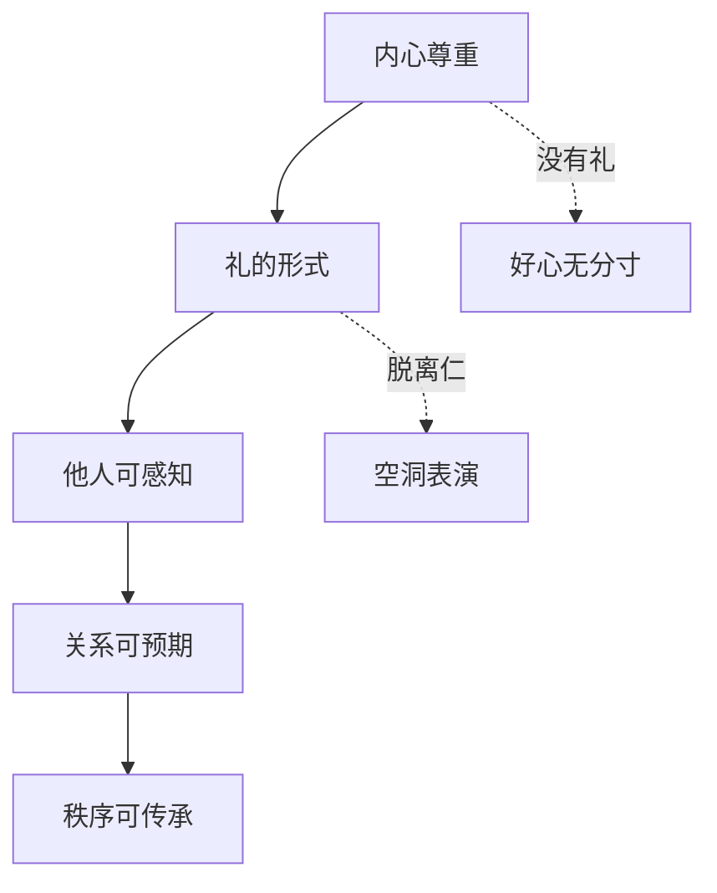

## 儒家思维筑基课: 礼序公理: 好关系需要稳定形式

### 作者
digoal

### 日期
2026-05-18

### 标签
礼序公理 , 儒家思想 , 礼 , 秩序 , 分寸 , 尊重 , 角色规范 , 礼记 , 克己复礼 , 社会教化

----

## 背景

> 面向对象: 高中生到大学低年级读者
> 核心问题: 儒家为什么这么重视礼？礼难道不是繁文缛节吗？
> 先说结论: 礼序公理认为，善意如果没有稳定形式，很难被别人理解和传承。礼把尊重、边界、角色和秩序变成可见行为。

## 一张图先看懂

## 求真讲法

### 它到底说了什么

礼序公理说，人与人相处不能只靠“我心里是好的”。因为别人看不见你的心，只能看见你的行为。礼就是把内心的尊重和外在的分寸连接起来。

孔子讲“克己复礼为仁”，不是说机械守礼就是仁，而是说要克制私欲，让行为回到合乎仁的秩序。

### 它是怎么来的

春秋时期“礼崩乐坏”，旧有仪式和等级秩序失效。儒家不是单纯怀旧，而是看到一个问题: 如果没有共同承认的行为形式，尊重、责任和界限就容易混乱。

比如道歉、祭祀、拜师、婚礼、丧礼、会议规则，都不只是动作，而是让重要关系被认真对待。

### 它依赖哪些假设

| 假设 | 含义 | 不成立时的后果 |
|---|---|---|
| 行为能表达内心 | 外在形式能承载尊重 | 礼变成无意义动作 |
| 关系需要边界 | 亲近也不能无分寸 | 好关系会互相消耗 |
| 秩序需要重复 | 反复实践才能稳定 | 规则无法传承 |
| 礼要服务仁 | 形式必须有伦理内容 | 礼会变成压迫工具 |

### 常见误解

礼不是越复杂越好。真正的礼要让关系更清楚、更尊重、更有分寸。如果一个礼节只制造恐惧、羞辱和权力感，它就背离了仁。

礼也不是只属于古代。排队、守时、引用注明来源、会议发言顺序，都是现代礼。

## 求存讲法

### 它有什么用

礼降低沟通成本。大家知道什么时候该说、怎么说、谁负责、怎样表达感谢和歉意，关系就更可预期。

### 它怎么迁移到熟悉领域

在课堂讨论中，举手、倾听、轮流发言就是礼。它不是为了压制表达，而是为了让每个人都有被听见的机会。

在开源协作中，提交说明、代码评审、署名和许可证也是礼。它们让合作不靠猜测。

### 它的适用范围和边界

| 场景 | 礼的价值 | 礼的边界 |
|---|---|---|
| 家庭 | 表达敬重和感谢 | 不能遮蔽真实问题 |
| 学校 | 让学习秩序稳定 | 不能变成单向服从 |
| 公司 | 明确流程和责任 | 不能替代实际公平 |
| 公共空间 | 让陌生人和平共处 | 不能只要求弱者守礼 |

### 正例: 怎么用它提升能力

你向别人求助时，先说明背景、具体问题、已尝试方法和希望对方帮什么。这个小小的礼，能减少对方负担，也表达尊重。

### 反例: 前提不成立会怎样

一个会议要求所有人“礼貌发言”，但领导可以随意打断别人。这里礼不再服务仁和秩序，而是保护权力不受挑战。礼序公理的“共同约束”前提被破坏了。

## 思考

现代人常讨厌形式主义，但完全没有形式也会出问题。关键问题不是“要不要礼”，而是“这种礼是在保护人的尊严，还是在保护某些人的特权”。

## 最后记住

1. 礼是让尊重和边界可见的行为形式。
2. 礼没有仁会空，仁没有礼会散。
3. 现代生活也需要礼，只是形式不同。
4. 礼必须共同约束强者和弱者，才有正当性。

## 参考资料

- 《论语》: “克己复礼为仁”“人而不仁，如礼何”。
- 《礼记》: 礼乐、丧祭、角色秩序相关论述。
- 《荀子》: 礼论与社会秩序思想。

  
#### [PostgreSQL 解决方案集合](../201706/20170601_02.md "40cff096e9ed7122c512b35d8561d9c8")
  
  
#### [德哥 / digoal's Github - 公益是一辈子的事.](https://github.com/digoal/blog/blob/master/README.md "22709685feb7cab07d30f30387f0a9ae")
  
  
#### [About 德哥](https://github.com/digoal/blog/blob/master/me/readme.md "a37735981e7704886ffd590565582dd0")
  
  

  
