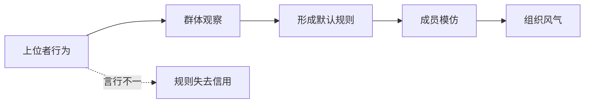

## 儒家思维筑基课: 德治公理: 上位者的德性会影响群体风气

### 作者
digoal

### 日期
2026-05-18

### 标签
德治公理 , 儒家思想 , 德治 , 为政以德 , 权力 , 风气 , 榜样 , 修身 , 治理 , 组织文化

----

## 背景

> 面向对象: 高中生到大学低年级读者
> 核心问题: 儒家为什么总说领导者要先正己？
> 先说结论: 德治公理认为，掌握权力和资源的人会塑造群体默认规则。上位者是否守义、守礼、守信，会影响下面的人相信什么、模仿什么。

## 一张图先看懂

## 求真讲法

### 它到底说了什么

德治公理说，治理不只是发布命令和惩罚违规。领导者怎样对待规则、利益、弱者和批评，会变成群体的信号。

孔子说“为政以德，譬如北辰”，又说“君子之德风，小人之德草”。这些话不是否定法律，而是强调榜样和风气的力量。

### 它是怎么来的

在一个信息不透明、制度不稳定的时代，普通人会通过上位者行为判断什么是真规则。上面讲诚信却暗中徇私，下面就会学到“诚信只是口号”。所以儒家特别重视掌权者修身。

### 它依赖哪些假设

| 假设 | 含义 | 不成立时的后果 |
|---|---|---|
| 人会模仿权力者 | 上位行为有示范效应 | 德治影响被削弱 |
| 风气会影响行为 | 群体默认规则很重要 | 只剩条文管理 |
| 权力需要自我约束 | 掌权者私欲影响更大 | 修身与治理脱节 |
| 德治要配合法度 | 德不能替代制度 | 容易变成人治 |

### 常见误解

德治不是“只靠好人治理”。儒家强调德，是因为没有德的权力会败坏规则。但现代视角必须补充: 德治需要法治和监督，否则容易变成对领导个人品格的赌博。

德也不是亲切形象，而是面对利益时仍守义。

## 求存讲法

### 它有什么用

德治公理能解释为什么一个组织的文化常常不是写在墙上的标语，而是领导者实际奖励什么、容忍什么、惩罚什么。

### 它怎么迁移到熟悉领域

班主任要求学生守时，自己却经常迟到，学生会学到“守时不重要”。团队负责人要求代码质量，自己却跳过评审，团队会学到“质量只是对别人要求”。

### 它的适用范围和边界

| 场景 | 德治有效点 | 必须补充 |
|---|---|---|
| 班级 | 老师示范会影响学生 | 规则应公开一致 |
| 公司 | 管理者行为塑造文化 | 需要制度监督 |
| 家庭 | 父母言行影响孩子 | 不能用权威压制 |
| 政治 | 公权力需要道德信用 | 必须有法治制衡 |

### 正例: 怎么用它提升能力

你负责小组时，最有效的管理不是先批评别人，而是先公开自己的规则: 准时、透明、认错、按贡献分配。别人会从你的行为判断这组是否可信。

### 反例: 前提不成立会怎样

一家公司口号是“诚信”，但高层为了业绩默许夸大宣传。员工会迅速明白真正规则是“只要结果好，可以不诚实”。德治公理中的榜样效应没有消失，只是朝坏方向发挥了。

## 思考

德治公理最深的问题是: 权力会放大人的品格。一个普通人的私心可能只伤害几个人，一个掌权者的私心会改变整个系统的风气。

## 最后记住

1. 德治强调上位者行为对群体风气的塑造。
2. 德不是形象，而是利益面前的自我约束。
3. 德治不能替代法治和监督。
4. 坏榜样也是榜样，会把系统教坏。

## 参考资料

- 《论语》: “为政以德，譬如北辰”“君子之德风，小人之德草”。
- 《大学》: 修身、齐家、治国之间的关系。
- 《孟子》: 仁政与义利之辨。

  
#### [PostgreSQL 解决方案集合](../201706/20170601_02.md "40cff096e9ed7122c512b35d8561d9c8")
  
  
#### [德哥 / digoal's Github - 公益是一辈子的事.](https://github.com/digoal/blog/blob/master/README.md "22709685feb7cab07d30f30387f0a9ae")
  
  
#### [About 德哥](https://github.com/digoal/blog/blob/master/me/readme.md "a37735981e7704886ffd590565582dd0")
  
  

  
