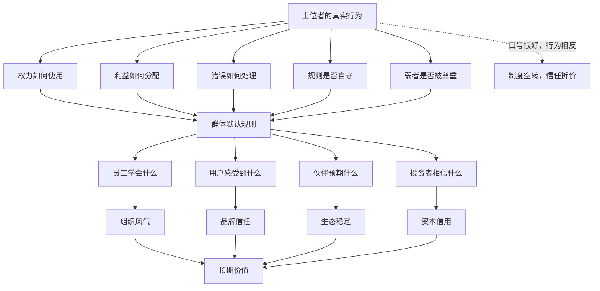
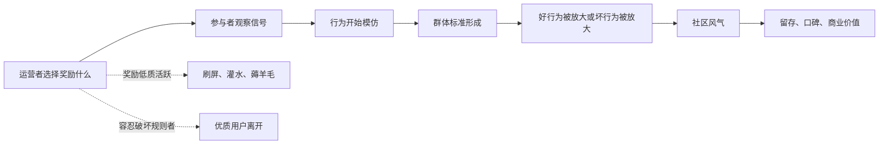

## 儒家思维筑基课: 德治公理: 上位者的德性会影响群体风气

### 作者
digoal

### 日期
2026-05-18

### 标签
儒家思维 , 德治公理 , 上位者 , 组织文化 , 奖惩信号 , 管理层质量 , 产品治理 , 创业文化 , 公司治理 , 长期价值

----

## 背景

> 面向对象: 大学生、产品经理、运营经理、创业者、有投资需求的人
> 核心问题: 世界表面变化很快，为什么同样的制度、同样的人才、同样的资源，在不同领导者和管理层手里，会长出完全不同的组织风气和长期结果？
> 先说结论: 德治公理说的是: 上位者如何使用权力、如何对待规则、如何分配利益、如何面对错误，会变成群体的隐性教材。制度写在纸上，德性写在行动里；下属、用户、伙伴和市场最终会学习真实行动，而不是学习口号。

## 一张图先看懂



## 求真讲法

### 它到底说了什么

“德治公理”可以表述为:

> 在任何群体中，掌握更多权力、资源和解释权的人，其行为会成为其他人的风向标，并持续塑造群体风气。

这里的“德”不是抽象的好人评价，而是上位者在关键时刻表现出来的稳定品质:

- 是否守规则，尤其是规则不利于自己时。
- 是否诚实面对错误，而不是把责任推给弱者。
- 是否公正分配利益、机会和荣誉。
- 是否尊重用户、员工、伙伴和小股东的长期利益。
- 是否能克制短期诱惑，不牺牲组织信用换短期数字。

“治”也不只是国家治理。在公司、团队、社区、平台、家庭、学校、资本市场里，只要有人拥有更高位置，就存在德治问题。

更简洁地说:

```text
群体风气 = 明文制度 x 上位者示范 x 奖惩信号 x 长期默认规则
```

制度告诉大家“应该怎样”，上位者行为告诉大家“实际上怎样才算数”。

### 它是怎么来的

儒家讲“为政以德”，核心不是说法律和制度没用，而是指出一个现实问题: 上位者的行为会改变制度的实际含义。

如果领导者要求员工守时，自己却长期迟到，组织学到的不是守时，而是“权力可以例外”。  
如果公司说重视客户，却奖励误导销售，员工学到的不是客户第一，而是“成交比诚实重要”。  
如果管理层说长期主义，却用财务包装换短期估值，市场学到的不是愿景，而是“这家公司会牺牲信用换价格”。

现代组织理论、行为经济学和投资分析中，也能看到同一逻辑:

| 领域 | 德治公理的现代说法 | 关键问题 |
|---|---|---|
| 儒家伦理 | 上行下效、为政以德 | 上位者能否以身作则 |
| 管理学 | 领导行为塑造组织文化 | 员工实际模仿什么 |
| 组织行为学 | 心理安全、奖惩信号、榜样效应 | 人们敢不敢说真话 |
| 产品生态 | 平台规则和治理方式塑造参与者行为 | 平台是否纵容劣币 |
| 创业 | 创始人价值观决定早期默认规则 | 公司会复制创始人的优点和缺陷 |
| 投资 | 管理层质量影响资本配置和长期现金流 | 小股东是否能信任管理层 |

这说明德治不是古代政治口号，而是所有组织和市场都会面对的底层规律。

### 它依赖哪些假设

德治公理依赖几个前提:

1. 群体成员会观察上位者的真实行为，而不只听公开表态。
2. 权力会改变规则执行方式，因此上位者是否自我约束很关键。
3. 奖惩会塑造风气，被奖励的行为会被复制。
4. 大多数人会根据组织默认规则调整自己的行为。
5. 长期信任依赖一致性: 说的、做的、奖励的必须大体一致。

如果这些前提成立，就不能只看制度文本，也不能只看企业文化墙。必须看关键人物在利益冲突、风险暴露、增长压力和权力诱惑面前怎么做。

### 德治不是人治

德治很容易被误解为“靠好人治理”。这不准确。

成熟的德治不是取消制度，而是让有权力的人也被德性和制度双重约束:

```text
德性: 上位者愿意自我约束
制度: 上位者即使不愿意，也不能随意作恶
监督: 下位者和外部人能发现并纠偏
```

如果只有德性，没有制度，系统会押注于“永远遇到好人”。  
如果只有制度，没有德性，制度会被聪明人钻空子、被强者选择性执行。  
德治公理真正强调的是: 上位者的自我约束，是制度有效运行的重要条件之一。

### 一个可复用的五问模型

判断一个团队、公司、平台或投资标的，可以问五个问题:

| 问题 | 看什么 | 反面信号 |
|---|---|---|
| 上位者是否守规则 | 规则是否也约束强者 | 强者例外，弱者背锅 |
| 奖励什么行为 | 升职、资源、荣誉给了谁 | 说重视长期，却奖励短期造假 |
| 如何面对错误 | 复盘事实还是掩盖问题 | 报喜不报忧，压制异议 |
| 如何对待弱者 | 员工、用户、供应商、小股东是否被尊重 | 把成本转嫁给最无议价权的人 |
| 权力是否可监督 | 决策和利益输送是否透明 | 一言堂、黑箱、亲信化 |

这五问能帮助你穿透表面文化和短期业绩，看到群体风气的真实方向。

### 常见误解

| 误解 | 更准确的理解 |
|---|---|
| 德治就是不要制度 | 德治必须和制度、监督、法治配合 |
| 领导人品好就够了 | 人品要落到决策、奖惩、分配和纠错上 |
| 企业文化看口号 | 文化看谁被奖励、谁被容忍、谁被牺牲 |
| 只要业绩好，德性不重要 | 德性缺陷可能暂时不进报表，但会侵蚀长期信用 |
| 上位者的小错无所谓 | 上位者的小例外，会变成下位者的大模仿 |

## 求存讲法

### 它有什么用

德治公理的最大用途，是判断一个群体能否形成长期可信的风气。

表面看，很多团队都说自己“诚信、创新、客户第一、长期主义”。但真实风气不由标语决定，而由上位者的关键行为决定:

- 当增长和诚信冲突时，选择哪个？
- 当亲信犯错时，是否同样处理？
- 当用户吃亏但公司赚钱时，是否修正？
- 当短期利润和长期信用冲突时，是否克制？
- 当下属说真话让领导难堪时，是保护还是打压？

这些选择会变成组织的隐性课程。员工不需要被正式培训，也会学会“在这里到底什么最重要”。

### 它怎么迁移到生活

在生活中，德治公理提醒我们: 有影响力的人不能只看自己有没有占便宜，还要看自己的行为会教会别人什么。

一个社团负责人如果用私人关系分配机会，成员很快会学会讨好而不是做事。  
一个宿舍里最有话语权的人如果不尊重公共规则，其他人也会降低自我约束。  
一个家庭里父母要求孩子诚实，自己却经常撒谎应付，孩子学到的通常不是诚实，而是“双重标准”。

上位者的危险在于: 他以为自己只是做了一次例外，别人看到的是规则真正的边界。

### 它怎么迁移到产品

产品经理也要理解德治公理，因为产品规则会塑造用户行为。

一个平台如果默许标题党、擦边内容、虚假评价和诱导消费，短期指标可能上涨，但优质用户和优质创作者会被驱逐。平台上位者不是某一个人，而是平台规则和算法权力。

| 产品治理问题 | 德治追问 |
|---|---|
| 推荐算法 | 奖励真实价值，还是奖励刺激和成瘾 |
| 内容审核 | 是否保护高质量参与者 |
| 商家规则 | 是否纵容虚假宣传和劣质服务 |
| 用户权益 | 投诉、退款、隐私是否被认真处理 |
| 平台抽成 | 是否让生态伙伴有可持续收益 |

产品的“德性”体现在规则和默认选项里。用户最后相信的不是宣传语，而是平台如何处理冲突。

### 它怎么迁移到运营

运营中的德治，是用奖惩信号塑造群体风气。



如果运营只奖励活跃度，用户会刷存在感。  
如果只奖励拉新，用户会拉低质量人群。  
如果只奖励销售额，销售会牺牲长期信任。  
如果奖励高质量贡献、真实帮助和守规则的增长，风气才会往长期价值上走。

### 它怎么迁移到创业

创业公司早期的风气，通常就是创始人行为的放大版。

创始人勤奋但不授权，公司容易忙而不强。  
创始人聪明但不诚实，公司容易学会包装和甩锅。  
创始人重客户但不重员工，公司可能服务好外部、消耗内部。  
创始人能承认错误，公司更容易形成复盘文化。  
创始人对钱有纪律，公司更容易活过周期。

创业者要警惕一个问题:

```text
你容忍什么，组织就会长出什么。
你奖励什么，组织就会复制什么。
你逃避什么，组织就会沉默什么。
```

早期看似“小事”的德性缺陷，会在规模化后变成制度性问题。

### 它怎么迁移到投融资

投资者看企业，管理层德性不是软指标，而是长期现金流和估值折价的硬变量。

| 投资观察点 | 德治公理下的追问 |
|---|---|
| 资本配置 | 管理层是否克制扩张冲动，尊重资本回报 |
| 信息披露 | 坏消息是否及时、清楚、完整 |
| 关联交易 | 是否存在利益输送和掏空风险 |
| 股东回报 | 是否尊重小股东，还是只服务控制人 |
| 客户关系 | 是否靠误导、成瘾或信息不对称赚钱 |
| 组织文化 | 是否能保留优秀人才和真实反馈 |

如果一家公司管理层长期说一套做一套，财报再漂亮也要打折。因为信任一旦破坏，融资成本、人才吸引、客户关系和监管风险都会恶化。

这不是具体投资建议，而是一种分析框架: 德性不是慈善标签，而是管理层如何处理权力、资本和利益冲突的可观察能力。

### 它的适用范围和边界

| 场景 | 德治公理有效的条件 | 边界 |
|---|---|---|
| 学校和社团 | 负责人行为会被成员模仿 | 不能把所有成员问题都归因于负责人 |
| 产品平台 | 规则和算法能塑造参与者行为 | 还要看外部竞争和监管 |
| 运营社区 | 奖惩信号能改变群体风气 | 规则过强可能压制活力 |
| 创业公司 | 创始人行为会变成默认文化 | 企业还需要制度化，不能永远靠个人 |
| 投资分析 | 管理层质量影响长期价值 | 德性好不能替代商业模式和财务质量 |

德治公理最重要的边界是: 上位者德性很重要，但不能替代制度。

更成熟的表达是:

```text
长期好风气 = 上位者自守 + 制度约束 + 奖惩一致 + 反馈畅通 + 外部监督
```

如果只讲上位者个人道德，而不设计制度监督，那么德治会退化成人治。

### 正例: 怎么用它提升能力

假设你是一个运营经理，负责一个专业内容社区。

点状思维会说:

```text
提高活跃 -> 多发活动 -> 多给奖励 -> 增加内容数量
```

德治思维会先问:

```text
我们奖励的行为，会把社区带向哪里?
```

于是你会设计不同的奖惩信号:

- 奖励经过验证的高质量内容，而不是单纯阅读量。
- 保护认真提问和认真回答的人，而不是纵容嘲讽。
- 对标题党和搬运内容降权，而不是因为它们带来流量就放任。
- 让版主公开说明处罚理由，避免黑箱治理。
- 对贡献者给予身份、曝光和长期权益，而不是一次性刺激。

这样社区成员会学到: 在这里，认真、可信、可复用的内容才是高地位行为。风气不是喊出来的，是奖惩塑造出来的。

### 反例: 前提不成立会怎样

某公司创始人天天讲“客户第一”，但实际管理中:

- 销售夸大承诺，只要签单就被奖励。
- 客服反馈产品问题，却被认为“制造麻烦”。
- 交付团队长期替销售承诺背锅。
- 用户投诉被压下，只要短期收入好看就行。
- 高管犯错无人追责，基层犯错严厉处罚。

短期看，公司收入增长很快；长期看，客户信任下降，员工互相甩锅，产品真实问题无人解决，优秀员工离开。

这里失败不是因为公司没有制度，而是上位者的奖惩信号破坏了制度。德治公理的前提不成立时，群体会学习真实利益导向，而不是学习墙上的价值观。

## 思考

德治公理最适合用来识别“表面正确、底层腐蚀”的系统。

很多组织表面上都很现代: 有制度、有流程、有文化手册、有绩效系统、有战略会。但如果上位者不断例外，制度就会被重新解释。大家会逐渐明白:

- 哪些规则只约束普通人。
- 哪些话可以公开说，哪些真话不能说。
- 哪些错误可以被掩盖，哪些错误会被牺牲。
- 哪些价值观只是包装，哪些利益才是真规则。

所以判断未来时，不要只看一个系统“说自己相信什么”，要看它在压力下“牺牲什么、保护什么、奖励什么、惩罚什么”。

一个更锋利的问题是:

> 如果所有人都模仿上位者的真实行为，这个组织会变得更好，还是更坏？

如果答案是更坏，那么短期繁荣可能只是风气恶化前的延迟反馈。

现代社会需要法治、制度和监督，但它仍然绕不开德治公理。因为任何制度都要由人解释、执行和修正。上位者的德性，决定制度是被认真执行，还是被选择性利用。

## 最后记住

1. 德治公理不是“只靠道德治理”，而是说上位者真实行为会塑造群体风气。
2. 群体最终学习的不是口号，而是谁被奖励、谁被容忍、谁被牺牲。
3. 产品、运营、创业和投资中，德性体现为规则设计、奖惩信号、权力约束和利益分配。
4. 管理层德性不是软指标，它会影响信任、人才、客户、监管、融资成本和长期现金流。
5. 好风气需要上位者自守，也需要制度约束、反馈畅通和外部监督。

## 参考资料

- 《论语》: “为政以德，譬如北辰”“君子之德风，小人之德草”等关于德治和上行下效的经典表达。
- 《大学》: 修身、齐家、治国、平天下的治理展开路径。
- 《孟子》: 仁政、义利之辨与上位者责任的思想资源。
- Edgar H. Schein, *Organizational Culture and Leadership*, 1985: 领导者如何塑造组织文化。
- Amy C. Edmondson, *The Fearless Organization*, 2018: 心理安全与组织学习。
- James C. Collins, *Good to Great*, 2001: 领导力、纪律文化与长期组织表现。
- Warren E. Buffett, shareholder letters: 管理层诚信、资本配置和股东友好对长期价值的重要性。
- 本文为跨学科教学性重构，目的是提供生活、产品、运营、创业和投资中的底层分析框架，不构成具体投资建议。
  
#### [PostgreSQL 解决方案集合](../201706/20170601_02.md "40cff096e9ed7122c512b35d8561d9c8")
  
  
#### [德哥 / digoal's Github - 公益是一辈子的事.](https://github.com/digoal/blog/blob/master/README.md "22709685feb7cab07d30f30387f0a9ae")
  
  
#### [About 德哥](https://github.com/digoal/blog/blob/master/me/readme.md "a37735981e7704886ffd590565582dd0")
  
  

  
