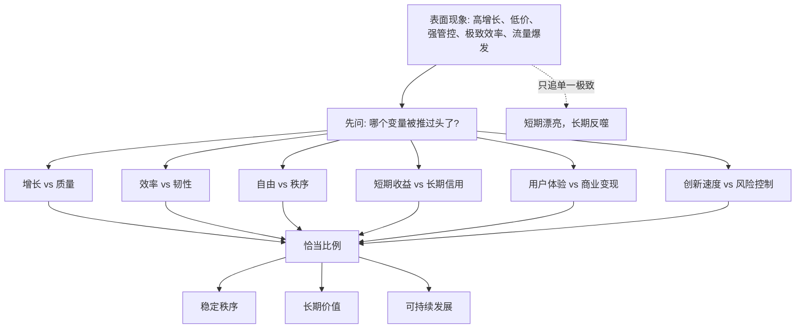
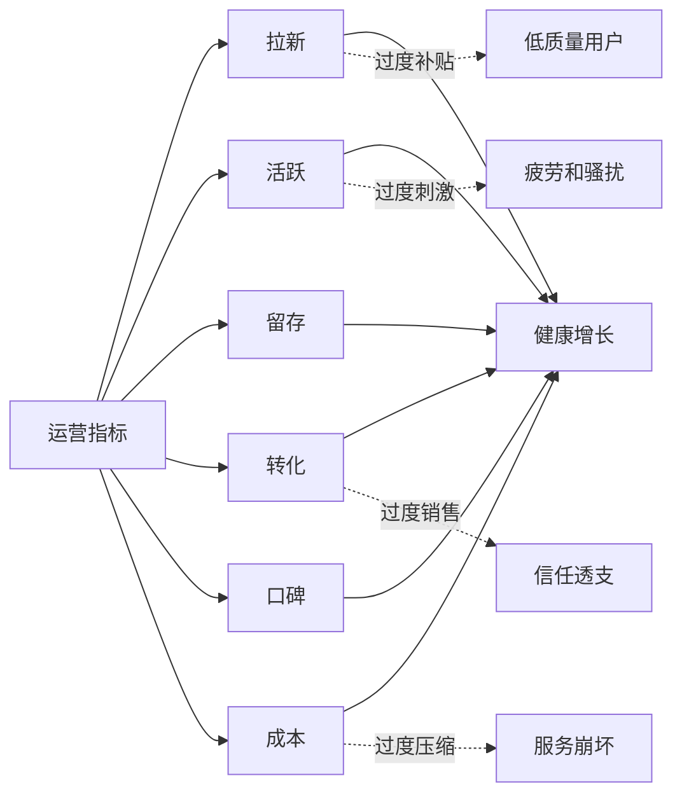

## 儒家思维筑基课: 中和公理: 好秩序来自恰当和平衡

### 作者
digoal

### 日期
2026-05-18

### 标签
儒家思维 , 中和公理 , 中庸 , 平衡 , 系统思维 , 风险收益 , 产品决策 , 运营指标 , 创业节奏 , 投资纪律

----

## 背景

> 面向对象: 大学生、产品经理、运营经理、创业者、有投资需求的人
> 核心问题: 世界表面变化很快，为什么很多系统一开始靠某个单点突破快速增长，后来却因为过度、失衡和反噬而崩坏？
> 先说结论: 中和公理说的是: 好秩序不是把某个指标推到极端，而是在具体情境中让关键变量保持恰当比例。所谓“中”，不是站在中间，也不是各打五十大板，而是不过度、不不足、合时、合位、合义。所谓“和”，不是没有冲突，而是不同力量能被安放在一个可持续结构里。

## 一张图先看懂



## 求真讲法

### 它到底说了什么

“中和公理”可以表述为:

> 任何复杂系统要长期运行，都不能只追求单一目标最大化，而要在多个相互牵制的变量之间找到适合当下情境的恰当比例。

这里的复杂系统包括个人生活、家庭关系、公司组织、产品生态、资本市场、社会治理。

比如:

- 学习只追时长，不看反馈，会变成低效勤奋。
- 产品只追转化，不顾体验，会消耗用户信任。
- 公司只追增长，不管现金流，会在周期下行时失血。
- 组织只追效率，不留冗余，会在突发变化中崩溃。
- 投资只追收益，不看风险，会在一次回撤中失去本金。

所以中和不是保守，而是一种高级判断:

```text
好决策 = 看见多变量张力 + 判断当前阶段 + 找到恰当比例 + 动态校准
```

### 它是怎么来的

在儒家经典里，《中庸》把“中”和“和”看得很重。教学性地理解，可以这样拆:

- 中: 情绪、行为、制度和判断没有过度，也没有不足。
- 和: 不同角色、利益、情感和力量能形成相对稳定的协调。

这不是数学意义上的中点，也不是永远选择温和方案。面对原则问题，中可能是坚决；面对误解，中可能是解释；面对危险，中可能是停止；面对机会，中可能是果断投入。

现代领域里，中和公理也反复出现:

| 领域 | 中和公理的现代说法 | 关键问题 |
|---|---|---|
| 儒家伦理 | 中庸、中和、过犹不及 | 行动是否合时、合位、合义 |
| 系统论 | 系统稳定依赖反馈和平衡 | 哪些变量过度偏离 |
| 管理学 | 效率与韧性需要平衡 | 是否为短期效率牺牲长期能力 |
| 产品 | 体验、增长、变现、信任要协调 | 是否单点优化伤害整体 |
| 运营 | 活跃、质量、成本、留存要匹配 | 是否把热闹误认为健康 |
| 投资 | 收益、风险、流动性、时间要匹配 | 是否为收益忽视承受能力 |

这说明中和不是古代修身词汇，而是复杂系统长期稳定的底层规律。

### 它依赖哪些假设

中和公理依赖几个前提:

1. 现实系统通常有多个目标，且目标之间存在张力。
2. 单一指标最大化会制造外部成本或隐藏风险。
3. 不同阶段需要不同权重，不能用同一尺度处理所有问题。
4. 系统会反馈，过度偏离会引发反作用。
5. 判断“恰当”需要看情境、角色、资源、时间和后果。

这些前提使我们从“越多越好”“越快越好”“越省越好”转向更成熟的问题:

```text
现在最重要的约束是什么?
哪个变量已经过度?
哪个变量被长期忽视?
如果继续推这个指标，系统会在哪里反噬?
```

### 中和不是折中

中和最常见的误解，是把它当成折中。

折中通常是:

```text
A 要 100，B 要 0，于是取 50。
```

中和不是这样。中和要先判断情境:

```text
如果火势正在蔓延，恰当行动可能是 100% 灭火。
如果团队长期过劳，恰当行动可能是立刻降速。
如果产品早期还没价值，恰当行动可能是先不商业化。
如果公司现金流危险，恰当行动可能是果断收缩。
```

所以中和不是平均，而是适配。

### 一个可复用的五问模型

面对生活选择、产品决策、运营策略、创业扩张或投资机会，可以问五个问题:

| 问题 | 看什么 | 反面信号 |
|---|---|---|
| 当前阶段是什么 | 起步、增长、稳定、转型、危机 | 用同一种打法打所有阶段 |
| 核心张力是什么 | 增长和质量、收益和风险、效率和韧性 | 只承认一个目标 |
| 哪个变量过度 | 过快、过慢、过重、过轻、过度依赖 | 数据漂亮但副作用累积 |
| 哪个变量不足 | 信任、现金流、人才、反馈、规则 | 短板长期被忽视 |
| 如何动态校准 | 指标、反馈、阈值、止损、复盘 | 一条路走到黑 |

这五问能帮助你识别“表面强大但底层失衡”的系统。

### 常见误解

| 误解 | 更准确的理解 |
|---|---|
| 中和就是折中 | 中和是情境中的恰当比例，不是平均分配 |
| 中庸就是没立场 | 真正的中庸包含原则、尺度和时机 |
| 平衡就是不增长 | 好平衡是为了让增长可持续 |
| 极致才有竞争力 | 局部极致若破坏整体，最终会反噬 |
| 稳定就是保守 | 稳定也可能需要主动调整和果断取舍 |

## 求存讲法

### 它有什么用

中和公理的最大用途，是帮你识别长期系统风险。

表面世界喜欢单一指标:

- 学生看分数。
- 产品看转化率。
- 运营看活跃。
- 创业看增速。
- 投资看收益率。

这些指标都重要，但都不能单独代表健康。一个系统真正值得关注的，是关键变量之间的比例是否合适。

```text
健康系统不是没有压力，而是压力、资源、反馈和修复能力之间还能匹配。
```

当某个变量被长期推到极端，系统会开始用另一种方式收费。

### 它怎么迁移到生活

生活里的中和，不是躺平，也不是卷到底。

一个大学生如果只追绩点，可能忽视身体、社交、表达、实习和真实能力。短期简历好看，长期适应性不足。  
如果只追自由和体验，又可能缺少纪律和积累。短期轻松，长期选择变少。

更好的做法是定期看自己的“人生资产负债表”:

| 变量 | 过度的风险 | 不足的风险 |
|---|---|---|
| 学习 | 只会考试，缺少实践 | 基础薄弱，机会变少 |
| 社交 | 被关系消耗 | 缺少协作和信息 |
| 健康 | 过度控制，焦虑身体 | 精力不足，长期受损 |
| 金钱 | 过度节省，错过投资自己 | 透支消费，失去自由 |
| 情绪 | 过度敏感 | 麻木、压抑、失去反馈 |

中和不是每项都平均用力，而是知道当前阶段哪一项已经失衡。

### 它怎么迁移到产品

产品经理最需要警惕“单指标优化”。

| 产品目标 | 推过头的后果 | 中和视角 |
|---|---|---|
| 转化率 | 诱导、误导、退款和投诉 | 转化要和信任匹配 |
| 留存 | 成瘾、打扰、疲劳 | 留存要和真实价值匹配 |
| 功能丰富 | 复杂、学习成本高 | 功能要和核心场景匹配 |
| 个性化推荐 | 信息茧房、隐私担忧 | 推荐要和用户控制权匹配 |
| 商业化 | 体验下降、品牌折损 | 变现要和用户价值匹配 |

一个产品能长期存在，不是因为某个指标永远最大，而是因为用户价值、商业收入、体验成本、信任边界之间形成了可持续比例。

### 它怎么迁移到运营

运营中的中和，是不把热闹误认为健康。



如果运营只追拉新，可能吸引大量低质量用户。  
如果只追活跃，可能制造刷屏和噪音。  
如果只追转化，可能牺牲长期口碑。  
如果只控成本，可能让服务质量坍塌。

好的运营要看指标组合，而不是拜一个指标为王。

### 它怎么迁移到创业

创业公司最容易在三个地方失衡:

| 失衡点 | 表面好处 | 长期代价 |
|---|---|---|
| 增长过快 | 估值高、声量大 | 交付跟不上，组织失控 |
| 产品过早复杂 | 看起来完整 | 资源分散，核心价值不清 |
| 融资过度依赖 | 短期安全感 | 纪律变弱，商业闭环推迟 |
| 创始人过度控制 | 决策快 | 团队无法成长 |
| 过度节省 | 现金流好看 | 错过关键窗口 |

中和不是让创业公司慢，而是让它知道“快在哪里、慢在哪里、重在哪里、轻在哪里”。

一个可持续创业系统通常需要:

```text
清晰痛点 + 可交付产品 + 可承受成本 + 可复制销售 + 可成长组织 + 可控现金流
```

少一项，短期也许还能跑；长期就会在缺失处断裂。

### 它怎么迁移到投融资

投资里，中和公理对应的是风险收益匹配。

很多亏损不是因为投资者完全看错趋势，而是因为比例失衡:

- 看对行业，但仓位过重。
- 看对公司，但价格太贵。
- 看对长期，但资金期限太短。
- 看对收益，但低估回撤。
- 看对商业模式，但忽视治理风险。

| 投资变量 | 过度 | 不足 |
|---|---|---|
| 收益预期 | 追逐泡沫 | 不敢承担合理风险 |
| 安全边际 | 错过机会 | 抗风险能力弱 |
| 仓位 | 一次判断决定命运 | 即使看对也赚不到 |
| 分散 | 过度分散，看不清重点 | 过度集中，承受不了错误 |
| 流动性 | 频繁交易 | 现金不足，被迫卖出 |
| 时间 | 盲目长期持有 | 没给价值兑现时间 |

这不是具体投资建议，而是一种判断框架: 投资不是追求最高收益率，而是在你的认知、期限、现金流和承受能力之内，找到合适的风险收益结构。

### 它的适用范围和边界

| 场景 | 中和公理有效的条件 | 边界 |
|---|---|---|
| 生活规划 | 多个目标需要长期协调 | 危机时不能慢慢平衡，先处理关键风险 |
| 产品设计 | 用户价值、体验和商业化互相牵制 | 早期探索可能需要阶段性聚焦单点 |
| 运营增长 | 多指标共同决定健康 | 指标太多会导致没有主线 |
| 创业管理 | 增长、现金流、组织和交付需要匹配 | 机会窗口短时需要果断倾斜 |
| 投资决策 | 收益、风险、期限、流动性需要匹配 | 不能用平衡掩盖缺乏判断 |

中和公理最重要的边界是: 它不是逃避选择。

更准确地说:

```text
成熟中和 = 明确主矛盾 + 识别副作用 + 设置边界 + 动态校准
```

如果一个人总说“要平衡”，却不敢判断主次、不敢承担取舍，那不是中和，而是犹豫。

### 正例: 怎么用它提升能力

假设你是一个产品经理，负责一个内容社区的商业化。

点状思维会说:

```text
收入不够 -> 增加广告位 -> 提高付费墙 -> 强化转化弹窗
```

中和思维会先问:

```text
商业化、用户体验、创作者收益、内容质量、长期信任之间的比例是否合适?
```

你可能会这样设计:

- 广告不插入关键阅读流程，保护核心体验。
- 付费内容要有明确价值，不用标题诱导。
- 创作者分成透明，让供给侧愿意长期贡献。
- 对低质营销内容限流，避免短期收入破坏社区。
- 用用户满意度、续费率和投诉率约束商业化强度。

这不是少赚钱，而是避免把未来收入提前透支。

### 反例: 前提不成立会怎样

某创业公司融资后疯狂追增长，所有部门只看新增用户和GMV:

- 销售为了签单夸大承诺。
- 产品不断堆定制功能，核心体验变差。
- 交付团队长期超负荷，离职率上升。
- 财务忽视回款质量，账面收入好看但现金流紧张。
- 管理层用更高增长目标掩盖组织问题。

短期看，增长曲线漂亮；长期看，客户投诉、员工离职、现金流风险和产品复杂度一起爆发。

这里失败不是因为增长不重要，而是增长和质量、现金流、组织能力、客户信任之间失衡。中和公理的前提不成立时，单点胜利会变成系统失败。

## 思考

中和公理最能帮助我们抵抗“极端叙事”。

现实世界的传播喜欢简单答案:

- 年轻人就要拼命卷。
- 公司就要极致效率。
- 产品就要极致体验。
- 投资就要重仓高确定性。
- 创业就要不惜一切增长。

这些话都有局部道理，但只要把局部道理推成唯一原则，就会制造失衡。

复杂系统的难点在于: 今天正确的比例，明天可能不再正确。早期产品需要速度，成熟产品需要稳定；牛市需要警惕贪婪，熊市需要保留勇气；年轻时需要试错，中年后需要复利和风险控制。

所以中和不是固定答案，而是一种持续校准能力。

一个更适合判断未来的问题是:

> 这个系统现在最强的指标，是否正在损害它未来最需要的能力？

如果答案是肯定的，就要小心。很多衰败不是从弱点开始，而是从过度使用自己的强项开始。

## 最后记住

1. 中和公理不是折中，而是在具体情境中找到关键变量的恰当比例。
2. 好秩序不是单一指标最大化，而是增长、质量、风险、信任、成本和韧性的动态协调。
3. 产品、运营、创业和投资中，最危险的常常不是短期弱，而是长期失衡。
4. 中和要求判断主次和承担取舍，不是用“平衡”逃避决策。
5. 判断未来时，要问: 当前最强的指标，是否正在透支系统未来最需要的能力。

## 参考资料

- 《中庸》: 关于“中”“和”“过犹不及”和情境恰当性的经典思想资源。
- 《论语》: “过犹不及”等关于尺度、分寸和行为恰当的表达。
- 《礼记》: 礼乐秩序与社会协调思想。
- Herbert A. Simon, *Administrative Behavior*, 1947: 有限理性与管理决策中的权衡。
- Peter M. Senge, *The Fifth Discipline*, 1990: 系统思考、反馈回路和复杂系统学习。
- Nassim Nicholas Taleb, *Antifragile*, 2012: 韧性、反脆弱和过度优化的风险。
- Howard Marks, *The Most Important Thing*, 2011: 投资中的风险、周期和二阶思维。
- 本文为跨学科教学性重构，目的是提供生活、产品、运营、创业和投资中的底层分析框架，不构成具体投资建议。
  
#### [PostgreSQL 解决方案集合](../201706/20170601_02.md "40cff096e9ed7122c512b35d8561d9c8")
  
  
#### [德哥 / digoal's Github - 公益是一辈子的事.](https://github.com/digoal/blog/blob/master/README.md "22709685feb7cab07d30f30387f0a9ae")
  
  
#### [About 德哥](https://github.com/digoal/blog/blob/master/me/readme.md "a37735981e7704886ffd590565582dd0")
  
  

  
