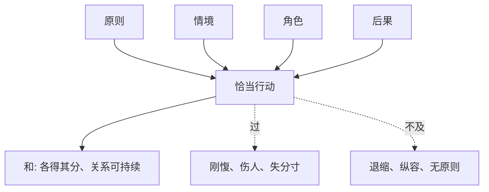

## 儒家思维筑基课: 中和公理: 好秩序来自恰当和平衡

### 作者
digoal

### 日期
2026-05-18

### 标签
中和公理 , 儒家思想 , 中庸 , 中和 , 分寸 , 情境判断 , 礼 , 和谐 , 原则 , 平衡

----

## 背景

> 面向对象: 高中生到大学低年级读者
> 核心问题: 中庸是不是没有立场、谁都不得罪？
> 先说结论: 中和公理认为，情感、行为和制度都要在具体情境中达到恰当。中不是站在中间，和不是抹平差异，而是让原则、角色、时机和后果协调起来。

## 一张图先看懂

## 求真讲法

### 它到底说了什么

《中庸》说“中也者，天下之大本也；和也者，天下之达道也”。简单说，中是未偏离恰当位置，和是不同部分各得其分后形成的协调。

中庸不是折中主义。它要求人在具体情境中判断: 什么时候该直言，什么时候该委婉；什么时候该忍让，什么时候该坚持；什么时候讲情，什么时候守法。

### 它是怎么来的

人类行动常常在两个极端间摇摆: 过度与不及。太软弱会纵容错误，太强硬会破坏关系；太重规则会冷酷，太重人情会失公。儒家需要一个原则来处理复杂情境，于是形成中和思想。

### 它依赖哪些假设

| 假设 | 含义 | 不成立时的后果 |
|---|---|---|
| 情境会影响判断 | 同一原则要看具体条件 | 容易机械套规则 |
| 情感需要调节 | 喜怒哀乐要合度 | 情绪支配行动 |
| 原则不能丢 | 中不是无底线妥协 | 变成和稀泥 |
| 和不是同 | 差异可协调但不必消失 | 误以为必须统一声音 |

### 常见误解

中庸不是“各退一步”。如果一方正当、一方侵害，强行各退一步就是不义。中庸也不是“别惹事”，因为面对原则问题时，沉默可能就是不及。

## 求存讲法

### 它有什么用

中和公理训练的是判断力。现实生活很少只有一道标准答案，很多时候需要同时考虑原则、关系、时机和后果。

### 它怎么迁移到熟悉领域

批评同学作业时，你既要诚实指出问题，也要选择对方能接受的方式。只说好话是不及，当众羞辱是过。指出具体问题并给出改进建议，才更接近中。

### 它的适用范围和边界

| 场景 | 中和的用法 | 失效方式 |
|---|---|---|
| 沟通 | 真诚且有分寸 | 把伤人当直率 |
| 管理 | 原则和弹性并用 | 用灵活破坏公平 |
| 学习 | 劳逸有度 | 放松变懒散，勤奋变透支 |
| 公共争议 | 区分事实、价值、情绪 | 不分是非地折中 |

### 正例: 怎么用它提升能力

面对朋友迟到，你可以说: “我愿意等你一次，但以后请提前说，因为这会影响我的安排。”这既没有压抑不满，也没有爆发攻击，守住了关系和边界。

### 反例: 前提不成立会怎样

有人在小组中长期不做事，组长为了“和谐”从不指出。最后认真做事的人受损，偷懒者得利。这里的“和”没有原则，变成不及，不是中庸。

## 思考

中庸难在它要求人同时拥有原则和分寸。只讲原则容易锋利但伤人，只讲分寸容易圆滑但失真。真正的中，是在复杂处境中仍能做合义的事。

## 最后记住

1. 中不是站中间，而是恰当。
2. 和不是没有差异，而是差异被合理安顿。
3. 中庸反对过度，也反对不及。
4. 没有原则的和谐不是中庸。

## 参考资料

- 《中庸》: “中也者，天下之大本也；和也者，天下之达道也”。
- 《论语》: “中庸之为德也，其至矣乎”。
- 《礼记》: 礼乐与情感节制相关论述。

  
#### [PostgreSQL 解决方案集合](../201706/20170601_02.md "40cff096e9ed7122c512b35d8561d9c8")
  
  
#### [德哥 / digoal's Github - 公益是一辈子的事.](https://github.com/digoal/blog/blob/master/README.md "22709685feb7cab07d30f30387f0a9ae")
  
  
#### [About 德哥](https://github.com/digoal/blog/blob/master/me/readme.md "a37735981e7704886ffd590565582dd0")
  
  

  
