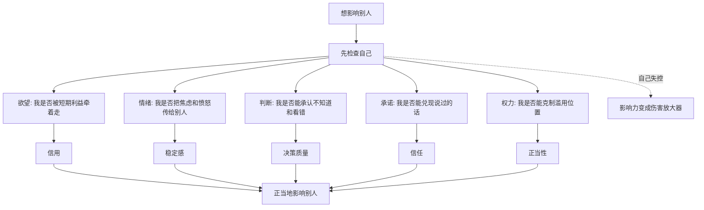
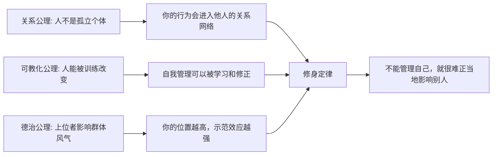
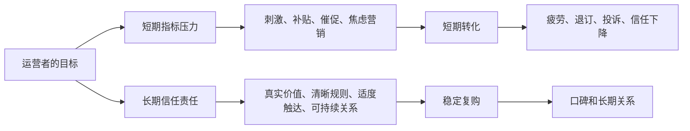

## 儒家思维筑基课: 修身定律: 不能管理自己，就很难正当地影响别人

### 作者
digoal

### 日期
2026-05-18

### 标签
儒家思维 , 修身定律 , 自我管理 , 影响力 , 情绪管理 , 判断校准 , 权力边界 , 产品责任 , 创业领导力 , 投资纪律

----

## 背景

> 面向对象: 大学生、产品经理、运营经理、创业者、有投资需求的人
> 核心问题: 世界表面变化太快，为什么很多人能力很强、资源很多、位置很高，却一旦影响别人、管理团队、做产品或配置资本，就不断制造失控和反噬？
> 先说结论: 修身定律说的是: 一个人如果不能管理自己的欲望、情绪、判断、承诺和权力边界，就很难正当地影响别人。因为影响别人不是单纯输出观点，而是把自己的偏见、欲望、风险和信用放进他人的生活与系统里。修身不是道德装饰，而是影响力的前置风控。

## 一张图先看懂



## 求真讲法

### 它到底说了什么

“修身定律”可以表述为:

> 越想影响别人，越要先管理自己；越拥有权力、资源和话语权，越需要先校准自己的欲望、情绪、判断、承诺和边界。

这里的“修身”不是简单地“做个好人”，而是训练一个人具备稳定影响他人的能力。

它至少包含五件事:

- 管理欲望: 不让短期利益吞掉长期信用。
- 管理情绪: 不把自己的恐惧、愤怒、焦虑转嫁给别人。
- 管理判断: 能承认不知道、看错了、需要证据。
- 管理承诺: 说到做到，不能做到就提前说明。
- 管理权力: 有位置、有资源、有信息优势时，不随意伤害弱者。

更简洁地说:

```text
正当影响力 = 自我约束 x 判断质量 x 信用积累 x 权力边界
```

没有修身，影响力越大，破坏力也越大。

### 它是怎么来的

在经典儒家里，《大学》把“修身”放在齐家、治国、平天下之前。这不是说会修身就一定能治理大事，而是说如果一个人连自己都不能管理，他影响别人时就会把自己的失控放大。

从底层公理看，修身定律可以这样推出:



这个推导不是数学证明，而是实践逻辑:

1. 人活在关系中，所以你的行为会影响别人。
2. 人可以被训练，所以自我管理不是纯天赋。
3. 有影响力的人会被模仿，所以自我失控会外溢。
4. 因此，影响别人之前必须先管理自己。

现代领域里，也能看到同一规律:

| 领域 | 修身定律的现代说法 | 关键问题 |
|---|---|---|
| 心理学 | 自我调节、延迟满足、认知偏差管理 | 你能否控制冲动和偏见 |
| 管理学 | 领导者自我认知和情绪稳定 | 你是否把团队变成情绪垃圾桶 |
| 产品 | 产品经理要克制自嗨和操纵 | 你是否把用户当成指标材料 |
| 运营 | 运营者要克制短期刺激 | 你是否透支长期信任 |
| 创业 | 创始人要管理欲望、现金和权力 | 公司是否复制创始人的失控 |
| 投资 | 投资者要管理贪婪、恐惧和过度自信 | 你是否能守住纪律 |

### 它依赖哪些假设

修身定律依赖几个前提:

1. 人的行为会影响他人，不只是私人选择。
2. 人有欲望、情绪和偏见，天然容易失衡。
3. 自我管理能力可以通过训练、反馈和环境改善。
4. 影响力越大，个人失控造成的外部成本越大。
5. 正当影响别人需要信任，而信任来自长期一致的行为。

这些前提让我们从“我有能力，所以我可以指挥别人”转向更成熟的问题:

```text
我是否有资格影响别人?
我的判断是否可靠?
我的欲望是否会污染决策?
我是否能承受别人把信任交给我?
```

### 修身不是内耗

修身常被误解为压抑自己、过度反省、道德洁癖。这不准确。

成熟修身不是把人变得胆小，而是让人更可靠:

```text
不修身: 情绪来了就发泄，机会来了就贪，压力来了就甩锅
过度修身: 什么都怪自己，不敢行动，不敢争取
成熟修身: 看见自己的欲望和偏差，然后用规则、反馈和行动校准
```

修身的目标不是完美人格，而是降低自己对他人的不必要伤害，提高自己对复杂局面的承载能力。

### 一个可复用的五问模型

在你想影响别人、管理团队、做产品决策、创业扩张或投资下注之前，可以问五个问题:

| 问题 | 看什么 | 反面信号 |
|---|---|---|
| 我想要什么 | 真实动机是否清楚 | 用宏大理由包装私欲 |
| 我怕什么 | 恐惧是否在操纵判断 | 因焦虑做过度决策 |
| 我知道什么 | 证据、边界和不确定性 | 把猜测当事实 |
| 我承诺什么 | 资源、时间、能力是否匹配 | 为了成交随口承诺 |
| 我影响谁 | 谁承担我的决策后果 | 收益归自己，成本给别人 |

这五问能把修身从抽象道德变成可执行的决策检查。

### 常见误解

| 误解 | 更准确的理解 |
|---|---|
| 修身就是自我感动 | 修身要落到稳定行为和可验证信用 |
| 先成功再修身 | 影响力越大，越早需要自我约束 |
| 管理别人靠能力，不靠修身 | 能力决定能不能做事，修身决定会不会伤人和失控 |
| 修身就是压抑欲望 | 修身是管理欲望，不是消灭欲望 |
| 私德和事业无关 | 私人失控常会外溢为组织风险、产品风险和投资风险 |

## 求存讲法

### 它有什么用

修身定律的最大用途，是帮你判断一个人或系统的影响力是否可靠。

很多表面现象很诱人:

- 这个人表达很强。
- 这个创始人很有魅力。
- 这个产品增长很快。
- 这个运营打法转化率很高。
- 这个投资人收益惊人。

但修身定律会追问:

- 他能否在利益面前守住信用？
- 他能否在压力面前保持判断？
- 他能否在权力面前尊重边界？
- 他能否在看错时及时承认和修正？
- 他能否不把自己的风险转嫁给别人？

影响力如果没有自我约束，短期越强，长期越危险。

### 它怎么迁移到生活

在生活中，修身不是“把自己变完美”，而是让自己变得可合作。

比如小组合作时，你想推动别人完成任务，先要管理自己:

- 不把临近截止的焦虑变成对同学的攻击。
- 不把自己的拖延包装成“追求质量”。
- 不随便承诺自己做不到的部分。
- 不在分工时只挑轻松任务。
- 出错时先复盘自己的责任，再讨论协作机制。

这样你影响别人时，别人不会只感到被控制，而会感到你有信用、有边界、能承担。

### 它怎么迁移到产品

产品经理最常见的失控，是把自己的想象当成用户需求，把指标压力转嫁给用户。

| 产品决策 | 修身追问 |
|---|---|
| 做新功能 | 这是用户真实需要，还是我的表达欲 |
| 做增长弹窗 | 这是帮助用户，还是打扰用户 |
| 做付费设计 | 用户是否清楚理解成本和收益 |
| 做算法推荐 | 是否用刺激性内容换短期停留 |
| 做隐私授权 | 用户是否能真正选择和退出 |

产品经理的修身，就是在“我想要数据”与“用户应被尊重”之间建立边界。

如果产品权力没有自我约束，界面就会变成操纵工具；如果产品权力有修身，界面会变成帮助用户完成目标的工具。

### 它怎么迁移到运营

运营者也有权力: 可以设计活动、制造稀缺、控制信息、塑造群体情绪、影响消费和传播。



修身好的运营，不是不追指标，而是不让指标毁掉关系。

你可以促销，但不要误导。  
你可以提醒，但不要骚扰。  
你可以制造紧迫感，但不要制造虚假恐慌。  
你可以做社群氛围，但不要操纵用户互相攀比和焦虑。

### 它怎么迁移到创业

创业者的修身，是公司早期最容易被低估的基础设施。

创始人的欲望、恐惧和边界，会很快变成组织默认规则:

| 创始人失控点 | 公司后果 |
|---|---|
| 过度自信 | 不听客户和团队反馈 |
| 贪快 | 交付质量和现金流失控 |
| 爱面子 | 坏消息被压制 |
| 不守承诺 | 员工、客户、投资人信任下降 |
| 情绪化 | 团队用猜领导情绪替代做事 |
| 权力无边界 | 组织变成亲疏关系和恐惧结构 |

修身不是要求创业者温和无害，而是要求他在高压、高诱惑、高不确定环境下仍能保持纪律。

创业公司最怕的不是创始人没有情绪，而是创始人没有办法处理自己的情绪；不是创始人有野心，而是野心没有边界。

### 它怎么迁移到投融资

投资中，修身定律尤其关键，因为市场会不断诱发人的贪婪、恐惧、嫉妒和过度自信。

| 投资情境 | 不修身的反应 | 修身后的反应 |
|---|---|---|
| 暴涨 | 觉得自己无所不能 | 检查估值、仓位和运气成分 |
| 暴跌 | 恐慌卖出或赌徒加仓 | 回到事实、现金流和承受能力 |
| 别人赚钱 | 追热点 | 守住能力圈 |
| 看错公司 | 找借口 | 复盘假设，及时止损或调整 |
| 重仓机会 | 情绪下注 | 先问错了会怎样 |

对普通投资者来说，修身不是道德问题，而是本金保护问题。

投资里的很多失败，不是知识不够，而是自我管理失败: 太贪、太急、太爱证明自己、太怕错过、太不愿承认错误。

这不是具体投资建议，而是一种底层提醒: 投资系统里，最难管理的资产常常是自己。

### 它的适用范围和边界

| 场景 | 修身定律有效的条件 | 边界 |
|---|---|---|
| 生活协作 | 个人行为会影响他人 | 不能把所有关系问题都归咎于自己 |
| 产品决策 | 产品权力会影响用户选择 | 修身不能替代用户研究和数据验证 |
| 运营增长 | 运营动作会塑造用户情绪和信任 | 不能用道德洁癖否定商业目标 |
| 创业管理 | 创始人会塑造组织默认规则 | 公司还需要制度，不可只靠个人修养 |
| 投资决策 | 情绪和偏见会影响判断 | 修身不能替代财务分析和风险管理 |

修身定律最重要的边界是: 修身不是万能解法。

更成熟的表达是:

```text
正当影响别人 = 自我管理 + 专业能力 + 制度约束 + 反馈机制 + 外部监督
```

只讲修身、不讲能力，会变成好心办坏事。  
只讲修身、不讲制度，会把系统押注在个人品质上。  
只讲修身、不讲反馈，会变成自我想象。

### 正例: 怎么用它提升能力

假设你是一个创业团队负责人，团队连续两个月没有完成目标。

点状思维会说:

```text
团队不够努力 -> 加压 -> 开会批评 -> 提高目标
```

修身思维会先检查自己:

```text
目标是否清楚?
承诺是否过度?
资源是否匹配?
我是否因为融资压力转嫁焦虑?
我是否只听到好消息?
我是否奖励了错误行为?
```

然后你可能会做出更正当的管理动作:

- 承认之前目标拆解不够清楚。
- 重新区分市场问题、产品问题和执行问题。
- 让团队说真话，不惩罚暴露问题的人。
- 调整资源和优先级，而不是继续堆口号。
- 明确新的承诺和复盘节奏。

这不是软弱，而是把影响别人建立在事实、责任和边界上。

### 反例: 前提不成立会怎样

某投资博主短期业绩很好，开始带领粉丝重仓热门赛道。他表面上很自信，表达也很有感染力，但缺少修身:

- 欲望失控: 把粉丝规模和商业变现放在风险提示之前。
- 情绪失控: 市场下跌时用更激烈语言稳住粉丝。
- 判断失控: 把牛市运气当成长期能力。
- 承诺失控: 暗示高收益，却淡化回撤风险。
- 权力失控: 利用信息和影响力让别人承担后果。

一旦市场反转，粉丝损失严重，他再解释“投资有风险”已经太晚。

这里失败不是因为他没有影响力，而是影响力缺少修身约束。修身定律的前提不成立时，影响力会把个人偏差放大成群体损失。

## 思考

修身定律对现代人很刺耳，因为现代社会鼓励每个人扩大影响力:

- 做个人品牌。
- 做社群。
- 做产品。
- 做创业。
- 做投资分享。
- 做管理者。

但很少有人提醒: 影响别人之前，先检查自己能不能承载这种影响。

一个人不管理自己的欲望，会把别人变成工具。  
一个人不管理自己的情绪，会把别人变成出口。  
一个人不管理自己的判断，会把别人带进错误。  
一个人不管理自己的承诺，会把别人拖进不确定。  
一个人不管理自己的权力，会把别人放在弱势位置。

所以，修身不是退回个人内心的小事，而是公共影响力的起点。

一个更锋利的问题是:

> 如果别人真的按照我的建议、规则、产品或决策行动，我是否愿意承担相应责任？

如果答案含糊，就说明影响力跑得比修身快。

## 最后记住

1. 修身定律不是道德表演，而是影响别人之前的前置风控。
2. 不能管理欲望、情绪、判断、承诺和权力边界，就很难正当地影响别人。
3. 产品、运营、创业和投资中的很多风险，本质是影响力缺少自我约束。
4. 修身需要和专业能力、制度约束、反馈机制、外部监督配合。
5. 判断一个人是否值得追随，不只看他多强，还要看他如何处理利益、压力、错误和权力。

## 参考资料

- 《大学》: “自天子以至于庶人，壹是皆以修身为本”及修身、齐家、治国、平天下的经典链条。
- 《论语》: 君子、克己复礼、慎言、诚信、为政以德等关于自我约束和影响力的思想资源。
- 《孟子》: 养心、义利之辨和大丈夫人格中的自我约束思想。
- Roy F. Baumeister and Kathleen D. Vohs, *Handbook of Self-Regulation*, 2004: 自我调节研究的心理学框架。
- Daniel Kahneman, *Thinking, Fast and Slow*, 2011: 认知偏差、判断错误与自我校准。
- Jim Collins, *Good to Great*, 2001: 领导者谦逊、纪律和组织长期表现。
- Howard Marks, *The Most Important Thing*, 2011: 投资中的二阶思维、风险和自我纪律。
- 本文为跨学科教学性重构，目的是提供生活、产品、运营、创业和投资中的底层分析框架，不构成具体投资建议。
  
#### [PostgreSQL 解决方案集合](../201706/20170601_02.md "40cff096e9ed7122c512b35d8561d9c8")
  
  
#### [德哥 / digoal's Github - 公益是一辈子的事.](https://github.com/digoal/blog/blob/master/README.md "22709685feb7cab07d30f30387f0a9ae")
  
  
#### [About 德哥](https://github.com/digoal/blog/blob/master/me/readme.md "a37735981e7704886ffd590565582dd0")
  
  

  
