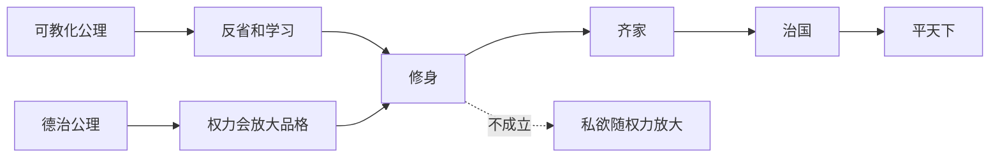

## 儒家思维筑基课: 修身定律: 不能管理自己，就很难正当地影响别人

### 作者
digoal

### 日期
2026-05-18

### 标签
修身定律 , 儒家思想 , 修身 , 大学 , 齐家治国 , 自我管理 , 德治 , 反省 , 权力约束 , 君子

----

## 背景

> 面向对象: 高中生到大学低年级读者
> 核心问题: 为什么《大学》把修身放在齐家、治国、平天下之前？
> 先说结论: 修身定律认为，人的欲望、情绪和判断若不被校准，权力和影响力越大，造成的偏差越大。修身不是私人洁癖，而是公共责任的起点。

## 一张图先看懂

## 求真讲法

### 它到底说了什么

修身定律不是说会修身就一定能治理国家，而是说: 如果一个人连自己的欲望、情绪、偏见和言行都不能约束，他影响别人时就更容易失控。

《大学》的链条“格物、致知、诚意、正心、修身、齐家、治国、平天下”，强调的是由内到外的责任扩展。

### 它是怎么来的

儒家认为社会秩序不是纯粹外部工程。制度需要人执行，权力需要人使用，关系需要人维护。一个人越靠近权力中心，他的品格越会影响别人。

所以修身被放在前面: 不是因为个人比制度重要，而是因为没有自我约束的人会扭曲制度。

### 它依赖哪些假设

| 依赖公理 | 对修身定律的支撑 |
|---|---|
| 可教化公理 | 人能通过学习和反省改变 |
| 德治公理 | 上位者品格会影响群体 |
| 礼序公理 | 修身需要外在行为训练 |
| 关系公理 | 自我管理会影响身边关系 |

### 常见误解

修身不是只管自己、不问社会。儒家把修身放在前面，是为了让人进入关系和公共事务时更可靠。

修身也不是压抑所有欲望。它强调的是让欲望合乎义和礼，而不是让人变成没有情感的工具。

## 求存讲法

### 它有什么用

修身定律能帮助你判断一个人是否适合承担更大责任。能力强但不能管理私欲的人，可能把能力变成伤害别人的工具。

### 它怎么迁移到熟悉领域

班干部、项目负责人、家长、老师、经理，都需要修身。因为他们的坏情绪、偏见和私心不只影响自己，还会影响一群人的资源和机会。

### 它的适用范围和边界

| 场景 | 有效用法 | 边界 |
|---|---|---|
| 学习 | 管理拖延和浮躁 | 不能用自责替代方法 |
| 管理 | 先管自己再管别人 | 不能忽视制度设计 |
| 家庭 | 控制情绪再沟通 | 不能忍受长期伤害 |
| 政治 | 权力者要受德性约束 | 必须配合法治监督 |

### 正例: 怎么用它提升能力

你要批评组员前，先问: 我掌握的信息完整吗？我是为了解决问题，还是为了证明自己正确？这一步能减少权力位置带来的冲动。

### 反例: 前提不成立会怎样

一个老师情绪失控时用羞辱语言教育学生，然后说“我是为你好”。这里修身失败，礼和仁都被破坏。影响力越大，未修之身造成的伤害越大。

## 思考

现代人常说制度比个人品德重要，这有道理。但制度也会遇到一个问题: 谁来执行制度？修身定律提醒我们，个人品格不是制度的替代品，却是制度能否被正当执行的条件之一。

## 最后记住

1. 修身是承担公共责任的起点。
2. 权力会放大未被约束的私欲。
3. 修身需要反省、学习和礼的训练。
4. 修身不能替代制度监督。

## 参考资料

- 《大学》: 格物、致知、诚意、正心、修身、齐家、治国、平天下。
- 《论语》: 君子、为政以德、克己复礼相关论述。
- 《孟子》: 义利之辨与修养思想。

  
#### [PostgreSQL 解决方案集合](../201706/20170601_02.md "40cff096e9ed7122c512b35d8561d9c8")
  
  
#### [德哥 / digoal's Github - 公益是一辈子的事.](https://github.com/digoal/blog/blob/master/README.md "22709685feb7cab07d30f30387f0a9ae")
  
  
#### [About 德哥](https://github.com/digoal/blog/blob/master/me/readme.md "a37735981e7704886ffd590565582dd0")
  
  

  
