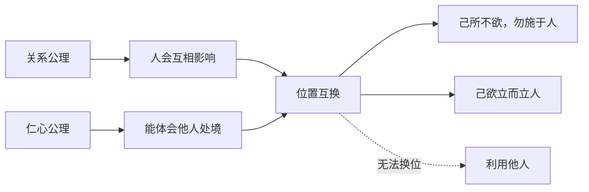

## 儒家思维筑基课: 忠恕定律: 把自己放进对方的位置

### 作者
digoal

### 日期
2026-05-18

### 标签
忠恕定律 , 儒家思想 , 忠恕 , 己所不欲 , 推己及人 , 仁 , 换位思考 , 人际关系 , 礼 , 伦理判断

----

## 背景

> 面向对象: 高中生到大学低年级读者
> 核心问题: “己所不欲，勿施于人”为什么能成为儒家伦理的核心规则？
> 先说结论: 忠恕定律认为，判断一个行为是否合宜，不能只看自己是否方便，还要做位置互换: 如果我是对方，我是否仍认为这件事合理？

## 一张图先看懂

## 求真讲法

### 它到底说了什么

忠恕中的“忠”可以理解为尽己，“恕”可以理解为推己及人。孔子说“己所不欲，勿施于人”，又说“己欲立而立人，己欲达而达人”。合起来看，就是从自己的真实感受出发，推想到别人也有类似需要和边界。

### 它是怎么来的

在人际关系中，人最容易犯的错误是只从自己的欲望看世界。儒家要解决这个问题，就提出一种最低限度的伦理测试: 你不愿别人这样对你，就不要这样对别人。

更高一级的要求是: 你希望自己被帮助、被尊重、被成全，也要愿意成全别人。

### 它依赖哪些假设

| 依赖公理 | 对忠恕定律的支撑 |
|---|---|
| 关系公理 | 我的行为会进入他人的生活 |
| 仁心公理 | 我能理解他人的感受 |
| 中和公理 | 换位后仍要结合具体情境 |
| 礼序公理 | 尊重需要恰当表达 |

### 常见误解

忠恕不是“我喜欢什么就给别人什么”。真正的忠恕要问对方的处境，而不是把自己的偏好强加给别人。

它也不是无原则宽容。如果对方伤害他人，阻止他也是对更多人的恕。

## 求存讲法

### 它有什么用

忠恕定律是日常冲突中的快速检查器。发消息、批评、竞争、分配任务前，先做一次位置互换，可以减少很多自私而不自知的行为。

### 它怎么迁移到熟悉领域

写产品说明时，站到新用户的位置，就不会只写自己懂的术语。做班级安排时，站到被安排者的位置，就会考虑时间、压力和公平。

### 它的适用范围和边界

| 场景 | 忠恕的用法 | 边界 |
|---|---|---|
| 同学相处 | 不把麻烦随手丢给别人 | 不能纵容不负责任 |
| 家庭沟通 | 体会对方处境 | 不能取消自己的边界 |
| 管理协作 | 分配任务时考虑承受力 | 不能因此放弃标准 |
| 公共争议 | 理解不同群体处境 | 不能把事实问题情绪化 |

### 正例: 怎么用它提升能力

你要催别人交材料时，可以先写清楚截止时间、原因和需要对方做什么，而不是只发“快点”。这是把对方的理解成本纳入考虑。

### 反例: 前提不成立会怎样

有人说“我喜欢别人直接批评我，所以我也当众羞辱别人”。这不是忠恕，因为他没有理解对方处境，只是把自己的偏好投射给别人。

## 思考

忠恕看似简单，难在真实执行。人常常只在自己受损时要求公平，在自己占便宜时忘记换位。儒家要训练的，正是这种不舒服时仍能自我校正的能力。

## 最后记住

1. 忠恕是推己及人，不是强加己好。
2. “勿施于人”是底线，“立人达人”是更高要求。
3. 换位思考要结合真实处境。
4. 忠恕不能替代原则和边界。

## 参考资料

- 《论语》: “己所不欲，勿施于人”“己欲立而立人，己欲达而达人”。
- 《孟子》: 恻隐之心与仁义思想。
- 《中庸》: 忠恕与诚的相关解释传统。

  
#### [PostgreSQL 解决方案集合](../201706/20170601_02.md "40cff096e9ed7122c512b35d8561d9c8")
  
  
#### [德哥 / digoal's Github - 公益是一辈子的事.](https://github.com/digoal/blog/blob/master/README.md "22709685feb7cab07d30f30387f0a9ae")
  
  
#### [About 德哥](https://github.com/digoal/blog/blob/master/me/readme.md "a37735981e7704886ffd590565582dd0")
  
  

  
