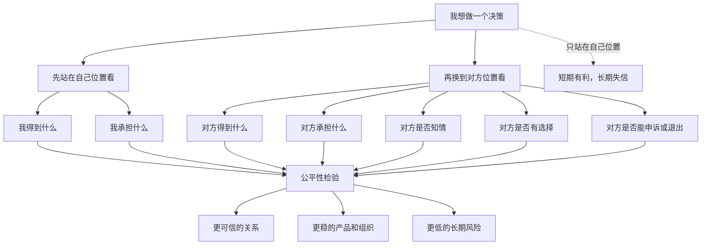
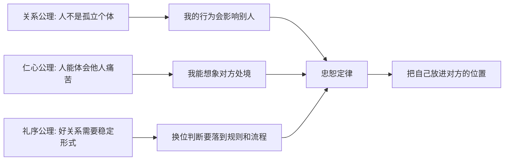
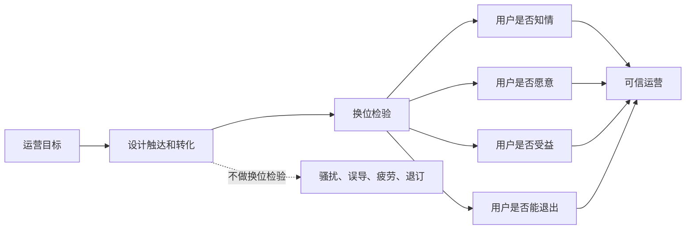

## 儒家思维筑基课: 忠恕定律: 把自己放进对方的位置

### 作者
digoal

### 日期
2026-05-18

### 标签
儒家思维 , 忠恕定律 , 换位思考 , 公平检验 , 用户视角 , 知情权 , 选择权 , 创业关系 , 利益相关者 , 投资治理

----

## 背景

> 面向对象: 大学生、产品经理、运营经理、创业者、有投资需求的人
> 核心问题: 世界表面变化太快，为什么很多看似合理的决策，一换到对方位置看，就暴露出不公平、不可信、不可持续的问题？
> 先说结论: 忠恕定律说的是: 判断一件事是否正当，不能只站在自己的利益、指标和位置上看，还要把自己放进对方的位置，检验这套规则、承诺和后果是否仍然说得通。“忠”是尽己之心，不欺骗自己的责任；“恕”是推己及人，不把自己不愿承受的东西强加给别人。

## 一张图先看懂



## 求真讲法

### 它到底说了什么

“忠恕定律”可以表述为:

> 任何影响他人的行动，都要通过位置互换来检验: 如果我站在对方的位置，承受同样的信息、成本、风险和后果，我还认为这件事合理吗？

它有两个部分:

- 忠: 对自己负责，不欺骗自己的真实动机，不逃避自己应尽的责任。
- 恕: 对他人设身处地，不把自己不愿承受的成本、风险和羞辱强加给别人。

更实用地说:

```text
正当决策 = 自己位置的收益判断 + 对方位置的承受检验 + 双方关系的长期后果
```

只看自己位置，很容易把“我方便”“我赚钱”“我增长”“我赢了”误认为“这件事合理”。忠恕定律会要求你把镜头转过去，看对方是否被误导、被强迫、被转嫁成本、被剥夺选择。

### 它是怎么来的

在儒家经典中，“忠恕”常与“己所不欲，勿施于人”“己欲立而立人，己欲达而达人”相连。教学性地理解，它是仁心从情感走向判断的方法:



这个推导不是数学证明，而是实践逻辑:

1. 人活在关系中，所以行动会进入别人的生活。
2. 人有体会他人处境的可能，所以可以做位置互换。
3. 好关系需要稳定形式，所以换位不能只停留在情绪上，要变成规则、流程和边界。

现代社会里，忠恕定律也有许多对应表达:

| 领域 | 忠恕定律的现代说法 | 关键问题 |
|---|---|---|
| 伦理学 | 互惠、可普遍化、角色互换 | 如果人人这样做，关系还能维持吗 |
| 产品设计 | 用户视角、同理心、可用性测试 | 用户是否真的理解并愿意承受 |
| 管理学 | 利益相关者视角、公平感 | 决策成本是否被转嫁给弱势方 |
| 运营 | 不透支用户信任 | 转化动作若发生在自己身上是否可接受 |
| 创业 | 客户、员工、伙伴、投资人共同承受 | 商业模式是否建立在单方吃亏上 |
| 投资 | 少数股东、客户、供应商视角 | 利润是否来自不可持续的成本转嫁 |

### 它依赖哪些假设

忠恕定律依赖几个前提:

1. 人能意识到自己的位置并不等于全部世界。
2. 人有能力想象对方的信息、资源、风险和处境。
3. 一段关系要长期维持，不能让一方长期承担不可接受的成本。
4. 公平不是抽象口号，而要看收益、风险、选择权和知情权如何分配。
5. 信任来自可互换性: 如果位置交换，规则仍然大体能被接受。

这些前提让我们从“我有没有赢”转向更成熟的问题:

```text
如果我是用户，我愿意被这样设计吗?
如果我是员工，我愿意被这样管理吗?
如果我是供应商，我愿意承担这种账期和风险吗?
如果我是小股东，我愿意接受这种信息披露吗?
如果我是对方，我是否还有真实选择?
```

### 忠恕不是讨好

忠恕经常被误解为“总替别人着想，所以委屈自己”。这不准确。

忠恕不是取消自己的利益，而是让自己的利益经得起位置互换检验。

```text
讨好: 我牺牲边界，只求别人满意
冷酷: 我只看自己，把成本推给别人
忠恕: 我承认自己的利益，也认真检验对方能否公平承受
```

忠恕也不是“别人不舒服，我就不能做”。有些必要决策会让人不舒服，比如淘汰低质量内容、拒绝不合理需求、终止亏损合作、执行风险控制。关键在于: 规则是否清楚、信息是否充分、过程是否尊重、后果是否合义。

### 一个可复用的六问模型

做任何影响他人的决策时，可以用“忠恕六问”:

| 问题 | 看什么 | 反面信号 |
|---|---|---|
| 如果我是对方，我知道真相吗 | 信息是否对称 | 用模糊话术诱导 |
| 如果我是对方，我有选择吗 | 是否能拒绝、退出、申诉 | 绑定、强迫、暗扣 |
| 如果我是对方，我承担什么 | 时间、钱、风险、尊严、机会成本 | 成本被隐藏 |
| 如果我是对方，我得到什么 | 收益是否真实可感 | 只给承诺不给结果 |
| 如果我是对方，我会觉得被尊重吗 | 过程和表达是否体面 | 羞辱、操纵、甩锅 |
| 如果位置互换，我还支持这条规则吗 | 规则是否可互换 | 强者规则、双重标准 |

这六问能把忠恕从道德格言变成决策工具。

### 常见误解

| 误解 | 更准确的理解 |
|---|---|
| 忠恕就是老好人 | 忠恕是位置互换后的公平检验，不是无原则让步 |
| 换位思考就是猜对方感受 | 不只猜感受，还要看信息、选择、成本和后果 |
| 商业竞争不需要忠恕 | 长期商业依赖信任，信任依赖可接受的互惠关系 |
| 用户说什么就做什么 | 忠恕不是迎合，而是理解真实处境后做正确设计 |
| 对方不满意就是我错 | 不满意可能来自合理边界，关键看规则是否清楚合义 |

## 求存讲法

### 它有什么用

忠恕定律的最大用途，是帮你发现“站在自己这边看很合理，站到对方那边看很荒唐”的风险。

很多失败不是因为人完全不聪明，而是因为太会站在自己位置上聪明:

- 产品经理只看转化率，忘了用户是否被误导。
- 运营只看活动效果，忘了用户是否被骚扰。
- 管理者只看效率，忘了员工是否长期承受不合理压力。
- 创业者只看融资故事，忘了客户是否真的获益。
- 投资者只看利润，忘了利润是否来自不可持续的成本转嫁。

忠恕定律能帮你判断一个系统的长期信任是否稳固。

### 它怎么迁移到生活

生活里，忠恕最直接的用法是处理冲突。

比如室友晚上外放声音。只站在自己位置，他可能想: “我只是放松一下。”  
换到别人位置，就会看到: 别人明天考试、需要休息、没有选择空间、还不好意思反复提醒。

忠恕不是要求他永远不娱乐，而是让他重新设计行为:

```text
戴耳机 -> 提前沟通 -> 控制时间 -> 尊重公共空间 -> 被提醒后立即调整
```

这个例子小，但底层规律很大: 公共关系中，你的自由要经过他人承受能力的检验。

### 它怎么迁移到产品

产品里的忠恕，就是把自己放进用户的位置。

| 产品动作 | 只站在公司位置 | 换到用户位置 |
|---|---|---|
| 默认勾选 | 提高授权率 | 用户可能根本没意识到授权 |
| 连续弹窗 | 提高转化 | 用户感到被打扰和操纵 |
| 自动续费 | 收入更稳定 | 用户是否充分知情、方便取消 |
| 复杂退款 | 降低退款率 | 用户会把困难体验记成不信任 |
| 推荐算法 | 提高停留 | 用户是否被困在刺激和低质内容里 |

一个产品如果经常经不起“我是用户会怎样”的检验，短期指标越好，长期信任越危险。

### 它怎么迁移到运营

运营中的忠恕，是不把用户当成可以被任意推动的指标对象。



好的运营不是不追转化，而是追求用户事后仍认为“这次触达对我有价值”。如果用户一旦清醒或复盘就觉得被骗，运营增长其实是在透支信任。

### 它怎么迁移到创业

创业者很容易只站在创始人位置看问题:

- 对客户: 我需要签单。
- 对员工: 我需要大家拼命。
- 对供应商: 我需要更长账期。
- 对投资人: 我需要更高估值。
- 对用户: 我需要增长数据。

忠恕定律会要求你换位:

| 对象 | 忠恕追问 |
|---|---|
| 客户 | 如果我是客户，我是否清楚知道交付边界 |
| 员工 | 如果我是员工，我是否相信承诺和回报匹配 |
| 供应商 | 如果我是供应商，我是否能承受账期和风险 |
| 投资人 | 如果我是投资人，我是否获得充分真实的信息 |
| 用户 | 如果我是用户，我是否愿意长期被这样服务 |

创业不是让所有人都满意，而是让关键关系中的收益、风险、信息和承诺尽可能经得起位置互换检验。

### 它怎么迁移到投融资

投资里，忠恕定律可以帮助识别商业模式和治理风险。

| 投资观察点 | 换位问题 |
|---|---|
| 用户增长 | 如果我是用户，我是真的受益，还是被诱导 |
| 高毛利 | 如果我是客户，我是否仍愿意长期付费 |
| 供应链优势 | 如果我是供应商，我是否被过度压榨 |
| 员工效率 | 如果我是员工，这种强度是否可持续 |
| 股东治理 | 如果我是小股东，我是否被公平对待 |
| 信息披露 | 如果我是外部投资者，我是否足够知情 |

一个公司如果长期让某一方承担不可接受的成本，它的利润可能不是护城河，而是未来风险的蓄水池。用户会流失，员工会离职，供应商会反抗，监管会介入，小股东会折价。

这不是具体投资建议，而是一种底层判断: 好生意通常要让关键关系方都有继续合作的理由。

### 它的适用范围和边界

| 场景 | 忠恕定律有效的条件 | 边界 |
|---|---|---|
| 生活关系 | 双方都能表达处境和边界 | 不能用换位思考替代明确沟通 |
| 产品设计 | 用户体验和信任影响长期价值 | 用户视角不能替代商业可行性 |
| 运营增长 | 用户感受会影响留存和口碑 | 不能因为怕打扰就不做必要触达 |
| 创业管理 | 多方关系决定企业可持续性 | 不能满足所有相关方的全部要求 |
| 投资分析 | 利益相关者关系影响现金流 | 换位判断不能替代财务和行业分析 |

忠恕定律最重要的边界是: 换位不是替对方做主。

更成熟的表达是:

```text
成熟忠恕 = 位置互换 + 信息核实 + 边界判断 + 长期关系检验
```

如果只靠想象对方感受，容易自以为体贴；如果只看对方表达，又可能被短期情绪绑架。忠恕要和事实、规则、边界一起使用。

### 正例: 怎么用它提升能力

假设你是产品经理，正在设计一个会员自动续费功能。

点状思维会说:

```text
自动续费 -> 收入更稳定 -> 默认勾选 -> 取消路径藏深一点
```

忠恕思维会先做位置互换:

```text
如果我是用户，我是否充分知道会自动扣费?
我是否能方便取消?
我是否在扣费前收到提醒?
我是否能理解会员权益和费用周期?
```

于是更正当的设计可能是:

- 明确显示续费周期和金额。
- 不用模糊文案隐藏扣费事实。
- 扣费前提醒用户。
- 取消入口清楚可达。
- 对误扣或争议提供清楚处理流程。

这可能短期降低一些转化，但会保护长期信任。一个经得起用户换位检验的产品，才更可能建立品牌信用。

### 反例: 前提不成立会怎样

某在线课程平台为了提高销售额，运营团队制造“最后一天”“名额有限”“错过涨价”等紧迫感，但实际上优惠长期存在，名额也没有限制。

从平台位置看:

- 转化率提高。
- 销售额变好。
- 活动数据漂亮。

但换到用户位置:

- 用户以为自己获得真实限时机会。
- 用户在焦虑中下单。
- 用户后来发现规则不真实，产生被欺骗感。
- 即使课程内容还可以，信任也被损坏。

这里失败不是因为营销不该制造紧迫感，而是紧迫感不能建立在虚假信息上。忠恕定律的前提不成立时，短期转化会变成长期不信任。

## 思考

忠恕定律对现代人特别重要，因为技术和组织让我们越来越容易“远距离影响别人”。

产品经理改一个默认选项，可能影响百万用户。  
运营发一次活动，可能调动大量情绪和消费。  
创业者讲一个故事，可能影响员工、客户和投资人的选择。  
投资者发布一个观点，可能影响跟随者的风险暴露。  
平台改一条规则，可能改变商家、创作者和用户的生计。

影响范围越大，越不能只站在自己的位置。

一个更锋利的问题是:

> 如果所有受影响的人都坐在会议室里，并且能完整表达自己的成本、风险和选择，你还会用同样方式做这个决策吗？

如果答案是否定的，说明这个决策可能靠的是信息不对称、权力不对称或注意力不对称。

忠恕的现代意义，不是让人变得温柔，而是让影响力经得起位置互换的审计。

## 最后记住

1. 忠恕定律不是老好人原则，而是用位置互换检验公平、信任和长期关系。
2. “己所不欲，勿施于人”关注底线，“己欲立而立人，己欲达而达人”关注共同成长。
3. 产品、运营、创业和投资中，很多长期风险来自把成本转嫁给看不见的一方。
4. 成熟忠恕需要位置互换、信息核实、边界判断和长期关系检验。
5. 判断一个决策是否可靠，要问: 如果我站在对方位置，是否仍认为这套规则合理。

## 参考资料

- 《论语》: “己所不欲，勿施于人”“己欲立而立人，己欲达而达人”等关于忠恕和推己及人的经典表达。
- 《孟子》: 仁心、恻隐之心和道德扩充的思想资源。
- 《大学》: 修身与影响他人、治理关系之间的展开路径。
- John Rawls, *A Theory of Justice*, 1971: 原初状态和无知之幕作为位置互换式公平思考的现代政治哲学资源。
- Adam Smith, *The Theory of Moral Sentiments*, 1759: 同情、旁观者视角和道德判断。
- Don Norman, *The Design of Everyday Things*, 1988: 以使用者视角理解设计、错误和反馈。
- R. Edward Freeman, *Strategic Management: A Stakeholder Approach*, 1984: 利益相关者视角下的企业决策。
- 本文为跨学科教学性重构，目的是提供生活、产品、运营、创业和投资中的底层分析框架，不构成具体投资建议。
  
#### [PostgreSQL 解决方案集合](../201706/20170601_02.md "40cff096e9ed7122c512b35d8561d9c8")
  
  
#### [德哥 / digoal's Github - 公益是一辈子的事.](https://github.com/digoal/blog/blob/master/README.md "22709685feb7cab07d30f30387f0a9ae")
  
  
#### [About 德哥](https://github.com/digoal/blog/blob/master/me/readme.md "a37735981e7704886ffd590565582dd0")
  
  

  
