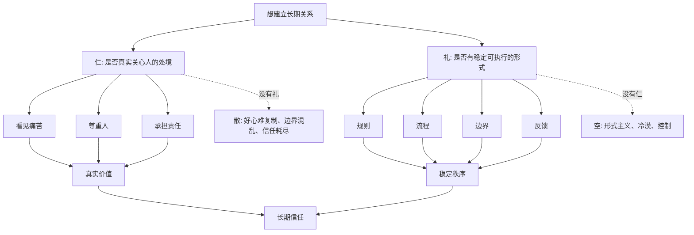
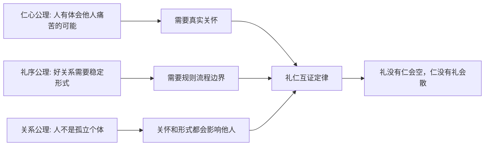
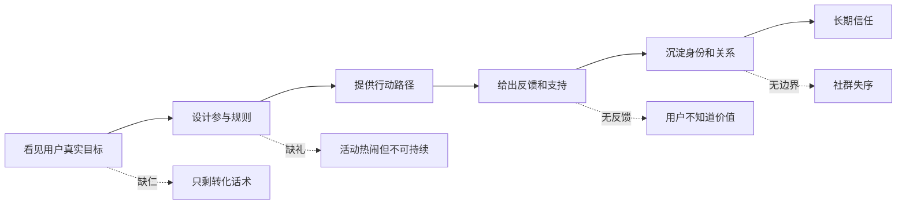

## 儒家思维筑基课: 礼仁互证定律: 礼没有仁会空，仁没有礼会散

### 作者
digoal

### 日期
2026-05-18

### 标签
儒家思维 , 礼仁互证 , 仁 , 礼 , 真实价值 , 稳定形式 , 产品服务 , 运营机制 , 创业交付 , 公司治理

----

## 背景

> 面向对象: 大学生、产品经理、运营经理、创业者、有投资需求的人
> 核心问题: 世界表面变化很快，为什么有些系统流程很完整却没有人味，有些系统初心很好却无法长期运转？
> 先说结论: 礼仁互证定律说的是: 真正稳定的好关系，既需要“仁”的真实关怀，也需要“礼”的稳定形式。礼没有仁，会变成空洞流程、表演和控制；仁没有礼，会变成临时善意、情绪冲动和不可复制的好心。长期可信的产品、组织和商业系统，必须让真实价值有形式承载，让形式持续服务真实价值。

## 一张图先看懂



## 求真讲法

### 它到底说了什么

“礼仁互证定律”可以表述为:

> 一段关系、一个组织、一个产品或一个商业系统，只有当真实关怀和稳定形式互相支撑时，才可能长期可信。

这里的“仁”，不是抽象善良，而是对人的真实处境、痛苦、尊严和长期利益有感知。  
这里的“礼”，不是繁文缛节，而是让尊重、边界、责任、承诺和反馈变成可执行形式。

它包含两个方向:

```text
礼验证仁: 你说关心别人，要看有没有规则、流程和承诺来兑现。
仁验证礼: 你说有制度流程，要看它是否真的保护人和创造价值。
```

只有仁，没有礼，容易变成“我很想帮你，但每次都靠临时发挥”。  
只有礼，没有仁，容易变成“流程都对，但没人真正对结果负责”。

### 它是怎么来的

在经典儒家里，“仁”和“礼”常常一起出现。《论语》中有“克己复礼为仁”，也有“人而不仁，如礼何”。教学性地理解，这不是两句孤立语录，而是在说明一组互相验证的关系:

- 仁让礼不空: 礼背后必须有人心、尊重和责任。
- 礼让仁不散: 仁必须通过稳定形式进入行动和秩序。

从前面几条底层公理看，这条定律可以这样推出:



这个推导不是数学证明，而是实践逻辑:

1. 人会受他人痛苦和关系责任影响，所以需要仁。
2. 长期关系不能只靠临时善意，所以需要礼。
3. 人活在关系网络中，仁和礼都会扩散成信任或不信任。
4. 因此，仁和礼必须互相验证。

现代领域里，也能看到同一规律:

| 领域 | 仁的对应物 | 礼的对应物 | 缺一后的问题 |
|---|---|---|---|
| 产品 | 用户价值、痛点、尊重 | 交互、权限、退款、隐私流程 | 要么操纵用户，要么好心难用 |
| 运营 | 真实帮助用户成长 | 规则、节奏、反馈、社群机制 | 要么割韭菜，要么一团热闹 |
| 管理 | 尊重员工和客户 | 岗位、流程、绩效、申诉机制 | 要么冷酷制度，要么人情混乱 |
| 创业 | 解决真实痛点 | 合同、交付、组织、治理 | 要么伪需求包装，要么交付失控 |
| 投资 | 尊重利益相关者 | 治理、披露、审计、资本纪律 | 要么道德表演，要么制度空转 |

### 它依赖哪些假设

礼仁互证定律依赖几个前提:

1. 人需要被尊重和理解，不能只被当成指标、角色或资源。
2. 好意如果没有形式承载，难以稳定、复制和传递。
3. 形式如果脱离真实价值，会被人识别为空洞甚至压迫。
4. 长期信任来自“说的、做的、制度奖励的”大体一致。
5. 复杂系统既需要人的尺度，也需要规则的尺度。

这些前提让我们从“我有善意就行”或“我有流程就行”转向更成熟的问题:

```text
我的善意有没有被设计成可执行机制?
我的制度是否还在服务真实的人和真实价值?
如果一个新人进入系统，他能否靠规则感受到仁?
如果一个用户遇到问题，流程是否真的帮他解决痛苦?
```

### 礼和仁如何互相检验

可以用一个简单矩阵判断系统状态:

| 状态 | 有仁 | 有礼 | 结果 |
|---|---|---|---|
| 成熟关系 | 有 | 有 | 真实关怀被稳定兑现 |
| 情绪关系 | 有 | 无 | 好心很多，但边界混乱 |
| 空心制度 | 无 | 有 | 流程完整，但冷漠失信 |
| 野蛮关系 | 无 | 无 | 只剩强弱、利益和临时交易 |

最危险的不是“无仁无礼”，因为它很容易被看出来。更危险的是“有礼无仁”: 表面流程、制度、话术都完整，实际只是把人包装成指标，把责任包装成手续。

### 一个可复用的六问模型

判断一个产品、组织、社群、创业项目或投资标的，可以问六个问题:

| 问题 | 检查仁 | 检查礼 |
|---|---|---|
| 谁被真实帮助 | 是否看见人的痛苦 | 是否有服务流程兑现帮助 |
| 谁承担成本 | 是否尊重弱势方处境 | 是否有边界和补偿机制 |
| 承诺如何兑现 | 是否真想负责 | 是否可追踪、可验收、可复盘 |
| 出错如何处理 | 是否愿意承认伤害 | 是否有反馈、申诉、退款、纠错 |
| 规则服务什么 | 是否服务真实价值 | 是否避免形式主义和黑箱 |
| 长期是否可信 | 是否持续关心人 | 是否稳定、一致、可复制 |

这六问能帮你穿透“漂亮话”和“漂亮流程”。

### 常见误解

| 误解 | 更准确的理解 |
|---|---|
| 有制度就专业 | 制度若不服务人和价值，只是空心形式 |
| 有初心就够了 | 初心若不能流程化和制度化，长期会散 |
| 讲仁会降低效率 | 真正的仁能减少投诉、流失和信任成本 |
| 讲礼就是官僚 | 好礼降低协作成本，坏礼才制造官僚 |
| 仁和礼二选一 | 长期系统必须让仁和礼互相验证 |

## 求存讲法

### 它有什么用

礼仁互证定律的最大用途，是帮你判断一个系统是真健康，还是只在表面上健康。

表面健康常见两种:

- 流程健康: 文档齐全、制度完整、指标漂亮，但用户、员工、伙伴并没有感受到尊重和价值。
- 情绪健康: 大家热情高、口号强、关系近，但没有边界、流程、责任和复盘。

前者会变冷，后者会变乱。真正能长期运行的系统，必须同时解决:

```text
为什么值得做? 这是仁的问题。
怎样稳定做? 这是礼的问题。
```

### 它怎么迁移到生活

生活里，很多关系坏掉，不是因为完全没有感情，而是仁和礼不匹配。

朋友之间有仁无礼: 互相很关心，但借钱不写清楚、约定经常变、边界不清，最后感情被消耗。  
亲密关系有礼无仁: 节日礼物、固定问候、形式都在，但真正的倾听、尊重和承担不在，关系会变成表演。

成熟关系通常是:

```text
我在乎你，所以我尊重边界。
我尊重边界，所以我的在乎更可信。
```

### 它怎么迁移到产品

产品最容易出现两种偏差。

第一种是有礼无仁: 权限弹窗、协议、客服流程、退款规则都存在，但目的只是规避责任，不是真帮助用户。  
第二种是有仁无礼: 团队很想解决用户痛点，但入口混乱、说明不清、出错难处理、隐私边界不稳定。

| 产品场景 | 礼没有仁会怎样 | 仁没有礼会怎样 |
|---|---|---|
| 隐私授权 | 用户被迫同意，看似合规 | 团队重视隐私但说明混乱 |
| 退款 | 流程复杂，拖延责任 | 想帮用户但没有标准 |
| 新手引导 | 只为转化，不为理解 | 功能有价值但用户不会用 |
| 客服 | 话术标准但不解决问题 | 客服热心但结果不可控 |
| 社区规则 | 用规则压制真实反馈 | 氛围友好但劣质内容泛滥 |

好产品的本质，是用礼把仁做成可体验的东西。

### 它怎么迁移到运营

运营里的礼仁互证，是“真实帮助”和“稳定机制”的结合。



如果运营只有仁，大家会说“我们真的想帮用户”，但用户不知道怎么参与、怎么得到反馈、怎么持续成长。  
如果运营只有礼，活动规则、打卡机制、转化链路都很完整，但用户感到自己只是被推进漏斗。

真正好的运营，是让用户在规则中感受到帮助，而不是在帮助中失去秩序。

### 它怎么迁移到创业

创业中，礼仁互证对应两件事:

- 仁: 是否解决真实痛点，是否尊重客户、员工、伙伴和投资人。
- 礼: 是否有可交付产品、稳定流程、清晰合同、组织机制和治理结构。

常见失败有两类:

| 创业偏差 | 表面表现 | 长期问题 |
|---|---|---|
| 有仁无礼 | 创始人有使命感，客户也认可痛点 | 交付混乱、成本失控、团队疲惫 |
| 有礼无仁 | BP精美、流程完整、增长模型漂亮 | 伪需求、用户不爱、组织空心 |

创业不是只靠初心，也不是只靠模型。真正能穿越变化的公司，要把真实痛点变成可重复交付的结构。

### 它怎么迁移到投融资

投资里，礼仁互证可以帮助判断企业质量。

| 投资观察点 | 仁的检验 | 礼的检验 |
|---|---|---|
| 用户价值 | 用户是否真实受益 | 是否有稳定交付和服务体系 |
| 员工关系 | 是否尊重人才成长 | 是否有清楚激励和组织机制 |
| 供应链 | 是否不把风险过度转嫁 | 合同、账期、质量标准是否稳定 |
| 公司治理 | 是否尊重股东和长期信用 | 披露、审计、董事会是否有效 |
| 资本配置 | 是否克制短期诱惑 | 是否有纪律和可复盘机制 |

一家企业如果只有仁，可能是好愿望，但不一定是好生意。  
一家企业如果只有礼，可能有漂亮治理和流程，但如果不创造真实用户价值，长期也难成立。

这不是具体投资建议，而是一种底层判断: 好公司通常既有真实价值，也有承载真实价值的制度能力。

### 它的适用范围和边界

| 场景 | 礼仁互证有效的条件 | 边界 |
|---|---|---|
| 生活关系 | 双方都重视感受和边界 | 不能用形式替代真实沟通 |
| 产品设计 | 用户价值需要被稳定体验 | 不能为流程完整牺牲核心价值 |
| 运营增长 | 用户需要帮助，也需要秩序 | 不能把用户全当成被教育对象 |
| 创业管理 | 使命和组织能力都重要 | 好初心不能抵消商业模式缺陷 |
| 投资分析 | 真实价值和治理结构共同影响长期现金流 | 仁礼分析不能替代财务估值 |

礼仁互证最重要的边界是: 不能把仁和礼都说成万能。

更成熟的表达是:

```text
长期可信系统 = 真实价值 + 稳定形式 + 反馈纠错 + 激励一致
```

仁解决“为什么值得信”，礼解决“怎样稳定信”。但系统仍然需要能力、资源、技术、成本和时机。

### 正例: 怎么用它提升能力

假设你是运营经理，负责一个求职训练营。

点状思维会说:

```text
卖课 -> 拉群 -> 发资料 -> 打卡 -> 催续费
```

礼仁互证思维会先问:

```text
仁: 学员真正痛苦是什么?
礼: 我们用什么稳定机制帮他改变?
```

于是你可能会设计:

- 先诊断学员简历、表达、行业选择和面试短板。
- 用标准模板让学员知道如何改简历。
- 设置模拟面试和真实反馈，而不是只讲方法论。
- 明确服务边界，不承诺保offer。
- 对学员进展做记录，结营时给出可复盘成果。
- 对退款、延期、投诉设置清晰规则。

这里，仁让训练营不只是卖焦虑；礼让帮助不是靠老师个人热心，而能稳定交付。

### 反例: 前提不成立会怎样

某公司号称“以员工为家人”，节日礼物、团建、口号、仪式都很多，看起来很有温度。但实际情况是:

- 加班长期无边界。
- 绩效标准不透明。
- 员工提出问题会被说“不够奋斗”。
- 管理层用“家人文化”要求牺牲，却不承担相应责任。
- 申诉和反馈机制只是摆设。

这里表面有礼: 仪式、称呼、活动很多。  
但底层无仁: 没有真正尊重员工的时间、边界和发展。  
同时也没有真正的好礼: 因为制度不是保护关系，而是包装权力。

礼没有仁会空，甚至会变成操纵。前提不成立时，越强调形式，越容易暴露虚伪。

## 思考

礼仁互证定律对现代组织特别重要，因为现代系统非常擅长制造“形式正确”:

- 合规协议很完整。
- 客服话术很标准。
- 企业文化很漂亮。
- 运营流程很精细。
- 投资者关系材料很专业。

但形式正确不等于价值真实。

反过来，现代人也喜欢强调“初心、热爱、使命、用户价值”。但如果这些不能变成流程、制度、交付、反馈和边界，它们也很难穿越规模和时间。

所以判断一个系统，不要只问:

```text
它有没有制度?
它有没有善意?
```

更要问:

```text
制度是否仍在服务真实价值?
善意是否已经变成稳定机制?
```

一个更锋利的问题是:

> 如果没有创始人、领导者或少数热心人临场发挥，这个系统还能不能让人感受到尊重、价值和边界？

如果不能，说明仁还没有变成礼。  
如果能运转但没人感到被真正尊重，说明礼已经失去仁。

## 最后记住

1. 礼仁互证定律说的是: 真实关怀和稳定形式必须互相验证。
2. 礼没有仁会空，表现为流程正确但冷漠、控制和形式主义。
3. 仁没有礼会散，表现为初心很好但不可复制、不可交付、不可持续。
4. 产品、运营、创业和投资都要同时检查真实价值和承载机制。
5. 长期可信系统需要真实价值、稳定形式、反馈纠错和激励一致。

## 参考资料

- 《论语》: “克己复礼为仁”“人而不仁，如礼何”等关于仁与礼互相支撑的经典表达。
- 《礼记》: 礼乐、秩序、角色形式和社会教化的思想资源。
- 《孟子》: 仁心、恻隐之心和道德扩充的思想资源。
- 《大学》: 修身、齐家、治国的秩序展开路径。
- Douglass C. North, *Institutions, Institutional Change and Economic Performance*, 1990: 制度如何降低不确定性并塑造行为。
- Don Norman, *The Design of Everyday Things*, 1988: 设计形式如何影响人的理解、行动和错误。
- Edgar H. Schein, *Organizational Culture and Leadership*, 1985: 组织文化如何通过行为、制度和假设沉淀。
- 本文为跨学科教学性重构，目的是提供生活、产品、运营、创业和投资中的底层分析框架，不构成具体投资建议。
  
#### [PostgreSQL 解决方案集合](../201706/20170601_02.md "40cff096e9ed7122c512b35d8561d9c8")
  
  
#### [德哥 / digoal's Github - 公益是一辈子的事.](https://github.com/digoal/blog/blob/master/README.md "22709685feb7cab07d30f30387f0a9ae")
  
  
#### [About 德哥](https://github.com/digoal/blog/blob/master/me/readme.md "a37735981e7704886ffd590565582dd0")
  
  

  
