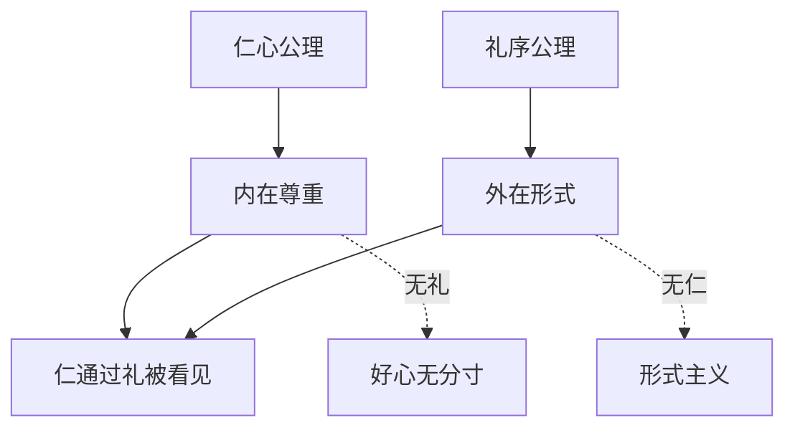

## 儒家思维筑基课: 礼仁互证定律: 礼没有仁会空，仁没有礼会散

### 作者
digoal

### 日期
2026-05-18

### 标签
礼仁互证定律 , 儒家思想 , 仁 , 礼 , 克己复礼 , 形式主义 , 尊重 , 分寸 , 道德实践 , 社会秩序

----

## 背景

> 面向对象: 高中生到大学低年级读者
> 核心问题: 儒家到底更重视内心仁爱，还是外在礼仪？
> 先说结论: 礼仁互证定律认为，仁是礼的灵魂，礼是仁的形状。只有内心善意没有合适形式，容易失分寸；只有形式没有仁，容易变成表演和压迫。

## 一张图先看懂

## 求真讲法

### 它到底说了什么

孔子说“克己复礼为仁”，又说“人而不仁，如礼何”。这两句话要合起来看: 礼帮助人成仁，但没有仁的礼没有意义。

所以礼和仁不是二选一。仁回答“为什么尊重人”，礼回答“怎样让尊重可见”。

### 它是怎么来的

人和人相处有两个困难。第一，内心无法被直接看见；第二，形式容易被伪装。儒家因此需要礼仁互证: 用礼训练和表达仁，又用仁检验礼是否正当。

### 它依赖哪些假设

| 依赖公理 | 对礼仁互证的支撑 |
|---|---|
| 仁心公理 | 人有尊重和体恤他人的可能 |
| 礼序公理 | 尊重需要稳定形式 |
| 中和公理 | 礼的使用要合时合度 |
| 可教化公理 | 礼能反过来训练人的心 |

### 常见误解

礼仁互证不是“心好就不用讲礼”。你心里尊重别人，却总迟到、打断、失约，别人感受到的仍是不尊重。

也不是“动作对了就算有德”。动作正确但目的只是讨好权力或压制他人，不是仁。

## 求存讲法

### 它有什么用

这条定律能帮助我们区分真尊重和表演性礼貌。真正的礼会让对方更有尊严、更清楚边界、更愿意信任你。

### 它怎么迁移到熟悉领域

代码评审中，仁是希望对方成长，礼是具体指出问题、避免羞辱、给出可执行建议。只有仁没有礼，可能说得混乱；只有礼没有仁，可能礼貌地否定一切。

### 它的适用范围和边界

| 情况 | 合理状态 | 失效状态 |
|---|---|---|
| 有仁有礼 | 尊重可见，关系稳定 | 最理想 |
| 有仁无礼 | 有善意但伤分寸 | 好心办坏事 |
| 有礼无仁 | 动作漂亮但内里空 | 形式主义 |
| 无仁无礼 | 冷漠且失序 | 关系崩坏 |

### 正例: 怎么用它提升能力

你拒绝别人请求时，可以说清楚原因、表达理解、给出可行替代方案。拒绝本身守住边界，表达方式体现仁和礼。

### 反例: 前提不成立会怎样

有人在公开场合对长辈非常恭敬，私下却欺骗和利用他们。这里礼的形式存在，仁的前提不存在，所以礼变成表演。

## 思考

现代社会常把礼貌当社交技巧，把善良当私人情绪。儒家的提醒是: 礼貌若没有仁，会很冷；善良若没有礼，会很乱。

## 最后记住

1. 仁是礼的灵魂，礼是仁的形状。
2. 心好不能替代合适行为。
3. 形式正确不能证明内心有仁。
4. 真正的礼让人更有尊严，而不是更恐惧。

## 参考资料

- 《论语》: “克己复礼为仁”“人而不仁，如礼何”。
- 《礼记》: 礼的社会表达和教化功能。
- 《孟子》: 仁心与恻隐之心。

  
#### [PostgreSQL 解决方案集合](../201706/20170601_02.md "40cff096e9ed7122c512b35d8561d9c8")
  
  
#### [德哥 / digoal's Github - 公益是一辈子的事.](https://github.com/digoal/blog/blob/master/README.md "22709685feb7cab07d30f30387f0a9ae")
  
  
#### [About 德哥](https://github.com/digoal/blog/blob/master/me/readme.md "a37735981e7704886ffd590565582dd0")
  
  

  
