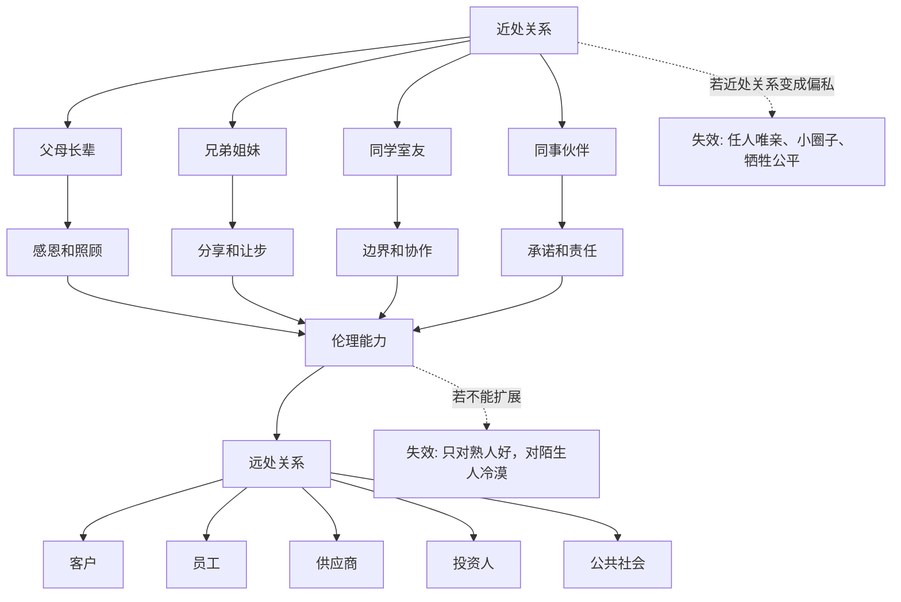
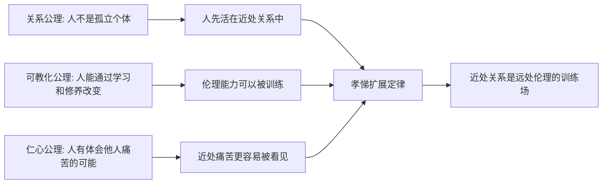
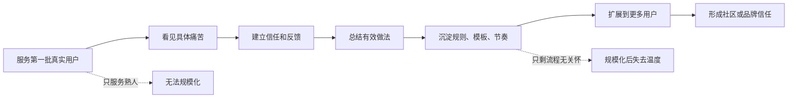

## 儒家思维筑基课: 孝悌扩展定律: 近处关系是远处伦理的训练场

### 作者
digoal

### 日期
2026-05-18

### 标签
儒家思维 , 孝悌扩展 , 近处关系 , 责任训练 , 信任 , 边界 , 产品用户 , 运营服务 , 创业治理 , 投资分析

----

## 背景

> 面向对象: 大学生、产品经理、运营经理、创业者、有投资需求的人
> 核心问题: 世界表面变化很快，为什么一个人在家庭、同学、同事这些近处关系中的行为，常常能预测他在团队、商业、投资和公共关系中的长期可信度？
> 先说结论: 孝悌扩展定律说的是: 人对远处陌生人的责任能力，往往先在近处关系中被训练出来。近处关系让人学习感恩、照顾、边界、承诺、冲突处理和角色责任。但这条定律有边界: 孝悌不是无条件服从亲近的人，也不是任人唯亲；它真正训练的是可扩展的责任能力，而不是小圈子偏私。

## 一张图先看懂



## 求真讲法

### 它到底说了什么

“孝悌扩展定律”可以表述为:

> 人最早学习责任、信任、边界和照顾的地方，通常不是抽象社会，而是近处关系；近处关系处理得是否成熟，会影响一个人能否把伦理能力扩展到更远的人。

这里的“孝”，不是盲目听父母的话，而是对生命来源、养育成本、代际责任和亲情边界有真实理解。  
这里的“悌”，不是只对兄弟姐妹客气，而是学习与同辈相处时的尊重、让步、协作和不独占。

所以它不是在说:

```text
对家人好 = 一定对社会好
```

而是在说:

```text
近处关系训练出的责任能力，如果能摆脱偏私并被扩展，就会成为远处伦理的基础。
```

一个人如果在近处关系里长期不守承诺、不承担成本、不尊重边界，只在远处关系里讲宏大责任，往往要谨慎。因为远处关系更抽象、更容易包装，近处关系更能暴露真实行为模式。

### 它是怎么来的

在经典儒家中，《论语》说“孝弟也者，其为仁之本与”。教学性地理解，这不是说“家庭利益高于一切”，而是说人的仁爱能力常从亲近关系开始发生。

从底层公理看，这条定律可以这样推出:



这个推导不是数学证明，而是实践逻辑:

1. 人一开始不是面对抽象社会，而是面对家人、同学、同事等近处关系。
2. 近处关系中的成本、情绪和责任最难逃避。
3. 如果一个人能在近处关系中训练出稳定责任，就更有机会把它扩展到远处关系。
4. 如果这种责任停留在小圈子里，就会变成偏私，而不是仁。

现代领域中，也能看到类似规律:

| 领域 | 孝悌扩展的现代说法 | 关键问题 |
|---|---|---|
| 家庭教育 | 早期关系训练信任和责任 | 一个人如何理解照顾、边界和承诺 |
| 心理学 | 依恋、同理心和亲社会行为发展 | 近处互动如何塑造人格和合作 |
| 管理学 | 小团队协作训练组织伦理 | 能否从熟人协作扩展到制度协作 |
| 产品 | 从核心用户出发理解更广用户 | 是否把真实照顾扩展成稳定体验 |
| 创业 | 早期团队关系影响公司文化 | 亲近关系能否制度化，而非家族化 |
| 投资 | 关键人处理近处利益的方式暴露治理质量 | 是否尊重小股东、员工和伙伴 |

### 它依赖哪些假设

孝悌扩展定律依赖几个前提:

1. 人的伦理能力不是一开始就面向全人类，而常从具体关系开始。
2. 近处关系更高频、更真实，更容易暴露责任感和边界感。
3. 近处训练出的能力可以被抽象、迁移和制度化。
4. 如果不能从亲疏关系中走出来，孝悌会退化成偏私。
5. 远处伦理需要稳定规则，否则只靠情感无法覆盖陌生人社会。

这些前提让我们从“这个人对熟人好不好”继续追问:

```text
他是否只对熟人好?
他能否把近处责任扩展到陌生人?
他是否用亲情、兄弟情、自己人掩盖不公平?
他能否把信任从人情关系升级为制度关系?
```

### 孝悌不是小圈子主义

孝悌最容易被误解成“家人永远优先”“自己人永远优先”。这正是它的失效版本。

成熟孝悌与小圈子主义的区别是:

| 类型 | 近处关系 | 远处关系 | 结果 |
|---|---|---|---|
| 成熟孝悌 | 训练责任和感恩 | 扩展为公平、信任和公共责任 | 近处有情，远处有义 |
| 偏私孝悌 | 只维护亲近者利益 | 牺牲陌生人和规则 | 任人唯亲，破坏公平 |
| 空洞博爱 | 口头关心远方 | 逃避身边责任 | 宏大叙事，近处失信 |
| 冷漠个人主义 | 不承认关系责任 | 只看个人利益 | 合作成本高，信任薄 |

真正的孝悌扩展，不是把家庭逻辑原封不动搬到社会，而是把近处关系中训练出的责任、尊重和边界，转化为可普遍化的伦理能力。

### 一个可复用的六问模型

判断一个人、团队、产品、创业公司或投资标的，可以问六个问题:

| 问题 | 看什么 | 反面信号 |
|---|---|---|
| 他如何对待近处的人 | 家人、同学、同事、早期伙伴 | 对远人热情，对近人失信 |
| 他是否尊重边界 | 亲近不等于无限索取 | 用亲情和义气压人 |
| 他能否承担成本 | 照顾不是口头表达 | 好处自己拿，成本给亲近者 |
| 他能否公平扩展 | 从熟人责任走向陌生人责任 | 只照顾自己人 |
| 他能否制度化 | 把信任变成规则和流程 | 永远靠人情协调 |
| 他如何处理冲突 | 近处冲突是否能讲理讲义 | 用身份压制问题 |

这六问能帮助你识别一个人或组织的伦理能力是否真的可扩展。

### 常见误解

| 误解 | 更准确的理解 |
|---|---|
| 孝就是服从父母 | 成熟孝包含照顾、感恩、边界和正当劝谏 |
| 悌就是听哥哥姐姐的话 | 悌更重要的是同辈中的尊重、让步和协作 |
| 对家人好就一定可靠 | 还要看能否把责任扩展到陌生人和规则 |
| 讲孝悌就是任人唯亲 | 任人唯亲是孝悌的退化，不是成熟孝悌 |
| 现代社会不需要孝悌 | 现代社会更需要把近处责任升级为公共责任 |

## 求存讲法

### 它有什么用

孝悌扩展定律的最大用途，是帮你判断一个人的责任能力是否真实、稳定、可扩展。

很多表面现象容易包装:

- 对外演讲很有理想。
- 简历写得很漂亮。
- 产品口号很有人文关怀。
- 公司宣传很重视用户和员工。
- 创始人故事很感人。

但近处关系往往更难伪装:

- 他对共同生活的人是否守信。
- 他对早期伙伴是否公平。
- 他对基层员工是否尊重。
- 他对老客户是否负责。
- 他对供应商和小股东是否讲信用。

一个人或组织如果连近处关系都长期处理不好，却声称能对远处人负责，通常需要更强证据。

### 它怎么迁移到生活

对大学生来说，孝悌扩展不只是家庭伦理，也包括宿舍、同学、项目组和社团。

一个人如何处理这些近处关系，会训练他未来的合作能力:

```text
能不能按时完成自己的部分
能不能照顾公共空间
能不能在冲突时讲事实
能不能不把熟人的帮助当理所当然
能不能在亲近关系里仍然尊重边界
```

这些能力看似普通，实际上是未来管理、创业、投资和公共合作的基础。

### 它怎么迁移到产品

产品中的孝悌扩展，可以理解为: 先从最具体、最靠近的用户关系中训练真实理解，再把这种理解扩展为更稳定的产品能力。

| 产品阶段 | 近处关系 | 扩展方式 |
|---|---|---|
| 早期验证 | 和核心用户深聊 | 找到真实痛点和使用场景 |
| MVP交付 | 认真服务第一批用户 | 把手工照顾沉淀为流程 |
| 增长阶段 | 观察不同用户群差异 | 把个别经验抽象为产品规则 |
| 规模化 | 处理投诉、退款、隐私 | 把近处信任变成系统信任 |
| 平台化 | 协调多方角色 | 用规则覆盖陌生人协作 |

好的产品不是只服务熟人用户，而是从近处用户身上学会尊重真实问题，再把这种尊重做成可扩展体验。

### 它怎么迁移到运营

运营里的孝悌扩展，是从小规模真实关系到大规模稳定关系的过程。



很多运营早期靠人肉服务有效，规模一大就崩，是因为没有把近处照顾转化为稳定机制。  
也有很多运营规模化后变冷，是因为流程扩展了，但近处关系中学到的真实关怀丢掉了。

### 它怎么迁移到创业

创业公司早期常常像一个小家庭: 人少、关系近、沟通快、信任强。但创业者必须警惕两种极端。

第一种是只靠近处关系:

- 合伙人靠兄弟情，不写清楚股权和退出。
- 招人只招熟人，不看能力和岗位匹配。
- 供应商靠私人关系，不建立验收和合同。
- 客户靠创始人亲自照顾，无法复制交付。

第二种是过早丢掉近处责任:

- 一增长就忘记早期客户。
- 一融资就牺牲早期员工承诺。
- 一规模化就把用户变成指标。
- 一制度化就失去真实照顾。

成熟创业要做的是:

```text
近处信任 -> 明确规则 -> 可复制流程 -> 公平制度 -> 远处协作
```

这才是孝悌扩展在公司里的现代版本。

### 它怎么迁移到投融资

投资中，孝悌扩展定律能帮助判断管理层和公司治理。

| 投资观察点 | 近处关系信号 | 扩展后的长期含义 |
|---|---|---|
| 创始团队 | 合伙人关系是否公平透明 | 是否能建立可信治理 |
| 早期员工 | 承诺是否兑现 | 组织是否有长期信用 |
| 老客户 | 是否持续负责 | 收入质量和口碑是否稳定 |
| 供应商 | 是否按约付款、合理分担风险 | 供应链是否可持续 |
| 小股东 | 信息披露是否尊重外部人 | 资本市场信用是否可靠 |

如果一家公司对最靠近自己的相关方都不讲信用，却对资本市场讲长期主义，要谨慎。近处关系常常是治理质量的压力测试。

这不是具体投资建议，而是一种分析框架: 管理层如何处理身边人、早期人、弱势交易方，常会预示它未来如何处理更大范围的利益关系。

### 它的适用范围和边界

| 场景 | 孝悌扩展有效的条件 | 边界 |
|---|---|---|
| 生活关系 | 近处互动能训练责任和边界 | 不能用孝悌要求无条件服从 |
| 产品设计 | 近处用户能暴露真实需求 | 不能只服务熟人样本 |
| 运营增长 | 小规模服务能沉淀可复制机制 | 不能永远靠人肉维护 |
| 创业管理 | 早期信任能制度化 | 不能把公司变成家族关系 |
| 投资分析 | 近处利益关系暴露治理质量 | 不能只凭私人道德判断替代财务分析 |

孝悌扩展最重要的边界是: 近处关系只是训练场，不是最终边界。

更成熟的表达是:

```text
成熟孝悌 = 近处有责任 + 远处能公平 + 亲疏不破坏规则
```

如果只停留在近处，就是偏私。  
如果跳过近处责任，只谈远方宏大理想，就是空洞。

### 正例: 怎么用它提升能力

假设你是创业公司创始人，早期有十个核心客户。

点状思维会说:

```text
客户少 -> 创始人亲自服务 -> 满意就行 -> 继续拉新
```

孝悌扩展思维会说:

```text
近处客户是训练场 -> 找出真实痛点 -> 沉淀服务标准
-> 做成产品能力和交付流程 -> 扩展到更多客户
```

于是你会做几件事:

- 记录每个客户的真实问题，而不是只靠记忆。
- 把创始人亲自解释的话，写成清楚文档和产品提示。
- 把常见交付问题，做成验收标准和客服流程。
- 把客户抱怨当作系统改进机会，而不是私人关系维护。
- 不因为客户熟就随口承诺，也不因为关系近就忽视合同边界。

这样，近处关系不是小圈子，而是产品和组织能力的训练场。

### 反例: 前提不成立会怎样

某创业公司早期全靠熟人关系发展。创始人说“我们都是兄弟”，所以很多事不写清楚:

- 股权只有口头承诺。
- 岗位职责靠默契。
- 亲戚朋友优先进入核心岗位。
- 客户付款和交付边界不明确。
- 财务报销靠信任，不留记录。

早期看起来很团结，规模一大就出问题。贡献不同但分配不清，能力不足的人占据关键岗位，外部员工觉得没有公平机会，客户开始质疑交付。

这里失败不是因为近处关系不好，而是近处关系没有扩展成公平制度。孝悌扩展定律的前提不成立时，亲近关系会从信任资产变成治理负债。

## 思考

孝悌扩展定律对现代人最大的提醒是: 不要把“近处责任”和“远处理想”割裂。

有些人对远方议题非常热情，却对身边人的承诺经常失信。  
有些组织对外宣传社会责任，却对员工、客户和供应商长期不公平。  
有些公司讲生态共赢，却先压榨最靠近自己的合作伙伴。  
有些投资故事讲改变世界，却连小股东的信息权都不尊重。

这类现象的问题，不是人不能关心远方，而是远方伦理如果不能回到近处关系接受检验，就容易变成表演。

反过来，如果一个人只对亲近的人好，对陌生人冷漠甚至不公，也不是成熟伦理。现代社会需要把近处训练出的责任扩展到更大范围:

```text
从家人到同学
从同学到同事
从同事到客户
从客户到陌生用户
从熟人社会到制度社会
```

一个更锋利的问题是:

> 你在近处关系中训练出的责任，是正在扩展为公平，还是正在退化为偏私？

这能帮助我们穿透很多表面道德叙事。

## 最后记住

1. 孝悌扩展定律说的是: 近处关系常常是责任、信任、边界和协作能力的训练场。
2. 孝不是盲从，悌不是等级服从；成熟孝悌包含感恩、照顾、边界、劝谏和公平扩展。
3. 近处关系处理方式，常能暴露一个人或组织的长期信用和治理质量。
4. 产品、运营、创业和投资中，要把早期近处信任沉淀为可扩展制度，而不是停留在熟人关系。
5. 成熟孝悌是近处有责任、远处能公平、亲疏不破坏规则。

## 参考资料

- 《论语》: “孝弟也者，其为仁之本与”及关于孝、悌、仁、忠恕的经典表达。
- 《孟子》: 亲亲而仁民、仁心扩充、人伦关系等思想资源。
- 《大学》: 修身、齐家、治国、平天下的由近及远结构。
- 《礼记》: 家庭伦理、角色秩序和礼制教化的思想资源。
- John Bowlby, *Attachment and Loss*, 1969: 依恋关系对人格和关系能力发展的影响。
- James S. Coleman, “Social Capital in the Creation of Human Capital”, 1988: 家庭和社会关系中的信任、规范与人力资本。
- Francis Fukuyama, *Trust*, 1995: 信任、社会资本与经济组织能力。
- 本文为跨学科教学性重构，目的是提供生活、产品、运营、创业和投资中的底层分析框架，不构成具体投资建议。
  
#### [PostgreSQL 解决方案集合](../201706/20170601_02.md "40cff096e9ed7122c512b35d8561d9c8")
  
  
#### [德哥 / digoal's Github - 公益是一辈子的事.](https://github.com/digoal/blog/blob/master/README.md "22709685feb7cab07d30f30387f0a9ae")
  
  
#### [About 德哥](https://github.com/digoal/blog/blob/master/me/readme.md "a37735981e7704886ffd590565582dd0")
  
  

  
