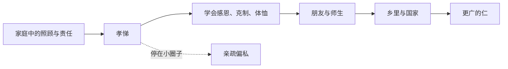

## 儒家思维筑基课: 孝悌扩展定律: 近处关系是远处伦理的训练场

### 作者
digoal

### 日期
2026-05-18

### 标签
孝悌扩展定律 , 儒家思想 , 孝悌 , 仁 , 家庭伦理 , 由近及远 , 亲亲 , 公共伦理 , 责任 , 边界

----

## 背景

> 面向对象: 高中生到大学低年级读者
> 核心问题: 儒家为什么把孝悌看得这么重要？这会不会导致只爱自己家人？
> 先说结论: 孝悌扩展定律认为，人在最亲近关系中学习感恩、责任、克制和体恤，再把这种能力扩展到更远的人群。近处不是终点，而是起点。

## 一张图先看懂

## 求真讲法

### 它到底说了什么

《论语》说“孝弟也者，其为仁之本与”。这里的“本”不是全部，而是根部。儒家认为，一个人最早学习如何承担责任，往往发生在家庭和亲近关系里。

孝悌不是只对父母兄长好，而是通过近处关系训练仁的能力。

### 它是怎么来的

抽象地爱天下人很容易，具体地照顾身边人很难。儒家从近处开始，是因为近处关系最真实、最长期、最能暴露人的自私和耐心不足。

如果一个人对身边长期照顾自己的人毫无感恩，却宣称爱所有人，儒家会怀疑这种爱是否可靠。

### 它依赖哪些假设

| 依赖公理 | 对孝悌扩展的支撑 |
|---|---|
| 关系公理 | 人在亲近关系中形成责任 |
| 仁心公理 | 对亲人的体恤可以扩充 |
| 可教化公理 | 家庭经验能训练品格 |
| 中和公理 | 孝需要分寸，不是盲从 |

### 常见误解

孝不是绝对服从。父母如果做错事，子女可以用合适方式劝谏。孝也不是把家庭利益放在公共规则之上，否则会从仁滑向私。

## 求存讲法

### 它有什么用

孝悌扩展定律提醒我们，伦理能力要从真实关系中练。感恩、耐心、照顾、沟通、边界，不是靠背概念获得的。

### 它怎么迁移到熟悉领域

你能否认真听家人说话、对同学守信、对老师有基本尊重，这些都是公共伦理的预备训练。一个人在小事中练习责任，才可能在大事中可靠。

### 它的适用范围和边界

| 场景 | 合理孝悌 | 失效方式 |
|---|---|---|
| 家庭 | 感恩、照顾、劝谏 | 盲从和控制 |
| 朋友 | 讲信义 | 义气压倒原则 |
| 公共生活 | 从亲近扩展到陌生人 | 只护自己人 |
| 组织 | 尊重前辈经验 | 论资排辈 |

### 正例: 怎么用它提升能力

你可以从一个小练习开始: 对家人的付出具体表达感谢，并在不同意见时用清楚但不羞辱的方式沟通。这是在练习仁、礼和中。

### 反例: 前提不成立会怎样

有人为了帮亲戚，破坏公共规则、挤掉更合格的人。他以为这是孝悌，其实是把近处关系绝对化，切断了向公共伦理的扩展。

## 思考

孝悌真正难的地方，是从亲近之爱走向公正之爱。只爱近处会偏私，只爱抽象远方又可能空洞。儒家的理想是由近及远，而不是止于近处。

## 最后记住

1. 孝悌是仁的根部，不是仁的全部。
2. 近处关系训练真实伦理能力。
3. 孝不是盲从，悌不是论资排辈。
4. 不能把亲情凌驾于公共规则之上。

## 参考资料

- 《论语》: “孝弟也者，其为仁之本与”。
- 《孟子》: 亲亲而仁民、老吾老以及人之老相关思想。
- 《礼记》: 家庭礼制与角色责任。

  
#### [PostgreSQL 解决方案集合](../201706/20170601_02.md "40cff096e9ed7122c512b35d8561d9c8")
  
  
#### [德哥 / digoal's Github - 公益是一辈子的事.](https://github.com/digoal/blog/blob/master/README.md "22709685feb7cab07d30f30387f0a9ae")
  
  
#### [About 德哥](https://github.com/digoal/blog/blob/master/me/readme.md "a37735981e7704886ffd590565582dd0")
  
  

  
