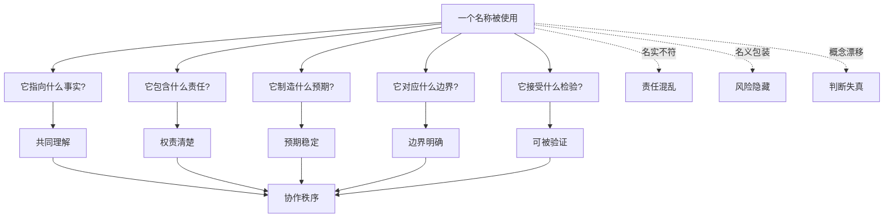
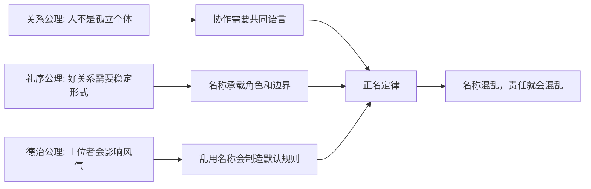
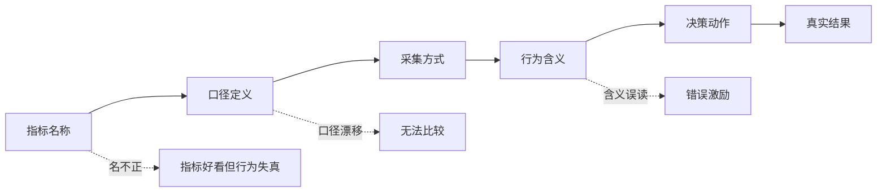

## 儒家思维筑基课: 正名定律: 名称混乱，责任就会混乱

### 作者
digoal

### 日期
2026-05-18

### 标签
儒家思维 , 正名定律 , 名实相符 , 权责边界 , 概念校准 , 产品定位 , 运营指标 , 创业叙事 , 商业模式 , 投资风控

----

## 背景

> 面向对象: 大学生、产品经理、运营经理、创业者、有投资需求的人
> 核心问题: 世界表面变化很快，为什么很多争论、产品失败、组织扯皮和投资踩坑，并不是因为没人努力，而是因为一开始“名”就没有说清楚？
> 先说结论: 正名定律说的是: 名称不是标签，而是责任、边界、预期和判断标准的入口。岗位名、产品名、指标名、合同名、商业模式名、投资叙事名一旦混乱，人们就会按不同含义行动，最后责任不清、风险隐藏、协作失控。正名不是维护头衔，而是让名称、事实、责任和行动相匹配。

## 一张图先看懂



## 求真讲法

### 它到底说了什么

“正名定律”可以表述为:

> 一个系统要稳定运行，必须让名称和事实、角色和责任、承诺和能力、指标和真实价值相匹配；名称一旦混乱，行动和责任就会混乱。

这里的“名”不只是名字，而是所有用来组织世界的概念:

- 岗位名: CEO、产品经理、运营、合伙人、顾问。
- 产品名: 平台、工具、社区、AI助手、基础设施。
- 指标名: 活跃、留存、收入、利润、用户增长。
- 合同名: 合作、代理、投资、咨询、外包。
- 叙事名: 长期主义、生态、赋能、私域、护城河。

名称会影响人如何理解责任。比如一个人叫“合伙人”，但没有股权、决策权和风险承担，那他到底是合伙人，还是高级员工？一个产品叫“AI导师”，但只会生成模板答案，它到底是导师，还是内容工具？一家公司说自己是“平台”，但实际只靠自营销售，它到底是平台，还是渠道商？

更简洁地说:

```text
稳定协作 = 名称清楚 x 事实匹配 x 责任明确 x 检验标准一致
```

### 它是怎么来的

在经典儒家里，“正名”常被理解为“名不正，则言不顺”。教学性地理解，它不是让人迷信头衔，而是指出一个治理问题: 如果名称和实际责任错位，语言就无法指导行动，行动就无法承担后果。

从底层公理看，正名定律可以这样推出:



这个推导不是数学证明，而是实践逻辑:

1. 人要协作，必须先共享概念。
2. 概念会分配角色、责任、边界和预期。
3. 如果名称被滥用，强者可以借名逃责，弱者会承担混乱成本。
4. 因此，正名是协作和治理的基础。

现代领域中，正名以不同形式出现:

| 领域 | 正名的现代说法 | 关键问题 |
|---|---|---|
| 逻辑和科学 | 定义清楚、概念可检验 | 讨论的是同一个东西吗 |
| 法律 | 权利义务、合同性质、责任主体 | 谁承担什么后果 |
| 管理 | 岗位职责、RACI、组织边界 | 谁负责、谁决策、谁协作 |
| 产品 | 定位、用户、场景、价值主张 | 产品到底解决什么问题 |
| 运营 | 指标口径、活动规则、用户分层 | 数据代表真实行为吗 |
| 投资 | 商业模式、利润质量、护城河定义 | 叙事是否对应可持续现金流 |

### 它依赖哪些假设

正名定律依赖几个前提:

1. 人通过语言和概念理解世界、分配任务和判断责任。
2. 同一个名称若被不同人理解为不同含义，协作会产生摩擦。
3. 名称会制造预期，因此乱命名会制造错误承诺。
4. 权力较强的一方可能利用模糊名称隐藏责任。
5. 长期信任需要名实相符: 说的是什么，做的就应当接近什么。

这些前提让我们从“这个词听起来很高级”转向更成熟的问题:

```text
这个名称到底指什么?
它不指什么?
谁因这个名称获得权力?
谁因这个名称承担责任?
它能被什么事实验证或证伪?
```

### 正名不是咬文嚼字

正名常被误解为抠字眼。其实正名不是为了争词，而是为了防止行动失真。

```text
咬文嚼字: 只争表述，不解决责任
粗糙表达: 名称模糊，后果混乱
成熟正名: 定义清楚，边界清楚，责任清楚，检验清楚
```

如果一个会议里，大家都在说“增长”，但有人指新增注册，有人指活跃用户，有人指收入，有人指利润，有人指估值，那么讨论越热烈，偏差越大。

### 一个可复用的六问模型

面对一个岗位、产品、项目、指标、合同或投资叙事，可以用“正名六问”:

| 问题 | 看什么 | 反面信号 |
|---|---|---|
| 它叫什么 | 使用了哪个名称 | 名称很大，事实很小 |
| 它是什么 | 对应的真实对象和机制 | 概念漂移，随场景变义 |
| 它不是什么 | 边界和排除项 | 什么都能装进去 |
| 谁负责 | 责任主体和后果承担 | 只有头衔，没有责任 |
| 怎么验证 | 指标、证据、交付标准 | 只能讲故事，不能验收 |
| 谁受影响 | 用户、员工、客户、股东、伙伴 | 成本被名称包装隐藏 |

这六问能帮助你识别“名义上很美，实际上失真”的系统。

### 常见误解

| 误解 | 更准确的理解 |
|---|---|
| 正名就是维护等级 | 正名的核心是名实相符、权责匹配 |
| 名称只是包装 | 名称会塑造预期、责任和行动 |
| 概念越高级越好 | 高级概念若不可验证，容易隐藏风险 |
| 大家心里懂就行 | 长期协作不能靠默契猜测 |
| 改个名字就能改变事实 | 正名不是改名，而是让名称回到事实和责任 |

## 求存讲法

### 它有什么用

正名定律的最大用途，是帮你识别“概念包装”和“责任漂移”。

很多麻烦都从名称混乱开始:

- 明明是销售，却叫顾问，责任从成交转成建议。
- 明明是广告，却叫内容，用户防备心下降。
- 明明是高风险投资，却叫稳健理财，风险被遮蔽。
- 明明是加班压榨，却叫奋斗文化，成本被美化。
- 明明是补贴拉新，却叫用户增长，质量被忽略。
- 明明是数据造假，却叫口径优化，真相被稀释。

一旦名称错误，判断会从源头偏掉。

### 它怎么迁移到生活

生活中，很多冲突来自名称和责任不匹配。

比如小组作业里，有人说自己是“负责人”，但只分配别人做事，不承担结果、不整合材料、不对外沟通。这个“负责人”的名就不正。

更清楚的正名应该是:

```text
负责人 = 目标拆解 + 分工协调 + 进度追踪 + 结果兜底 + 对外沟通
```

如果只拥有指挥权，却不承担兜底责任，就不是负责人，而是临时指派者。名称一正，冲突会少很多。

### 它怎么迁移到产品

产品里，正名决定定位和用户预期。

| 产品名称或定位 | 正名追问 | 名不正的后果 |
|---|---|---|
| AI助手 | 它能助手到什么程度，不能做什么 | 用户过度信任或错误依赖 |
| 社区 | 用户之间是否真的有关系和规则 | 只是内容流，却期待社区忠诚 |
| 平台 | 是否连接多方并形成规则 | 自营业务伪装成平台叙事 |
| 私域 | 是否有真实关系和信任 | 把流量池误认为关系资产 |
| 基础设施 | 是否不可替代、稳定、低迁移 | 普通工具被高估 |

产品经理如果不正名，很容易把“愿景”当“现实”，把“用户想象”当“用户需求”，把“功能集合”当“产品定位”。

### 它怎么迁移到运营

运营里，正名最常见的问题是指标口径混乱。



比如“活跃用户”这个指标:

- 是打开过 App 就算活跃？
- 是完成核心动作才算活跃？
- 是自然活跃，还是活动刺激活跃？
- 是高质量用户，还是薅羊毛用户？

如果这些不说清楚，运营团队可能为了“活跃”制造大量低价值动作。名称没正，指标就会诱导错误行为。

### 它怎么迁移到创业

创业公司尤其容易被漂亮名称诱惑。

| 创业叙事 | 正名检查 |
|---|---|
| 我们是平台 | 是否有多边网络效应，还是只是撮合中介 |
| 我们有护城河 | 是技术、品牌、数据、渠道，还是先发幻觉 |
| 我们是生态 | 多方是否互相依赖，还是资源松散堆积 |
| 我们做AI原生 | AI是否改变核心流程，还是只加了接口 |
| 我们长期主义 | 是否有现金流、资本纪律和组织耐心支撑 |

创业者如果不能正名，就会把融资语言当经营事实。团队也会被误导: 明明该补交付能力，却天天讲生态；明明该验证需求，却天天讲平台。

正名不是打击愿景，而是让愿景回到当前阶段:

```text
现在是什么 -> 正在验证什么 -> 还不是什麼 -> 什么时候才配叫那个名字
```

### 它怎么迁移到投融资

投资里，正名定律非常关键，因为市场最容易用名称包装风险。

| 投资名称 | 正名追问 |
|---|---|
| 成长股 | 增长来自真实需求、价格上涨、并购，还是会计口径 |
| 价值股 | 便宜是低估，还是价值陷阱 |
| 护城河 | 客户真的难离开，还是暂时没有更好选择 |
| 高利润 | 来自效率优势，还是压榨、垄断或周期红利 |
| 现金流好 | 是经营现金流，还是延迟付款和一次性因素 |
| 稳健理财 | 底层资产、杠杆、流动性和期限错配是什么 |

一个投资者如果不正名，会把故事当事实，把行业热词当护城河，把会计利润当现金流，把短期增长当长期复利。

这不是具体投资建议，而是一种分析框架: 投资前先正名，确认你买的到底是什么、赚的到底是什么钱、承担的到底是什么风险。

### 它的适用范围和边界

| 场景 | 正名定律有效的条件 | 边界 |
|---|---|---|
| 生活协作 | 名称会影响责任和预期 | 不能用定义争论逃避行动 |
| 产品设计 | 定位会影响用户理解 | 名称清楚不等于产品有价值 |
| 运营增长 | 指标名称会引导行为 | 指标正名不能替代执行 |
| 创业管理 | 叙事会影响资源配置 | 早期探索允许临时命名，但要标注假设 |
| 投资分析 | 概念包装会影响估值和风险判断 | 正名不能替代财务、行业和治理分析 |

正名定律最重要的边界是: 正名只是开始，不是结果。

更成熟的表达是:

```text
成熟正名 = 定义清楚 + 边界清楚 + 责任清楚 + 证据清楚 + 行动匹配
```

如果只定义清楚，却没有行动匹配，也只是另一种形式主义。

### 正例: 怎么用它提升能力

假设你是运营经理，老板说下季度目标是“提升用户增长”。

点状思维会直接做:

```text
买量 -> 活动 -> 拉新 -> 报新增用户
```

正名思维会先问:

```text
这里的用户增长到底指什么?
新增注册、有效激活、首单转化、复购用户、付费用户、还是高质量留存用户?
```

进一步正名:

- 用户: 是否完成核心动作的人才算用户。
- 增长: 是自然增长、付费增长，还是活动短期增长。
- 质量: 是否看 7 日留存、30 日留存、复购和客诉。
- 成本: CAC 是否可承受，是否透支品牌。
- 责任: 产品、投放、运营、销售分别负责哪一段。

这样一来，团队不会为了漂亮新增数字去拉低质量用户，而会围绕真实增长设计动作。

### 反例: 前提不成立会怎样

某创业公司对外宣称自己是“AI基础设施平台”。但深入看:

- 客户主要来自项目制交付。
- 产品没有标准化接口和稳定文档。
- 收入依赖销售关系，不依赖平台网络效应。
- AI能力主要调用第三方模型，没有核心数据闭环。
- 客户迁移成本不高，续费依赖人工服务。

这里“AI”“基础设施”“平台”三个名称都在放大预期。融资时估值按平台讲，经营时能力按项目制做，团队资源按基础设施投入，客户体验却像外包服务。

名不正的后果是: 战略、资源、估值、组织和客户预期全部错位。前提不成立时，名称越高级，责任越混乱，风险越隐蔽。

## 思考

正名定律对现代社会尤其重要，因为现代商业非常擅长制造新词:

- 新消费、私域、生态、平台、AI原生、长期主义。
- 赋能、闭环、飞轮、护城河、第二曲线。
- 稳健收益、结构化产品、类现金管理。

新词本身不是坏事。世界变化确实需要新概念。但每一个新词都要接受正名:

```text
它描述了什么新事实?
它和旧概念有什么不同?
它承担什么责任?
它能被什么数据验证?
它是否隐藏了成本和风险?
```

很多人无法判断真伪，不是因为不聪明，而是因为没有先正名。只要名称被对方控制，判断框架就被对方控制。

一个更锋利的问题是:

> 如果不用这个高级名称，只描述事实、责任、现金流和风险，这件事还成立吗？

如果去掉名称后，价值还清楚，它可能是真东西。  
如果去掉名称后，只剩模糊愿景和情绪，它可能只是包装。

## 最后记住

1. 正名定律说的是: 名称混乱，责任、预期、边界和判断都会混乱。
2. 正名不是维护头衔，而是让名称、事实、责任和行动相匹配。
3. 产品、运营、创业和投资中，许多风险来自高级名称掩盖真实机制。
4. 成熟正名要做到定义清楚、边界清楚、责任清楚、证据清楚、行动匹配。
5. 判断一个概念是否可信，要问: 去掉漂亮名字，只看事实和责任，它还成立吗？

## 参考资料

- 《论语》: “名不正，则言不顺；言不顺，则事不成”等关于正名、语言和治理秩序的经典表达。
- 《礼记》: 角色、名分、礼制和秩序关系的思想资源。
- 《大学》: 格物、致知、诚意、正心中的概念校准和行动秩序。
- Ludwig Wittgenstein, *Philosophical Investigations*, 1953: 语言使用、意义和生活形式的哲学资源。
- Peter F. Drucker, *Management: Tasks, Responsibilities, Practices*, 1973: 管理中的目标、责任和组织角色。
- Michael E. Porter, *Competitive Strategy*, 1980: 战略定位、竞争优势和概念边界。
- Howard Marks, *The Most Important Thing*, 2011: 投资中对风险、价值和周期概念的辨析。
- 本文为跨学科教学性重构，目的是提供生活、产品、运营、创业和投资中的底层分析框架，不构成具体投资建议。
  
#### [PostgreSQL 解决方案集合](../201706/20170601_02.md "40cff096e9ed7122c512b35d8561d9c8")
  
  
#### [德哥 / digoal's Github - 公益是一辈子的事.](https://github.com/digoal/blog/blob/master/README.md "22709685feb7cab07d30f30387f0a9ae")
  
  
#### [About 德哥](https://github.com/digoal/blog/blob/master/me/readme.md "a37735981e7704886ffd590565582dd0")
  
  

  
