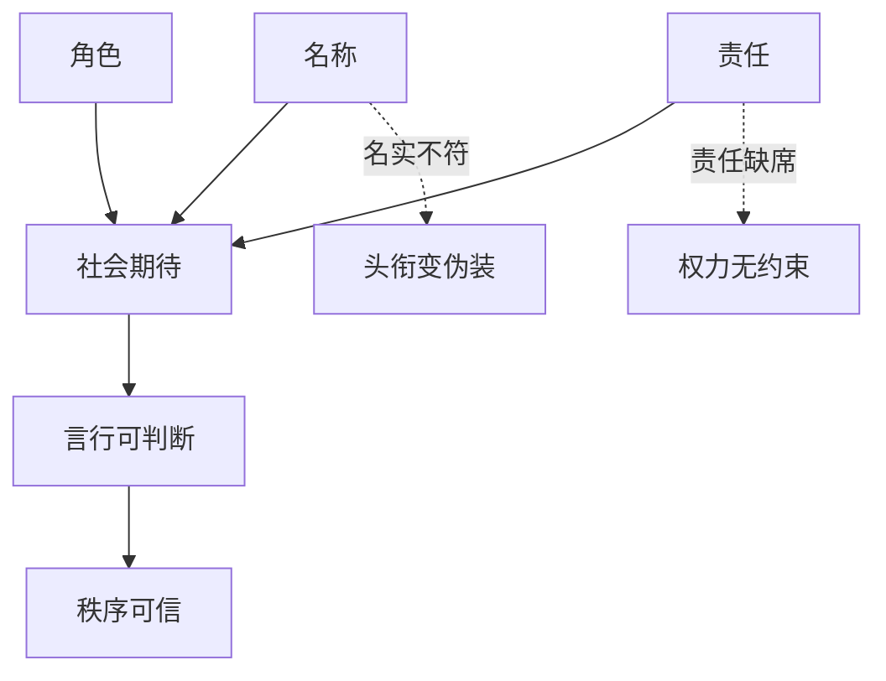

## 儒家思维筑基课: 正名定律: 名称混乱，责任就会混乱

### 作者
digoal

### 日期
2026-05-18

### 标签
正名定律 , 儒家思想 , 正名 , 名实相符 , 角色责任 , 权责匹配 , 礼 , 秩序 , 语言 , 组织治理

----

## 背景

> 面向对象: 高中生到大学低年级读者
> 核心问题: “名不正，则言不顺”为什么不只是文字游戏？
> 先说结论: 正名定律认为，称号、角色和实际责任必须相匹配。名称一旦被滥用，语言会失真，责任会逃逸，秩序会混乱。

## 一张图先看懂

## 求真讲法

### 它到底说了什么

孔子说“名不正，则言不顺”。正名不是单纯改名字，而是让名、实、责一致。君主要像君主，父亲要像父亲，老师要像老师，朋友要像朋友。

“像”不是摆架子，而是承担该角色的责任。

### 它是怎么来的

当一个社会的名称还在，但实际行为已经变了，秩序就会被语言欺骗。比如一个人叫“负责人”，却从不负责；一个制度叫“公平”，却暗中偏私；一个组织叫“家”，却只向成员索取。

儒家用正名来修复语言和责任之间的断裂。

### 它依赖哪些假设

| 依赖公理 | 对正名定律的支撑 |
|---|---|
| 关系公理 | 角色来自关系 |
| 礼序公理 | 角色需要可见规范 |
| 德治公理 | 上位角色尤其要名实一致 |
| 中和公理 | 角色责任要合情境，不可僵化 |

### 常见误解

正名不是维护等级特权。它同样要求上位者承担上位者的义务。如果君不君，就不能只要求臣臣。

正名也不是只讲称呼。称呼只是表层，真正关键是责任和行为。

## 求存讲法

### 它有什么用

正名定律能帮助我们识别许多现代问题: 头衔膨胀、职责不清、话术包装、权责不等。语言如果失真，治理和合作都会变难。

### 它怎么迁移到熟悉领域

小组作业中，“组长”这个名意味着协调、透明和承担，不是命令别人干活。公司里的“负责人”意味着对结果负责，不只是拿资源和权力。

### 它的适用范围和边界

| 场景 | 正名的价值 | 失效方式 |
|---|---|---|
| 学校 | 班干部职责清楚 | 只有头衔没有服务 |
| 公司 | 岗位权责匹配 | 权力大责任小 |
| 家庭 | 父母承担养育责任 | 只用身份压人 |
| 公共语言 | 概念不被滥用 | 用好词包装坏事 |

### 正例: 怎么用它提升能力

接手一个任务前，先确认: 我负责什么？我有什么权限？成功标准是什么？谁来配合？这就是现代版正名。

### 反例: 前提不成立会怎样

公司把员工叫“合伙人”，但员工没有分红、决策权和信息权，只承担加班义务。这里名称和实际责任不符，“合伙人”变成动员话术。

## 思考

正名定律提醒我们，语言不是中性的。谁能定义名称，谁就可能转移责任。成熟的人要追问: 这个名背后到底有没有相应的义务？

## 最后记住

1. 正名是让名称、角色、责任一致。
2. 头衔不是特权标签，而是义务标签。
3. 名不正会导致语言失真和责任逃逸。
4. 正名也约束上位者，不只是要求下位者。

## 参考资料

- 《论语》: “名不正，则言不顺”“君君，臣臣，父父，子子”。
- 《礼记》: 角色礼制与名分秩序。
- 《荀子》: 正名篇相关思想。

  
#### [PostgreSQL 解决方案集合](../201706/20170601_02.md "40cff096e9ed7122c512b35d8561d9c8")
  
  
#### [德哥 / digoal's Github - 公益是一辈子的事.](https://github.com/digoal/blog/blob/master/README.md "22709685feb7cab07d30f30387f0a9ae")
  
  
#### [About 德哥](https://github.com/digoal/blog/blob/master/me/readme.md "a37735981e7704886ffd590565582dd0")
  
  

  
