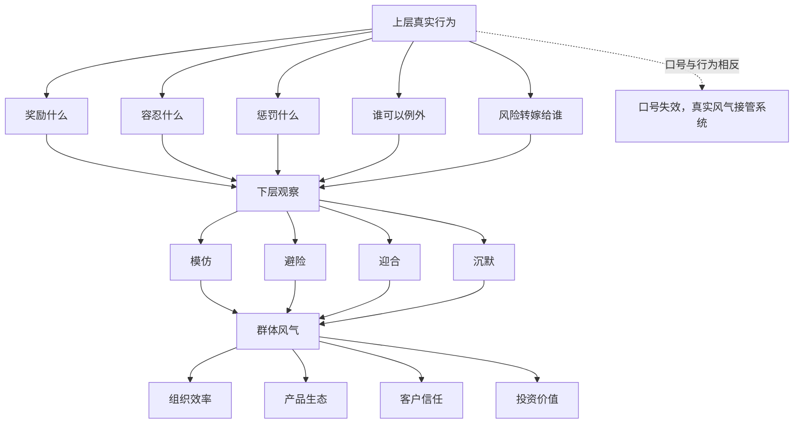
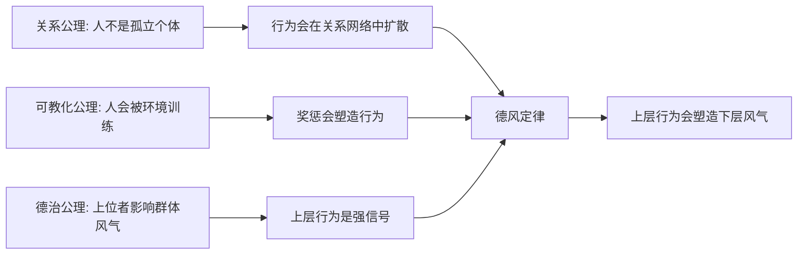
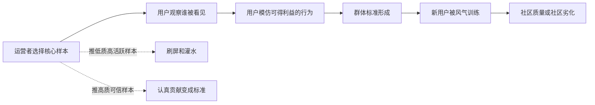

## 儒家思维筑基课: 德风定律: 上层行为会塑造下层风气

### 作者
digoal

### 日期
2026-05-18

### 标签
儒家思维 , 德风定律 , 上层行为 , 群体风气 , 奖惩机制 , 组织文化 , 平台治理 , 运营社区 , 创业管理 , 投资质量

----

## 背景

> 面向对象: 大学生、产品经理、运营经理、创业者、有投资需求的人
> 核心问题: 世界表面变化很快，为什么一个组织、平台或市场的风气，常常不是由口号决定，而是由上层人实际怎么做决定？
> 先说结论: 德风定律说的是: 上层行为会像风一样吹向下层，塑造群体的默认规则。谁被奖励、谁被容忍、谁被牺牲、谁能例外，会比墙上的价值观更有教育力。判断一个团队、产品生态、创业公司或投资标的，不能只看制度和口号，要看上层行为正在把下层训练成什么样。

## 一张图先看懂



## 求真讲法

### 它到底说了什么

“德风定律”可以表述为:

> 在一个群体或系统中，上层的真实行为会成为下层判断“什么才算数”的风向，并通过模仿、奖惩和避险逐渐变成群体风气。

这里的“上层”不只指政府或公司高管，也包括:

- 学校里的老师、社团负责人、学长学姐。
- 公司里的创始人、管理层、直属上级。
- 产品平台里的算法、规则制定者、头部创作者。
- 社群里的群主、版主、核心成员。
- 资本市场里的控股股东、管理层、头部机构。

“德风”不是抽象道德评价，而是上层行为形成的风向:

```text
上层怎么做 -> 下层怎么看 -> 群体怎么学 -> 风气怎么定型
```

如果上层守规则，下层会更容易相信规则。  
如果上层钻规则，下层会学习钻规则。  
如果上层压制坏消息，下层会学习报喜不报忧。  
如果上层奖励短期数据，下层会牺牲长期质量。  
如果上层尊重弱者，下层更可能保留边界和体面。

### 它是怎么来的

在儒家经典中，《论语》有“君子之德风，小人之德草，草上之风必偃”的表达。教学性地理解，不是说下层没有判断力，而是说权力、资源和奖惩位置不同，上层行为会天然成为强信号。

从底层公理看，德风定律可以这样推出:



这个推导不是数学证明，而是实践逻辑:

1. 人在关系网络中行动，会观察他人尤其是上层。
2. 人会学习环境里真正被奖励的行为。
3. 上层掌握资源、评价、机会和惩罚权，所以行为信号更强。
4. 因此，上层真实行为会长期塑造下层风气。

现代领域中，德风定律也有对应表达:

| 领域 | 德风的现代说法 | 关键问题 |
|---|---|---|
| 组织行为 | 领导示范、榜样效应、心理安全 | 员工学会说真话还是学会表演 |
| 管理学 | 文化来自被奖励和被容忍的行为 | 公司真正重视什么 |
| 产品平台 | 算法和规则塑造生态 | 平台奖励价值还是刺激 |
| 运营社区 | 核心成员行为带动群体标准 | 社群会沉淀质量还是噪音 |
| 创业 | 创始人行为复制成组织默认规则 | 公司长出什么性格 |
| 投资 | 管理层风格影响治理和资本配置 | 股东能否信任长期承诺 |

### 它依赖哪些假设

德风定律依赖几个前提:

1. 人会观察权力、资源和声望更高者的行为。
2. 群体成员会根据真实奖惩调整行为，而不只根据公开口号行动。
3. 下层面对不确定性时，会模仿上层以降低风险。
4. 上层行为会通过制度、流程、会议、算法和资源分配被放大。
5. 风气一旦形成，会反过来筛选人: 适应的人留下，不适应的人离开。

这些前提让我们从“组织说自己是什么”转向更成熟的问题:

```text
上层实际奖励了谁?
上层实际容忍了什么?
上层是否允许自己例外?
下层为了生存，正在被训练成什么样?
好人进入这个系统后，会变得更好还是更坏?
```

### 德风不是宿命

德风定律不是说下层永远只能被动接受。风向可以被改变，但改变风向通常需要上层行为改变、奖惩改变、制度改变和关键样本改变。

```text
坏风气: 上层例外 -> 下层模仿 -> 制度失信 -> 好人离开
改风气: 上层自守 -> 奖惩校准 -> 坏行为付成本 -> 好行为被保护
```

所以德风不是宿命论，而是提醒: 如果只要求下层改变，而上层行为不变，风气通常不会变。

### 一个可复用的六问模型

判断一个组织、平台、社群或投资标的，可以问六个问题:

| 问题 | 看什么 | 反面信号 |
|---|---|---|
| 上层奖励谁 | 资源、晋升、流量、奖金给了谁 | 奖励短期造假和迎合 |
| 上层容忍什么 | 哪些问题长期不被处理 | 容忍破坏规则的人 |
| 上层如何处理坏消息 | 保护说真话的人，还是惩罚报忧的人 | 报喜不报忧 |
| 上层是否自守 | 规则是否也约束强者 | 强者例外，弱者背锅 |
| 下层学会什么 | 员工、用户、商家、创作者的真实行为 | 大家都在表演指标 |
| 好人是否留下 | 高质量成员是否愿意长期参与 | 优质者退出，投机者留下 |

这六问能帮助你穿透表面制度，看到真实风气。

### 常见误解

| 误解 | 更准确的理解 |
|---|---|
| 风气是大家自发形成的 | 上层行为和奖惩信号通常是强变量 |
| 有制度就能纠正风气 | 制度若被上层选择性执行，会失去信用 |
| 只要培训下层就行 | 上层行为不变，培训会变成表演 |
| 上层偶尔例外无所谓 | 上层例外会重新定义规则边界 |
| 风气看不见，所以不重要 | 风气会进入效率、质量、留存、风险和估值 |

## 求存讲法

### 它有什么用

德风定律的最大用途，是帮你判断一个系统正在把人训练成什么样。

表面上，很多组织都有漂亮词:

- 诚信。
- 用户第一。
- 长期主义。
- 创新。
- 开放。
- 质量第一。

但真正的问题是:

```text
如果一个人在这里待三年，他会更诚实，还是更会包装?
会更专业，还是更会迎合?
会更敢说真话，还是更会沉默?
会更尊重用户，还是更会压榨用户?
```

这比口号更接近未来。

### 它怎么迁移到生活

在学校、社团和小团队里，德风同样存在。

一个小组负责人如果按贡献分配署名，成员会更愿意认真做事。  
如果负责人只照顾熟人，成员会学习站队。  
如果老师鼓励真实提问，课堂会更开放。  
如果老师嘲笑错误，学生会学习沉默。  
如果社团负责人守时，大家更容易守时。  
如果负责人总能例外，规则就会很快失效。

小系统里的风气训练，会影响一个人未来进入大系统后的行为模式。

### 它怎么迁移到产品

产品里的“上层”常常不是某个人，而是平台规则、推荐算法、审核机制和流量分配。

| 平台上层行为 | 下层会学到什么 | 长期后果 |
|---|---|---|
| 奖励标题党 | 夸张表达更有效 | 内容质量下降 |
| 容忍虚假评价 | 作假有利可图 | 用户信任下降 |
| 偏袒大商家 | 规则可被权力突破 | 中小参与者退出 |
| 只看停留时长 | 刺激内容胜出 | 用户疲劳和监管风险 |
| 保护优质创作者 | 认真创作有回报 | 生态质量提升 |

产品经理要意识到: 你设置的指标和规则，就是平台风气的上层行为。平台最后长成什么样，不是由愿景决定，而是由规则奖励什么决定。

### 它怎么迁移到运营

运营中的德风，是用核心样本和奖惩机制带出群体风气。



一个社群如果总把最吵的人推到前面，就会训练更多人变吵。  
一个活动如果只奖励邀请人数，就会训练用户乱拉人。  
一个内容平台如果只奖励爆点，就会训练创作者追逐刺激。

运营不是只做活动，而是在选择什么行为成为样板。

### 它怎么迁移到创业

创业公司早期的德风，几乎就是创始人和核心团队的行为外溢。

| 上层行为 | 下层风气 |
|---|---|
| 创始人承认错误 | 团队敢复盘 |
| 创始人甩锅 | 团队学会防御 |
| 高管尊重客户 | 一线更愿意解决问题 |
| 高管只要签单 | 销售会夸大承诺 |
| 管理层守现金纪律 | 团队理解资源约束 |
| 管理层追求面子工程 | 团队学会做表面功夫 |

创业公司最怕的不是没有制度，而是早期错误风气已经固化。等规模变大，风气会进入招聘、晋升、会议、销售、交付和财务，变成难改的组织惯性。

### 它怎么迁移到投融资

投资里，德风定律可以帮助判断管理层质量和公司长期风险。

| 投资观察点 | 德风追问 |
|---|---|
| 管理层薪酬 | 奖励真实回报，还是奖励规模扩张 |
| 信息披露 | 坏消息是否被及时说清 |
| 资本配置 | 是否克制追热点和乱并购 |
| 销售文化 | 是否允许误导客户换增长 |
| 内部晋升 | 真实贡献者上升，还是会包装者上升 |
| 股东关系 | 是否尊重小股东，还是只服务控制人 |

一家公司的风气，最终会进入财务结果。坏风气可能先表现为高增长，后来表现为应收账款、客户流失、员工离职、监管处罚、商誉减值和估值折价。

这不是具体投资建议，而是一种分析框架: 投资者不要只看结果数字，还要看这些数字背后的风气是如何被训练出来的。

### 它的适用范围和边界

| 场景 | 德风定律有效的条件 | 边界 |
|---|---|---|
| 学校和社团 | 负责人行为会被成员观察和模仿 | 下层仍有个人选择，不能完全归因上层 |
| 产品平台 | 规则、算法和流量分配能塑造行为 | 外部竞争和用户结构也会影响生态 |
| 运营社区 | 样本展示和奖惩机制影响参与者 | 过度控制会降低活力 |
| 创业公司 | 创始人和高管行为会固化文化 | 后期仍可通过制度和换人纠偏 |
| 投资分析 | 管理层风气影响长期现金流 | 风气分析不能替代财务和行业研究 |

德风定律最重要的边界是: 上层影响强，但不是唯一因素。

更成熟的表达是:

```text
群体风气 = 上层行为 + 奖惩机制 + 制度执行 + 成员选择 + 外部环境
```

但在这些变量中，上层行为往往是最早、最强、最能改变其他变量的信号。

### 正例: 怎么用它提升能力

假设你是一个内容社区的运营负责人，发现社区讨论质量下降。

点状思维会说:

```text
用户质量差 -> 加审核 -> 发公告 -> 禁言几个用户
```

德风思维会先问:

```text
我们过去奖励了什么行为?
谁被推荐到首页?
什么内容拿到了流量?
哪些破坏规则的人被容忍了?
认真贡献者有没有得到保护?
```

于是你可能会做出更有效的调整:

- 把高质量讨论放到更显眼位置。
- 对标题党、搬运和低质争吵降权。
- 公开解释治理规则，减少黑箱感。
- 给认真贡献者长期身份和权益。
- 让版主也遵守公开规则，避免权力例外。

这样改变的不是单个帖子，而是用户对“在这里什么行为有价值”的判断。

### 反例: 前提不成立会怎样

某公司口号是“客户第一”，但管理层实际奖励的是短期签单:

- 销售夸大承诺也能拿高提成。
- 交付团队反馈风险时被说成“不支持业务”。
- 客服解决老客户问题没有荣誉，拉新成交才有奖励。
- 高管会议只看新增合同，不看续费和投诉。
- 明知客户误解合同，也不主动澄清。

下层很快学会: 客户第一只是口号，签单才是真规则。

短期看，收入增长；长期看，交付崩溃、客户投诉、续费下降、员工互相甩锅。这里失败不是因为制度缺失，而是上层风向持续训练了错误行为。德风定律的前提不成立时，文化墙越漂亮，反差越大。

## 思考

德风定律最适合用来识别“口号和风气分离”的系统。

如果一个系统里，公开语言和真实奖励长期不一致，人们最终会相信真实奖励，而不是公开语言。

这也是为什么很多组织改革失败: 它们改了制度文件、培训材料、口号和流程，却没有改变上层行为。下层非常敏感，会观察:

- 谁真的升职了。
- 谁真的拿资源了。
- 谁犯错后没事。
- 谁说真话后倒霉。
- 谁牺牲质量却拿到结果。
- 谁守规则反而吃亏。

这些事实会组成风。

一个更锋利的问题是:

> 如果一个新人进入这个系统，只靠观察谁成功、谁失败、谁被容忍，他会学成什么样？

这个问题能预测很多组织、平台和公司的未来。

## 最后记住

1. 德风定律说的是: 上层真实行为会像风一样塑造下层风气。
2. 群体学习的不是口号，而是奖励、容忍、惩罚、例外和风险分配。
3. 产品、运营、创业和投资中，规则、算法、高管和头部样本都是风向源。
4. 坏风气会进入效率、质量、客户信任、员工流动、监管风险和估值折价。
5. 改风气不能只培训下层，必须校准上层行为、奖惩机制、制度执行和样本展示。

## 参考资料

- 《论语》: “君子之德风，小人之德草，草上之风必偃”等关于上层行为与群体风气的经典表达。
- 《大学》: 修身、齐家、治国、平天下的由内而外影响链条。
- 《孟子》: 仁政、义利之辨和上位者责任的思想资源。
- Edgar H. Schein, *Organizational Culture and Leadership*, 1985: 领导者行为、组织文化和深层假设。
- Albert Bandura, *Social Learning Theory*, 1977: 观察学习和榜样效应。
- Amy C. Edmondson, *The Fearless Organization*, 2018: 心理安全、说真话和组织学习。
- Charles Duhigg, *The Power of Habit*, 2012: 习惯、线索、奖励和组织行为变化。
- 本文为跨学科教学性重构，目的是提供生活、产品、运营、创业和投资中的底层分析框架，不构成具体投资建议。
  
#### [PostgreSQL 解决方案集合](../201706/20170601_02.md "40cff096e9ed7122c512b35d8561d9c8")
  
  
#### [德哥 / digoal's Github - 公益是一辈子的事.](https://github.com/digoal/blog/blob/master/README.md "22709685feb7cab07d30f30387f0a9ae")
  
  
#### [About 德哥](https://github.com/digoal/blog/blob/master/me/readme.md "a37735981e7704886ffd590565582dd0")
  
  

  
