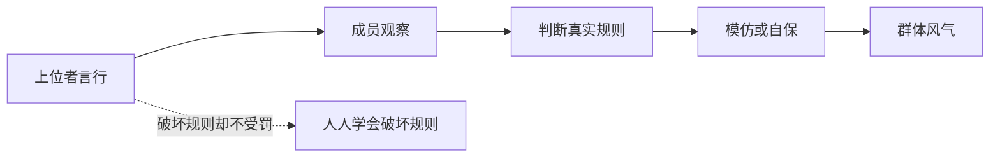

## 儒家思维筑基课: 德风定律: 上层行为会塑造下层风气

### 作者
digoal

### 日期
2026-05-18

### 标签
德风定律 , 儒家思想 , 德治 , 风气 , 榜样效应 , 上位者 , 组织文化 , 规则信用 , 权力 , 论语

----

## 背景

> 面向对象: 高中生到大学低年级读者
> 核心问题: 为什么一个组织的风气常常取决于掌权者实际怎么做？
> 先说结论: 德风定律认为，上位者的行为像风，群体成员的行为像草。风向长期稳定，草就会顺着倒。组织真正的规则，往往藏在上层实际奖励和容忍的行为里。

## 一张图先看懂

## 求真讲法

### 它到底说了什么

《论语》说“君子之德风，小人之德草，草上之风必偃”。这句话的重点不是贬低普通人，而是指出权力位置的示范效应。

人在组织中不只听口号，更会观察谁升迁、谁受罚、谁被保护、谁被牺牲。上层行为会变成风气。

### 它是怎么来的

儒家重视德治，因为它看见制度条文之外还有“默认规则”。如果默认规则与公开规则冲突，人们通常会相信默认规则。

比如公开说不许作弊，但作弊者得利；公开说尊重人才，但拍马屁者升迁。时间一久，风气就会被上层行为重新塑造。

### 它依赖哪些假设

| 依赖公理 | 对德风定律的支撑 |
|---|---|
| 德治公理 | 权力者品格影响群体 |
| 可教化公理 | 人会被环境和榜样塑造 |
| 礼序公理 | 公开规则需要行为维护 |
| 正名定律 | 角色责任要名实一致 |

### 常见误解

德风定律不是说普通人没有责任。它说的是，权力者的责任更大，因为他的行为会成为环境的一部分。

它也不是否定制度。恰恰相反，制度要靠上层带头遵守才有信用。

## 求存讲法

### 它有什么用

德风定律可以用来判断一个组织的真实文化。不要只看标语，看关键时刻: 违规者是否得利？说真话的人是否被保护？贡献是否被公平承认？

### 它怎么迁移到熟悉领域

班级里如果老师默许成绩好的学生插队，其他学生会学到规则可因身份改变。团队里如果负责人抢功，成员会学到合作不如自保。

### 它的适用范围和边界

| 场景 | 德风如何发生 | 边界 |
|---|---|---|
| 班级 | 老师和班干部塑造规则信用 | 学生也有选择责任 |
| 公司 | 高层奖惩塑造文化 | 需制度化而非靠个人 |
| 家庭 | 父母行为成为孩子样板 | 孩子不是完全被决定 |
| 政治 | 公权力行为影响社会信任 | 法治监督不可缺 |

### 正例: 怎么用它提升能力

如果你是小组负责人，公开承认自己的错误，并按同一规则处理自己和别人。这个动作会让规则变得可信。

### 反例: 前提不成立会怎样

团队负责人要求成员写清楚工作记录，自己却从不记录，还随意改口。成员会学到“记录不重要，揣摩负责人更重要”。风气由行为而非口号决定。

## 思考

德风定律让我们警惕一个事实: 组织会奖励它真正重视的东西，而不是它声称重视的东西。判断风气，要看实际代价和实际收益。

## 最后记住

1. 上位者行为会塑造群体默认规则。
2. 风气不是标语，而是长期奖惩结果。
3. 权力越大，示范责任越大。
4. 好风气需要德性和制度一起维护。

## 参考资料

- 《论语》: “君子之德风，小人之德草，草上之风必偃”。
- 《论语》: “为政以德，譬如北辰”。
- 《大学》: 修身、齐家、治国的外推结构。

  
#### [PostgreSQL 解决方案集合](../201706/20170601_02.md "40cff096e9ed7122c512b35d8561d9c8")
  
  
#### [德哥 / digoal's Github - 公益是一辈子的事.](https://github.com/digoal/blog/blob/master/README.md "22709685feb7cab07d30f30387f0a9ae")
  
  
#### [About 德哥](https://github.com/digoal/blog/blob/master/me/readme.md "a37735981e7704886ffd590565582dd0")
  
  

  
