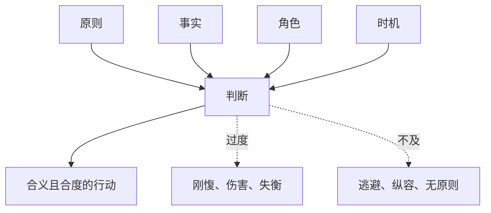

## 儒家思维筑基课: 中庸定律: 高级判断不是折中，而是守住恰当

### 作者
digoal

### 日期
2026-05-18

### 标签
中庸定律 , 儒家思想 , 中庸 , 中和 , 恰当 , 情境判断 , 原则 , 分寸 , 礼 , 复杂决策

----

## 背景

> 面向对象: 高中生到大学低年级读者
> 核心问题: 为什么“中庸”常被误解成没原则？
> 先说结论: 中庸定律认为，真正成熟的判断不是永远站中间，而是在具体情境中让原则、情感、角色和后果达到恰当。中庸反对过度，也反对不及。

## 一张图先看懂

## 求真讲法

### 它到底说了什么

中庸定律说，行动的好坏不能只看抽象原则，还要看具体情境。但它不是放弃原则，而是让原则在具体情境中正确落地。

比如诚实是原则，但是否当众揭短、怎样表达、何时表达，都需要中庸判断。沉默可能是不及，羞辱可能是过。

### 它是怎么来的

现实问题常常复杂: 讲情会不会破坏公正？守规会不会冷酷？直言会不会伤人？忍让会不会纵容？儒家用中庸处理这些张力。

“中”是恰当，“和”是不同因素被合理安顿后的协调。

### 它依赖哪些假设

| 依赖公理 | 对中庸定律的支撑 |
|---|---|
| 中和公理 | 恰当和平衡是好秩序的核心 |
| 礼序公理 | 分寸需要外在形式 |
| 仁心公理 | 判断要体恤人的处境 |
| 义的要求 | 不能为了和气放弃原则 |

### 常见误解

中庸不是“双方都有错”。如果一方明显欺负人，要求被欺负者也退一步，不是中庸，而是不义。

中庸也不是圆滑。圆滑的目标是保全自己，中庸的目标是合乎义和礼。

## 求存讲法

### 它有什么用

中庸定律训练的是复杂判断力。它让人避免两个低级错误: 只会机械套原则，或只会为了关系放弃原则。

### 它怎么迁移到熟悉领域

学习上，努力是必要的，但长期透支会伤身体；休息是必要的，但放纵会毁掉节奏。中庸不是少努力，而是让努力可持续。

沟通中，真话要说，但要考虑方式。方式不是虚伪，而是让真话更可能产生好结果。

### 它的适用范围和边界

| 场景 | 中庸的用法 | 失效方式 |
|---|---|---|
| 批评 | 具体、真实、有分寸 | 羞辱或沉默 |
| 决策 | 原则、事实、后果并看 | 只看一端 |
| 关系 | 亲近但有边界 | 控制或疏离 |
| 公共争议 | 区分是非与情绪 | 无原则折中 |

### 正例: 怎么用它提升能力

同学作业质量差，你可以私下指出具体问题，并约定修改时间。你没有回避问题，也没有当众羞辱，这是中庸式处理。

### 反例: 前提不成立会怎样

有人在团队中抄袭成果，负责人说“大家各退一步，别伤和气”。这里不是中庸，因为原则被牺牲，受害者被迫承担不公。

## 思考

中庸难在它不能自动套公式。它要求人有事实判断、情感理解、原则底线和行动分寸。越复杂的时代，越需要这种能力。

## 最后记住

1. 中庸不是折中，而是恰当。
2. 中庸既反对过度，也反对不及。
3. 没有原则的和气不是中庸。
4. 真正的中庸需要事实、原则、角色和后果一起判断。

## 参考资料

- 《中庸》: 中、和、诚相关论述。
- 《论语》: “中庸之为德也，其至矣乎”。
- 《礼记》: 礼乐与分寸、情感节制相关思想。

  
#### [PostgreSQL 解决方案集合](../201706/20170601_02.md "40cff096e9ed7122c512b35d8561d9c8")
  
  
#### [德哥 / digoal's Github - 公益是一辈子的事.](https://github.com/digoal/blog/blob/master/README.md "22709685feb7cab07d30f30387f0a9ae")
  
  
#### [About 德哥](https://github.com/digoal/blog/blob/master/me/readme.md "a37735981e7704886ffd590565582dd0")
  
  

  
